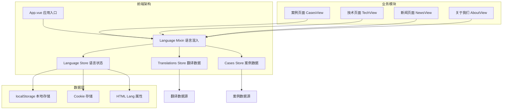
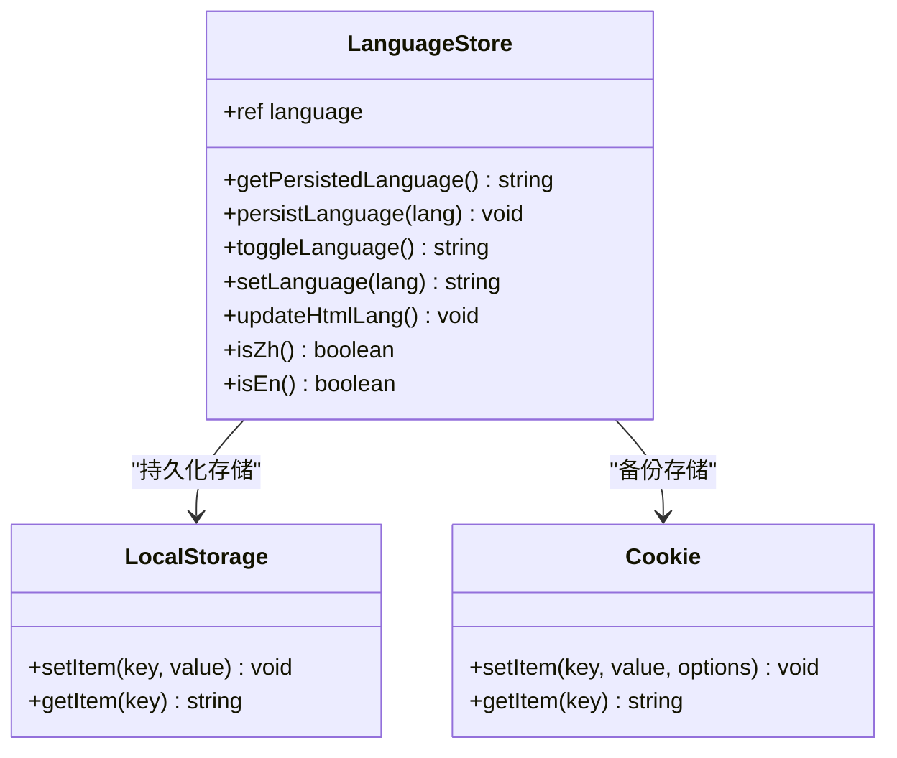
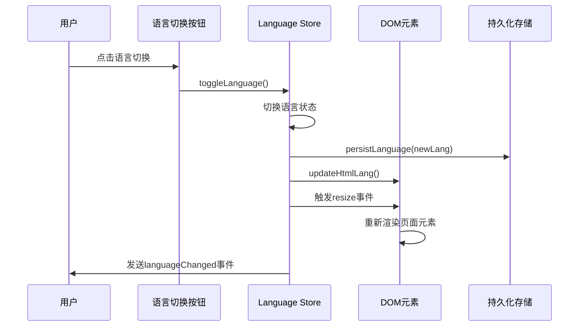

# 多语言支持机制

<cite>
**本文档引用的文件**
- [src/store/modules/cases.js](file://src/store/modules/cases.js)
- [src/store/modules/language.js](file://src/store/modules/language.js)
- [src/store/modules/translations.js](file://src/store/modules/translations.js)
- [src/views/CasesView.vue](file://src/views/CasesView.vue)
- [src/mixins/language.js](file://src/mixins/language.js)
- [src/App.vue](file://src/App.vue)
- [src/main.js](file://src/main.js)
- [index.html](file://index.html)
</cite>

## 目录
1. [项目概述](#项目概述)
2. [多语言架构设计](#多语言架构设计)
3. [核心组件分析](#核心组件分析)
4. [语言状态管理](#语言状态管理)
5. [案例数据的多语言实现](#案例数据的多语言实现)
6. [响应式语言切换机制](#响应式语言切换机制)
7. [最佳实践与注意事项](#最佳实践与注意事项)
8. [性能优化策略](#性能优化策略)
9. [故障排除指南](#故障排除指南)
10. [总结](#总结)

## 项目概述

本项目是一个基于Vue 3和Pinia的状态管理的多语言网站，主要服务于无人机和反无人机解决方案提供商。系统实现了完整的中英文双语支持，涵盖案例研究、技术介绍、新闻资讯等多个业务模块。

项目的核心特点：
- **双语言支持**：完整支持中文（zh）和英文（en）两种语言
- **响应式设计**：所有界面元素均可随语言切换动态更新
- **状态管理**：使用Pinia进行全局状态管理
- **持久化存储**：语言偏好保存到localStorage和cookie
- **渐进式增强**：支持语言切换时的平滑过渡效果

## 多语言架构设计



**图表来源**
- [src/App.vue](file://src/App.vue#L1-L50)
- [src/mixins/language.js](file://src/mixins/language.js#L1-L30)
- [src/store/modules/language.js](file://src/store/modules/language.js#L1-L50)

## 核心组件分析

### 语言混入（Language Mixin）

语言混入是整个多语言系统的核心抽象层，提供了统一的语言访问接口：

```javascript
export function useLanguage() {
  const languageStore = useLanguageStore()
  const translationsStore = useTranslationsStore()
  const contentStore = useContentStore()
  
  // 语言判断
  const isZh = computed(() => languageStore.isZh())
  const isEn = computed(() => languageStore.isEn())
  
  // 翻译获取
  const getCasesPage = () => translationsStore.getCasesPage(currentLanguage.value)
  const getCaseCategories = () => translationsStore.getCaseCategories(currentLanguage.value)
  
  return {
    isZh,
    isEn,
    getCasesPage,
    getCaseCategories,
    // ...更多翻译方法
  }
}
```

### 翻译数据结构

翻译数据采用双语言键值对的设计模式：

```javascript
const navItems = reactive({
  zh: [
    { text: '首页', link: '/', id: 'home' },
    { text: '反无人机系统', link: '/technology', id: 'technology' }
  ],
  en: [
    { text: 'Home', link: '/', id: 'home' },
    { text: 'Anti-UAV System', link: '/technology', id: 'technology' }
  ]
})
```

**章节来源**
- [src/mixins/language.js](file://src/mixins/language.js#L10-L50)
- [src/store/modules/translations.js](file://src/store/modules/translations.js#L5-L50)

## 语言状态管理

### 语言状态存储



**图表来源**
- [src/store/modules/language.js](file://src/store/modules/language.js#L1-L100)

### 语言初始化流程

系统启动时会按优先级顺序读取语言设置：

1. **强制语言变量**：检查window.__forceLanguage
2. **localStorage**：读取持久化存储的语言设置
3. **Cookie**：从浏览器cookie读取
4. **全局变量**：检查window.__reloadLanguage
5. **HTML属性**：读取HTML标签的lang属性
6. **默认值**：使用中文（zh）作为默认语言

```javascript
function getPersistedLanguage() {
  let lang = null;
  
  // 1. 从localStorage读取
  try {
    lang = localStorage.getItem('language');
  } catch (e) {
    console.error('从localStorage读取语言失败:', e);
  }
  
  // 2. 从cookie读取
  if (!lang || (lang !== 'zh' && lang !== 'en')) {
    try {
      const cookies = document.cookie.split(';');
      for (let cookie of cookies) {
        const [name, value] = cookie.trim().split('=');
        if (name === 'language') {
          lang = value;
          break;
        }
      }
    } catch (e) {
      console.error('从cookie读取语言失败:', e);
    }
  }
  
  // 3. 使用默认值
  if (!lang || (lang !== 'zh' && lang !== 'en')) {
    lang = 'zh';
  }
  
  return lang;
}
```

**章节来源**
- [src/store/modules/language.js](file://src/store/modules/language.js#L10-L45)
- [src/main.js](file://src/main.js#L76-L120)

## 案例数据的多语言实现

### 案例数据结构设计

案例模块采用了独特的双语言数据结构设计，每个案例对象包含中英文两个版本：

```javascript
const cases = {
  zh: [
    {
      id: 1,
      title: '军事要地无人机防御系统',
      tag: '军事安全',
      date: '2024-05-15',
      image: '/images/cases/military-defense.jpg',
      summary: '为北部军事要地部署朗德智能防御系统...',
      highlight: '实现100%无人机探测率，干扰范围达5公里，零安全事故',
      content: '项目背景、面临挑战、解决方案、部署成效等详细内容...'
    }
  ],
  en: [
    {
      id: 1,
      title: 'Military Site Anti-Drone Defense System',
      tag: 'Military Security',
      date: '2024-05-15',
      image: '/images/cases/military-defense.jpg',
      summary: 'Deployed Lande Intelligent defense system for a northern military site...',
      highlight: 'Achieved 100% drone detection rate, jamming range of 5km, zero security incidents',
      content: 'Project Background, Challenges, Solution, Deployment Results...'
    }
  ]
}
```

### getAllCases Getter的回退机制

```javascript
getters: {
  getAllCases(state) {
    return state.cases[state.language] || state.cases.zh;
  },
  
  getCaseById: (state) => (id) => {
    const currentCases = state.cases[state.language] || state.cases.zh;
    return currentCases.find(c => c.id === parseInt(id));
  }
}
```

这种设计的优势：
- **数据一致性**：确保每个案例都有完整的中英文版本
- **回退保护**：当某种语言缺失时自动回退到中文
- **性能优化**：只加载当前语言的数据，减少内存占用
- **扩展性**：易于添加新的语言支持

### 案例页面的语言切换

```javascript
// 获取案例相关翻译
const casesPage = computed(() => {
  const translations = getCasesPage()
  return {
    ...translations,
    // 添加分页相关的翻译
    prevPage: isZh.value ? '上一页' : 'Previous',
    nextPage: isZh.value ? '下一页' : 'Next',
  }
})

// 获取案例数据
const cases = computed(() => casesStore.getAllCases)
```

**章节来源**
- [src/store/modules/cases.js](file://src/store/modules/cases.js#L1-L100)
- [src/views/CasesView.vue](file://src/views/CasesView.vue#L40-L60)

## 响应式语言切换机制

### 语言切换流程



**图表来源**
- [src/store/modules/language.js](file://src/store/modules/language.js#L60-L120)
- [src/App.vue](file://src/App.vue#L500-L550)

### 语言切换的具体实现

```javascript
const toggleLanguage = () => {
  const newLang = language.value === 'zh' ? 'en' : 'zh';
  
  // 使用增强的持久化保存方法
  persistLanguage(newLang);
  
  // 更新状态
  language.value = newLang;
  
  // 发布语言变化事件
  document.dispatchEvent(new CustomEvent('languageChanged', { detail: newLang }));
  
  // 更新HTML标签的lang属性
  updateHtmlLang();
  
  // 强制触发页面重新渲染
  setTimeout(() => {
    window.dispatchEvent(new Event('resize'));
    
    // 强制重新渲染页面元素
    document.querySelectorAll('.page-content').forEach(el => {
      el.style.opacity = '0.99';
      setTimeout(() => {
        el.style.opacity = '1';
      }, 10);
    });
  }, 50);
  
  return newLang;
}
```

### 语言切换的视觉反馈

系统提供了多层次的视觉反馈机制：

1. **DOM元素重绘**：通过修改透明度触发重绘
2. **CSS类切换**：添加临时CSS类触发动画
3. **Resize事件**：通知所有组件重新计算布局
4. **Custom Events**：发布语言变化事件

```javascript
// 强制重新渲染页面元素
document.querySelectorAll('.page-content').forEach(el => {
  // 微小改变opacity以触发重绘
  el.style.opacity = '0.99';
  setTimeout(() => {
    el.style.opacity = '1';
  }, 10);
});

// 尝试重新加载页面内容区域
const contentElements = document.querySelectorAll('.news-list, .tech-sections, .case-grid');
contentElements.forEach(el => {
  // 临时添加class触发重绘
  el.classList.add('language-changed');
  setTimeout(() => {
    el.classList.remove('language-changed');
  }, 50);
});
```

**章节来源**
- [src/store/modules/language.js](file://src/store/modules/language.js#L60-L120)
- [src/App.vue](file://src/App.vue#L500-L550)

## 最佳实践与注意事项

### 添加新语言的最佳实践

1. **数据完整性检查**
```javascript
// 确保所有翻译字段都存在
const validateTranslation = (translation, fallback) => {
  const keys = Object.keys(fallback);
  const missingKeys = keys.filter(key => !translation[key]);
  
  if (missingKeys.length > 0) {
    console.warn(`缺少翻译字段: ${missingKeys.join(', ')}`);
    return false;
  }
  return true;
}
```

2. **键值一致性验证**
```javascript
// 验证中英文键值的一致性
const validateKeyConsistency = (zhData, enData) => {
  const zhKeys = new Set(Object.keys(zhData));
  const enKeys = new Set(Object.keys(enData));
  
  const missingInEn = [...zhKeys].filter(k => !enKeys.has(k));
  const missingInZh = [...enKeys].filter(k => !zhKeys.has(k));
  
  if (missingInEn.length > 0) {
    console.warn(`英文缺少键值: ${missingInEn.join(', ')}`);
  }
  
  if (missingInZh.length > 0) {
    console.warn(`中文缺少键值: ${missingInZh.join(', ')}`);
  }
  
  return missingInEn.length === 0 && missingInZh.length === 0;
}
```

3. **翻译质量检查**
```javascript
// 自动检测翻译质量问题
const checkTranslationQuality = (text, language) => {
  if (language === 'en') {
    // 检查是否有中文字符
    if (/[一-龥]/.test(text)) {
      console.warn('英文翻译中包含中文字符');
    }
  } else if (language === 'zh') {
    // 检查是否有英文单词
    if (/[a-zA-Z]/.test(text)) {
      console.warn('中文翻译中包含英文单词');
    }
  }
}
```

### 常见错误与预防

1. **键值不一致**
```javascript
// 错误示例
const incorrectTranslation = {
  zh: {
    title: '标题',
    description: '描述',
    // 缺少content字段
  },
  en: {
    title: 'Title',
    description: 'Description',
    // 缺少content字段
  }
}

// 正确示例
const correctTranslation = {
  zh: {
    title: '标题',
    description: '描述',
    content: '内容',
    // 所有字段都存在
  },
  en: {
    title: 'Title',
    description: 'Description',
    content: 'Content',
    // 所有字段都存在
  }
}
```

2. **未同步更新双语内容**
```javascript
// 错误：只更新一种语言
const updateOnlyEnglish = (data) => {
  translationsStore.updateTranslation('en', data);
  // 忘记更新中文版本
}

// 正确：同步更新两种语言
const updateBothLanguages = (data) => {
  translationsStore.updateTranslation('zh', data);
  translationsStore.updateTranslation('en', data);
}
```

3. **忽略回退机制**
```javascript
// 错误：绕过getter的回退机制
const wrongGetAllCases = () => {
  return casesStore.cases[casesStore.language]; // 可能返回undefined
}

// 正确：使用getter的回退机制
const correctGetAllCases = () => {
  return casesStore.getAllCases; // 自动回退到中文
}
```

### 性能优化建议

1. **懒加载翻译数据**
```javascript
// 按需加载翻译模块
const lazyLoadTranslations = async (language) => {
  if (!translationsCache[language]) {
    const module = await import(`./translations/${language}.js`);
    translationsCache[language] = module.default;
  }
  return translationsCache[language];
}
```

2. **缓存翻译结果**
```javascript
// 缓存翻译结果避免重复计算
const cachedGetTranslation = memoize((key, language) => {
  return translationsStore.getTranslation(key, language);
});
```

## 性能优化策略

### 数据加载优化

1. **按需加载案例数据**
```javascript
// 只加载当前语言的案例数据
const loadCasesForLanguage = (language) => {
  return import(`../data/cases-${language}.json`)
    .then(module => module.default)
    .catch(() => []);
};
```

2. **翻译数据预加载**
```javascript
// 预加载常用翻译
const preLoadCommonTranslations = async () => {
  const commonKeys = ['navigation', 'footer', 'buttons'];
  const promises = commonKeys.map(key => 
    translationsStore.loadTranslation(key)
  );
  return Promise.all(promises);
};
```

### 内存管理

1. **清理未使用的翻译数据**
```javascript
// 定期清理未使用的翻译缓存
const cleanupUnusedTranslations = () => {
  const activeLanguages = [currentLanguage.value];
  Object.keys(translationsCache).forEach(lang => {
    if (!activeLanguages.includes(lang)) {
      delete translationsCache[lang];
    }
  });
};
```

2. **优化DOM操作**
```javascript
// 批量处理DOM更新
const batchDOMUpdates = (updates) => {
  requestAnimationFrame(() => {
    updates.forEach(update => update());
  });
};
```

## 故障排除指南

### 常见问题诊断

1. **语言切换失效**
```javascript
// 诊断语言切换问题
const diagnoseLanguageIssue = () => {
  console.log('当前语言:', languageStore.language);
  console.log('localStorage语言:', localStorage.getItem('language'));
  console.log('cookie语言:', document.cookie);
  console.log('HTML lang属性:', document.documentElement.lang);
};
```

2. **翻译数据丢失**
```javascript
// 检查翻译数据完整性
const validateTranslationData = () => {
  const languages = ['zh', 'en'];
  languages.forEach(lang => {
    const translations = translationsStore.getAllTranslations(lang);
    if (!translations) {
      console.error(`语言${lang}的翻译数据不存在`);
    }
  });
};
```

3. **案例数据显示异常**
```javascript
// 检查案例数据状态
const diagnoseCaseDisplay = () => {
  console.log('当前语言:', casesStore.language);
  console.log('案例数据:', casesStore.cases);
  console.log('获取的案例:', casesStore.getAllCases);
};
```

### 调试工具

1. **语言状态监控**
```javascript
// 监控语言状态变化
const monitorLanguageChanges = () => {
  watch(() => languageStore.language, (newLang, oldLang) => {
    console.log(`语言从${oldLang}切换到${newLang}`);
  });
};
```

2. **翻译质量检查**
```javascript
// 实时检查翻译质量
const enableTranslationQualityCheck = () => {
  setInterval(() => {
    const allTranslations = translationsStore.getAllTranslations();
    Object.entries(allTranslations).forEach(([key, translation]) => {
      checkTranslationQuality(translation, key);
    });
  }, 1000);
};
```

**章节来源**
- [src/store/modules/language.js](file://src/store/modules/language.js#L150-L200)
- [src/store/modules/cases.js](file://src/store/modules/cases.js#L500-L600)

## 总结

本项目实现了一个完整而高效的多语言支持系统，具有以下核心特性：

### 技术亮点

1. **模块化设计**：通过语言混入和状态管理实现松耦合架构
2. **响应式更新**：利用Vue 3的响应式系统实现无缝的语言切换
3. **数据一致性**：严格的键值对设计确保翻译数据的完整性
4. **性能优化**：按需加载和缓存机制提升用户体验
5. **容错机制**：完善的回退机制保证系统稳定性

### 设计原则

- **单一职责**：每个模块专注于特定的语言功能
- **开放封闭**：易于扩展新语言，同时保持现有功能不变
- **依赖倒置**：通过抽象层解耦具体实现
- **关注点分离**：数据层、业务层、表现层职责分明

### 应用价值

这套多语言支持机制不仅适用于当前的无人机解决方案网站，也可以作为其他国际化项目的参考模板。其设计理念和实现方式体现了现代Web应用开发的最佳实践，为构建高质量的多语言应用提供了完整的解决方案。

通过深入理解这些设计原理和实现细节，开发者可以更好地维护和扩展这个多语言系统，同时也能将这些经验应用到其他类似的国际化项目中。