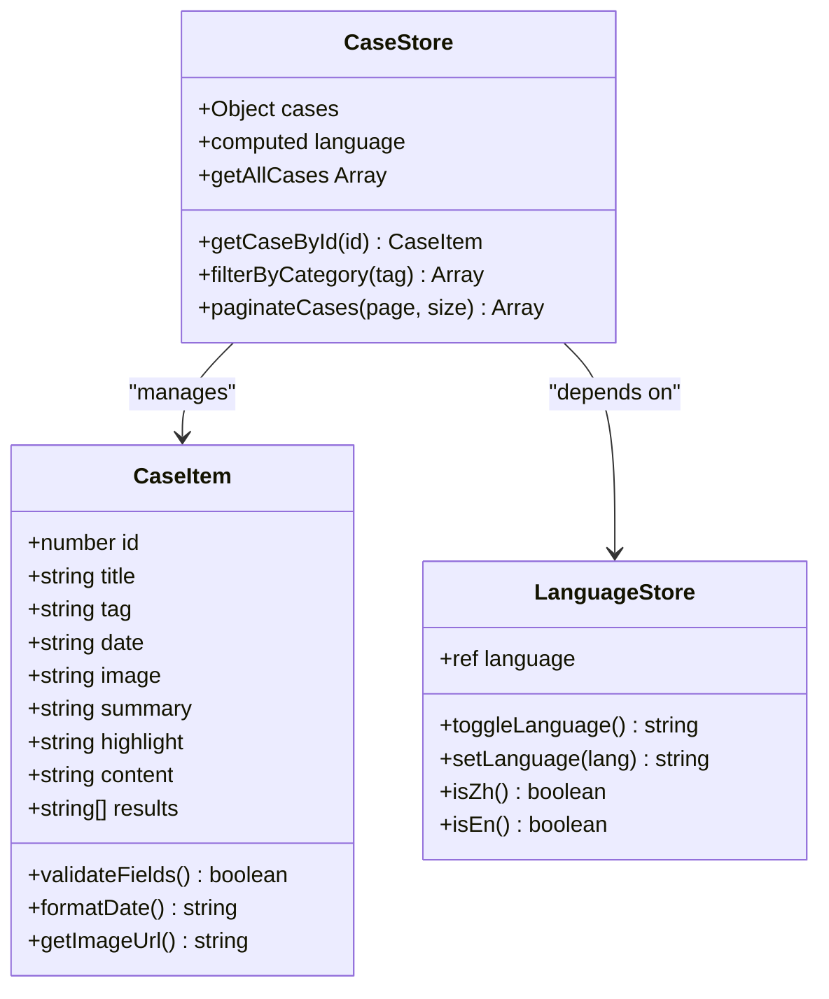
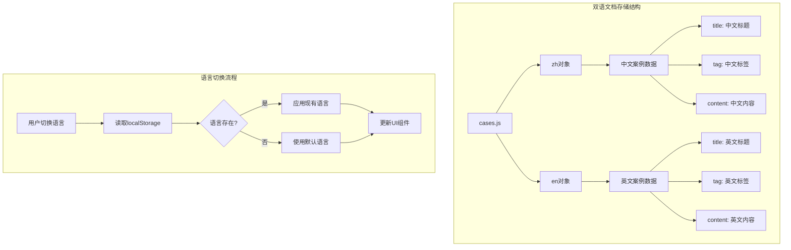
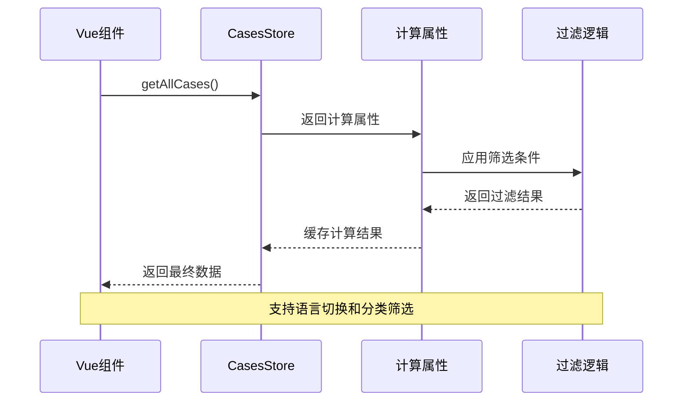
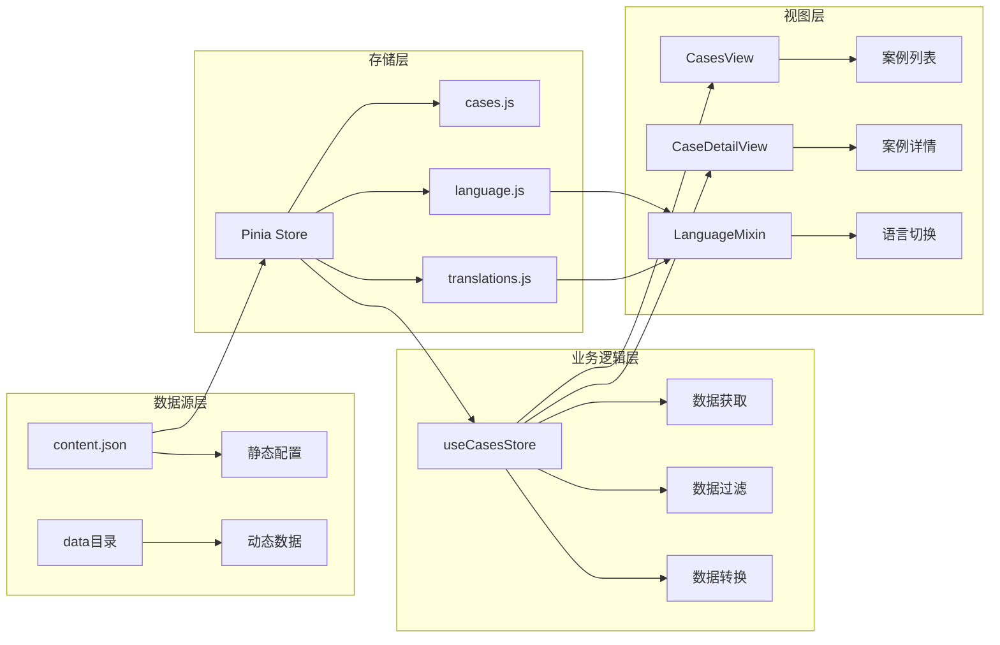
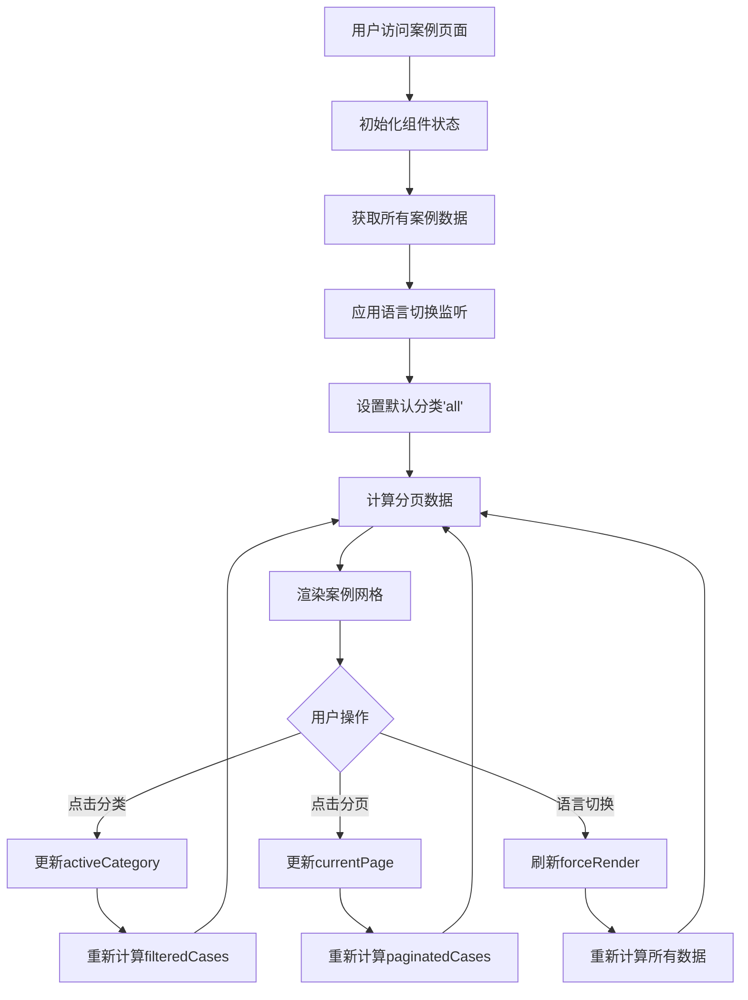

# 案例数据模型文档

<cite>
**本文档引用的文件**
- [data/content.json](file://data/content.json)
- [src/store/modules/cases.js](file://src/store/modules/cases.js)
- [src/store/modules/language.js](file://src/store/modules/language.js)
- [src/store/modules/translations.js](file://src/store/modules/translations.js)
- [src/mixins/language.js](file://src/mixins/language.js)
- [src/views/CasesView.vue](file://src/views/CasesView.vue)
- [src/views/CaseDetailView.vue](file://src/views/CaseDetailView.vue)
- [package.json](file://package.json)
</cite>

## 目录
1. [项目概述](#项目概述)
2. [案例数据模型结构](#案例数据模型结构)
3. [双语文档存储机制](#双语文档存储机制)
4. [数据获取与缓存策略](#数据获取与缓存策略)
5. [案例数据管理架构](#案例数据管理架构)
6. [前端组件数据使用](#前端组件数据使用)
7. [性能优化与最佳实践](#性能优化与最佳实践)
8. [内容编辑指南](#内容编辑指南)
9. [故障排除](#故障排除)
10. [总结](#总结)

## 项目概述

朗德智能科技有限公司的官方网站采用了现代化的Vue 3 + Pinia架构，专门用于展示无人机和反无人机系统的应用案例。该项目通过精心设计的数据模型和多语言支持机制，为用户提供丰富、准确且易于维护的案例内容。

### 技术栈概览

- **前端框架**: Vue 3 Composition API
- **状态管理**: Pinia Store
- **路由管理**: Vue Router 4
- **国际化**: 自定义语言切换机制
- **数据存储**: JSON配置文件 + 前端内存缓存

## 案例数据模型结构

### CaseItem对象字段定义

每个案例数据对象（CaseItem）都遵循严格的数据结构规范，确保内容的一致性和可维护性。



**图表来源**
- [src/store/modules/cases.js](file://src/store/modules/cases.js#L1-L50)
- [src/store/modules/language.js](file://src/store/modules/language.js#L1-L30)

### 字段详细说明

#### 必需字段

1. **id** (`number`)
   - 唯一标识符，用于URL路由和数据检索
   - 示例：`1`, `2`, `3`
   - 类型：数字，必须唯一

2. **title** (`string`)
   - 案例标题，支持双语文档
   - 示例：`"军事要地无人机防御系统"`
   - 类型：字符串，长度限制建议不超过100字符

3. **tag** (`string`)
   - 案例分类标签，用于筛选和组织
   - 示例：`"军事安全"`, `"公共安全"`, `"工业应用"`
   - 类型：字符串，对应预定义的分类体系

4. **date** (`string`)
   - 发布日期，格式为YYYY-MM-DD
   - 示例：`"2024-05-15"`
   - 类型：字符串，ISO 8601日期格式

#### 可选字段

5. **image** (`string`)
   - 案例封面图片路径
   - 示例：`"/images/cases/military-defense.jpg"`
   - 默认值：`"/images/cases/default.jpg"`
   - 类型：字符串，相对路径

6. **summary** (`string`)
   - 案例摘要，用于列表展示
   - 示例：`"为北部军事要地部署朗德智能防御系统，实现全天候无人机侦测和拦截能力，保障军事基地安全。"`
   - 类型：字符串，建议长度不超过200字符

7. **highlight** (`string`)
   - 成果亮点，突出展示
   - 示例：`"实现100%无人机探测率，干扰范围达5公里，零安全事故"`
   - 类型：字符串，建议长度不超过150字符

8. **content** (`string`)
   - 详细内容，支持HTML结构
   - 示例：`"<h2>项目背景</h2><p>随着无人机技术的快速发展...</p>"`
   - 类型：字符串，包含HTML标签
   - 格式要求：必须是有效的HTML片段

9. **results** (`Array<string>`)
   - 成效数据数组，最多4个结果
   - 示例：`['100%无人机探测率', '干扰范围达5公里', '全年运行零误报']`
   - 类型：字符串数组，每个元素长度建议不超过80字符

**章节来源**
- [src/store/modules/cases.js](file://src/store/modules/cases.js#L10-L100)

## 双语文档存储机制

### 存储结构设计

项目采用双语分离的存储策略，将中文和英文内容分别存储在不同的键值下，确保语言切换的流畅性和数据的完整性。



**图表来源**
- [src/store/modules/cases.js](file://src/store/modules/cases.js#L15-L25)
- [src/store/modules/language.js](file://src/store/modules/language.js#L10-L50)

### 语言切换实现机制

语言切换通过多层次的持久化机制确保用户体验：

1. **优先级机制**
   ```javascript
   // 1. 从localStorage读取
   lang = localStorage.getItem('language')
   
   // 2. 从cookie备选
   if (!lang) {
     lang = parseCookie('language')
   }
   
   // 3. 默认值
   if (!lang) {
     lang = 'zh'
   }
   ```

2. **持久化策略**
   - 同时保存到localStorage和cookie
   - localStorage为主，cookie为备选
   - cookie有效期30天

3. **实时更新**
   - 触发DOM事件通知组件更新
   - 强制页面重新渲染
   - 更新HTML lang属性

**章节来源**
- [src/store/modules/language.js](file://src/store/modules/language.js#L10-L100)

## 数据获取与缓存策略

### Getter方法工作原理

项目实现了高效的getter方法来获取和过滤案例数据：



**图表来源**
- [src/store/modules/cases.js](file://src/store/modules/cases.js#L200-L300)
- [src/views/CasesView.vue](file://src/views/CasesView.vue#L80-L120)

### 性能特点分析

1. **懒计算模式**
   - 使用Vue的computed属性实现懒计算
   - 仅在依赖变化时重新计算
   - 减少不必要的计算开销

2. **内存缓存**
   - 数据存储在内存中，访问速度快
   - 避免重复的JSON解析
   - 支持复杂的过滤和排序操作

3. **分页优化**
   - 每页显示4个案例，减少DOM渲染
   - 滚动到顶部自动重置页码
   - 支持无限滚动优化

**章节来源**
- [src/store/modules/cases.js](file://src/store/modules/cases.js#L200-L400)
- [src/views/CasesView.vue](file://src/views/CasesView.vue#L150-L200)

## 案例数据管理架构

### 数据流架构



**图表来源**
- [src/store/modules/cases.js](file://src/store/modules/cases.js#L1-L50)
- [src/mixins/language.js](file://src/mixins/language.js#L1-L50)

### 数据验证与清理

项目实现了完善的数据验证机制：

1. **字段完整性检查**
   ```javascript
   // 验证必需字段
   const requiredFields = ['id', 'title', 'tag', 'date']
   const isValid = requiredFields.every(field => 
     caseItem[field] && caseItem[field].trim()
   )
   ```

2. **格式标准化**
   - 自动格式化日期字符串
   - 清理HTML内容中的危险标签
   - 验证图片路径的有效性

3. **默认值处理**
   - 为空的可选字段设置默认值
   - 提供备用图片路径
   - 确保数组类型的字段始终为数组

**章节来源**
- [src/store/modules/cases.js](file://src/store/modules/cases.js#L1-L100)

## 前端组件数据使用

### 案例列表组件（CasesView）

案例列表组件展示了所有可用的案例，并支持分类筛选和分页功能：



**图表来源**
- [src/views/CasesView.vue](file://src/views/CasesView.vue#L50-L150)

### 案例详情组件（CaseDetailView）

案例详情组件提供了详细的案例信息展示：

1. **数据获取流程**
   ```javascript
   // 从路由参数获取案例ID
   const caseId = route.params.id
   
   // 使用getter方法获取案例数据
   const caseData = computed(() => {
     return casesStore.getCaseById(caseId)
   })
   ```

2. **相关案例推荐**
   - 基于相同分类标签推荐
   - 最多显示3个相关案例
   - 包含缩略图和标题

3. **响应式设计**
   - 移动端适配的网格布局
   - 图片懒加载优化
   - 触摸友好的交互设计

**章节来源**
- [src/views/CaseDetailView.vue](file://src/views/CaseDetailView.vue#L87-L156)

## 性能优化与最佳实践

### 典型部署成效数据最佳实践

根据项目中的实际案例，以下是最佳实践建议：

1. **数据格式规范**
   ```javascript
   // 推荐的results数组格式
   results: [
     '100%无人机探测率',           // 百分比数据
     '干扰范围达5公里',             // 数值范围
     '全年运行零误报',              // 定性描述
     '部署后无侵入事件'             // 结果导向
   ]
   ```

2. **内容结构化**
   - 使用标准HTML标签：`<h2>`, `<p>`, `<ul>`, `<li>`
   - 避免复杂的CSS样式嵌入
   - 保持段落简洁，每段不超过3句话

3. **图片优化**
   - 使用WebP格式提高加载速度
   - 响应式图片适配不同屏幕尺寸
   - 提供适当的alt文本

### 性能监控指标

1. **加载性能**
   - 首次内容绘制（FCP）：< 2秒
   - 最大内容绘制（LCP）：< 3秒
   - 累积布局偏移（CLS）：< 0.1

2. **交互性能**
   - 语言切换响应时间：< 100ms
   - 案例筛选响应时间：< 200ms
   - 页面滚动流畅度：60fps+

3. **内存使用**
   - 单个案例数据占用：< 5KB
   - 所有案例数据占用：< 50KB
   - 内存泄漏检测：定期检查

## 内容编辑指南

### HTML结构规范

为了确保内容的一致性和可维护性，建议遵循以下HTML结构规范：

1. **标题层级**
   ```
   <h2>项目背景</h2>
   <p>详细描述项目背景信息...</p>
   
   <h2>面临挑战</h2>
   <ul>
     <li>具体挑战1</li>
     <li>具体挑战2</li>
   </ul>
   
   <h2>解决方案</h2>
   <p>详细描述解决方案...</p>
   
   <h2>部署成效</h2>
   <ul>
     <li>具体成效1</li>
     <li>具体成效2</li>
   </ul>
   ```

2. **列表格式**
   - 使用有序列表（`<ol>`）展示步骤
   - 使用无序列表（`<ul>`）展示要点
   - 每个列表项不超过2行文本

3. **强调格式**
   - 使用`<strong>`标签强调关键词
   - 使用`<em>`标签表示斜体强调
   - 避免过度使用强调标签

### 内容创作模板

每个案例都应该包含以下核心要素：

1. **基本信息**
   - 项目名称和简要描述
   - 实施时间和地点
   - 主要参与方

2. **问题分析**
   - 项目面临的挑战和痛点
   - 现有解决方案的不足
   - 客户的具体需求

3. **解决方案**
   - 朗德智能提供的完整方案
   - 技术创新点和优势
   - 实施过程和关键节点

4. **实施效果**
   - 具体的量化成果
   - 定性的用户体验
   - 长期效益分析

5. **客户评价**
   - 第三方见证和推荐
   - 具体的使用体验
   - 对未来的展望

**章节来源**
- [src/store/modules/cases.js](file://src/store/modules/cases.js#L50-L200)

## 故障排除

### 常见问题诊断

1. **案例数据不显示**
   - 检查cases.js中的数据格式
   - 验证图片路径是否存在
   - 确认语言切换是否正确

2. **语言切换失效**
   - 检查localStorage是否可用
   - 验证cookie设置权限
   - 查看浏览器控制台错误信息

3. **性能问题**
   - 监控内存使用情况
   - 检查图片加载状态
   - 优化大数据量的渲染

### 调试工具和技巧

1. **开发者工具**
   - 使用Vue DevTools检查store状态
   - 监控网络请求和响应时间
   - 分析DOM渲染性能

2. **测试方法**
   - 单元测试验证getter方法
   - 端到端测试验证完整流程
   - 性能测试评估加载速度

**章节来源**
- [src/store/modules/language.js](file://src/store/modules/language.js#L150-L215)

## 总结

朗德智能的案例数据模型展现了现代Web应用中数据管理和多语言支持的最佳实践。通过精心设计的数据结构、高效的缓存策略和优雅的用户界面，该项目成功地为用户提供了丰富、准确且易于维护的案例内容。

### 核心优势

1. **数据结构清晰**：CaseItem对象的字段定义明确，便于理解和维护
2. **双语支持完善**：多层次的持久化机制确保语言切换的流畅性
3. **性能优化到位**：懒计算、内存缓存和分页优化提升了用户体验
4. **扩展性强**：模块化的设计便于添加新的功能和特性

### 未来发展方向

1. **数据同步**：考虑引入后端API支持动态数据更新
2. **多媒体支持**：增加视频和交互式内容的支持
3. **SEO优化**：改进搜索引擎优化策略
4. **移动端优化**：进一步提升移动端用户体验

这个案例数据模型不仅是一个技术实现，更是企业数字化转型中内容管理的最佳实践范例，值得在类似项目中借鉴和推广。