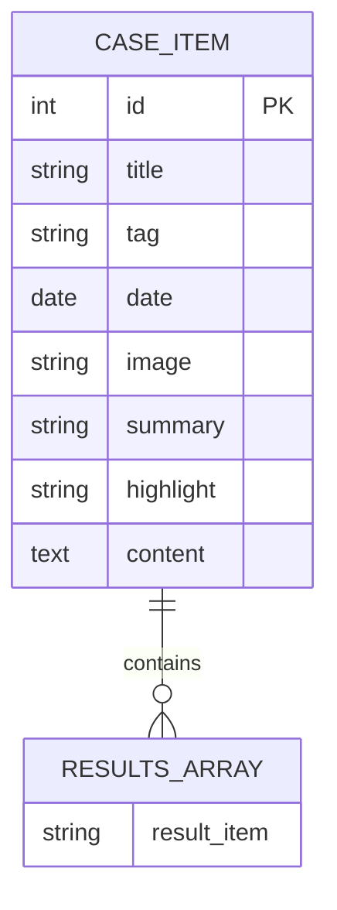

# 案例数据结构

<cite>
**本文档引用的文件**
- [cases.js](file://src/store/modules/cases.js)
- [CaseDetailView.vue](file://src/views/CaseDetailView.vue)
- [CasesView.vue](file://src/views/CasesView.vue)
- [language.js](file://src/mixins/language.js)
- [translations.js](file://src/store/modules/translations.js)
</cite>

## 目录
1. [引言](#引言)
2. [案例数据结构定义](#案例数据结构定义)
3. [字段详细说明](#字段详细说明)
4. [多语言内容组织](#多语言内容组织)
5. [前端渲染注意事项](#前端渲染注意事项)
6. [新增案例指导](#新增案例指导)
7. [总结](#总结)

## 引言
本文档旨在全面描述`CaseItem`对象的数据结构，为开发者提供详细的字段定义、格式要求和使用规范。通过分析`src/store/modules/cases.js`中的实际示例，本文档将解释如何组织多语言内容，并指导开发者在新增案例时保持结构一致性。

**Section sources**
- [cases.js](file://src/store/modules/cases.js#L0-L641)

## 案例数据结构定义
`CaseItem`对象是应用中用于表示单个案例的核心数据结构。该对象在`src/store/modules/cases.js`中被定义，并以多语言形式存储（中文`zh`和英文`en`）。每个案例包含以下关键字段：`id`、`title`、`tag`、`date`、`image`、`summary`、`highlight`、`content`和`results`。

**Diagram sources**
- [cases.js](file://src/store/modules/cases.js#L0-L641)

**Section sources**
- [cases.js](file://src/store/modules/cases.js#L0-L641)

## 字段详细说明
以下是`CaseItem`对象各个字段的详细定义与格式要求：

### id (唯一标识)
- **数据类型**: 整数 (`int`)
- **约束条件**: 必填，全局唯一，用于标识和检索特定案例。
- **业务含义**: 每个案例的唯一数字ID，在URL和数据查询中作为主键使用。
- **示例**: `1`, `2`, `3`

**Section sources**
- [cases.js](file://src/store/modules/cases.js#L0-L641)

### title (中英文标题)
- **数据类型**: 字符串 (`string`)
- **约束条件**: 必填，长度建议不超过100字符。
- **业务含义**: 案例的标题，直接展示给用户，应简洁明了地概括案例核心。
- **多语言支持**: 在`cases.js`的`zh`和`en`数组中分别定义中文和英文标题。
- **示例**: 
  - 中文: `"军事要地无人机防御系统"`
  - 英文: `"Military Site Anti-Drone Defense System"`

**Section sources**
- [cases.js](file://src/store/modules/cases.js#L0-L641)

### tag (分类标签)
- **数据类型**: 字符串 (`string`)
- **约束条件**: 必填，值必须与`translations.js`中定义的`caseCategories`标签一致。
- **业务含义**: 案例的分类标签，用于筛选和归类。前端根据此标签进行过滤和显示。
- **多语言支持**: 标签本身是多语言的，例如中文环境用"军事安全"，英文环境用"Military Security"。
- **有效值**: 来自`src/store/modules/translations.js`的`caseCategories`，包括：
  - 军事安全 / Military Security
  - 公共安全 / Public Security
  - 工业应用 / Industrial Applications
  - 农业应用 / Agricultural Applications
  - 应急救援 / Emergency Rescue
  - 边境安全 / Border Security
- **示例**: `"军事安全"` 或 `"Military Security"`

**Section sources**
- [cases.js](file://src/store/modules/cases.js#L0-L641)
- [translations.js](file://src/store/modules/translations.js#L200-L250)

### date (发布日期)
- **数据类型**: 字符串 (`string`)，格式为`YYYY-MM-DD`
- **约束条件**: 必填，符合ISO 8601日期格式。
- **业务含义**: 案例的创建或发布日期，用于排序和按时间展示。
- **示例**: `"2024-05-15"`

**Section sources**
- [cases.js](file://src/store/modules/cases.js#L0-L641)

### image (案例图片路径)
- **数据类型**: 字符串 (`string`)
- **约束条件**: 推荐填写，应为相对路径或绝对URL。
- **业务含义**: 案例的封面图片路径。如果未提供，前端会使用默认图片`/images/cases/default.jpg`。
- **示例**: `"/images/cases/military-defense.jpg"`

**Section sources**
- [cases.js](file://src/store/modules/cases.js#L0-L641)
- [CaseDetailView.vue](file://src/views/CaseDetailView.vue#L0-L199)

### summary (摘要信息)
- **数据类型**: 字符串 (`string`)
- **约束条件**: 必填，长度建议在100-200字符之间。
- **业务含义**: 案例的简短概述，通常在案例列表页显示，让用户快速了解案例内容。
- **示例**: `"为北部军事要地部署朗德智能防御系统，实现全天候无人机侦测和拦截能力，保障军事基地安全。"`

**Section sources**
- [cases.js](file://src/store/modules/cases.js#L0-L641)

### highlight (核心亮点)
- **数据类型**: 字符串 (`string`)
- **约束条件**: 必填，长度建议不超过150字符。
- **业务含义**: 案例最突出的成果或优势，通常以引述形式在详情页显著位置展示。
- **示例**: `"实现100%无人机探测率，干扰范围达5公里，零安全事故"`

**Section sources**
- [cases.js](file://src/store/modules/cases.js#L0-L641)

### content (详细内容HTML结构)
- **数据类型**: 字符串 (`string`)，包含HTML标签
- **约束条件**: 必填，内容可以包含`<h2>`、`
`、`<ul>`、`<li>`等基本HTML标签。
- **业务含义**: 案例的详细描述，采用富文本格式，可包含章节标题、段落和列表。
- **前端渲染**: 使用Vue的`v-html`指令直接渲染，因此需确保内容安全，避免XSS攻击。
- **示例**: