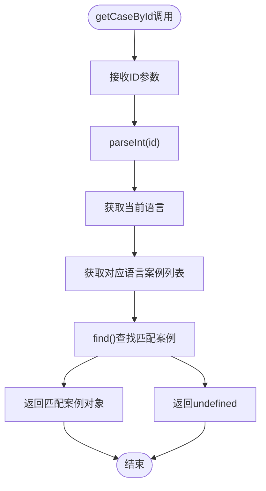
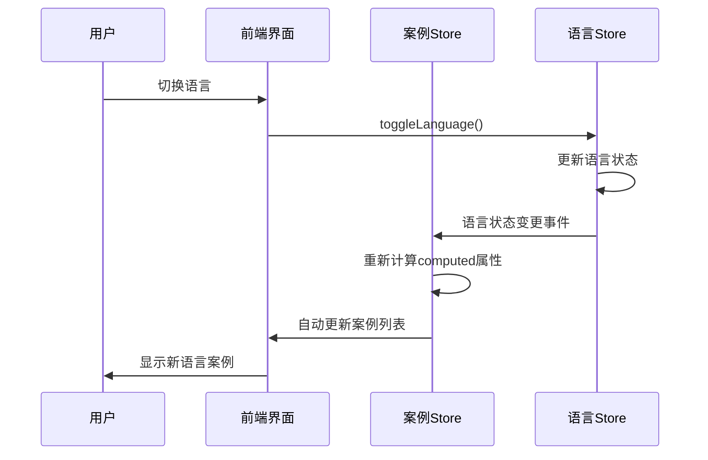

# 案例访问接口

<cite>
**本文档中引用的文件**
- [cases.js](file://src/store/modules/cases.js)
- [CasesView.vue](file://src/views/CasesView.vue)
- [CaseDetailView.vue](file://src/views/CaseDetailView.vue)
- [language.js](file://src/mixins/language.js)
- [language.js](file://src/store/modules/language.js)
- [translations.js](file://src/store/modules/translations.js)
- [i18n.js](file://src/plugins/i18n.js)
- [main.js](file://src/main.js)
</cite>

## 目录
1. [概述](#概述)
2. [案例数据结构](#案例数据结构)
3. [Getter接口详解](#getter接口详解)
4. [响应式数据更新机制](#响应式数据更新机制)
5. [前端组件使用示例](#前端组件使用示例)
6. [性能优化建议](#性能优化建议)
7. [错误处理与边界情况](#错误处理与边界情况)
8. [总结](#总结)

## 概述

案例访问接口是朗德智能无人机系统网站的核心功能之一，通过Pinia状态管理库提供响应式的案例数据访问能力。该接口主要包含两个核心Getter方法：`getAllCases`和`getCaseById`，它们为前端组件提供了便捷的数据获取方式，支持多语言切换和实时响应式更新。

## 案例数据结构

案例数据采用双语言结构设计，分别存储中文和英文版本的案例信息：

```javascript
// 案例数据结构示例
{
  id: 1,
  title: '军事要地无人机防御系统',
  tag: '军事安全',
  date: '2024-05-15',
  image: '/images/cases/military-defense.jpg',
  summary: '为北部军事要地部署朗德智能防御系统...',
  highlight: '实现100%无人机探测率，干扰范围达5公里，零安全事故',
  content: '<h2>项目背景</h2>...',
  results: [
    '100%无人机探测率',
    '干扰范围达5公里',
    '全年运行零误报',
    '部署后无侵入事件'
  ]
}
```

每个案例包含以下字段：
- **基础信息**：ID、标题、标签、日期、缩略图
- **摘要信息**：简短描述和亮点
- **详细内容**：完整的项目介绍，包含多个章节
- **成果展示**：具体的数据指标和效果

**节来源**
- [cases.js](file://src/store/modules/cases.js#L10-L642)

## Getter接口详解

### getAllCases Getter

`getAllCases`是一个无参数的Getter，根据当前语言状态返回对应的案例列表：

```javascript
getAllCases(state) {
  return state.cases[state.language] || state.cases.zh;
}
```

#### 工作机制

1. **语言状态获取**：通过`state.language`获取当前激活的语言
2. **数据源选择**：优先返回对应语言的案例列表
3. **回退机制**：当指定语言的案例不存在时，自动回退到中文版本

#### 响应式特性

由于`state.language`是通过`computed`属性定义的，它会自动监听语言状态的变化：

```javascript
const languageStore = useLanguageStore();
return {
  language: computed(() => languageStore.language),
  // ...
};
```

当用户切换语言时，`getAllCases`会自动返回相应语言的案例列表，无需手动刷新。

### getCaseById Getter

`getCaseById`是一个带参数的Getter，用于根据ID精确查找特定案例：

```javascript
getCaseById: (state) => (id) => {
  const currentCases = state.cases[state.language] || state.cases.zh;
  return currentCases.find(c => c.id === parseInt(id));
}
```

#### 实现原理

1. **参数接收**：接收案例ID作为参数
2. **类型转换**：使用`parseInt()`将字符串ID转换为数字
3. **ID匹配**：通过`Array.prototype.find()`方法进行精确匹配
4. **语言适配**：同样遵循语言状态和回退机制

#### 查找流程



**图表来源**
- [cases.js](file://src/store/modules/cases.js#L635-L642)

**节来源**
- [cases.js](file://src/store/modules/cases.js#L635-L642)

## 响应式数据更新机制

### 语言状态监听

案例模块通过Vue的响应式系统实现了自动的数据更新：

```javascript
const languageStore = useLanguageStore();
return {
  language: computed(() => languageStore.language),
  // ...
};
```

### 自动更新流程



**图表来源**
- [cases.js](file://src/store/modules/cases.js#L10-L15)
- [language.js](file://src/store/modules/language.js#L60-L85)

### 数据持久化

语言设置通过localStorage和cookie双重持久化：

```javascript
// 保存到localStorage
localStorage.setItem('language', lang);

// 同时保存到cookie
document.cookie = `language=${lang}; path=/; max-age=${60*60*24*30}`;
```

**节来源**
- [language.js](file://src/store/modules/language.js#L20-L45)
- [main.js](file://src/main.js#L100-L120)

## 前端组件使用示例

### CasesView.vue 中的使用

在案例列表页面中，`getAllCases`被广泛使用：

```javascript
// 获取案例数据
const casesStore = useCasesStore()
const cases = computed(() => casesStore.getAllCases)

// 分类筛选
const filteredCases = computed(() => {
  if (activeCategory.value === 'all') {
    return cases.value
  } else {
    return cases.value.filter(item => {
      return item.tag === activeCategory.value || 
             item.tag === categoryTag
    })
  }
})
```

#### 性能考虑

- **批量获取**：一次性获取所有案例，避免重复查询
- **本地过滤**：在客户端进行分类筛选，减少服务器请求
- **响应式更新**：语言切换时自动更新显示

### CaseDetailView.vue 中的使用

在案例详情页面中，`getCaseById`用于精确获取特定案例：

```javascript
// 获取案例数据
const caseData = computed(() => {
  isLoading.value = false
  return casesStore.getCaseById(caseId)
})

// 获取相关案例
const relatedCases = computed(() => {
  if (!caseData.value) return []
  
  return casesStore.getAllCases
    .filter(item => item.id !== parseInt(caseId) && 
           item.tag === caseData.value.tag)
    .slice(0, 3)
})
```

#### 错误处理

```javascript
// 案例不存在时的处理
const caseData = computed(() => {
  isLoading.value = false
  const result = casesStore.getCaseById(caseId)
  if (!result) {
    console.warn(`案例ID ${caseId} 不存在`)
  }
  return result
})
```

**节来源**
- [CasesView.vue](file://src/views/CasesView.vue#L70-L120)
- [CaseDetailView.vue](file://src/views/CaseDetailView.vue#L50-L80)

## 性能优化建议

### 避免循环中的重复调用

**不推荐的做法**：
```javascript
// 不推荐：在循环中重复调用getCaseById
const relatedCases = computed(() => {
  return originalCases.map(originalItem => {
    return casesStore.getCaseById(originalItem.id)
  }).filter(item => item !== undefined)
})
```

**推荐做法**：
```javascript
// 推荐：先获取完整列表，然后进行本地过滤
const relatedCases = computed(() => {
  const allCases = casesStore.getAllCases
  return originalCases.map(originalItem => {
    return allCases.find(item => item.id === originalItem.id)
  }).filter(item => item !== undefined)
})
```

### 数据缓存策略

```javascript
// 实现简单的缓存机制
const caseCache = new Map()

const getCachedCaseById = (id) => {
  if (!caseCache.has(id)) {
    const caseData = casesStore.getCaseById(id)
    caseCache.set(id, caseData)
  }
  return caseCache.get(id)
}
```

### 批量预加载

对于经常访问的案例，可以实现预加载机制：

```javascript
// 预加载最近访问的案例
const preloadRecentCases = (recentIds) => {
  recentIds.forEach(id => {
    if (!caseCache.has(id)) {
      casesStore.getCaseById(id)
    }
  })
}
```

## 错误处理与边界情况

### ID格式验证

```javascript
const getCaseByIdSafe = (id) => {
  // 验证ID格式
  if (!id || isNaN(parseInt(id))) {
    console.error('无效的案例ID:', id)
    return null
  }
  
  // 类型转换
  const numericId = parseInt(id)
  
  // 获取案例
  const caseData = casesStore.getCaseById(numericId)
  
  // 验证结果
  if (!caseData) {
    console.warn(`案例ID ${numericId} 不存在`)
  }
  
  return caseData
}
```

### 语言回退机制

```javascript
const getCaseByIdWithFallback = (id, preferredLang = null) => {
  // 尝试首选语言
  if (preferredLang) {
    const preferredCase = casesStore.getCaseById(id)
    if (preferredCase) return preferredCase
  }
  
  // 回退到中文
  return casesStore.getCaseById(id)
}
```

### 空数据处理

```javascript
const safeGetAllCases = () => {
  const cases = casesStore.getAllCases
  if (!cases || cases.length === 0) {
    console.warn('案例数据为空')
    return []
  }
  return cases
}
```

## 总结

朗德智能的案例访问接口通过精心设计的Getter方法和响应式数据管理，为前端组件提供了高效、可靠的数据访问能力。主要特点包括：

1. **简洁的API设计**：两个Getter方法满足了大部分使用场景
2. **自动响应式更新**：语言切换时自动更新显示内容
3. **完善的错误处理**：提供了语言回退和空数据处理机制
4. **性能优化潜力**：支持缓存和批量操作优化

通过合理使用这些接口，开发者可以构建出流畅、响应式的用户体验，同时保持代码的简洁性和可维护性。建议在实际开发中遵循性能优化建议，避免不必要的重复查询，充分利用Vue的响应式特性来提升应用性能。