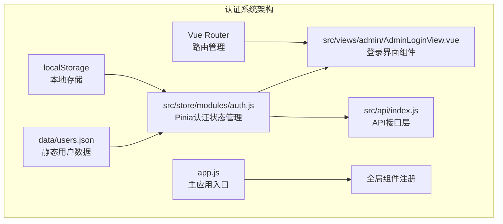
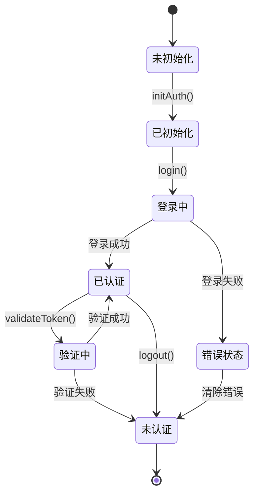
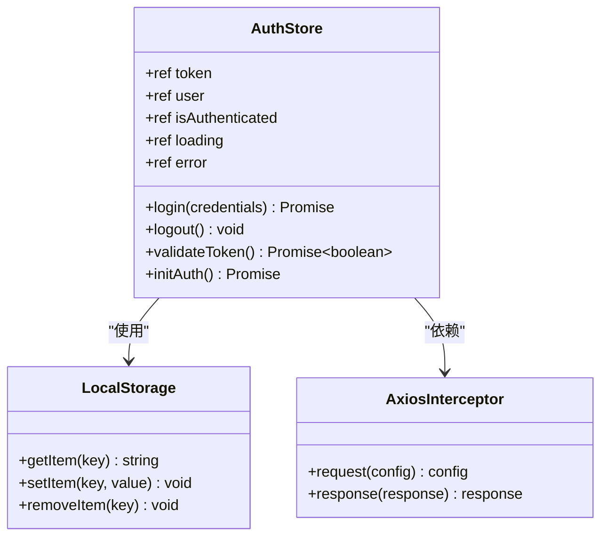
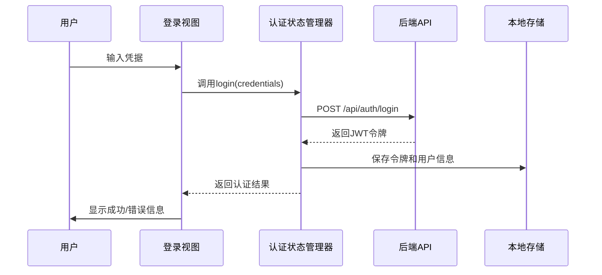
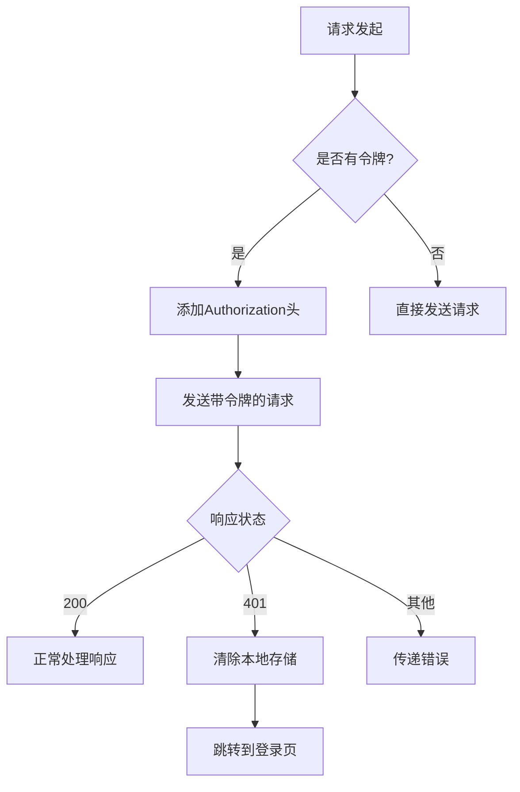

# 用户认证数据模型文档

<cite>
**本文档中引用的文件**
- [data/users.json](file://data/users.json)
- [src/store/modules/auth.js](file://src/store/modules/auth.js)
- [src/views/admin/AdminLoginView.vue](file://src/views/admin/AdminLoginView.vue)
- [src/api/index.js](file://src/api/index.js)
- [app.js](file://app.js)
</cite>

## 目录
1. [简介](#简介)
2. [项目结构概览](#项目结构概览)
3. [核心认证数据模型](#核心认证数据模型)
4. [认证状态管理架构](#认证状态管理架构)
5. [详细组件分析](#详细组件分析)
6. [安全策略与最佳实践](#安全策略与最佳实践)
7. [故障排除指南](#故障排除指南)
8. [总结](#总结)

## 简介

本文档详细说明了朗德智能科技有限公司网站系统的用户认证数据模型设计。该系统采用基于JWT（JSON Web Token）的认证机制，结合Pinia状态管理库实现认证状态的持久化和管理。系统支持管理员身份验证，提供安全的用户权限管理功能，并确保认证状态在浏览器会话期间的可靠维护。

## 项目结构概览

系统采用模块化架构，认证相关的组件分布在以下关键目录中：



**图表来源**
- [src/store/modules/auth.js](file://src/store/modules/auth.js#L1-L86)
- [src/views/admin/AdminLoginView.vue](file://src/views/admin/AdminLoginView.vue#L1-L105)
- [src/api/index.js](file://src/api/index.js#L1-L95)

## 核心认证数据模型

### AuthState 结构设计

认证状态管理器使用以下核心数据结构：

```javascript
// 认证状态对象结构
{
  token: string,           // JWT访问令牌
  user: object,           // 用户基本信息对象
  isAuthenticated: boolean, // 认证状态标志
  loading: boolean,       // 加载状态标志
  error: string|null      // 错误信息
}
```

### 数据类型与安全策略

#### 1. Token 字段
- **类型**: `string`
- **长度**: 变长（通常为200-400字符）
- **格式**: Base64编码的JWT令牌
- **安全特性**: 
  - 使用HTTP-only cookie或localStorage存储
  - 支持自动刷新机制
  - 实现过期时间检查

#### 2. User 字段
- **类型**: `object`
- **结构**: 包含用户基本信息
- **示例数据**:
```javascript
{
  id: 1,
  username: "admin",
  role: "admin"
}
```

#### 3. Expires 字段
- **类型**: `number` (Unix时间戳)
- **用途**: 存储令牌过期时间
- **自动管理**: 通过token解析自动更新

**章节来源**
- [src/store/modules/auth.js](file://src/store/modules/auth.js#L6-L12)
- [data/users.json](file://data/users.json#L1-L8)

## 认证状态管理架构

### 状态管理模式



**图表来源**
- [src/store/modules/auth.js](file://src/store/modules/auth.js#L15-L86)

### 认证生命周期

系统实现了完整的认证生命周期管理：

1. **初始化阶段**: 从localStorage恢复认证状态
2. **登录阶段**: 验证凭据并获取JWT令牌
3. **验证阶段**: 定期验证令牌有效性
4. **维护阶段**: 自动处理令牌刷新
5. **清理阶段**: 安全注销并清除本地存储

## 详细组件分析

### 认证状态管理器 (auth.js)

认证状态管理器是整个认证系统的核心，使用Pinia进行状态管理：



**图表来源**
- [src/store/modules/auth.js](file://src/store/modules/auth.js#L6-L86)
- [src/api/index.js](file://src/api/index.js#L10-L40)

#### 关键方法实现

**登录方法** (`login`):
- 接收用户凭据参数
- 调用后端认证API
- 成功时保存令牌到localStorage
- 更新认证状态

**令牌验证方法** (`validateToken`):
- 检查本地令牌存在性
- 调用后端验证接口
- 返回验证结果

**初始化方法** (`initAuth`):
- 从localStorage恢复状态
- 验证现有令牌有效性
- 清理无效状态

**章节来源**
- [src/store/modules/auth.js](file://src/store/modules/auth.js#L15-L60)

### 登录界面组件 (AdminLoginView.vue)

登录界面组件提供了直观的用户交互体验：



**图表来源**
- [src/views/admin/AdminLoginView.vue](file://src/views/admin/AdminLoginView.vue#L45-L55)
- [src/store/modules/auth.js](file://src/store/modules/auth.js#L15-L35)

#### 表单验证与错误处理

登录组件实现了完整的表单验证机制：
- 必填字段验证
- 实时错误提示
- 加载状态指示
- 用户友好的反馈信息

**章节来源**
- [src/views/admin/AdminLoginView.vue](file://src/views/admin/AdminLoginView.vue#L1-L105)

### API拦截器配置

系统配置了专门的API拦截器来处理认证相关的请求：



**图表来源**
- [src/api/index.js](file://src/api/index.js#L10-L40)

#### 拦截器功能特性

1. **请求拦截**: 自动添加Authorization头
2. **响应拦截**: 处理401未授权错误
3. **自动重定向**: 管理员页面自动跳转到登录
4. **状态清理**: 清除无效的认证状态

**章节来源**
- [src/api/index.js](file://src/api/index.js#L10-L40)

## 安全策略与最佳实践

### 令牌存储机制

系统采用localStorage作为主要的令牌存储机制：

#### 存储策略
- **令牌存储**: `localStorage.setItem('admin-token', token)`
- **用户信息存储**: `localStorage.setItem('admin-user', JSON.stringify(user))`
- **安全性考虑**: 
  - 使用localStorage而非cookie
  - 实现自动清理机制
  - 支持手动登出

#### 自动刷新逻辑

系统实现了令牌自动验证机制：

```javascript
// 自动验证逻辑
const validateToken = async () => {
  if (!token.value) return false
  
  try {
    const response = await axios.post('/api/auth/validate', { token: token.value })
    return response.data.valid
  } catch (e) {
    logout()  // 验证失败时自动登出
    return false
  }
}
```

### 失效处理机制

系统提供了多层次的失效处理：

1. **前端验证**: 定期验证令牌有效性
2. **后端验证**: API层面的令牌验证
3. **自动清理**: 失效时自动清除本地存储
4. **用户体验**: 友好的错误提示和重定向

### 管理员身份验证

基于静态用户数据的管理员身份验证：

```javascript
// 静态用户数据结构
{
  id: 1,
  username: "admin",
  password: "admin123",
  role: "admin"
}
```

**章节来源**
- [data/users.json](file://data/users.json#L1-L8)
- [src/store/modules/auth.js](file://src/store/modules/auth.js#L45-L60)

## 故障排除指南

### 常见问题与解决方案

#### 1. 认证状态丢失
**症状**: 用户频繁需要重新登录
**原因**: localStorage被清空或浏览器隐私模式
**解决方案**: 
- 检查浏览器localStorage可用性
- 实现自动重新认证机制
- 提供离线模式支持

#### 2. 令牌验证失败
**症状**: 登录成功但无法访问受保护资源
**原因**: 后端验证失败或时间同步问题
**解决方案**:
- 检查服务器时间配置
- 验证JWT密钥配置
- 实现重试机制

#### 3. 自动登出问题
**症状**: 用户在操作过程中突然被登出
**原因**: 令牌过期或验证失败
**解决方案**:
- 增加令牌刷新机制
- 实现优雅的过期处理
- 提供用户确认对话框

### 调试工具与技巧

#### 开发者工具使用
1. 打开浏览器开发者工具
2. 查看Application面板中的localStorage
3. 检查Network面板中的认证请求
4. 使用Console面板调试状态管理器

#### 日志记录建议
- 记录认证状态变化
- 记录API请求和响应
- 记录错误和异常情况
- 监控性能指标

**章节来源**
- [src/store/modules/auth.js](file://src/store/modules/auth.js#L45-L60)
- [src/api/index.js](file://src/api/index.js#L25-L40)

## 总结

朗德智能科技有限公司的用户认证数据模型展现了现代Web应用的最佳实践。通过精心设计的状态管理、安全的存储机制和完善的错误处理，系统为管理员提供了可靠的权限管理基础。

### 关键优势

1. **模块化设计**: 清晰的组件分离和职责划分
2. **状态持久化**: 基于localStorage的安全存储机制
3. **自动验证**: 智能的令牌验证和刷新逻辑
4. **错误处理**: 完善的异常处理和用户体验
5. **安全性**: 多层次的安全防护措施

### 发展建议

1. **增强安全性**: 考虑使用HttpOnly cookie存储令牌
2. **改进用户体验**: 添加记住我功能和自动登录
3. **监控改进**: 实现更详细的日志记录和监控
4. **性能优化**: 减少不必要的API调用和状态更新

该认证系统为朗德智能科技有限公司提供了坚实的技术基础，支持其业务的持续发展和扩展需求。