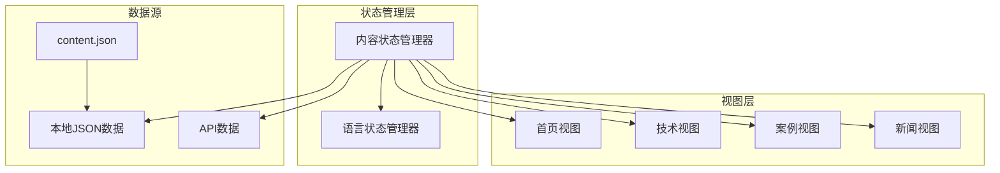
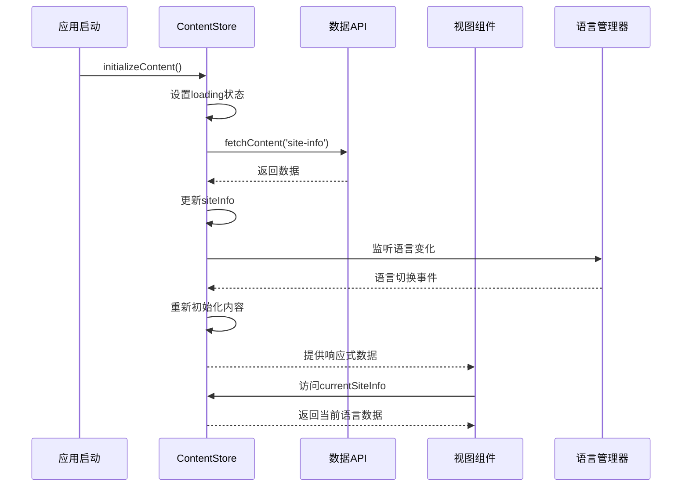
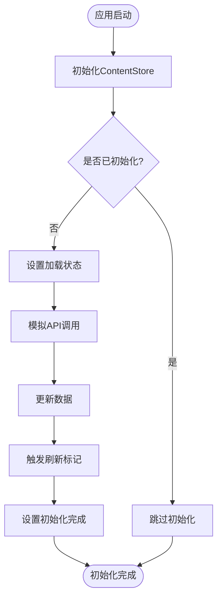
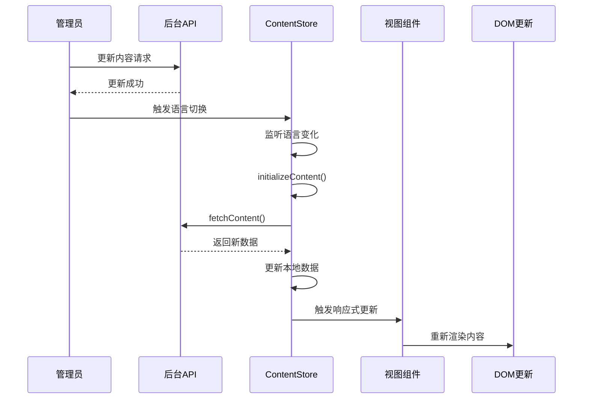
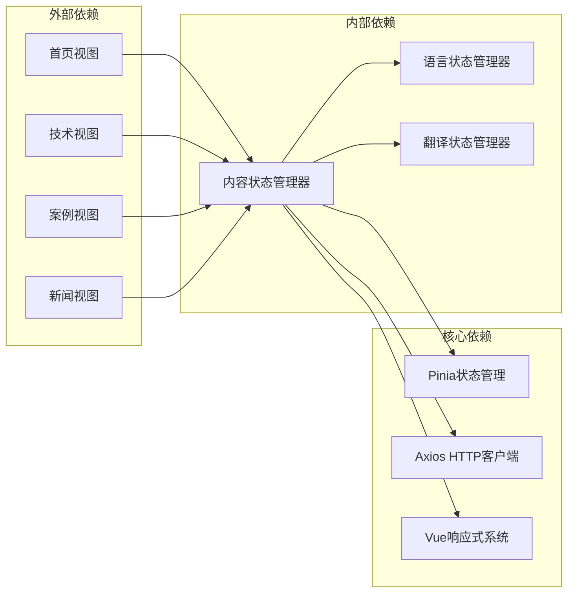

# 内容状态管理

<cite>
**本文档引用的文件**
- [src/store/modules/content.js](file://src/store/modules/content.js)
- [src/views/HomeView.vue](file://src/views/HomeView.vue)
- [src/views/TechnologyView.vue](file://src/views/TechnologyView.vue)
- [src/store/index.js](file://src/store/index.js)
- [src/main.js](file://src/main.js)
- [src/App.vue](file://src/App.vue)
- [data/content.json](file://data/content.json)
</cite>

## 目录
1. [简介](#简介)
2. [项目结构](#项目结构)
3. [核心组件](#核心组件)
4. [架构概览](#架构概览)
5. [详细组件分析](#详细组件分析)
6. [依赖关系分析](#依赖关系分析)
7. [性能考虑](#性能考虑)
8. [故障排除指南](#故障排除指南)
9. [结论](#结论)

## 简介

内容状态管理模块是整个应用程序的核心数据层，负责管理网站的所有静态内容数据。该模块通过Pinia状态管理库实现了响应式的数据管理，支持多语言内容切换，并提供了完整的数据初始化、加载、更新和缓存机制。

主要内容包括：
- 网站基本信息（公司名称、标语、联系方式）
- 技术解决方案和核心技术介绍
- 应用案例和成功故事
- 新闻资讯和公司动态
- 关于我们和企业文化信息
- 招聘信息和人才需求

## 项目结构

内容状态管理模块位于`src/store/modules/content.js`，采用模块化设计，每个内容类别都有独立的数据结构和管理逻辑。



**图表来源**
- [src/store/modules/content.js](file://src/store/modules/content.js#L1-L648)
- [src/store/index.js](file://src/store/index.js#L1-L6)

## 核心组件

### ContentStore状态管理器

ContentStore是整个内容管理系统的核心，使用Pinia的组合式API设计，提供了完整的响应式状态管理功能。

```javascript
export const useContentStore = defineStore('content', () => {
  // 获取语言store
  const languageStore = useLanguageStore()
  
  // 状态管理
  const loading = ref(false)
  const error = ref(null)
  const isInitialized = ref(false)
  
  // 添加一个强制刷新的标记
  const refreshTrigger = ref(0)
  
  // 监听语言变化，触发刷新
  watch(() => languageStore.language, async (newLang, oldLang) => {
    console.log('ContentStore检测到语言变化，从', oldLang, '变为', newLang);
    await initializeContent()
  })
})
```

**章节来源**
- [src/store/modules/content.js](file://src/store/modules/content.js#L6-L25)

### 多语言内容结构

每个内容类别都支持中英文双语，采用reactive对象结构存储：

```javascript
// 网站基本信息
const siteInfo = reactive({
  zh: {
    companyName: '杭州朗德智能科技有限公司',
    slogan: '智能反无人机，守护空域安全',
    description: '领先的反无人机系统及反无人机解决方案提供商',
    contactInfo: {
      address: '浙江省杭州市滨江区科技园区创新大厦A座15楼',
      phone: '0571-8888 9999',
      email: 'info@landedrone.com'
    }
  },
  en: {
    companyName: 'Hangzhou Lande Intelligent Technology Co., Ltd.',
    slogan: 'Smart Anti-Drone Systems, Securing Airspace',
    description: 'Leading provider of anti-drone systems and solutions',
    contactInfo: {
      address: '15F, Building A, Innovation Tower, Science & Technology Park, Binjiang District, Hangzhou, Zhejiang',
      phone: '0571-8888 9999',
      email: 'info@landedrone.com'
    }
  }
})
```

**章节来源**
- [src/store/modules/content.js](file://src/store/modules/content.js#L32-L60)

## 架构概览

内容状态管理采用分层架构设计，实现了清晰的关注点分离：



**图表来源**
- [src/store/modules/content.js](file://src/store/modules/content.js#L26-L43)
- [src/App.vue](file://src/App.vue#L150-L189)

## 详细组件分析

### 数据初始化流程

ContentStore在应用启动时会自动初始化内容数据：



**图表来源**
- [src/store/modules/content.js](file://src/store/modules/content.js#L26-L43)

### fetchContent方法详解

fetchContent方法是内容加载的核心，支持按需加载不同类型的内容：

```javascript
const fetchContent = async (contentType) => {
  if (!isInitialized.value) return null
  
  try {
    loading.value = true
    error.value = null
    
    // 构建API请求URL
    const url = `/content/${contentType}`
    
    // 发送请求
    const response = await axios.get(url)
    
    // 更新相应的数据
    if (contentType === 'site-info') {
      // 更新网站基本信息
      Object.assign(siteInfo.zh, response.data?.zh || {})
      Object.assign(siteInfo.en, response.data?.en || {})
    } else if (contentType === 'technologies') {
      // 更新技术数据
      if (response.data?.zh) technologies.zh = response.data.zh
      if (response.data?.en) technologies.en = response.data.en
    }
    // ... 其他内容类型的处理
    
    return response.data
  } catch (err) {
    console.error(`获取${contentType}数据失败:`, err)
    error.value = err.message || '数据加载失败'
    return null
  } finally {
    loading.value = false
  }
}
```

**章节来源**
- [src/store/modules/content.js](file://src/store/modules/content.js#L540-L574)

### 视图层数据访问模式

在各个视图组件中，可以通过多种方式访问内容数据：

#### 方式一：直接使用store的计算属性

```javascript
// HomeView.vue
import { useContentStore } from '@/store/modules/content'
import { storeToRefs } from 'pinia'

const contentStore = useContentStore()
const { siteInfo, technologies, cases, news } = storeToRefs(contentStore)

// 使用计算属性获取当前语言的数据
const currentTechnologies = computed(() => contentStore.currentTechnologies)
```

#### 方式二：使用语言混入函数

```javascript
// HomeView.vue
import { useLanguage } from '@/mixins/language'

const { getTechnologies, getCurrentSiteInfo, getCurrentTechnologies } = useLanguage()

// 优先使用混入函数获取数据
const currentTechnologies = computed(() => {
  const techsFromMixin = getTechnologies()
  if (techsFromMixin && techsFromMixin.length > 0) {
    return techsFromMixin
  }
  return defaultTechnologies.value
})
```

#### 方式三：使用默认数据作为后备

```javascript
// HomeView.vue
const defaultTechnologies = computed(() => {
  return isZh.value ? [
    {
      id: 'detection',
      title: '无人机探测系统',
      description: '多传感器融合的无人机探测系统，可实现全天候、全方位监控',
      icon: 'fas fa-shield-alt',
      details: '采用雷达、光电、无线电信号等多种探测手段相结合...',
      image: '/images/tech/detection.jpg'
    }
    // ... 更多默认数据
  ] : [
    // 英文版本的默认数据
  ]
})
```

**章节来源**
- [src/views/HomeView.vue](file://src/views/HomeView.vue#L100-L200)
- [src/views/TechnologyView.vue](file://src/views/TechnologyView.vue#L100-L150)

### 内容更新机制

当管理员修改内容后，前端会重新加载并同步UI：



**图表来源**
- [src/store/modules/content.js](file://src/store/modules/content.js#L26-L30)
- [src/App.vue](file://src/App.vue#L500-L550)

**章节来源**
- [src/store/modules/content.js](file://src/store/modules/content.js#L598-L615)

## 依赖关系分析

内容状态管理模块与其他模块存在复杂的依赖关系：



**图表来源**
- [src/store/modules/content.js](file://src/store/modules/content.js#L1-L5)
- [src/store/index.js](file://src/store/index.js#L1-L6)

**章节来源**
- [src/store/modules/content.js](file://src/store/modules/content.js#L1-L6)
- [src/store/index.js](file://src/store/index.js#L1-L6)

## 性能考虑

### 缓存策略

ContentStore实现了多层次的缓存策略：

1. **内存缓存**：所有内容数据都存储在reactive对象中，避免重复请求
2. **刷新标记**：通过refreshTrigger.ref()实现强制刷新机制
3. **懒加载**：只有在需要时才加载特定类型的内容

### 性能优化点

1. **语言切换优化**：监听语言变化时只重新初始化必要的内容
2. **加载状态管理**：使用loading和error状态避免重复请求
3. **响应式更新**：利用Vue的响应式系统自动更新视图
4. **默认数据回退**：提供默认数据确保页面始终可访问

```javascript
// 语言切换时的优化处理
watch(() => languageStore.language, async (newLang, oldLang) => {
  console.log('ContentStore检测到语言变化，从', oldLang, '变为', newLang);
  await initializeContent()
})

// 加载状态的优化
const initializeContent = async () => {
  if (loading.value) return
  
  try {
    loading.value = true
    error.value = null
    
    // 模拟API调用，实际应用中应替换为真实请求
    await new Promise(resolve => setTimeout(resolve, 100))
    
    refreshTrigger.value++
    isInitialized.value = true
  } catch (err) {
    console.error('Failed to initialize content:', err)
    error.value = err
  } finally {
    loading.value = false
  }
}
```

**章节来源**
- [src/store/modules/content.js](file://src/store/modules/content.js#L26-L43)

## 故障排除指南

### 常见问题场景

#### 1. 内容加载失败

**症状**：页面显示默认内容而非从服务器获取的数据

**原因分析**：
- API请求失败
- 网络连接问题
- 数据格式错误

**解决方案**：
```javascript
// 检查加载状态和错误信息
const loadError = computed(() => {
  return !contentStore.isInitialized && contentStore.error
})

// 提供重试机制
const retryLoad = async () => {
  try {
    await contentStore.initializeContent()
  } catch (error) {
    console.error('重试加载失败:', error)
  }
}
```

#### 2. 语言切换不生效

**症状**：切换语言后内容没有更新

**原因分析**：
- 语言状态未正确更新
- 刷新标记未触发
- 视图组件未监听状态变化

**解决方案**：
```javascript
// 确保语言切换后正确触发刷新
watch(() => languageStore.language, async (newLang) => {
  console.log('语言已变更，开始强制刷新视图:', newLang)
  isLoading.value = true
  await nextTick()
  window.dispatchEvent(new Event('resize'))
  
  // 刷新当前路由
  const currentPath = router.currentRoute.value.fullPath
  const refreshPath = currentPath.includes('?') 
    ? `${currentPath}&_t=${Date.now()}`
    : `${currentPath}?_t=${Date.now()}`
  
  router.replace(refreshPath)
})
```

#### 3. 内容缺失处理

**症状**：某些内容字段为空或undefined

**解决方案**：
```javascript
// 提供健壮的数据访问方法
const getCurrentSiteInfo = computed(() => {
  const infoFromStore = contentStore.siteInfo
  if (infoFromStore && infoFromStore.companyName) {
    return infoFromStore
  }
  // 返回默认数据
  return {
    companyName: '杭州朗德智能科技有限公司',
    slogan: '智能反无人机，守护空域安全',
    description: '领先的反无人机系统及反无人机解决方案提供商',
    contactInfo: {
      address: '浙江省杭州市滨江区科技园区创新大厦A座15楼',
      phone: '0571-8888 9999',
      email: 'info@landedrone.com'
    }
  }
})
```

**章节来源**
- [src/views/HomeView.vue](file://src/views/HomeView.vue#L100-L150)
- [src/App.vue](file://src/App.vue#L500-L550)

## 结论

内容状态管理模块是一个设计精良、功能完善的系统，它成功地解决了以下关键问题：

### 主要优势

1. **响应式设计**：基于Vue 3的响应式系统，确保数据变化时UI自动更新
2. **多语言支持**：完整的中英文双语支持，满足国际化需求
3. **性能优化**：多层次缓存策略和懒加载机制
4. **容错处理**：完善的错误处理和默认数据回退机制
5. **易于维护**：模块化设计，职责清晰，便于扩展和维护

### 最佳实践建议

1. **数据验证**：在fetchContent方法中添加更严格的数据验证
2. **缓存策略**：考虑实现更高级的缓存策略，如TTL过期机制
3. **错误报告**：集成错误监控系统，及时发现和处理问题
4. **性能监控**：添加性能指标监控，跟踪数据加载时间和用户体验
5. **测试覆盖**：增加单元测试和集成测试，确保系统的稳定性

该模块为整个应用程序提供了坚实的数据基础，是构建高质量Web应用的重要组成部分。通过合理的架构设计和性能优化，它能够很好地支持业务需求的增长和技术演进。