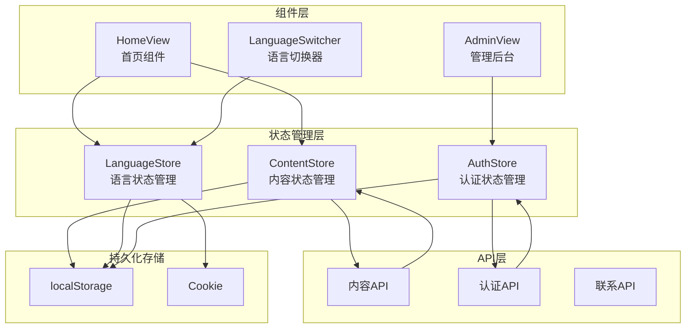
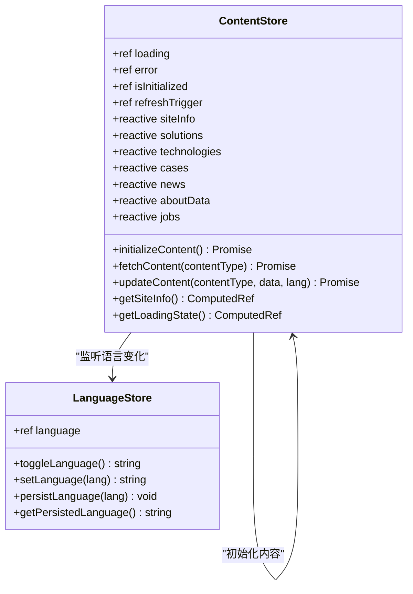
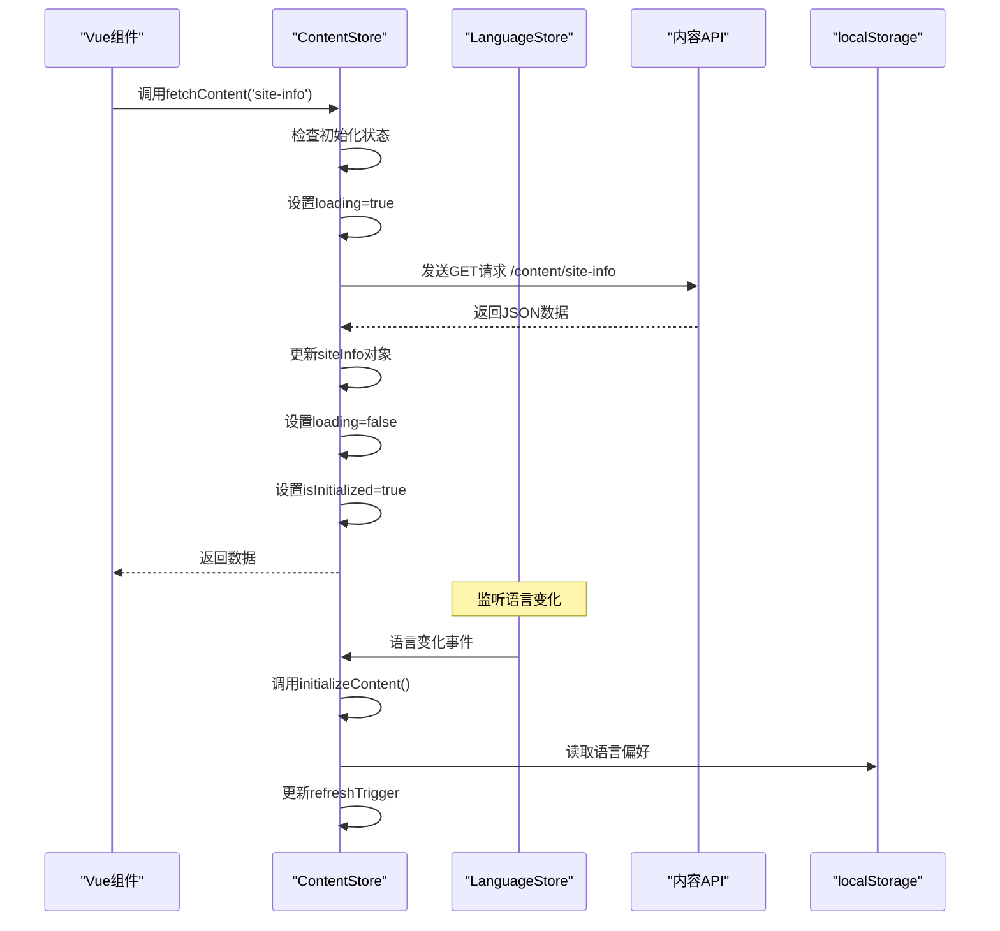
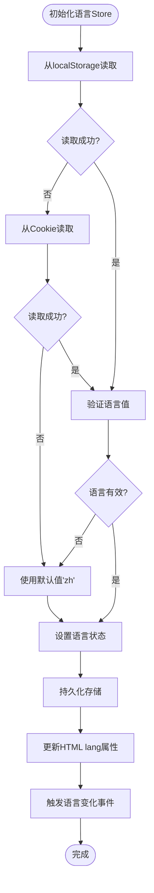
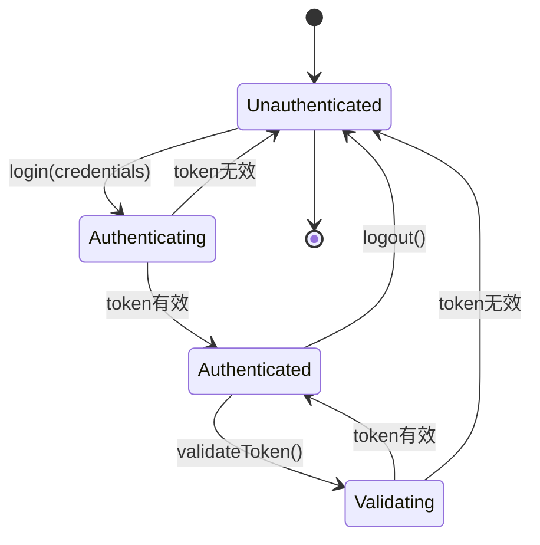
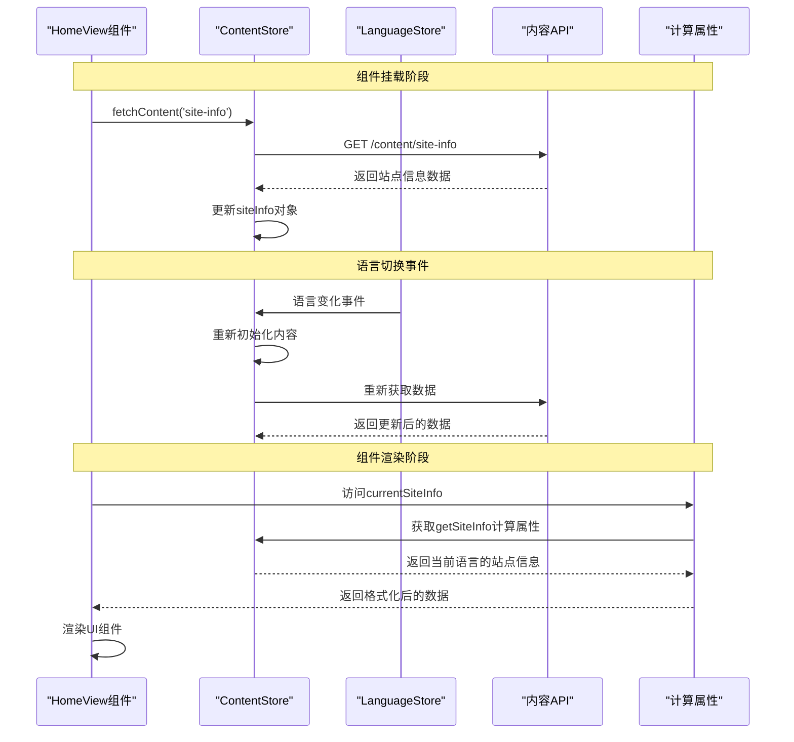
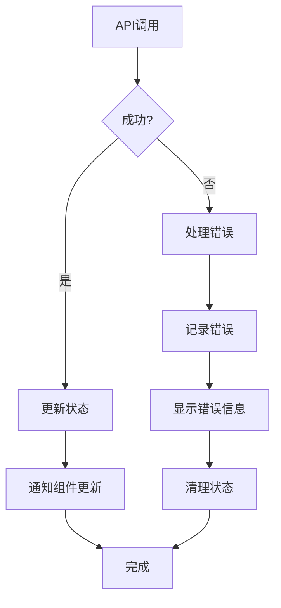

# 数据流与状态管理

<cite>
**本文档引用的文件**
- [package.json](file://package.json)
- [src/store/index.js](file://src/store/index.js)
- [src/store/modules/content.js](file://src/store/modules/content.js)
- [src/store/modules/language.js](file://src/store/modules/language.js)
- [src/store/modules/auth.js](file://src/store/modules/auth.js)
- [src/views/HomeView.vue](file://src/views/HomeView.vue)
- [src/api/index.js](file://src/api/index.js)
- [src/router/index.js](file://src/router/index.js)
- [src/views/admin/AdminView.vue](file://src/views/admin/AdminView.vue)
</cite>

## 目录
1. [项目概述](#项目概述)
2. [状态管理架构](#状态管理架构)
3. [ContentState数据流分析](#contentstate数据流分析)
4. [LanguageState语言管理机制](#languagestate语言管理机制)
5. [AuthState认证状态管理](#authstate认证状态管理)
6. [数据流完整示例](#数据流完整示例)
7. [状态管理最佳实践](#状态管理最佳实践)
8. [性能优化建议](#性能优化建议)
9. [总结](#总结)

## 项目概述

该项目是一个基于Vue 3和Pinia的状态管理系统，专门用于管理反无人机系统的网站内容。系统采用模块化的状态管理模式，通过三个核心store模块（ContentState、LanguageState、AuthState）实现数据的统一管理和跨组件共享。

项目使用以下关键技术栈：
- **前端框架**: Vue 3 (Composition API)
- **状态管理**: Pinia (Vue 3官方推荐的状态管理库)
- **路由管理**: Vue Router 4
- **HTTP客户端**: Axios
- **构建工具**: Vite

## 状态管理架构

**图表来源**
- [src/store/index.js](file://src/store/index.js#L1-L6)
- [src/store/modules/content.js](file://src/store/modules/content.js#L1-L10)
- [src/store/modules/language.js](file://src/store/modules/language.js#L1-L10)
- [src/store/modules/auth.js](file://src/store/modules/auth.js#L1-L10)

## ContentState数据流分析

### 核心数据结构

ContentStore负责管理网站的所有静态内容数据，包括站点信息、解决方案、技术详情、案例研究、新闻资讯等。数据结构采用双语言模式（中文/英文）进行组织。

**图表来源**
- [src/store/modules/content.js](file://src/store/modules/content.js#L1-L50)
- [src/store/modules/language.js](file://src/store/modules/language.js#L60-L80)

### 数据初始化流程

ContentStore的初始化过程展示了完整的数据加载和缓存机制：

**图表来源**
- [src/store/modules/content.js](file://src/store/modules/content.js#L540-L590)
- [src/store/modules/language.js](file://src/store/modules/language.js#L15-L30)

### 语言感知的数据更新

ContentStore通过监听LanguageStore的语言变化来实现动态内容更新：

**章节来源**
- [src/store/modules/content.js](file://src/store/modules/content.js#L15-L25)
- [src/store/modules/content.js](file://src/store/modules/content.js#L540-L590)

## LanguageState语言管理机制

### 持久化策略

LanguageStore实现了双重持久化机制，确保语言设置的可靠存储：

**图表来源**
- [src/store/modules/language.js](file://src/store/modules/language.js#L10-L40)
- [src/store/modules/language.js](file://src/store/modules/language.js#L45-L70)

### 语言切换机制

语言切换过程不仅更新状态，还触发UI重渲染和事件通知：

**章节来源**
- [src/store/modules/language.js](file://src/store/modules/language.js#L70-L120)
- [src/store/modules/language.js](file://src/store/modules/language.js#L150-L180)

## AuthState认证状态管理

### JWT Token管理

AuthStore负责管理管理员用户的认证状态，包括JWT token的存储、验证和自动登出机制：

**图表来源**
- [src/store/modules/auth.js](file://src/store/modules/auth.js#L10-L30)
- [src/store/modules/auth.js](file://src/store/modules/auth.js#L40-L60)

### 路由守卫与认证

系统通过Vue Router的前置守卫实现管理后台的访问控制：

**章节来源**
- [src/store/modules/auth.js](file://src/store/modules/auth.js#L1-L86)
- [src/router/index.js](file://src/router/index.js#L90-L105)

## 数据流完整示例

### 实际使用案例：HomeView中的数据流

让我们通过HomeView组件的实现来展示完整的数据流链条：

**图表来源**
- [src/views/HomeView.vue](file://src/views/HomeView.vue#L150-L180)
- [src/store/modules/content.js](file://src/store/modules/content.js#L540-L590)

### API交互流程

系统通过统一的API层处理所有外部数据请求：

**章节来源**
- [src/views/HomeView.vue](file://src/views/HomeView.vue#L150-L180)
- [src/api/index.js](file://src/api/index.js#L1-L95)

## 状态管理最佳实践

### 状态设计原则

1. **单一职责**: 每个store专注于特定的功能领域
2. **不可变性**: 使用ref和reactive确保状态的响应性
3. **计算属性**: 利用computed实现派生状态的高效计算
4. **异步处理**: 完善的loading和error状态管理

### 性能优化策略

1. **懒加载**: 按需加载内容数据
2. **缓存机制**: 避免重复的API调用
3. **语言感知**: 通过语言变化触发局部更新
4. **计算属性缓存**: 利用Vue的计算属性缓存机制

### 错误处理机制

**图表来源**
- [src/store/modules/content.js](file://src/store/modules/content.js#L540-L590)
- [src/store/modules/auth.js](file://src/store/modules/auth.js#L15-L35)

## 性能优化建议

### 状态冗余规避

1. **避免重复计算**: 使用computed而非重复的计算逻辑
2. **选择性订阅**: 只订阅必要的状态变化
3. **批量更新**: 合并多个状态更新操作

### 过度订阅预防

1. **细粒度订阅**: 避免订阅整个store对象
2. **条件更新**: 根据业务逻辑决定是否更新
3. **防抖处理**: 对频繁的状态变化进行防抖

### 内存泄漏防范

1. **及时清理**: 在组件卸载时清理事件监听器
2. **循环引用**: 避免store之间的循环依赖
3. **定时器清理**: 及时清理setTimeout和setInterval

## 总结

该项目的状态管理系统展现了现代Vue应用的最佳实践：

1. **模块化设计**: 通过分离的store模块实现清晰的职责划分
2. **响应式架构**: 利用Pinia的响应式特性实现高效的状态管理
3. **持久化策略**: 实现了可靠的本地存储和同步机制
4. **用户体验**: 通过渐进式加载和错误处理提升用户体验
5. **可维护性**: 清晰的代码结构和完善的注释便于后续维护

该系统为反无人机网站提供了强大的数据管理能力，支持多语言内容、用户认证和管理后台等功能，是一个典型的现代前端应用状态管理范例。