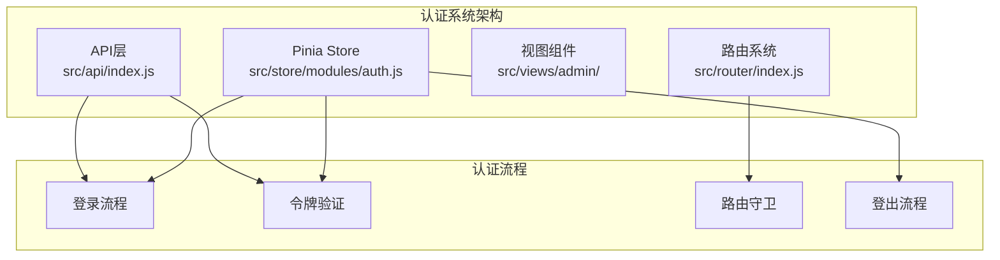
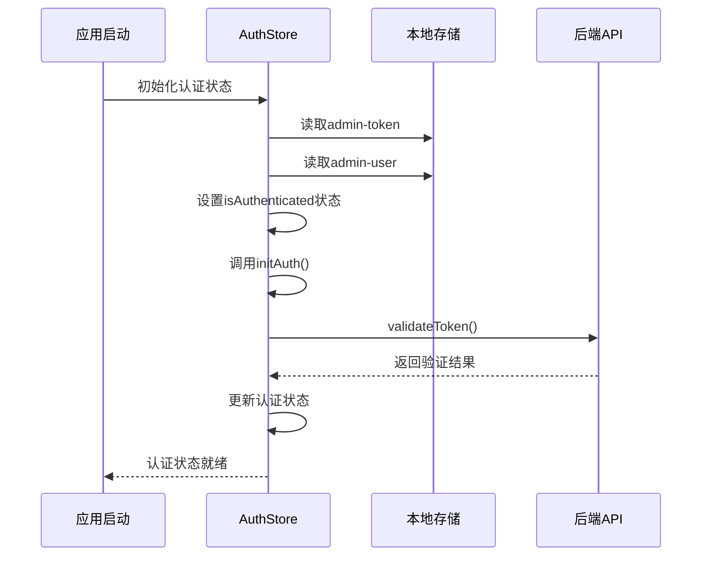
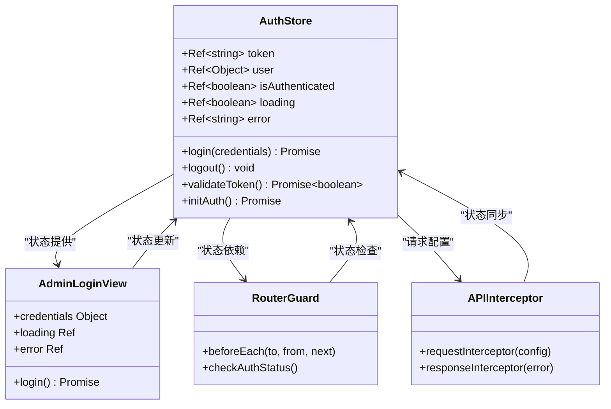
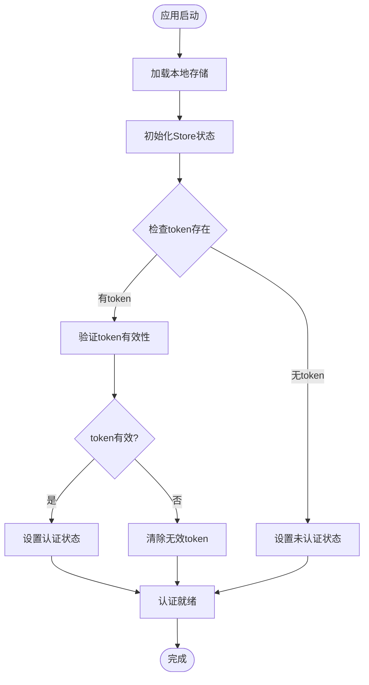
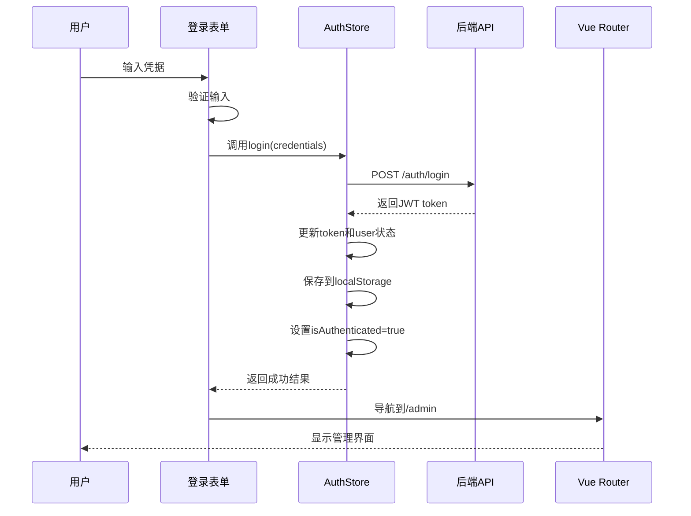
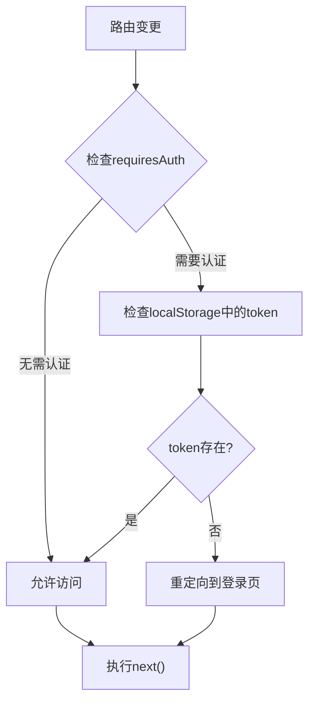
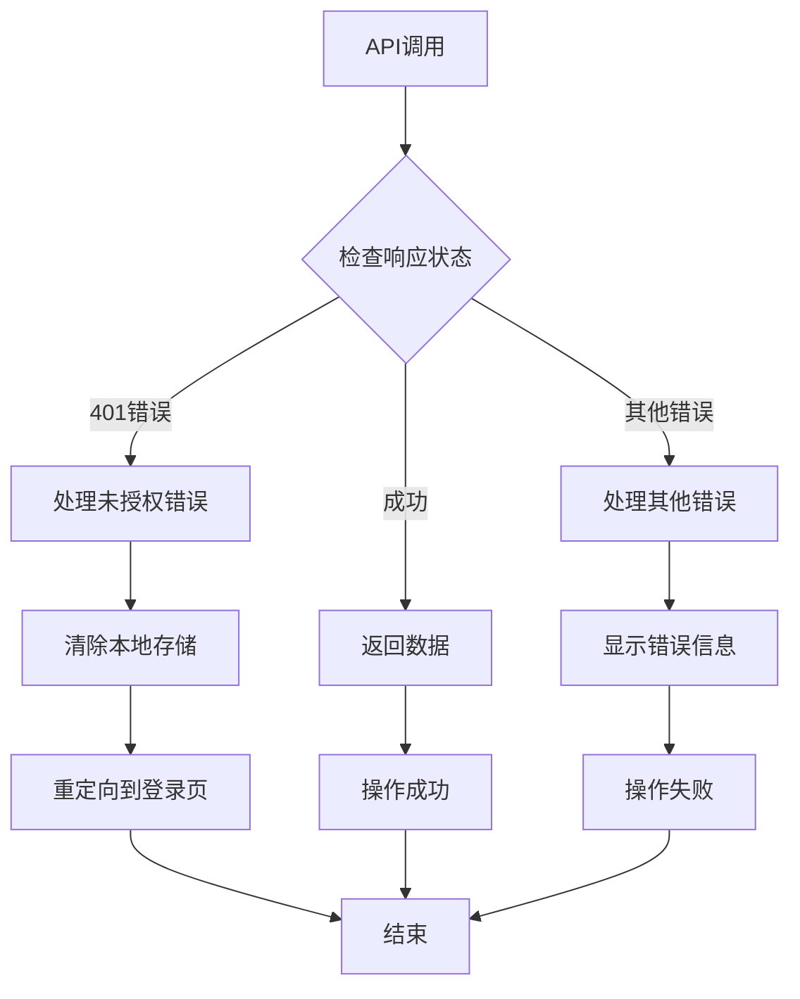

# 认证状态管理

<cite>
**本文档引用的文件**
- [src/store/modules/auth.js](file://src/store/modules/auth.js)
- [src/views/admin/AdminLoginView.vue](file://src/views/admin/AdminLoginView.vue)
- [src/router/index.js](file://src/router/index.js)
- [src/store/index.js](file://src/store/index.js)
- [src/api/index.js](file://src/api/index.js)
- [src/views/admin/AdminView.vue](file://src/views/admin/AdminView.vue)
</cite>

## 目录
1. [简介](#简介)
2. [项目结构概览](#项目结构概览)
3. [核心认证模块分析](#核心认证模块分析)
4. [认证状态管理架构](#认证状态管理架构)
5. [详细组件分析](#详细组件分析)
6. [路由守卫机制](#路由守卫机制)
7. [API集成与拦截器](#API集成与拦截器)
8. [错误处理与安全机制](#错误处理与安全机制)
9. [性能考虑](#性能考虑)
10. [故障排除指南](#故障排除指南)
11. [结论与改进建议](#结论与改进建议)

## 简介

本文档深入分析了基于Vue 3和Pinia的状态管理系统中的认证模块。该系统采用JWT（JSON Web Token）进行身份验证，通过localStorage持久化存储认证信息，并实现了完整的认证生命周期管理，包括登录、登出、令牌验证和自动登出功能。

认证系统的核心目标是：
- 安全地管理用户的登录状态
- 提供透明的令牌管理和自动续期机制
- 实现细粒度的权限控制
- 确保用户体验的一致性和流畅性

## 项目结构概览

认证系统的文件组织遵循模块化设计原则，主要组件分布在以下目录结构中：



**图表来源**
- [src/store/modules/auth.js](file://src/store/modules/auth.js#L1-L86)
- [src/router/index.js](file://src/router/index.js#L1-L122)
- [src/api/index.js](file://src/api/index.js#L1-L95)

## 核心认证模块分析

### AuthStore状态定义

认证模块使用Pinia的组合式API模式，定义了以下核心状态：

```javascript
// 认证状态
const token = ref(localStorage.getItem('admin-token') || '')
const user = ref(JSON.parse(localStorage.getItem('admin-user') || '{}'))
const isAuthenticated = ref(!!token.value)
const loading = ref(false)
const error = ref(null)
```

这些响应式状态提供了：
- **token**: 存储JWT令牌，从localStorage初始化
- **user**: 用户信息对象，支持序列化/反序列化
- **isAuthenticated**: 基于token值的布尔状态
- **loading**: 异步操作状态指示
- **error**: 错误信息存储

### 认证状态初始化流程



**图表来源**
- [src/store/modules/auth.js](file://src/store/modules/auth.js#L75-L86)

**章节来源**
- [src/store/modules/auth.js](file://src/store/modules/auth.js#L1-L86)

## 认证状态管理架构

### 状态管理模式

认证系统采用响应式状态管理模式，所有状态变更都通过Pinia store进行统一管理：



**图表来源**
- [src/store/modules/auth.js](file://src/store/modules/auth.js#L1-L86)
- [src/views/admin/AdminLoginView.vue](file://src/views/admin/AdminLoginView.vue#L1-L105)
- [src/router/index.js](file://src/router/index.js#L95-L105)
- [src/api/index.js](file://src/api/index.js#L15-L45)

### 数据流架构

认证数据流遵循单向数据流原则：



**图表来源**
- [src/store/modules/auth.js](file://src/store/modules/auth.js#L75-L86)

**章节来源**
- [src/store/modules/auth.js](file://src/store/modules/auth.js#L1-L86)

## 详细组件分析

### AdminLoginView组件分析

AdminLoginView是认证流程的入口点，负责处理用户登录表单和状态更新：



**图表来源**
- [src/views/admin/AdminLoginView.vue](file://src/views/admin/AdminLoginView.vue#L50-L60)
- [src/store/modules/auth.js](file://src/store/modules/auth.js#L13-L40)

#### 表单验证与状态管理

登录组件使用reactive响应式对象管理表单状态：

```javascript
const credentials = reactive({
  username: '',
  password: ''
})
```

表单提交流程：
1. 用户输入凭据并点击登录
2. 组件调用authStore.login(credentials)
3. Store执行异步登录操作
4. 成功后导航到管理后台

### AuthStore Actions详解

#### login方法实现

login方法是认证流程的核心，包含完整的错误处理和状态管理：

```javascript
const login = async (credentials) => {
  loading.value = true
  error.value = null
  
  try {
    const response = await axios.post('/api/auth/login', credentials)
    
    if (response.data.token) {
      token.value = response.data.token
      user.value = response.data.user
      isAuthenticated.value = true
      
      // 保存到本地存储
      localStorage.setItem('admin-token', token.value)
      localStorage.setItem('admin-user', JSON.stringify(user.value))
      
      return { success: true }
    } else {
      throw new Error('认证失败')
    }
  } catch (e) {
    error.value = e.message || '登录失败，请检查账号和密码'
    return { success: false, error: error.value }
  } finally {
    loading.value = false
  }
}
```

关键特性：
- **异步操作管理**: 使用try-catch-finally确保状态一致性
- **错误处理**: 提供详细的错误信息反馈
- **状态同步**: 自动更新store状态和localStorage
- **用户体验**: loading状态指示操作进度

#### logout方法实现

logout方法负责清理所有认证相关状态：

```javascript
const logout = () => {
  token.value = ''
  user.value = {}
  isAuthenticated.value = false
  
  // 清除本地存储
  localStorage.removeItem('admin-token')
  localStorage.removeItem('admin-user')
}
```

logout操作的特点：
- **原子性**: 所有状态同时清空
- **安全性**: 立即移除敏感信息
- **一致性**: 保持前端状态与后端会话同步

#### validateToken方法实现

validateToken方法用于验证现有token的有效性：

```javascript
const validateToken = async () => {
  if (!token.value) return false
  
  try {
    const response = await axios.post('/api/auth/validate', { token: token.value })
    return response.data.valid
  } catch (e) {
    logout()
    return false
  }
}
```

该方法的设计考虑：
- **防御性编程**: 检查token是否存在
- **自动清理**: 验证失败时自动登出
- **幂等性**: 可以安全地重复调用

**章节来源**
- [src/views/admin/AdminLoginView.vue](file://src/views/admin/AdminLoginView.vue#L50-L60)
- [src/store/modules/auth.js](file://src/store/modules/auth.js#L13-L86)

## 路由守卫机制

### 前置守卫实现

路由守卫是保护管理后台路由的关键机制：

```javascript
router.beforeEach((to, from, next) => {
  if (to.matched.some(record => record.meta.requiresAuth)) {
    // 检查用户是否已登录
    const isLoggedIn = localStorage.getItem('admin-token')
    if (!isLoggedIn) {
      // 如果没有登录，重定向到登录页面
      next({ name: 'admin-login' })
    } else {
      next()
    }
  } else {
    next()
  }
})
```

### 路由元信息配置

管理后台路由配置requiresAuth元信息：

```javascript
{
  path: '/admin',
  name: 'admin',
  component: () => import('../views/admin/AdminView.vue'),
  meta: { requiresAuth: true },
  children: [
    // 子路由...
  ]
}
```

### 守卫工作流程



**图表来源**
- [src/router/index.js](file://src/router/index.js#L95-L105)

**章节来源**
- [src/router/index.js](file://src/router/index.js#L95-L105)

## API集成与拦截器

### 请求拦截器

API拦截器负责自动添加认证头：

```javascript
api.interceptors.request.use(
  config => {
    const token = localStorage.getItem('admin-token')
    if (token) {
      config.headers.Authorization = `Bearer ${token}`
    }
    return config
  },
  error => {
    return Promise.reject(error)
  }
)
```

### 响应拦截器

响应拦截器处理认证相关的错误：

```javascript
api.interceptors.response.use(
  response => {
    return response
  },
  error => {
    if (error.response) {
      if (error.response.status === 401) {
        localStorage.removeItem('admin-token')
        localStorage.removeItem('admin-user')
        if (window.location.pathname.startsWith('/admin')) {
          window.location.href = '/admin/login'
        }
      }
    }
    return Promise.reject(error)
  }
)
```

### API接口定义

```javascript
export const authApi = {
  // 登录
  login: (credentials) => api.post('/auth/login', credentials),
  
  // 验证token
  validateToken: () => api.post('/auth/validate'),
  
  // 获取用户信息
  getUserInfo: () => api.get('/auth/me')
}
```

**章节来源**
- [src/api/index.js](file://src/api/index.js#L15-L45)
- [src/api/index.js](file://src/api/index.js#L60-L70)

## 错误处理与安全机制

### 自动登出机制

当检测到401未授权错误时，系统会自动执行以下操作：

1. **清除本地存储**: 移除admin-token和admin-user
2. **重定向到登录页**: 自动导航到登录页面
3. **状态同步**: 确保前端状态与后端会话一致

### 错误处理策略



**图表来源**
- [src/api/index.js](file://src/api/index.js#L25-L40)

### 安全最佳实践

1. **令牌存储安全**
   - 使用localStorage存储JWT令牌
   - 实现自动清理机制
   - 支持手动登出

2. **请求安全**
   - 自动添加Authorization头
   - 处理认证错误
   - 支持token刷新

3. **状态同步**
   - 前后端状态保持一致
   - 实现自动验证机制
   - 支持离线状态恢复

**章节来源**
- [src/api/index.js](file://src/api/index.js#L25-L40)

## 性能考虑

### 状态更新优化

认证状态管理采用了多种性能优化策略：

1. **响应式状态**: 使用Pinia的响应式系统，只在必要时触发重新渲染
2. **懒加载**: 路由组件按需加载，减少初始包大小
3. **缓存策略**: localStorage作为持久化缓存，避免重复网络请求

### 内存管理

- **及时清理**: 登出时立即清理内存中的敏感信息
- **事件监听器**: 在组件卸载时移除事件监听器
- **循环引用**: 避免store之间的循环依赖

## 故障排除指南

### 常见问题诊断

1. **登录失败**
   - 检查网络连接
   - 验证凭据正确性
   - 查看浏览器控制台错误信息

2. **自动登出**
   - 检查token是否过期
   - 验证服务器时间同步
   - 查看响应拦截器日志

3. **路由重定向问题**
   - 检查路由守卫配置
   - 验证meta.requiresAuth设置
   - 确认localStorage状态

### 调试技巧

```javascript
// 开发环境下的调试工具
console.log('Current auth state:', {
  token: !!token.value,
  user: user.value,
  isAuthenticated: isAuthenticated.value,
  error: error.value
})
```

## 结论与改进建议

### 当前实现的优势

1. **简洁性**: 代码结构清晰，职责分离明确
2. **完整性**: 覆盖了认证生命周期的所有关键环节
3. **可维护性**: 使用现代Vue 3和Pinia技术栈
4. **安全性**: 实现了基本的安全防护机制

### 局限性分析

1. **令牌刷新**: 缺少自动token刷新机制
2. **多设备同步**: localStorage不支持跨设备同步
3. **安全级别**: localStorage相对容易受到XSS攻击
4. **并发控制**: 缺乏对并发登录的处理

### 改进建议

1. **增强安全性**
   ```javascript
   // 使用HttpOnly cookie替代localStorage
   // 实现CSRF保护
   // 添加XSS防护
   ```

2. **完善令牌管理**
   ```javascript
   // 实现refresh token机制
   // 添加token过期提醒
   // 支持多设备登录管理
   ```

3. **提升用户体验**
   ```javascript
   // 添加自动登出倒计时
   // 实现记住我功能
   // 优化错误提示信息
   ```

4. **扩展功能**
   ```javascript
   // 支持OAuth第三方登录
   // 实现双因素认证
   // 添加登录历史记录
   ```

通过持续的改进和优化，这个认证系统可以成为一个更加健壮、安全和用户友好的身份验证解决方案。