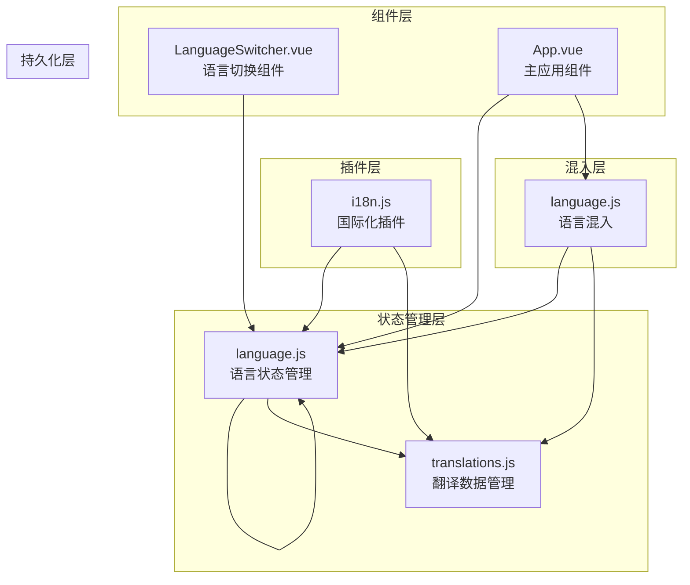
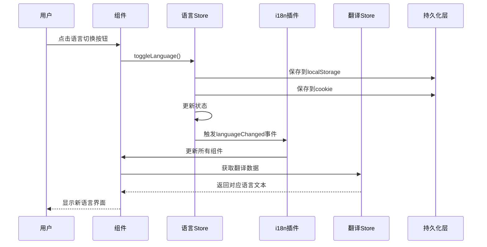
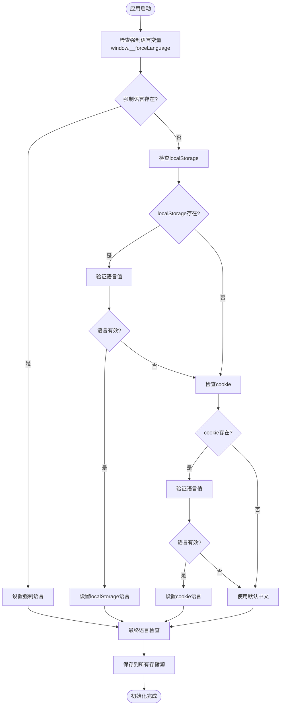
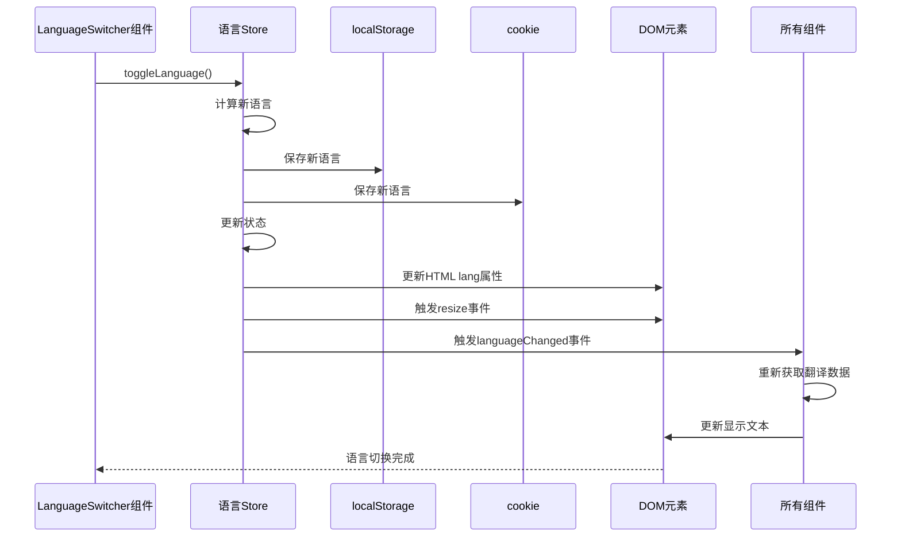
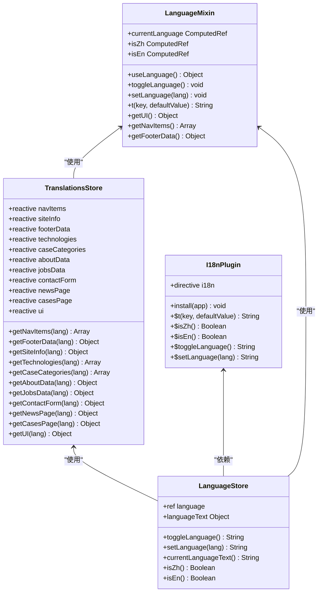
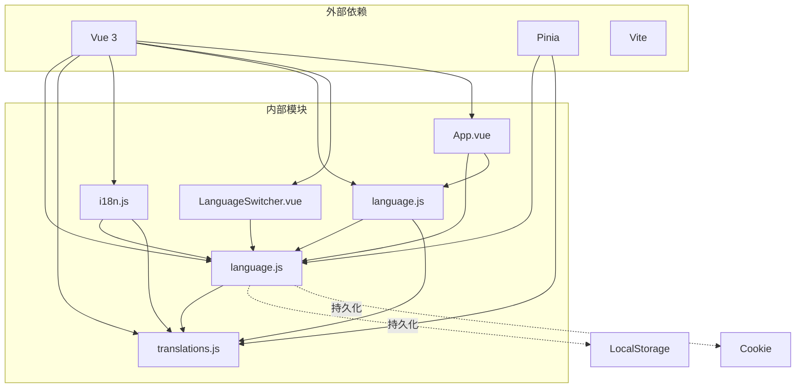

# 语言状态管理

<cite>
**本文档中引用的文件**
- [src/store/modules/language.js](file://src/store/modules/language.js)
- [src/plugins/i18n.js](file://src/plugins/i18n.js)
- [src/mixins/language.js](file://src/mixins/language.js)
- [src/components/LanguageSwitcher.vue](file://src/components/LanguageSwitcher.vue)
- [src/store/modules/translations.js](file://src/store/modules/translations.js)
- [src/main.js](file://src/main.js)
- [src/App.vue](file://src/App.vue)
</cite>

## 目录
1. [简介](#简介)
2. [项目结构](#项目结构)
3. [核心组件](#核心组件)
4. [架构概览](#架构概览)
5. [详细组件分析](#详细组件分析)
6. [依赖关系分析](#依赖关系分析)
7. [性能考虑](#性能考虑)
8. [故障排除指南](#故障排除指南)
9. [结论](#结论)

## 简介

本文档深入分析了基于Vue 3和Pinia的状态管理系统中的语言状态管理模块。该系统实现了完整的多语言支持，包括语言切换、持久化存储、响应式更新和国际化文本绑定等功能。系统采用分层架构设计，通过store模块、插件系统和混入机制实现语言状态的统一管理和响应式更新。

## 项目结构

语言状态管理系统的核心文件组织如下：



**图表来源**
- [src/store/modules/language.js](file://src/store/modules/language.js#L1-L215)
- [src/plugins/i18n.js](file://src/plugins/i18n.js#L1-L72)
- [src/mixins/language.js](file://src/mixins/language.js#L1-L127)

**章节来源**
- [src/store/modules/language.js](file://src/store/modules/language.js#L1-L215)
- [src/plugins/i18n.js](file://src/plugins/i18n.js#L1-L72)
- [src/mixins/language.js](file://src/mixins/language.js#L1-L127)

## 核心组件

### 语言状态管理器 (useLanguageStore)

语言状态管理器是整个系统的核心，负责维护当前语言状态、持久化存储和语言切换逻辑。

```javascript
// 初始化语言状态
const persistedLang = getPersistedLanguage();
const language = ref(persistedLang);

// 语言切换方法
const toggleLanguage = () => {
  const newLang = language.value === 'zh' ? 'en' : 'zh';
  persistLanguage(newLang);
  language.value = newLang;
  document.dispatchEvent(new CustomEvent('languageChanged', { detail: newLang }));
  updateHtmlLang();
  return newLang;
};
```

### 国际化插件 (i18n.js)

插件系统提供了全局的语言访问接口和翻译函数：

```javascript
// 全局属性定义
app.config.globalProperties.$language = languageStore.language;
app.config.globalProperties.$isZh = () => languageStore.isZh();
app.config.globalProperties.$isEn = () => languageStore.isEn();
app.config.globalProperties.$t = (key, defaultValue = '') => {
  const ui = translationsStore.getUI(languageStore.language);
  return ui[key] || defaultValue;
};
```

**章节来源**
- [src/store/modules/language.js](file://src/store/modules/language.js#L71-L146)
- [src/plugins/i18n.js](file://src/plugins/i18n.js#L1-L72)

## 架构概览

语言状态管理系统采用分层架构，实现了清晰的关注点分离：



**图表来源**
- [src/components/LanguageSwitcher.vue](file://src/components/LanguageSwitcher.vue#L42-L101)
- [src/store/modules/language.js](file://src/store/modules/language.js#L85-L104)
- [src/plugins/i18n.js](file://src/plugins/i18n.js#L40-L50)

## 详细组件分析

### 语言状态初始化

语言状态的初始化过程包含了多层持久化策略：



**图表来源**
- [src/main.js](file://src/main.js#L50-L150)
- [src/store/modules/language.js](file://src/store/modules/language.js#L10-L40)

### 语言切换流程

语言切换是一个复杂的多步骤操作，确保所有组件都能及时响应语言变化：



**图表来源**
- [src/components/LanguageSwitcher.vue](file://src/components/LanguageSwitcher.vue#L42-L101)
- [src/store/modules/language.js](file://src/store/modules/language.js#L85-L146)

### 翻译数据结构

翻译系统采用了分层的数据结构，支持多种类型的翻译内容：



**图表来源**
- [src/store/modules/translations.js](file://src/store/modules/translations.js#L1-L633)
- [src/store/modules/language.js](file://src/store/modules/language.js#L71-L215)
- [src/plugins/i18n.js](file://src/plugins/i18n.js#L1-L72)
- [src/mixins/language.js](file://src/mixins/language.js#L1-L127)

**章节来源**
- [src/store/modules/language.js](file://src/store/modules/language.js#L71-L215)
- [src/plugins/i18n.js](file://src/plugins/i18n.js#L1-L72)
- [src/mixins/language.js](file://src/mixins/language.js#L1-L127)

### 持久化存储机制

系统实现了双重持久化策略，确保语言设置的可靠性：

```javascript
// 从localStorage和cookie尝试获取语言设置
function getPersistedLanguage() {
  let lang = null;
  
  // 首先从localStorage读取
  try {
    lang = localStorage.getItem('language');
  } catch (e) {
    console.error('从localStorage读取语言失败:', e);
  }
  
  // 如果localStorage没有，尝试从cookie读取
  if (!lang || (lang !== 'zh' && lang !== 'en')) {
    try {
      const cookies = document.cookie.split(';');
      for (let cookie of cookies) {
        const [name, value] = cookie.trim().split('=');
        if (name === 'language') {
          lang = value;
          break;
        }
      }
    } catch (e) {
      console.error('从cookie读取语言失败:', e);
    }
  }
  
  // 如果都没有或无效，使用默认值'zh'
  if (!lang || (lang !== 'zh' && lang !== 'en')) {
    lang = 'zh';
  }
  
  return lang;
}
```

### 响应式更新机制

系统通过多种机制确保语言变化能够及时反映到所有组件：

1. **CustomEvent机制**：通过`document.dispatchEvent`触发全局事件
2. **Vue响应式系统**：利用Pinia的响应式特性自动更新组件
3. **DOM重绘机制**：通过CSS类和样式变更触发页面重绘
4. **指令系统**：自定义`v-i18n`指令实现文本的动态更新

**章节来源**
- [src/store/modules/language.js](file://src/store/modules/language.js#L10-L40)
- [src/store/modules/language.js](file://src/store/modules/language.js#L85-L146)

## 依赖关系分析

语言状态管理系统的依赖关系呈现清晰的层次结构：



**图表来源**
- [src/main.js](file://src/main.js#L1-L20)
- [src/store/modules/language.js](file://src/store/modules/language.js#L1-L10)
- [src/plugins/i18n.js](file://src/plugins/i18n.js#L1-L10)

**章节来源**
- [src/main.js](file://src/main.js#L1-L20)
- [src/store/modules/language.js](file://src/store/modules/language.js#L1-L10)

## 性能考虑

### 优化策略

1. **懒加载翻译数据**：按需加载不同语言的翻译内容
2. **缓存机制**：避免重复查询相同的翻译键
3. **批量更新**：通过事件系统批量更新相关组件
4. **内存管理**：及时清理语言变化监听器

### 性能监控

系统提供了详细的调试信息，帮助开发者监控语言切换的性能：

```javascript
// 语言切换过程中的性能监控
console.log('切换语言，当前语言:', language.value, '，类型:', typeof language.value);
console.log('新语言将设置为:', newLang, '，类型:', typeof newLang);
console.log('更新后的language.value:', language.value, '，类型:', typeof language.value);
console.log('触发languageChanged事件:', newLang);
```

## 故障排除指南

### 常见问题及解决方案

1. **语言切换后页面不更新**
   - 检查`languageChanged`事件是否正常触发
   - 确认所有组件都正确监听了语言变化
   - 验证翻译数据是否正确加载

2. **持久化失效**
   - 检查localStorage权限
   - 验证cookie设置
   - 确认存储格式正确

3. **翻译文本显示异常**
   - 检查翻译键是否存在
   - 验证语言数据结构
   - 确认翻译函数调用正确

### 调试工具

系统提供了丰富的调试信息：

```javascript
// 应用启动时的调试信息
console.log('应用启动：localStorage中的language =', localStorage.getItem('language'));
console.log('languageStore初始化后的language值:', languageStore.language, '，类型:', typeof languageStore.language);

// 语言切换过程中的调试信息
console.log('切换语言，当前语言:', language.value, '，类型:', typeof language.value);
console.log('新语言将设置为:', newLang, '，类型:', typeof newLang);
```

**章节来源**
- [src/store/modules/language.js](file://src/store/modules/language.js#L85-L146)
- [src/main.js](file://src/main.js#L1-L50)

## 结论

语言状态管理系统通过精心设计的架构实现了完整的多语言支持功能。系统采用了分层设计模式，通过store模块、插件系统和混入机制实现了语言状态的统一管理和响应式更新。

### 主要优势

1. **可靠性**：双重持久化策略确保语言设置不会丢失
2. **响应性**：多层次的更新机制保证所有组件及时响应语言变化
3. **可扩展性**：清晰的架构便于添加新的语言支持
4. **易维护性**：模块化设计降低了代码耦合度

### 改进建议

1. **异步加载优化**：可以考虑实现翻译资源的异步加载机制
2. **缓存策略**：增加翻译数据的本地缓存机制
3. **错误处理**：完善异常情况下的回退机制
4. **性能监控**：增加更详细的性能指标收集

该系统为现代Web应用提供了完整的国际化解决方案，具有良好的可维护性和扩展性，适合各种规模的应用项目。