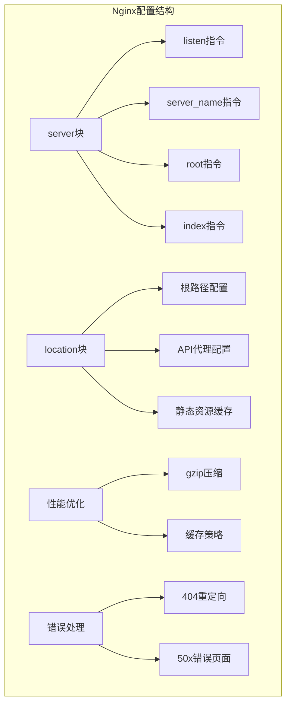
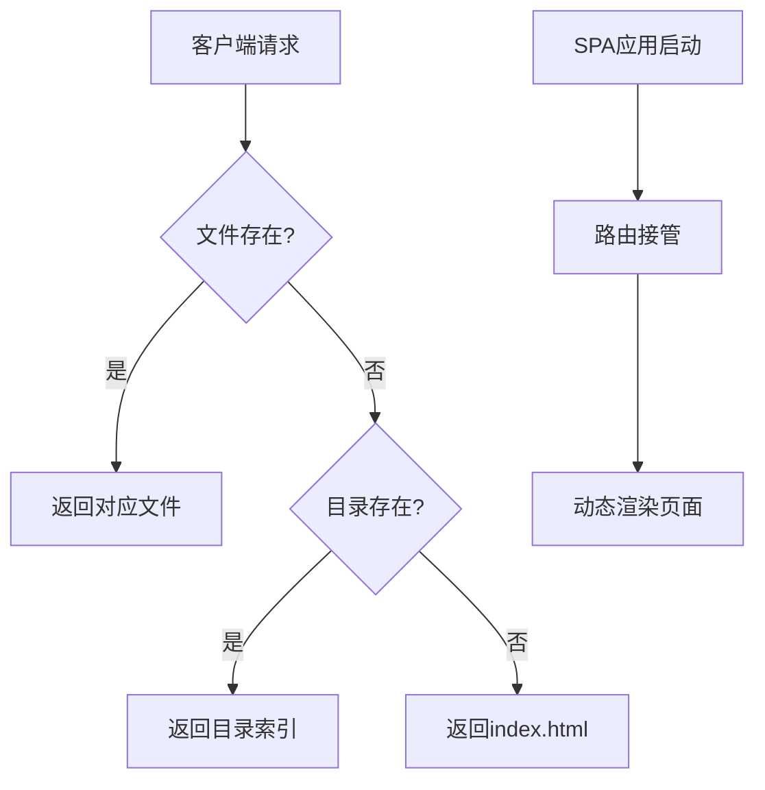
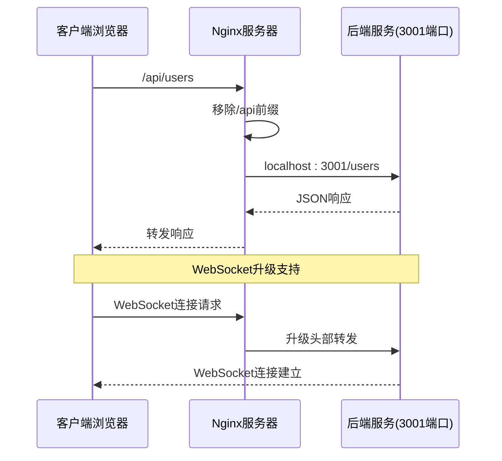
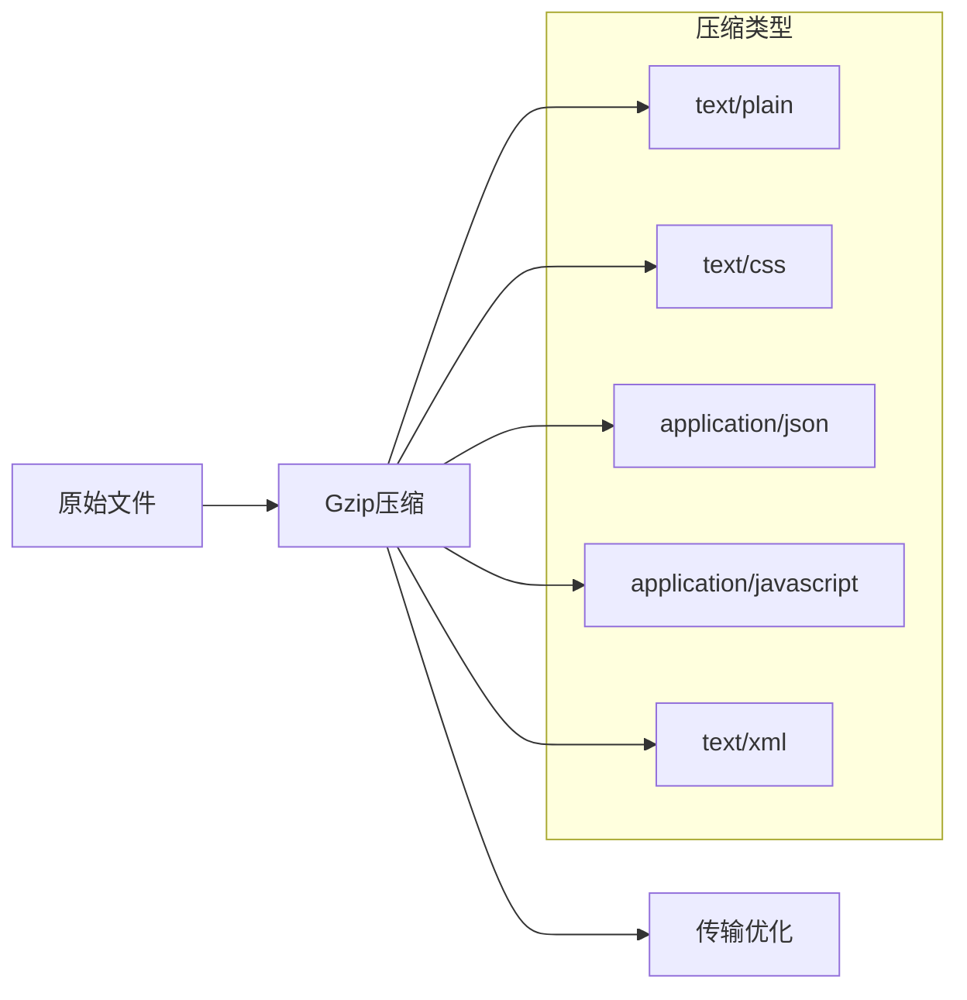
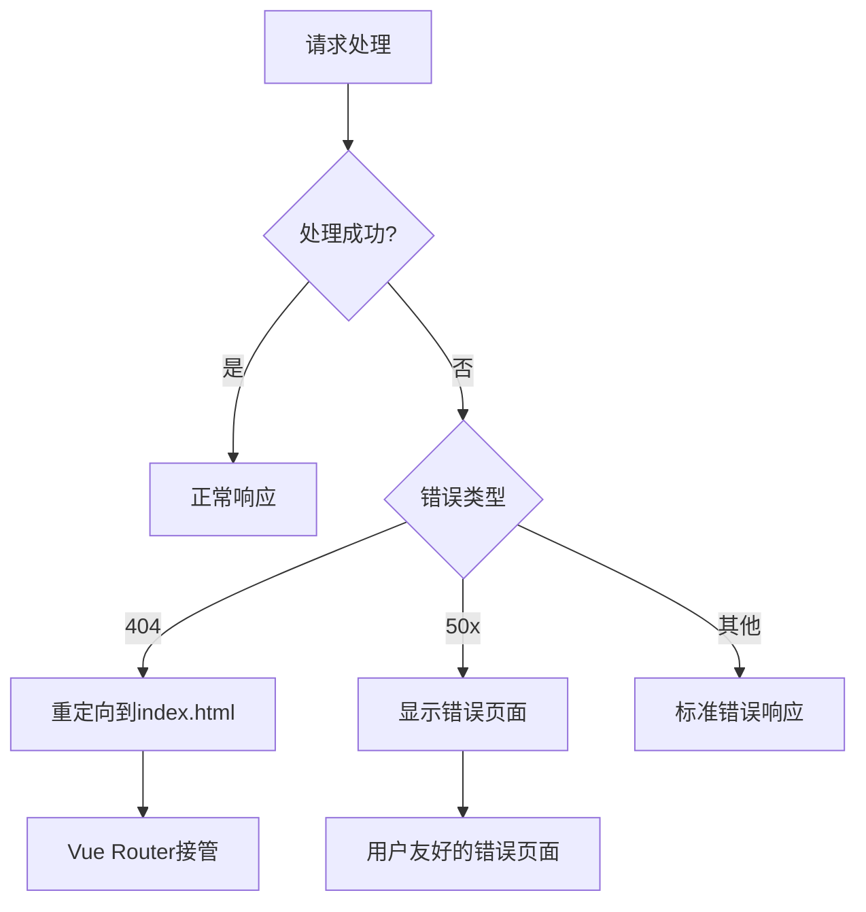

# Nginx服务器部署配置指南

<cite>
**本文档中引用的文件**
- [nginx.conf](file://nginx.conf)
- [package.json](file://package.json)
- [vite.config.js](file://vite.config.js)
- [src/router/index.js](file://src/router/index.js)
- [src/api/index.js](file://src/api/index.js)
- [app.js](file://app.js)
</cite>

## 目录
1. [项目概述](#项目概述)
2. [Nginx配置详解](#nginx配置详解)
3. [虚拟主机配置](#虚拟主机配置)
4. [静态文件服务](#静态文件服务)
5. [Vue Router历史模式配置](#vue-router历史模式配置)
6. [API反向代理配置](#api反向代理配置)
7. [性能优化配置](#性能优化配置)
8. [错误处理机制](#错误处理机制)
9. [部署验证步骤](#部署验证步骤)
10. [常见问题解决方案](#常见问题解决方案)
11. [总结](#总结)

## 项目概述

本项目是一个基于Vue 3的现代化单页应用(SPA)，使用Vite作为构建工具，包含完整的前端路由系统和RESTful API接口。应用部署在Nginx服务器上，通过nginx.conf配置文件实现静态文件服务、API代理和性能优化等功能。

**章节来源**
- [package.json](file://package.json#L1-L34)
- [vite.config.js](file://vite.config.js#L1-L41)

## Nginx配置详解

Nginx配置文件定义了服务器的基本行为和处理规则。以下是核心配置的详细说明：



**图表来源**
- [nginx.conf](file://nginx.conf#L1-L47)

**章节来源**
- [nginx.conf](file://nginx.conf#L1-L47)

## 虚拟主机配置

### Listen指令配置

```nginx
listen 80;
```

- **端口监听**：Nginx监听80端口，这是HTTP协议的标准端口
- **默认行为**：当不指定IP地址时，默认监听所有可用网络接口
- **SSL配置**：注释部分展示了HTTPS配置模板，建议在生产环境中启用

### Server Name配置

```nginx
server_name langdetech.cn www.langdetech.cn;
```

- **主域名**：`langdetech.cn`作为主要访问域名
- **子域名**：`www.langdetech.cn`提供标准化访问入口
- **多域名支持**：同时支持两个域名，提高用户体验
- **最佳实践**：建议在DNS中配置CNAME记录或A记录指向服务器IP

**章节来源**
- [nginx.conf](file://nginx.conf#L2-L3)

## 静态文件服务

### Root目录配置

```nginx
root /var/www/langdetech/dist;
```

- **静态文件根目录**：`/var/www/langdetech/dist`是Vue应用构建后的输出目录
- **文件结构**：该目录包含编译后的JavaScript、CSS、HTML文件和静态资源
- **权限要求**：Nginx进程必须对该目录具有读取权限
- **路径映射**：所有请求都会尝试匹配该目录下的文件

### Index文件配置

```nginx
index index.html;
```

- **默认首页**：当请求路径指向目录时，Nginx会查找`index.html`文件
- **SPA支持**：配合Vue Router的history模式，确保单页应用正常工作
- **文件优先级**：按顺序查找，找到第一个存在的文件作为响应

**章节来源**
- [nginx.conf](file://nginx.conf#L7-L8)

## Vue Router历史模式配置

### Try Files指令详解

```nginx
location / {
    try_files $uri $uri/ /index.html;
}
```

这个配置实现了Vue Router的history模式支持：



**图表来源**
- [nginx.conf](file://nginx.conf#L13-L14)

### 工作原理分析

1. **文件检查**：首先检查请求的URI对应的文件是否存在
2. **目录检查**：如果文件不存在，检查是否为目录
3. **SPA回退**：如果既不是文件也不是目录，返回`index.html`
4. **路由接管**：Vue Router接管路由，根据URL显示相应页面

这种配置确保：
- ✅ 所有路由都能正确加载应用
- ✅ 静态资源直接访问
- ✅ SEO友好（搜索引擎能抓取首页）
- ✅ 用户体验流畅

**章节来源**
- [nginx.conf](file://nginx.conf#L13-L14)

## API反向代理配置

### Proxy Pass配置

```nginx
location /api/ {
    proxy_pass http://localhost:3001/;
    proxy_http_version 1.1;
    proxy_set_header Upgrade $http_upgrade;
    proxy_set_header Connection 'upgrade';
    proxy_set_header Host $host;
    proxy_cache_bypass $http_upgrade;
}
```

### 代理配置详解



**图表来源**
- [nginx.conf](file://nginx.conf#L20-L27)

### 配置参数说明

1. **proxy_pass**：将/api/开头的请求转发到本地3001端口的服务
2. **proxy_http_version**：使用HTTP/1.1协议进行代理
3. **WebSocket支持**：通过Upgrade头部支持WebSocket协议
4. **Host头部**：保持原始请求的Host信息
5. **缓存绕过**：确保WebSocket连接不会被缓存

### 跨域问题处理

- **CORS配置**：后端服务需要正确配置CORS头
- **代理优势**：通过Nginx代理避免了浏览器同源策略限制
- **安全性**：代理层可以添加额外的安全检查

**章节来源**
- [nginx.conf](file://nginx.conf#L20-L27)

## 性能优化配置

### Gzip压缩配置

```nginx
gzip on;
gzip_types text/plain text/css application/json application/javascript text/xml application/xml application/xml+rss text/javascript;
gzip_min_length 1k;
gzip_vary on;
gzip_proxied any;
```

### 压缩配置详解



**图表来源**
- [nginx.conf](file://nginx.conf#L10-L12)

### 压缩效果分析

1. **文本文件压缩**：CSS、JS、JSON等文本文件压缩率高
2. **最小长度**：仅对大于1KB的文件进行压缩
3. **Vary头**：根据客户端支持情况发送不同版本
4. **代理兼容**：支持各种代理场景

### 静态资源缓存配置

```nginx
location /assets/ {
    expires 7d;
    add_header Cache-Control "public, no-transform";
}
```

- **缓存时间**：静态资源缓存7天
- **缓存策略**：public表示可被代理缓存，no-transform防止变形
- **性能提升**：减少重复下载，提高加载速度
- **版本控制**：建议配合文件名哈希实现强制更新

**章节来源**
- [nginx.conf](file://nginx.conf#L10-L18)

## 错误处理机制

### 404错误处理

```nginx
error_page 404 /index.html;
```

- **单页应用支持**：404错误重定向到index.html，让Vue Router处理
- **用户体验**：避免显示难看的404页面
- **SEO友好**：搜索引擎仍能正确索引页面

### 50x错误处理

```nginx
error_page 500 502 503 504 /50x.html;
location = /50x.html {
    root /usr/share/nginx/html;
}
```

- **错误范围**：处理500、502、503、504四种服务器错误
- **专用页面**：提供专门的错误页面，提升用户体验
- **默认位置**：错误页面位于标准的Nginx错误页面目录

### 错误处理流程



**图表来源**
- [nginx.conf](file://nginx.conf#L29-L33)

**章节来源**
- [nginx.conf](file://nginx.conf#L29-L33)

## 部署验证步骤

### 1. 文件权限检查

```bash
# 确保Nginx用户有读取权限
sudo chown -R www-data:www-data /var/www/langdetech/dist
sudo chmod -R 755 /var/www/langdetech/dist
```

### 2. Nginx配置测试

```bash
# 测试配置语法
sudo nginx -t

# 如果测试通过，重新加载配置
sudo systemctl reload nginx
```

### 3. 功能验证清单

- [ ] **静态文件访问**：访问`/assets/`目录下的资源
- [ ] **路由功能**：通过浏览器地址栏访问不同页面
- [ ] **API调用**：检查前端API请求是否正常工作
- [ ] **错误页面**：故意访问不存在的页面测试404处理
- [ ] **压缩效果**：检查响应头中的Content-Encoding

### 4. 性能测试

```bash
# 使用curl检查压缩效果
curl -I -H "Accept-Encoding: gzip" http://langdetech.cn/

# 检查缓存头
curl -I http://langdetech.cn/assets/main.css
```

## 常见问题解决方案

### 1. 权限不足问题

**问题症状**：
```
403 Forbidden: Permission denied
```

**解决方案**：
```bash
# 检查目录权限
ls -la /var/www/langdetech/dist

# 修改权限
sudo chown -R www-data:www-data /var/www/langdetech/dist
sudo chmod -R 755 /var/www/langdetech/dist
```

### 2. 路径错误问题

**问题症状**：
```
404 Not Found: The requested URL was not found on this server
```

**解决方案**：
```bash
# 检查root路径配置
grep "root" /etc/nginx/sites-available/langdetech

# 确认文件存在
ls -la /var/www/langdetech/dist/index.html
```

### 3. API代理失败

**问题症状**：
```
502 Bad Gateway: upstream sent invalid response
```

**解决方案**：
```bash
# 检查后端服务状态
curl http://localhost:3001/ping

# 检查防火墙设置
sudo ufw status
sudo ufw allow 3001
```

### 4. 缓存问题

**问题症状**：
```
页面更新但显示旧内容
```

**解决方案**：
```bash
# 清除浏览器缓存
# 或者修改静态资源引用，添加版本号
# 例如：/assets/main.css?v=1.0.1
```

### 5. SSL证书问题

**问题症状**：
```
SSL certificate problem: self signed certificate
```

**解决方案**：
```nginx
# 添加SSL配置
listen 443 ssl;
ssl_certificate /path/to/certificate.crt;
ssl_certificate_key /path/to/private.key;

# 强制HTTPS重定向
server {
    listen 80;
    server_name langdetech.cn www.langdetech.cn;
    return 301 https://$server_name$request_uri;
}
```

## 总结

本Nginx配置文件为Vue 3单页应用提供了完整的部署解决方案：

### 核心特性

1. **虚拟主机支持**：同时支持主域名和子域名
2. **静态文件服务**：高效处理Vue应用的静态资源
3. **SPA路由支持**：完美适配Vue Router的history模式
4. **API代理**：透明地代理后端API请求
5. **性能优化**：Gzip压缩和缓存策略提升性能
6. **错误处理**：优雅的错误页面和404处理

### 最佳实践建议

- **监控日志**：定期检查Nginx访问日志和错误日志
- **定期更新**：保持Nginx和系统软件的最新版本
- **备份配置**：定期备份重要的配置文件
- **安全加固**：配置适当的防火墙和安全头
- **性能监控**：使用工具监控网站性能和可用性

通过遵循本指南的配置和最佳实践，您可以成功部署一个高性能、高可用的Vue应用服务器。