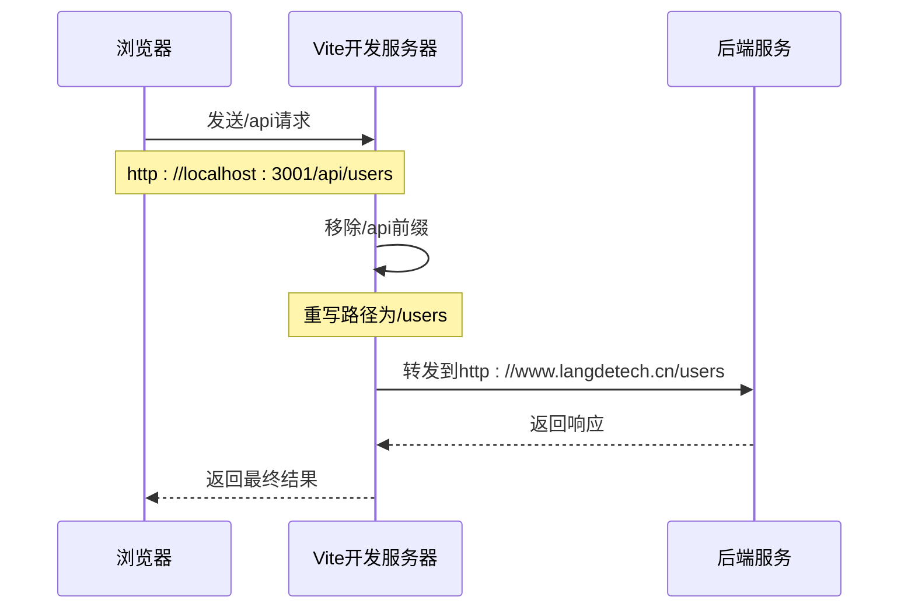
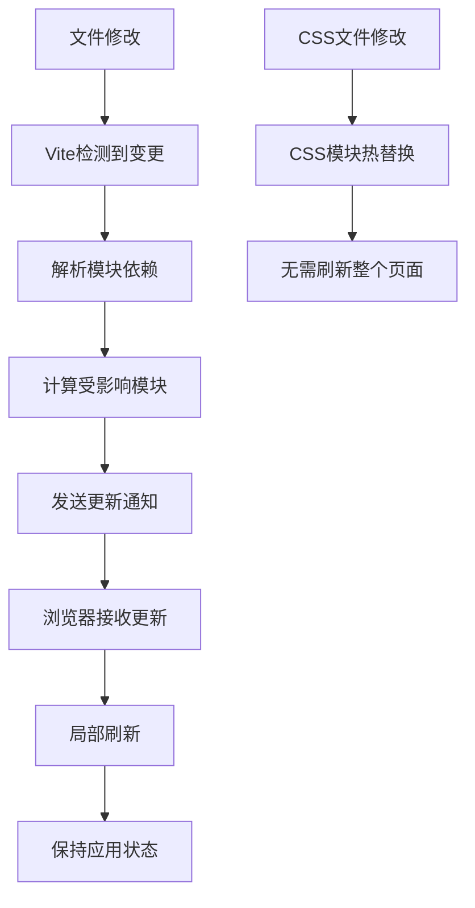

# 开发环境搭建指南

<cite>
**本文档中引用的文件**
- [package.json](file://package.json)
- [vite.config.js](file://vite.config.js)
- [app.js](file://app.js)
- [index.html](file://index.html)
- [README.md](file://README.md)
</cite>

## 目录
1. [项目概述](#项目概述)
2. [系统要求](#系统要求)
3. [环境准备](#环境准备)
4. [依赖安装](#依赖安装)
5. [开发服务器配置](#开发服务器配置)
6. [启动开发服务器](#启动开发服务器)
7. [代理配置详解](#代理配置详解)
8. [热重载机制](#热重载机制)
9. [常见问题解决](#常见问题解决)
10. [最佳实践](#最佳实践)

## 项目概述

杭州朗德智能科技有限公司官网是一个现代化的Vue 3前端项目，结合Express.js后端服务，提供了完整的前后端开发环境。该项目采用模块化架构，支持热重载开发模式，便于快速迭代和调试。

**章节来源**
- [README.md](file://README.md#L1-L137)

## 系统要求

### 必需软件
- **Node.js**: 版本16.0或更高
- **npm**: 版本7.0或更高
- **Git**: 用于版本控制（可选）

### 推荐工具
- **VS Code**: 建议使用Visual Studio Code作为开发编辑器
- **Chrome浏览器**: 用于调试和测试
- **Postman**: API测试工具（可选）

## 环境准备

### 1. 安装Node.js和npm

确保系统已安装Node.js和npm：

```bash
# 检查Node.js版本
node --version

# 检查npm版本
npm --version
```

如果未安装，请从[Node.js官网](https://nodejs.org/)下载并安装LTS版本。

### 2. 验证环境

创建一个简单的测试项目来验证环境：

```bash
mkdir test-env
cd test-env
npm init -y
node -e "console.log('Node.js环境正常')"
```

## 依赖安装

### 安装项目依赖

在项目根目录执行以下命令安装所有必要的依赖包：

```bash
npm install
```

### 依赖包说明

根据`package.json`文件，项目包含以下主要依赖：

#### 生产依赖
- **Vue 3**: 核心框架，使用Composition API
- **Vue Router 4**: 路由管理
- **Pinia**: 状态管理
- **Axios**: HTTP请求库
- **Express**: 后端Web框架
- **JSON Web Token**: 身份验证

#### 开发依赖
- **Vite**: 构建工具和开发服务器
- **@vitejs/plugin-vue**: Vue插件
- **Concurrently**: 同时运行多个命令
- **Nodemon**: 开发时自动重启服务器

**章节来源**
- [package.json](file://package.json#L1-L34)

## 开发服务器配置

### Vite配置详解

项目使用Vite作为开发服务器和构建工具，核心配置位于`vite.config.js`文件中。

```javascript
// vite.config.js 核心配置
export default defineConfig({
  server: {
    host: '0.0.0.0',           // 监听所有网络接口
    port: 3001,                // 使用3001端口
    strictPort: true,          // 端口被占用时直接报错
    proxy: {                   // API代理配置
      '/api': {
        target: 'http://www.langdetech.cn',
        changeOrigin: true,
        rewrite: (path) => path.replace(/^\/api/, '')
      }
    }
  }
})
```

### 配置参数说明

#### Host配置
- **值**: `'0.0.0.0'`
- **作用**: 监听所有网络接口，允许来自局域网的访问
- **应用场景**: 
  - 团队协作开发
  - 移动设备调试
  - Docker容器内运行

#### Port配置
- **值**: `3001`
- **原因**: 避免与常用服务（如HTTP 80端口、HTTPS 443端口）冲突
- **优势**:
  - 减少权限问题
  - 支持多项目并行开发
  - 方便端口转发和代理

#### StrictPort配置
- **作用**: 确保指定端口可用，否则直接报错
- **好处**: 防止端口冲突导致的意外行为

**章节来源**
- [vite.config.js](file://vite.config.js#L1-L41)

## 启动开发服务器

### 单独启动前端

使用以下命令启动前端开发服务器：

```bash
npm run dev
```

这将启动Vite开发服务器，监听`http://localhost:3001`。

### 同时启动前后端

使用以下命令同时启动前端和后端服务：

```bash
npm run dev:all
```

此命令会：
1. 启动前端开发服务器（端口3001）
2. 启动Express后端服务器（默认端口3000）
3. 使用`concurrently`同时运行两个进程

### 启动脚本对比

| 启动方式 | 前端端口 | 后端端口 | 适用场景 |
|---------|---------|---------|---------|
| `npm run dev` | 3001 | - | 仅开发前端 |
| `npm run server` | - | 3000 | 仅开发后端 |
| `npm run dev:all` | 3001 | 3000 | 前后端联调 |

**章节来源**
- [package.json](file://package.json#L6-L11)

## 代理配置详解

### API代理机制

Vite开发服务器配置了API代理，将前端请求转发到后端服务：

```javascript
proxy: {
  '/api': {
    target: 'http://www.langdetech.cn',
    changeOrigin: true,
    rewrite: (path) => path.replace(/^\/api/, '')
  }
}
```

### 代理工作流程



**图表来源**
- [vite.config.js](file://vite.config.js#L25-L32)

### 代理配置参数

#### Target
- **值**: `'http://www.langdetech.cn'`
- **作用**: 指定目标后端服务地址
- **注意**: 生产环境中需要替换为实际的后端地址

#### ChangeOrigin
- **作用**: 修改请求的Origin头为目标服务器
- **必要性**: 避免跨域问题和保持会话一致性

#### Rewrite
- **功能**: 移除请求路径中的`/api`前缀
- **示例**:
  - 前端请求: `/api/users`
  - 代理后请求: `/users`

### 本地开发代理

在本地开发环境中，建议配置本地代理：

```javascript
proxy: {
  '/api': {
    target: 'http://localhost:3000',
    changeOrigin: true,
    rewrite: (path) => path.replace(/^\/api/, '')
  }
}
```

**章节来源**
- [vite.config.js](file://vite.config.js#L25-L32)

## 热重载机制

### Vite热重载原理

Vite利用ESM原生模块系统实现快速热重载：



### 热重载特性

#### 1. 模块级别更新
- 只更新变更的模块
- 保持应用状态不变
- 显著提升开发体验

#### 2. CSS热更新
- 独立的CSS模块热替换
- 不影响JavaScript状态
- 实时预览样式修改

#### 3. Vue SFC支持
- 单文件组件的热重载
- 支持模板、脚本、样式分离更新
- 保持组件状态和事件绑定

### 性能优化

Vite的热重载经过多项优化：

```javascript
// vite.config.js 中的优化配置
build: {
  sourcemap: false,              // 生产环境禁用source map
  chunkSizeWarningLimit: 1500,   // 控制chunk大小警告
  rollupOptions: {
    output: {
      manualChunks(id) {         // 手动分割chunk
        if (id.includes('node_modules')) {
          return 'vendor';
        }
      }
    }
  }
}
```

**章节来源**
- [vite.config.js](file://vite.config.js#L12-L24)

## 常见问题解决

### 1. 端口占用问题

**问题**: 端口3001被占用

**解决方案**:
```bash
# 查看占用端口的进程
netstat -ano | findstr :3001

# 杀死占用进程（Windows）
taskkill /PID 进程ID /F

# 或者修改vite.config.js使用其他端口
port: 3002
```

### 2. 网络访问限制

**问题**: 无法从局域网访问开发服务器

**解决方案**:
```javascript
// 修改vite.config.js
server: {
  host: '0.0.0.0',  // 监听所有网络接口
  port: 3001
}
```

### 3. 代理配置错误

**问题**: API请求失败

**排查步骤**:
1. 检查代理配置是否正确
2. 确认后端服务是否正常运行
3. 查看浏览器开发者工具的网络请求

### 4. 模块解析错误

**问题**: 无法找到模块

**解决方案**:
```bash
# 清除npm缓存
npm cache clean --force

# 删除node_modules重新安装
rm -rf node_modules package-lock.json
npm install
```

### 5. 热重载不生效

**问题**: 修改文件后页面不更新

**解决方案**:
1. 检查文件是否在监控范围内
2. 确认没有语法错误
3. 尝试重启开发服务器

## 最佳实践

### 1. 开发环境配置

#### 推荐的开发环境设置
```javascript
// vite.config.js 生产环境配置
export default defineConfig(({ mode }) => {
  if (mode === 'development') {
    return {
      server: {
        host: '0.0.0.0',
        port: 3001,
        proxy: {
          '/api': {
            target: 'http://localhost:3000',
            changeOrigin: true,
            rewrite: (path) => path.replace(/^\/api/, '')
          }
        }
      }
    }
  }
  
  return {
    // 生产环境配置
  }
})
```

#### 环境变量管理
创建`.env.development`文件：
```
VITE_API_BASE=http://localhost:3000
VITE_PORT=3001
```

### 2. 代码组织规范

#### 目录结构最佳实践
```
src/
├── api/                    # API接口封装
├── assets/                 # 静态资源
├── components/             # 可复用组件
├── composables/            # Vue组合式函数
├── hooks/                  # React风格hooks
├── layouts/                # 布局组件
├── pages/                  # 页面组件
├── plugins/                # 插件
├── router/                 # 路由配置
├── store/                  # 状态管理
├── styles/                 # 样式文件
├── utils/                  # 工具函数
└── views/                  # 视图组件
```

#### 组件命名规范
- 使用PascalCase命名组件
- 添加文件扩展名`.vue`
- 示例：`UserProfile.vue`, `AdminDashboard.vue`

### 3. 性能优化建议

#### 1. 代码分割
```javascript
// 路由懒加载
const routes = [
  {
    path: '/admin',
    component: () => import('@/views/admin/AdminView.vue')
  }
]
```

#### 2. 图片优化
- 使用WebP格式
- 实现懒加载
- 设置合适的尺寸

#### 3. 缓存策略
```javascript
// service-worker缓存配置
workbox.routing.registerRoute(
  ({request}) => request.destination === 'image',
  new workbox.strategies.CacheFirst()
)
```

### 4. 调试技巧

#### 1. 浏览器调试
- 使用Vue DevTools
- 启用严格模式
- 监控网络请求

#### 2. 日志记录
```javascript
// 开发环境日志
if (process.env.NODE_ENV === 'development') {
  console.log('开发模式：启用详细日志')
}
```

#### 3. 错误边界
```javascript
// 全局错误处理
window.addEventListener('error', (event) => {
  console.error('全局错误:', event.error)
})
```

### 5. 团队协作

#### 1. 代码规范
- 使用ESLint统一代码风格
- 配置Prettier自动格式化
- 设置Git钩子进行代码检查

#### 2. 文档维护
- 更新README.md
- 编写组件使用文档
- 记录API接口规范

#### 3. 版本控制
```bash
# Git配置
git config --global core.autocrlf false
git config --global core.eol lf
```

通过遵循这些最佳实践，可以显著提升开发效率和代码质量，确保项目顺利推进。