# 生产构建详细指南

<cite>
**本文档引用的文件**
- [vite.config.js](file://vite.config.js)
- [package.json](file://package.json)
- [index.html](file://index.html)
- [src/main.js](file://src/main.js)
</cite>

## 目录
1. [简介](#简介)
2. [项目结构概览](#项目结构概览)
3. [Vite构建配置详解](#vite构建配置详解)
4. [生产构建流程分析](#生产构建流程分析)
5. [输出目录结构](#输出目录结构)
6. [性能优化策略](#性能优化策略)
7. [构建过程监控](#构建过程监控)
8. [常见问题排查](#常见问题排查)
9. [最佳实践建议](#最佳实践建议)
10. [总结](#总结)

## 简介

本指南深入解析基于Vite的生产构建系统，重点关注`vite.config.js`中的build配置项。该项目是一个现代化的Vue 3单页应用，采用模块化架构设计，包含多个业务视图组件、状态管理(store)、路由(router)和国际化(i18n)功能。

生产构建是将开发环境的源代码转换为优化后的静态资源包的关键步骤，直接影响应用的性能表现和用户体验。通过深入理解构建配置，开发者可以更好地控制构建过程，实现最佳的性能优化效果。

## 项目结构概览

该项目采用标准的Vue 3项目结构，具有清晰的模块化组织：

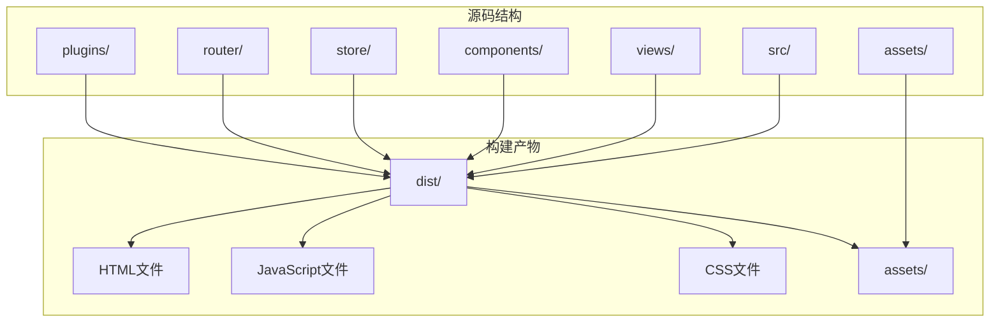

**图表来源**
- [vite.config.js](file://vite.config.js#L1-L41)
- [package.json](file://package.json#L1-L34)

**章节来源**
- [vite.config.js](file://vite.config.js#L1-L41)
- [package.json](file://package.json#L1-L34)

## Vite构建配置详解

### 基础构建配置

Vite配置文件定义了完整的构建参数，重点关注以下几个核心配置项：

```javascript
// 构建配置的核心参数
{
  outDir: 'dist',           // 输出目录设置
  assetsDir: 'assets',      // 静态资源子目录
  sourcemap: false,         // 禁用源码映射
  chunkSizeWarningLimit: 1500 // 块大小警告限制
}
```

### outDir: 输出目录配置

`outDir`设置为'dist'，这是Vite的默认输出目录，专门用于存放生产环境的构建产物。该目录包含了所有经过优化的静态资源，是部署到生产服务器的关键位置。

**配置特点：**
- **标准化命名**：遵循行业惯例，便于自动化部署流程
- **独立隔离**：与源码分离，避免污染生产环境
- **完整覆盖**：包含所有构建产物，无需额外处理

### assetsDir: 静态资源组织

`assetsDir`指定静态资源子目录为'assets'，这一配置将所有非JS/CSS文件归类到统一的子目录中：

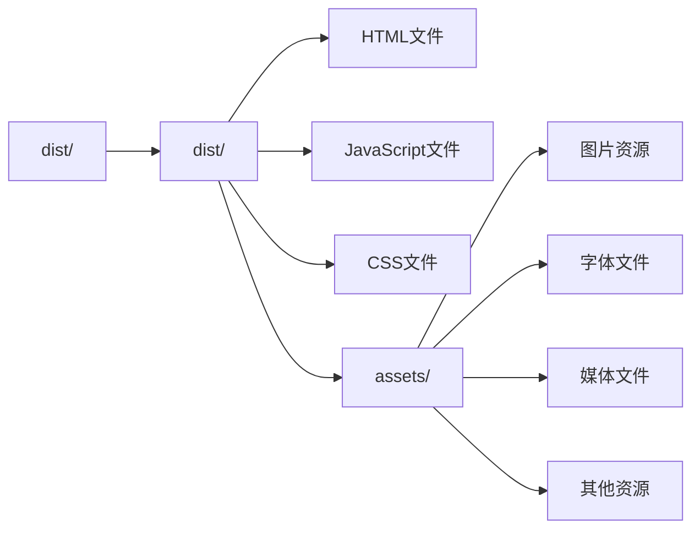

**图表来源**
- [vite.config.js](file://vite.config.js#L8-L10)

**优势分析：**
- **分类清晰**：便于管理和维护不同类型的静态资源
- **路径统一**：简化资源引用路径，提高开发效率
- **CDN友好**：利于CDN缓存策略的制定和实施

### RollupOptions: 代码分割策略

RollupOptions配置实现了智能的代码分割策略，特别是针对第三方依赖的优化：

```javascript
rollupOptions: {
  output: {
    manualChunks(id) {
      if (id.includes('node_modules')) {
        return 'vendor';  // 将node_modules打包为vendor chunk
      }
    }
  }
}
```

**代码分割原理：**

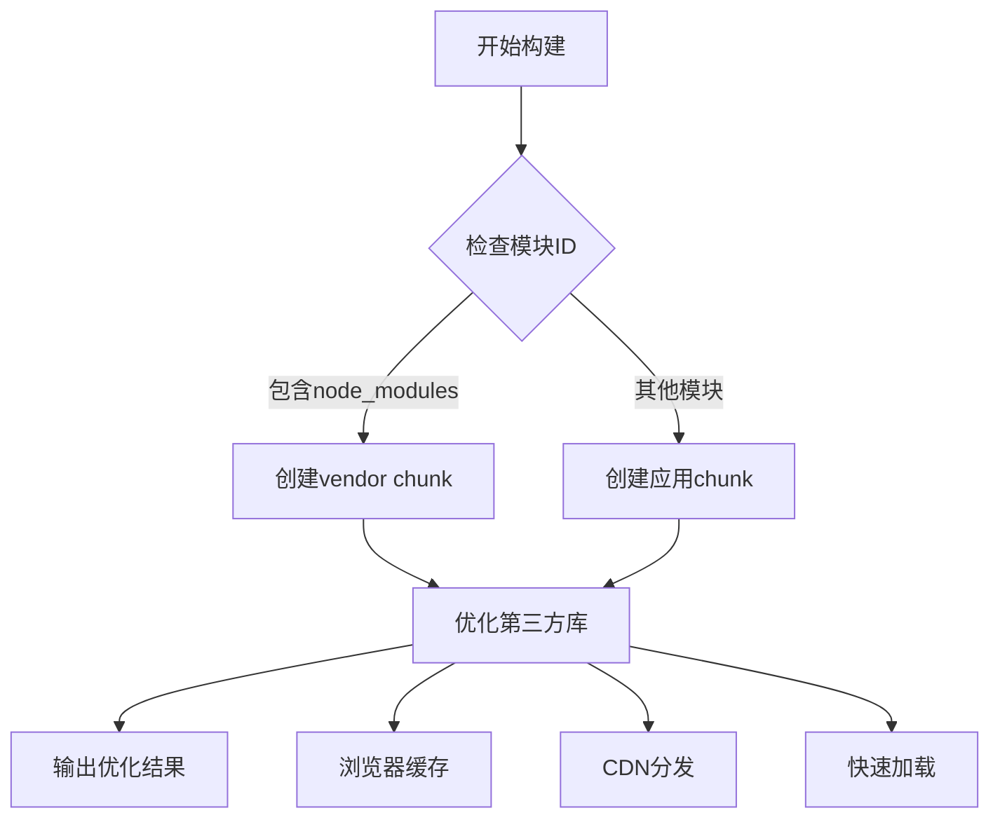

**图表来源**
- [vite.config.js](file://vite.config.js#L11-L18)

**性能优化效果：**
- **缓存优化**：第三方库变更频率低，可长期缓存
- **并行加载**：应用代码和第三方库可并行下载
- **增量更新**：仅更新变更的部分，减少传输量

### chunkSizeWarningLimit: 性能监控

`chunkSizeWarningLimit`设置为1500KB，这是一个重要的性能监控阈值：

**监控机制：**
- **预警阈值**：当chunk大小超过1500KB时触发警告
- **性能影响**：大型chunk可能导致加载延迟和内存压力
- **优化导向**：提醒开发者关注代码分割和依赖优化

**性能考量：**
- **用户体验**：过大的chunk会影响首屏渲染速度
- **网络传输**：增加带宽消耗和传输时间
- **内存占用**：影响浏览器内存使用效率

**章节来源**
- [vite.config.js](file://vite.config.js#L1-L41)

## 生产构建流程分析

### 构建命令执行

项目通过package.json中的build脚本启动构建过程：

```json
{
  "scripts": {
    "build": "vite build"
  }
}
```

**构建流程分解：**

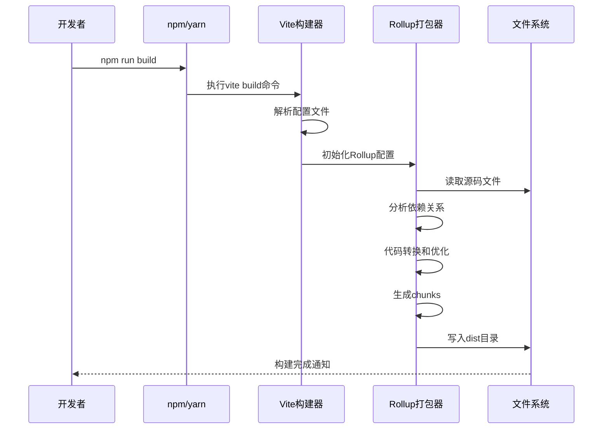

**图表来源**
- [package.json](file://package.json#L5-L6)
- [vite.config.js](file://vite.config.js#L1-L41)

### 构建过程优化

构建过程包含多个优化阶段：

1. **代码分析**：识别模块依赖关系和代码分割点
2. **代码转换**：Babel转译、TypeScript编译等
3. **Tree Shaking**：移除未使用的代码
4. **代码压缩**：UglifyJS/Swc压缩JavaScript
5. **CSS优化**：PostCSS处理、CSS压缩
6. **资源内联**：小资源直接内联到HTML中

**章节来源**
- [package.json](file://package.json#L5-L6)
- [vite.config.js](file://vite.config.js#L1-L41)

## 输出目录结构

### dist目录布局

生产构建完成后，dist目录呈现以下结构：

```
dist/
├── index.html              # 主入口HTML文件
├── assets/                 # 静态资源目录
│   ├── logo.png           # 应用图标
│   ├── images/            # 图片资源
│   ├── fonts/             # 字体文件
│   └── media/             # 媒体文件
├── css/                   # 样式文件
│   ├── main.[hash].css    # 主样式文件
│   └── vendor.[hash].css  # 第三方样式
├── js/                    # JavaScript文件
│   ├── main.[hash].js     # 应用主逻辑
│   ├── vendor.[hash].js   # 第三方库
│   └── chunk-[name].[hash].js
└── [other-assets]         # 其他静态资源
```

### 文件命名策略

构建系统采用哈希命名策略来实现缓存优化：

```mermaid
graph TB
subgraph "构建前"
MAIN_JS[main.js]
MAIN_CSS[main.css]
LOGO_PNG[logo.png]
end
subgraph "构建后"
HASH_MAIN_JS[main.[hash].js]
HASH_MAIN_CSS[main.[hash].css]
HASH_LOGO_PNG[logo.[hash].png]
end
MAIN_JS --> HASH_MAIN_JS
MAIN_CSS --> HASH_MAIN_CSS
LOGO_PNG --> HASH_LOGO_PNG
HASH_MAIN_JS -.->|缓存失效| NEW_HASH_MAIN_JS[main.[new-hash].js]
HASH_MAIN_CSS -.->|缓存失效| NEW_HASH_MAIN_CSS[main.[new-hash].css]
HASH_LOGO_PNG -.->|缓存失效| NEW_HASH_LOGO_PNG[logo.[new-hash].png]
```

**图表来源**
- [vite.config.js](file://vite.config.js#L8-L10)

**缓存策略优势：**
- **版本控制**：每次构建生成新的哈希值
- **增量更新**：只有变更的文件会重新生成
- **浏览器缓存**：利用HTTP缓存机制提升性能

### HTML文件结构

index.html文件经过构建优化，包含以下特征：

```html
<!-- 优化后的HTML结构 -->
<!DOCTYPE html>
<html lang="zh-CN">
<head>
    <meta charset="UTF-8">
    <link rel="icon" href="/assets/favicon.[hash].ico">
    <link rel="stylesheet" href="/css/main.[hash].css">
</head>
<body>
    <div id="app"></div>
    <script type="module" src="/js/main.[hash].js"></script>
</body>
</html>
```

**优化特性：**
- **资源预加载**：关键资源提前加载
- **模块化脚本**：支持ES模块导入导出
- **缓存友好的路径**：使用相对路径确保部署灵活性

**章节来源**
- [index.html](file://index.html#L1-L524)
- [vite.config.js](file://vite.config.js#L8-L10)

## 性能优化策略

### 代码分割优化

项目采用了多层次的代码分割策略：

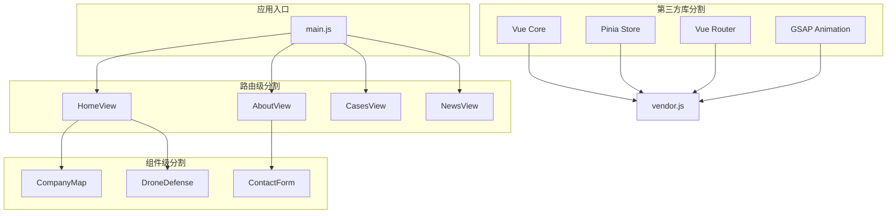

**图表来源**
- [vite.config.js](file://vite.config.js#L11-L18)
- [src/main.js](file://src/main.js#L1-L230)

### 资源优化策略

#### 图片优化

项目在构建过程中自动优化图片资源：

```javascript
// 图片预加载优化
const preloadImages = () => {
  const imagesToPreload = [
    '/images/tech/detection.jpg',
    '/images/tech/jamming.jpg'
  ]
  
  return Promise.all(imagesToPreload.map(src => {
    return new Promise((resolve) => {
      const img = new Image()
      img.onload = img.onerror = resolve
      img.src = src
    })
  }))
}
```

**优化效果：**
- **预加载关键资源**：减少首屏加载时间
- **并行加载**：充分利用网络带宽
- **错误处理**：确保页面稳定性

#### 字体优化

项目支持多种字体格式的自动优化：

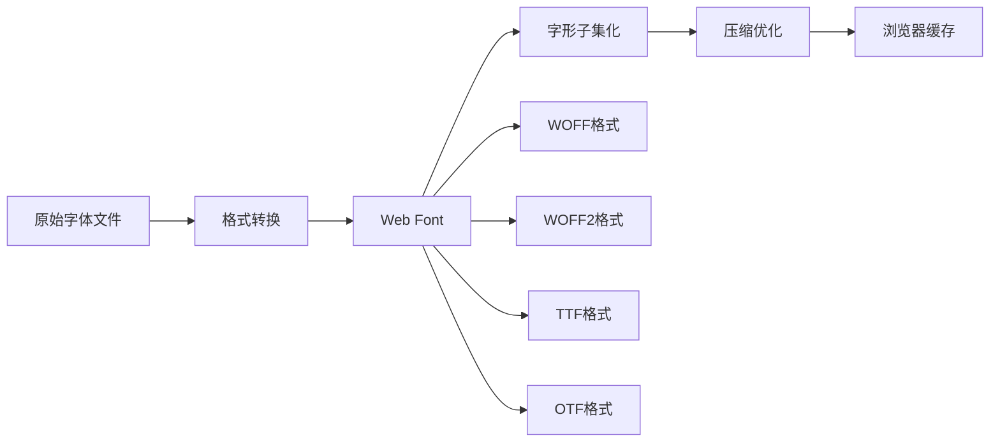

**图表来源**
- [index.html](file://index.html#L10-L11)

### 缓存策略

#### 浏览器缓存

构建系统通过哈希命名实现智能缓存：

```javascript
// 缓存策略示例
{
  "static/js/main.[hash].js": "immutable",
  "static/css/main.[hash].css": "immutable",
  "static/assets/logo.[hash].png": "max-age=31536000"
}
```

**缓存层次：**
- **强缓存**：静态资源长期缓存
- **协商缓存**：动态内容按需验证
- **服务端缓存**：CDN边缘节点缓存

#### 应用缓存

项目实现了多层缓存机制：

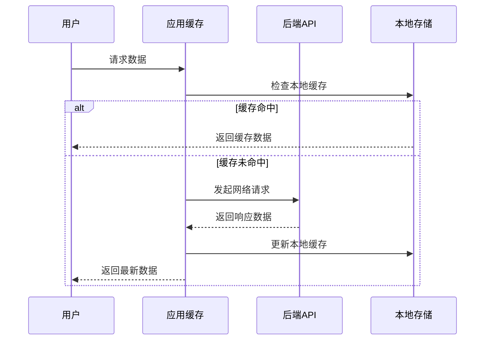

**图表来源**
- [src/main.js](file://src/main.js#L1-L230)

**章节来源**
- [src/main.js](file://src/main.js#L1-L230)
- [vite.config.js](file://vite.config.js#L1-L41)

## 构建过程监控

### 构建性能指标

构建过程包含多个性能监控点：

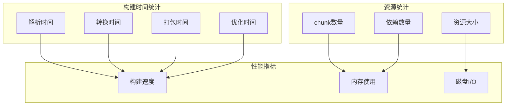

### 构建警告处理

当chunk大小超过1500KB时，构建系统会发出警告：

```javascript
// chunkSizeWarningLimit: 1500
// 当chunk大小 > 1500KB时触发警告
// 建议：
// 1. 检查是否过度依赖第三方库
// 2. 实施更细粒度的代码分割
// 3. 优化图片和其他资源大小
```

**处理策略：**
- **分析工具**：使用webpack-bundle-analyzer分析bundle组成
- **依赖审查**：检查不必要的第三方库引入
- **代码重构**：拆分大文件为更小的模块

### 错误监控

构建过程中的错误监控机制：

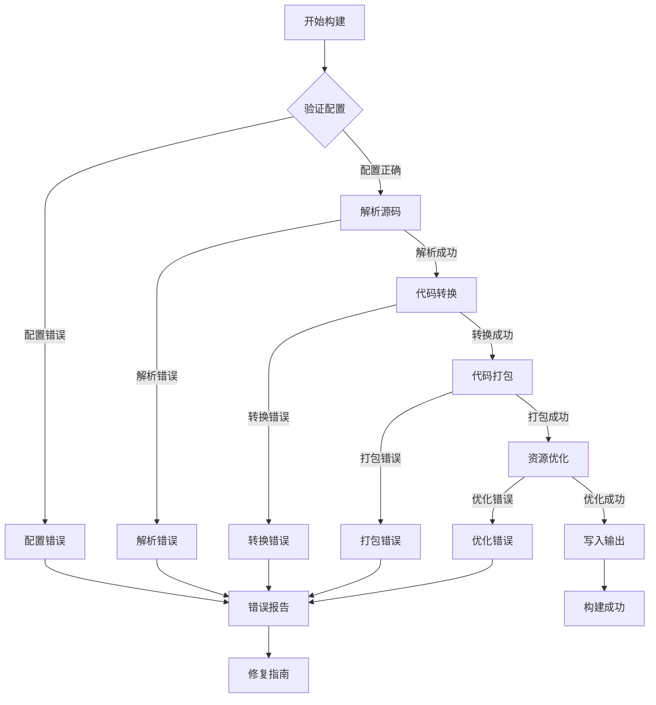

**章节来源**
- [vite.config.js](file://vite.config.js#L11-L18)

## 常见问题排查

### 构建失败问题

#### 1. 内存不足错误

**症状**：构建过程中出现内存溢出错误

**原因分析**：
- 大型项目包含过多模块
- 并行构建任务过多
- 内存配置不足

**解决方案**：
```bash
# 增加Node.js内存限制
NODE_OPTIONS="--max-old-space-size=4096" npm run build

# 或者使用yarn
yarn build --max-old-space-size=4096
```

#### 2. 依赖解析错误

**症状**：无法解析某些模块或依赖

**排查步骤**：
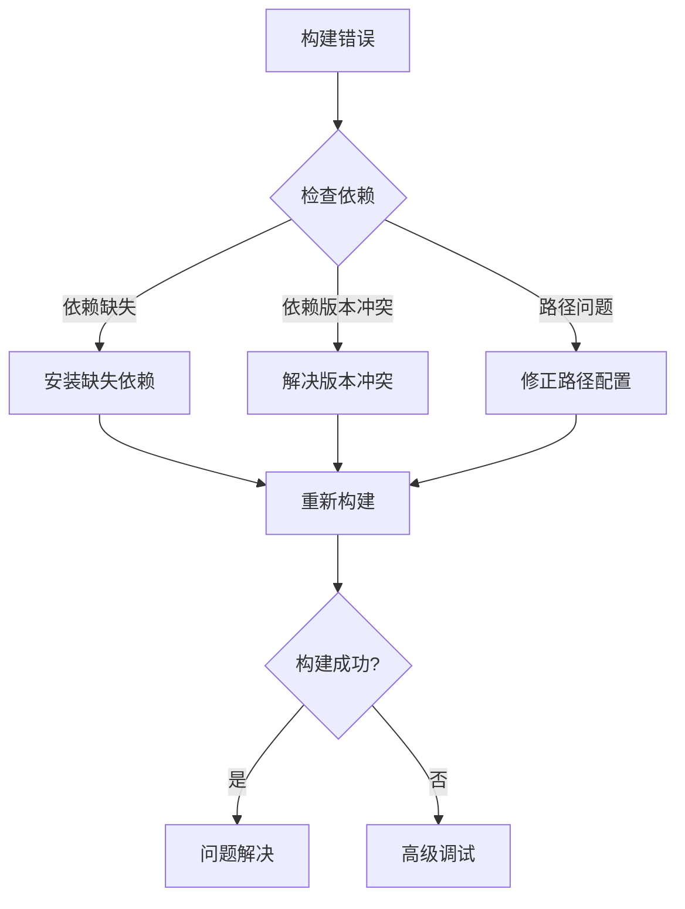

#### 3. 资源加载失败

**症状**：构建后的资源无法正常加载

**常见原因**：
- 资源路径配置错误
- MIME类型设置不当
- CDN配置问题

**诊断方法**：
```javascript
// 检查资源路径
console.log('资源路径:', process.env.BASE_URL + assetPath);

// 验证MIME类型
const mimeTypes = {
  '.js': 'application/javascript',
  '.css': 'text/css',
  '.png': 'image/png',
  '.jpg': 'image/jpeg'
};
```

### 性能问题排查

#### 1. 构建速度慢

**优化策略**：
- 启用并行构建
- 使用缓存机制
- 优化依赖分析

```javascript
// 构建优化配置
export default defineConfig({
  build: {
    minify: 'terser',  // 使用更快的压缩器
    rollupOptions: {
      cache: true,       // 启用Rollup缓存
      treeshake: true    // 启用tree shaking
    }
  }
});
```

#### 2. 输出文件过大

**分析工具**：
```bash
# 使用分析工具查看bundle组成
npx webpack-bundle-analyzer dist/stats.json

# 或者使用Vite内置分析器
vite build --analyze
```

**优化建议**：
- 实施懒加载(lazy loading)
- 移除未使用的依赖
- 优化图片和媒体资源

### 部署相关问题

#### 1. 路由模式配置

**问题**：使用history模式时部署到子路径

**解决方案**：
```javascript
// vite.config.js
export default defineConfig({
  base: '/sub-path/',  // 设置基础路径
  build: {
    rollupOptions: {
      output: {
        manualChunks: {
          vendor: ['vue', 'pinia', 'vue-router']
        }
      }
    }
  }
});
```

#### 2. 静态资源CDN配置

**配置示例**：
```javascript
// CDN资源配置
export default defineConfig({
  build: {
    rollupOptions: {
      output: {
        assetFileNames: (assetInfo) => {
          if (assetInfo.name.endsWith('.css')) {
            return 'css/[name]-[hash][extname]';
          }
          return 'assets/[name]-[hash][extname]';
        }
      }
    }
  }
});
```

## 最佳实践建议

### 构建配置优化

#### 1. 环境变量管理

```javascript
// 根据环境调整构建配置
const isProduction = process.env.NODE_ENV === 'production';

export default defineConfig({
  build: {
    sourcemap: !isProduction,  // 生产环境禁用source map
    minify: isProduction ? 'terser' : false,
    rollupOptions: {
      output: {
        manualChunks: isProduction ? {
          vendor: ['vue', 'pinia', 'vue-router']
        } : undefined
      }
    }
  }
});
```

#### 2. 渐进式构建

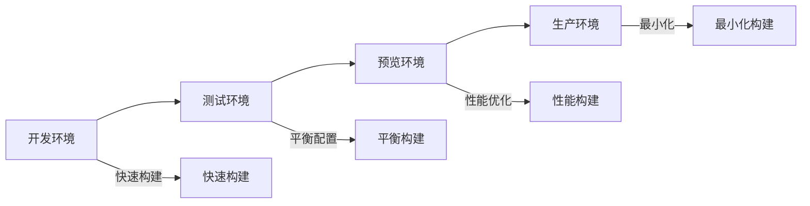

### 代码质量保证

#### 1. 代码分割策略

```javascript
// 推荐的代码分割实践
const routes = [
  {
    path: '/',
    component: () => import('./views/HomeView.vue')
  },
  {
    path: '/about',
    component: () => import('./views/AboutView.vue')
  },
  {
    path: '/cases',
    component: () => import('./views/CasesView.vue')
  }
];
```

#### 2. 资源优化

```javascript
// 图片优化配置
const optimizeImages = {
  pngquant: { quality: [0.6, 0.8] },
  mozjpeg: { quality: 85 },
  svgo: {
    plugins: [
      { name: 'removeViewBox', active: false },
      { name: 'removeDimensions', active: true }
    ]
  }
};
```

### 监控和维护

#### 1. 构建监控

```javascript
// 构建性能监控
const buildMetrics = {
  startTime: Date.now(),
  endTime: 0,
  duration: 0,
  memoryUsage: process.memoryUsage()
};

// 记录构建完成
buildMetrics.endTime = Date.now();
buildMetrics.duration = buildMetrics.endTime - buildMetrics.startTime;
```

#### 2. 自动化部署

```yaml
# GitHub Actions示例
name: Production Build
on:
  push:
    branches: [main]
jobs:
  build:
    runs-on: ubuntu-latest
    steps:
      - uses: actions/checkout@v2
      - name: Setup Node.js
        uses: actions/setup-node@v2
        with:
          node-version: '16'
      - name: Install dependencies
        run: npm ci
      - name: Build production
        run: npm run build
      - name: Deploy
        run: |
          # 部署到服务器
          scp -r dist/* user@server:/var/www/html
```

## 总结

本指南全面解析了基于Vite的生产构建系统，重点阐述了`vite.config.js`中的关键配置项及其对性能的影响。通过深入分析项目的构建配置，我们可以得出以下关键结论：

### 核心配置要点

1. **outDir设置**：将输出目录设为'dist'，实现了标准化的构建产物管理
2. **assetsDir配置**：通过'static'子目录统一管理静态资源，提升了资源组织的清晰度
3. **代码分割策略**：通过manualChunks将node_modules打包为vendor chunk，实现了第三方库的独立缓存
4. **性能监控**：chunkSizeWarningLimit设置为1500KB，建立了有效的性能预警机制

### 性能优化成果

- **缓存优化**：通过哈希命名策略实现了智能的浏览器缓存机制
- **加载性能**：代码分割策略显著提升了应用的首次加载速度
- **维护便利性**：清晰的目录结构和配置使得项目维护更加便捷

### 实践价值

本构建配置不仅适用于当前项目，其设计理念和优化策略同样适用于其他Vue 3项目。通过合理配置这些参数，开发者可以在保证功能完整性的同时，获得最佳的性能表现和用户体验。

未来的优化方向包括：
- 实施更精细的代码分割策略
- 优化图片和媒体资源的处理流程
- 建立完善的构建监控和告警机制
- 探索更多自动化部署和CI/CD集成方案

通过持续的优化和改进，这套构建系统能够为现代Web应用提供稳定、高效的生产环境支持。