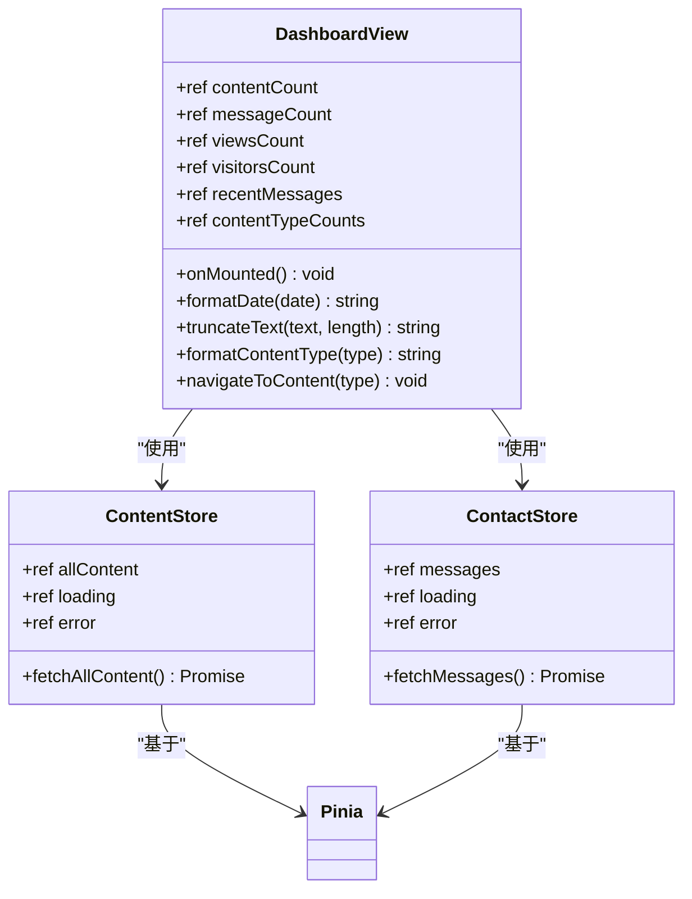
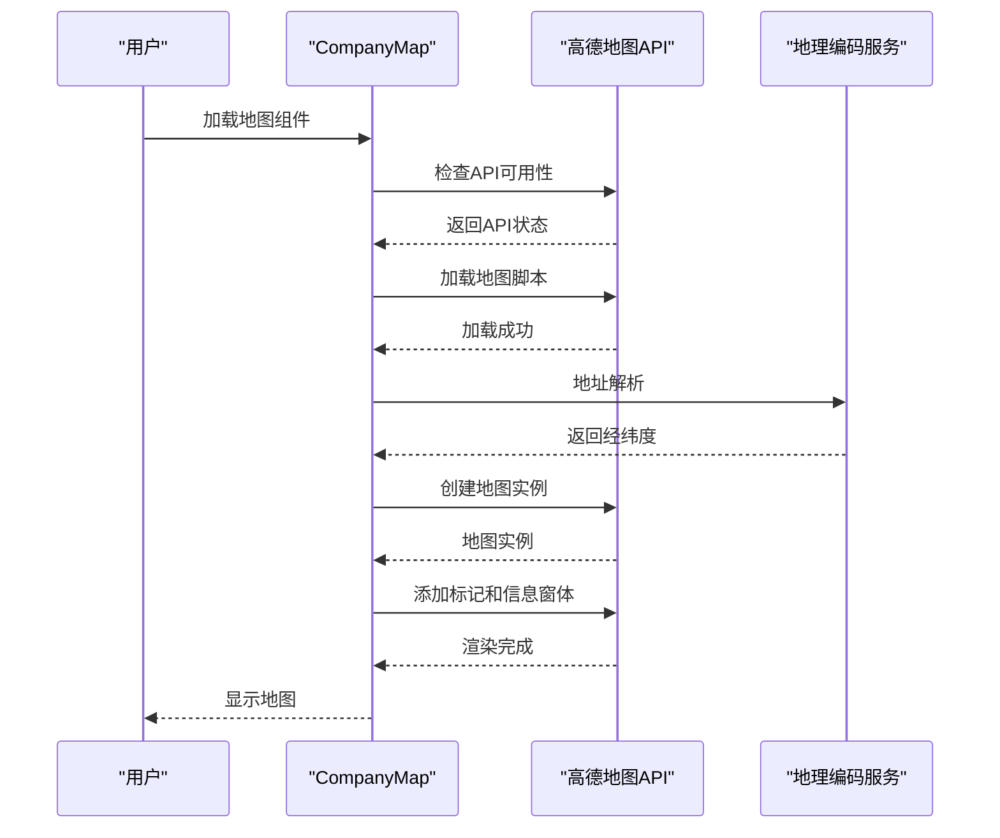
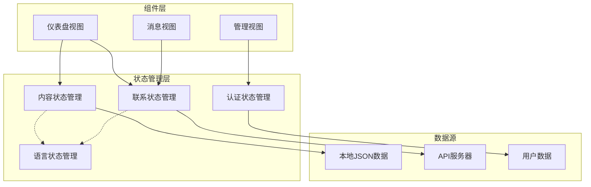
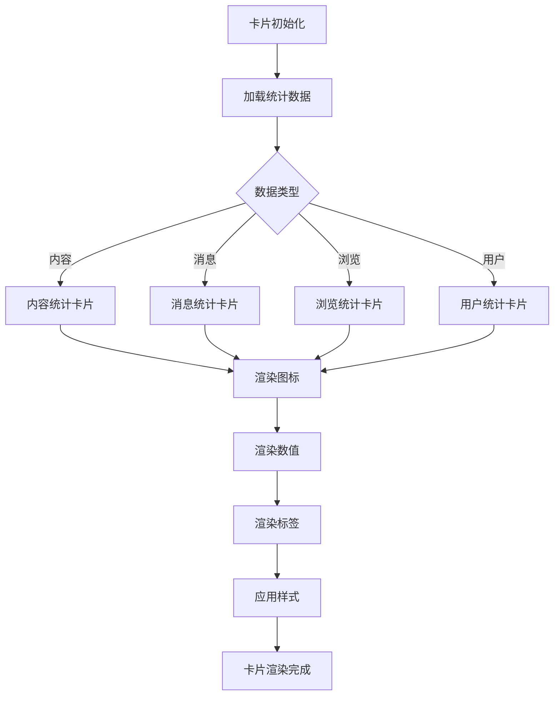
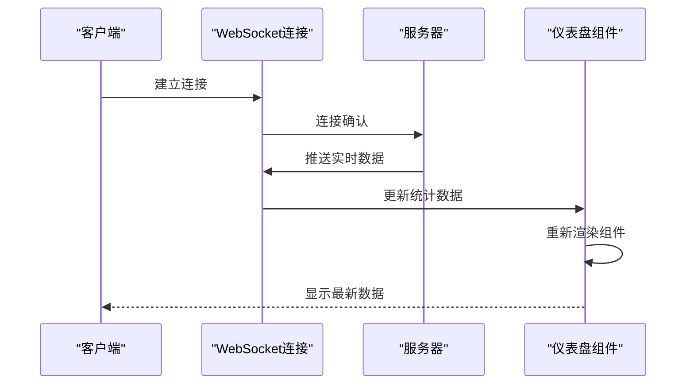

# 仪表盘概览

<cite>
**本文档引用的文件**
- [DashboardView.vue](file://src/views/admin/DashboardView.vue)
- [CompanyMap.vue](file://src/components/CompanyMap.vue)
- [content.js](file://src/store/modules/content.js)
- [contact.js](file://src/store/modules/contact.js)
- [content.json](file://data/content.json)
- [users.json](file://data/users.json)
- [index.js](file://src/store/index.js)
</cite>

## 目录
1. [项目概述](#项目概述)
2. [仪表盘设计目标](#仪表盘设计目标)
3. [核心组件分析](#核心组件分析)
4. [数据流架构](#数据流架构)
5. [可视化组件详解](#可视化组件详解)
6. [性能优化策略](#性能优化策略)
7. [响应式设计实现](#响应式设计实现)
8. [未来扩展方向](#未来扩展方向)
9. [总结](#总结)

## 项目概述

本项目是一个现代化的管理后台仪表盘系统，专门为杭州朗德智能科技有限公司设计。该系统集成了多个关键功能模块，包括数据统计展示、实时监控、内容管理和用户交互等功能。仪表盘作为整个系统的中枢，为管理员提供了统一的视图界面，帮助他们快速了解系统运行状态和业务数据。

## 仪表盘设计目标

### 用户体验优先
仪表盘的设计遵循简洁直观的原则，通过清晰的视觉层次和合理的布局，让用户能够在最短时间内获取最重要的信息。主要设计目标包括：

- **信息聚合**：将分散的数据源整合到一个统一的界面
- **实时监控**：提供关键指标的实时更新和状态监控
- **操作便捷**：通过快捷入口和导航设计，提升管理效率
- **视觉友好**：采用现代化的设计语言，确保良好的用户体验

### 技术架构目标
系统采用现代化的前端技术栈，确保良好的可维护性和扩展性：

- **模块化设计**：组件化架构便于功能扩展和维护
- **状态管理**：使用Pinia进行全局状态管理
- **响应式布局**：适配各种设备和屏幕尺寸
- **性能优化**：通过懒加载和缓存策略提升性能

## 核心组件分析

### DashboardView.vue - 主仪表盘组件

DashboardView是整个仪表盘的核心组件，负责整合多个关键指标卡片和功能模块。该组件采用了Vue 3的组合式API，实现了高度模块化和可复用的设计。



**图表来源**
- [DashboardView.vue](file://src/views/admin/DashboardView.vue#L75-L120)
- [content.js](file://src/store/modules/content.js#L1-L50)
- [contact.js](file://src/store/modules/contact.js#L1-L50)

#### 统计卡片系统

仪表盘包含四个核心统计卡片，每个卡片都展示了特定的关键指标：

1. **内容条目统计**：显示系统中所有内容的数量
2. **联系消息统计**：展示最新的联系消息数量
3. **页面浏览统计**：模拟的页面浏览次数
4. **访问用户统计**：模拟的独立访客数量

这些卡片采用统一的设计模式，包含图标、数值和描述文字，确保视觉一致性。

#### 最近消息模块

最近消息模块展示了最新的5条联系消息，每条消息包含：
- 发送者姓名和联系方式
- 消息摘要（截断显示）
- 发送时间和日期
- 查看全部链接

#### 内容概览模块

内容概览模块提供了对不同类型内容的快速访问：
- 显示每种内容类型的数量统计
- 提供快速跳转到相应管理页面的功能
- 支持按内容类型分类管理

**章节来源**
- [DashboardView.vue](file://src/views/admin/DashboardView.vue#L1-L100)

### CompanyMap.vue - 地理位置可视化组件

CompanyMap组件是一个专门的地理位置可视化组件，用于展示公司的分支机构分布情况。该组件集成了高德地图API，提供了丰富的地图交互功能。



**图表来源**
- [CompanyMap.vue](file://src/components/CompanyMap.vue#L40-L100)

#### 地图初始化流程

地图组件的初始化过程包括以下关键步骤：

1. **API检查**：确保高德地图API已正确加载
2. **地理编码**：将公司地址转换为经纬度坐标
3. **地图配置**：设置地图参数如缩放级别、视角模式等
4. **标记添加**：在地图上添加公司位置标记
5. **交互绑定**：为标记绑定点击事件和信息窗体

#### 响应式设计特性

CompanyMap组件具有良好的响应式设计，能够根据容器大小自动调整地图显示效果。组件支持：
- 动态尺寸调整
- 移动端触摸手势支持
- 信息窗体的自动定位

**章节来源**
- [CompanyMap.vue](file://src/components/CompanyMap.vue#L1-L100)

## 数据流架构

### 状态管理架构

系统采用Pinia作为状态管理工具，实现了清晰的数据流架构：



**图表来源**
- [index.js](file://src/store/index.js#L1-L6)
- [content.js](file://src/store/modules/content.js#L1-L30)
- [contact.js](file://src/store/modules/contact.js#L1-L30)

### 数据获取策略

系统采用混合的数据获取策略，结合本地模拟数据和远程API：

#### 本地数据模拟
- **内容数据**：使用本地JSON文件模拟内容管理系统数据
- **用户数据**：简单的本地用户认证数据
- **静态资源**：图片、图标等静态资源的本地引用

#### 远程API集成
- **联系表单提交**：通过API提交用户联系信息
- **消息管理**：从后端获取和管理联系消息
- **实时数据更新**：支持未来的实时数据推送

**章节来源**
- [content.js](file://src/store/modules/content.js#L50-L100)
- [contact.js](file://src/store/modules/contact.js#L50-L100)

## 可视化组件详解

### 统计卡片设计模式

仪表盘中的统计卡片采用了统一的设计模式，确保视觉一致性和用户体验：



**图表来源**
- [DashboardView.vue](file://src/views/admin/DashboardView.vue#L15-L50)

#### 卡片样式设计

每个统计卡片都包含以下元素：
- **图标区域**：使用Font Awesome图标增强视觉表达
- **数值区域**：突出显示关键数据值
- **标签区域**：提供数据含义的文字说明
- **交互效果**：鼠标悬停时的动画效果

### 地图组件技术实现

CompanyMap组件的技术实现展现了现代Web地图应用的最佳实践：

#### 高德地图集成
- **API加载管理**：异步加载高德地图JavaScript API
- **地理编码服务**：将地址字符串转换为精确的经纬度坐标
- **地图实例管理**：创建和销毁地图实例以优化性能
- **事件处理**：处理用户交互事件如点击、拖拽等

#### 错误处理机制
组件实现了完善的错误处理机制：
- **API加载失败处理**：提供备用方案和错误提示
- **地理编码失败处理**：使用默认位置作为备选方案
- **用户交互错误处理**：优雅地处理各种异常情况

**章节来源**
- [CompanyMap.vue](file://src/components/CompanyMap.vue#L100-L200)

## 性能优化策略

### 组件懒加载策略

为了提升初始加载性能，系统采用了多种懒加载策略：

#### 按需加载
- **地图组件**：仅在需要时才加载高德地图API
- **统计图表**：延迟加载复杂的图表组件
- **大型图片**：使用懒加载技术优化图片资源

#### 缓存机制
- **状态缓存**：缓存常用的状态数据减少重复请求
- **组件缓存**：利用Vue的keep-alive功能缓存组件状态
- **静态资源缓存**：合理设置HTTP缓存头

### WebSocket实时数据推送

虽然当前版本使用模拟数据，但系统架构已经为WebSocket实时数据推送做好准备：



**图表来源**
- [DashboardView.vue](file://src/views/admin/DashboardView.vue#L75-L120)

### 图表组件优化

对于可能扩展的图表组件，建议采用以下优化策略：
- **虚拟滚动**：对于大量数据的图表使用虚拟滚动
- **数据分页**：大数据集采用分页加载
- **增量更新**：只更新变化的部分而非重新渲染整个图表

## 响应式设计实现

### 移动端适配策略

系统采用移动优先的设计策略，确保在各种设备上都能提供良好的用户体验：

#### 断点设计
- **移动端**：单列布局，简化信息层级
- **平板端**：双列布局，适当增加信息密度
- **桌面端**：四列布局，充分利用屏幕空间

#### 触摸交互优化
- **点击区域**：确保触摸目标足够大
- **手势支持**：支持滑动、缩放等手势操作
- **反馈机制**：提供即时的视觉和触觉反馈

### CSS Grid布局系统

仪表盘使用CSS Grid布局系统实现灵活的响应式设计：

```css
.stats-grid {
  display: grid;
  grid-template-columns: repeat(4, 1fr);
  gap: 20px;
  margin-bottom: 40px;
}

@media (max-width: 992px) {
  .stats-grid {
    grid-template-columns: repeat(2, 1fr);
  }
}

@media (max-width: 576px) {
  .stats-grid {
    grid-template-columns: 1fr;
  }
}
```

**章节来源**
- [DashboardView.vue](file://src/views/admin/DashboardView.vue#L340-L363)

## 未来扩展方向

### 实时数据集成

随着系统的发展，可以考虑以下实时数据集成方案：

#### 数据源扩展
- **业务指标**：集成ERP、CRM等业务系统的实时数据
- **监控指标**：集成服务器监控、网络监控等运维数据
- **用户行为**：集成用户行为分析和转化率数据

#### 实时更新机制
- **WebSocket推送**：实现真正的实时数据更新
- **轮询机制**：作为WebSocket的备选方案
- **事件驱动**：基于事件的增量数据更新

### 多维度数据分析

未来的仪表盘可以扩展为更强大的数据分析平台：

#### 仪表板定制
- **个性化配置**：允许用户自定义仪表板布局
- **主题切换**：支持深色/浅色主题切换
- **权限控制**：基于角色的数据显示权限管理

#### 高级可视化
- **交互式图表**：支持钻取、筛选等交互功能
- **预测分析**：集成机器学习模型提供趋势预测
- **告警系统**：基于阈值的智能告警机制

### 国际化扩展

系统已经具备良好的国际化基础，未来可以进一步扩展：

#### 多语言支持
- **动态语言切换**：支持运行时的语言切换
- **本地化内容**：根据不同地区提供本地化的内容
- **文化适配**：考虑不同地区的文化和习惯差异

## 总结

本仪表盘系统展现了现代Web应用开发的最佳实践，通过模块化设计、响应式布局和性能优化，为管理员提供了高效、直观的管理界面。系统的主要优势包括：

### 技术优势
- **现代化架构**：采用Vue 3和Pinia，确保技术栈的先进性
- **组件化设计**：高度模块化的组件架构便于维护和扩展
- **性能优化**：多层次的性能优化策略确保良好的用户体验

### 功能特色
- **数据聚合**：将分散的数据源整合到统一界面
- **实时监控**：提供关键指标的实时更新和状态监控
- **操作便捷**：通过快捷入口和导航设计，提升管理效率

### 扩展潜力
- **技术可扩展**：为WebSocket实时数据推送预留架构空间
- **功能可扩展**：支持未来添加更多统计指标和可视化组件
- **国际化可扩展**：具备良好的国际化基础，支持多语言和多地区适配

该系统不仅满足了当前的管理需求，更为未来的功能扩展和技术升级奠定了坚实的基础。通过持续的优化和改进，这个仪表盘将成为企业数字化转型的重要工具。