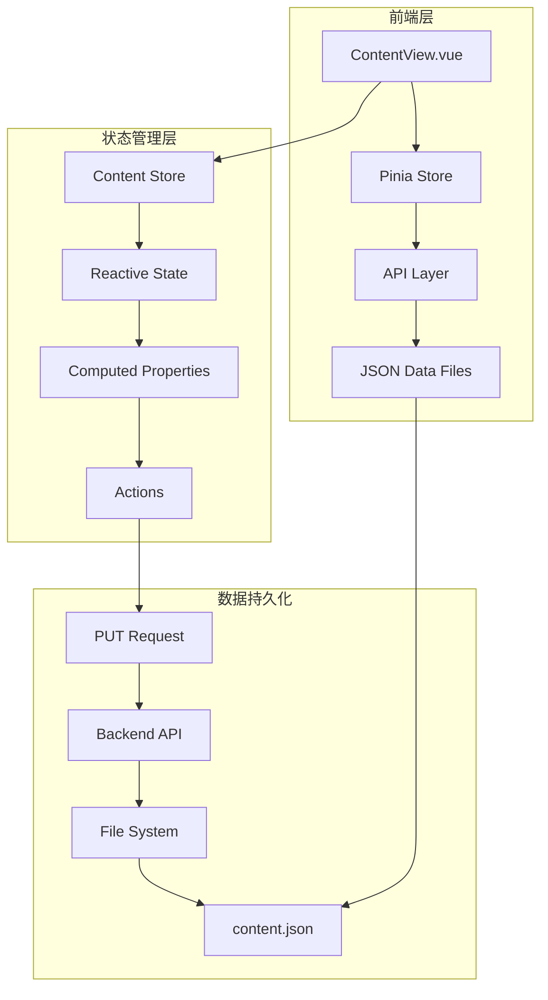
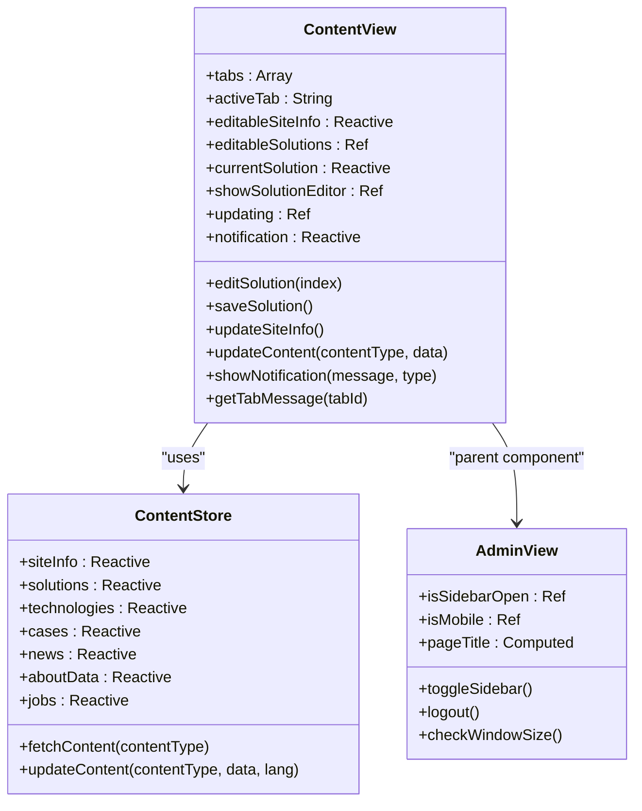
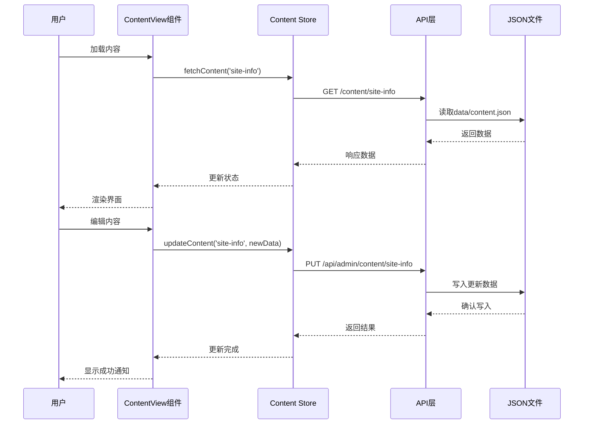
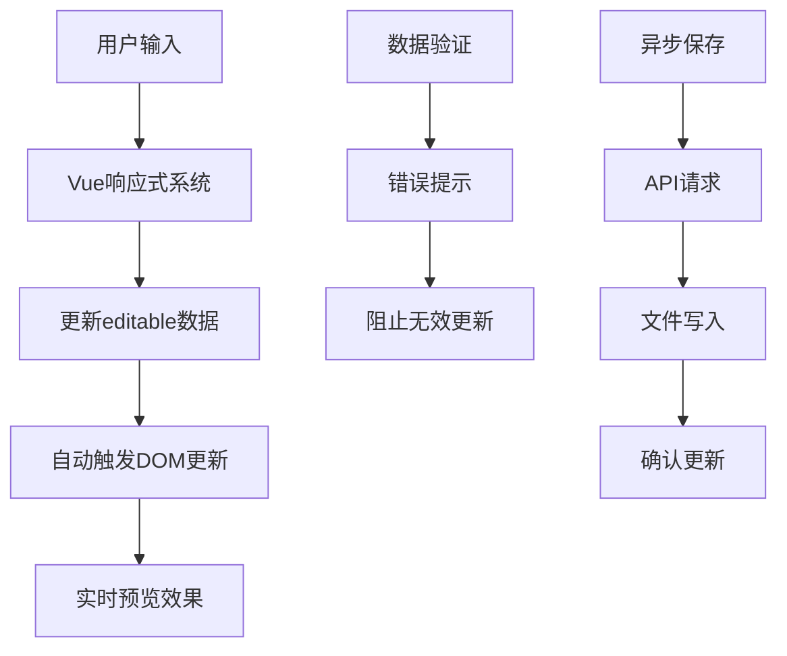
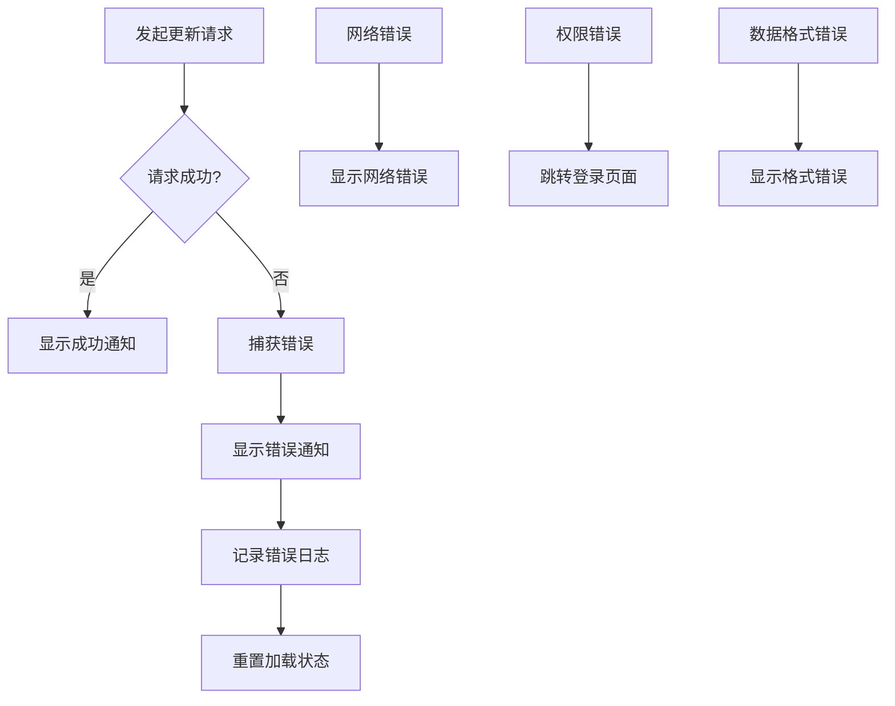

# 内容管理系统

<cite>
**本文档引用的文件**
- [data/content.json](file://data/content.json)
- [src/views/admin/ContentView.vue](file://src/views/admin/ContentView.vue)
- [src/store/modules/content.js](file://src/store/modules/content.js)
- [src/api/index.js](file://src/api/index.js)
- [src/router/index.js](file://src/router/index.js)
- [src/views/admin/AdminView.vue](file://src/views/admin/AdminView.vue)
- [src/App.vue](file://src/App.vue)
</cite>

## 目录
1. [项目概述](#项目概述)
2. [系统架构](#系统架构)
3. [核心组件分析](#核心组件分析)
4. [数据流分析](#数据流分析)
5. [实时预览功能](#实时预览功能)
6. [内容持久化机制](#内容持久化机制)
7. [JSON结构维护](#json结构维护)
8. [开发指南](#开发指南)
9. [故障排除](#故障排除)
10. [总结](#总结)

## 项目概述

本内容管理系统是一个基于Vue 3和Pinia的状态管理框架构建的现代化内容管理平台。系统采用前后端分离架构，通过JSON文件作为数据源，实现了内容的可视化编辑、实时预览和持久化存储功能。

系统主要服务于朗德智能科技有限公司，提供反无人机系统、无人机系统、核心技术、应用案例、新闻资讯等多维度内容的管理功能。通过直观的图形界面，内容编辑人员可以轻松地更新网站内容，而无需编写代码。

## 系统架构



**图表来源**
- [src/views/admin/ContentView.vue](file://src/views/admin/ContentView.vue#L1-L328)
- [src/store/modules/content.js](file://src/store/modules/content.js#L1-L648)

## 核心组件分析

### ContentView组件

ContentView组件是整个内容管理系统的核心入口，提供了完整的多标签页内容管理界面。



**图表来源**
- [src/views/admin/ContentView.vue](file://src/views/admin/ContentView.vue#L100-L200)
- [src/store/modules/content.js](file://src/store/modules/content.js#L100-L200)

**章节来源**
- [src/views/admin/ContentView.vue](file://src/views/admin/ContentView.vue#L1-L328)
- [src/store/modules/content.js](file://src/store/modules/content.js#L1-L648)

### 数据结构设计

系统采用分层的JSON结构来组织不同类型的内容：

```javascript
// 网站基本信息结构
{
  "site-info": {
    "companyName": "杭州朗德智能科技有限公司",
    "slogan": "智能反无人机，守护空域安全",
    "description": "领先的反无人机系统及反无人机解决方案提供商",
    "contactInfo": {
      "address": "浙江省杭州市滨江区科技园区创新大厦A座15楼",
      "phone": "0571-8888 9999",
      "email": "info@landedrone.com"
    }
  }
}

// 解决方案结构
"solutions": [
  {
    "id": "reconnaissance",
    "title": "侦察无人机",
    "description": "高续航、高稳定性的侦察无人机...",
    "image": "/images/solution-1.jpg",
    "details": "我们的侦察无人机采用先进的传感器技术..."
  }
]
```

## 数据流分析



**图表来源**
- [src/views/admin/ContentView.vue](file://src/views/admin/ContentView.vue#L165-L213)
- [src/store/modules/content.js](file://src/store/modules/content.js#L572-L596)

**章节来源**
- [src/views/admin/ContentView.vue](file://src/views/admin/ContentView.vue#L165-L213)
- [src/store/modules/content.js](file://src/store/modules/content.js#L572-L596)

## 实时预览功能

系统通过Vue的响应式系统实现了真正的实时预览功能：

### 响应式数据绑定

```javascript
// 使用reactive创建可编辑的副本
const editableSiteInfo = reactive({ ...siteInfo.value })
const editableSolutions = ref([...solutions.value])

// 监听数据变化，自动更新预览
watch(editableSiteInfo, (newValue) => {
  // 自动同步到原始数据
  Object.assign(siteInfo.value, newValue)
})
```

### 实时更新机制



**图表来源**
- [src/views/admin/ContentView.vue](file://src/views/admin/ContentView.vue#L100-L150)

## 内容持久化机制

### PUT请求实现

系统通过HTTP PUT请求将修改后的内容提交到后端API：

```javascript
// 更新内容的方法
const updateContent = async (contentType, data) => {
  updating.value = true
  try {
    const result = await contentStore.updateContent(contentType, data)
    if (result.success) {
      showNotification('更新成功！', 'success')
    } else {
      showNotification(`更新失败: ${result.error}`, 'error')
    }
  } catch (error) {
    showNotification(`更新失败: ${error.message}`, 'error')
  } finally {
    updating.value = false
  }
}
```

### 错误处理机制



**图表来源**
- [src/views/admin/ContentView.vue](file://src/views/admin/ContentView.vue#L165-L213)

**章节来源**
- [src/views/admin/ContentView.vue](file://src/views/admin/ContentView.vue#L165-L213)
- [src/api/index.js](file://src/api/index.js#L53-L94)

## JSON结构维护

### 数据验证策略

系统采用了多层次的数据验证策略来确保JSON结构的完整性：

```javascript
// 数据加载时的验证
const fetchContent = async (contentType) => {
  try {
    const response = await axios.get(`/content/${contentType}`)
    
    // 验证数据结构
    if (contentType === 'site-info') {
      Object.assign(siteInfo.zh, response.data?.zh || {})
      Object.assign(siteInfo.en, response.data?.en || {})
    } else if (contentType === 'solutions') {
      if (response.data?.zh) solutions.zh = response.data.zh
      if (response.data?.en) solutions.en = response.data.en
    }
    
    return response.data
  } catch (err) {
    console.error(`获取${contentType}数据失败:`, err)
    error.value = err.message || '数据加载失败'
    return null
  }
}
```

### 结构维护注意事项

1. **字段完整性检查**
   - 确保每个内容类型都有必需的字段
   - 验证数据类型的正确性
   - 检查链接和图片路径的有效性

2. **国际化支持**
   - 保持中英文版本的字段一致性
   - 确保翻译的准确性
   - 处理缺失翻译的情况

3. **数据格式标准化**
   ```javascript
   // 标准化的解决方案结构
   const solutionSchema = {
     id: 'string',
     title: 'string',
     description: 'string',
     image: 'string',
     details: 'string'
   }
   ```

**章节来源**
- [src/store/modules/content.js](file://src/store/modules/content.js#L572-L596)

## 开发指南

### 新增配置项字段

要为系统添加新的配置项字段，需要按照以下步骤操作：

1. **更新JSON结构**
   ```javascript
   // 在data/content.json中添加新字段
   {
     "site-info": {
       "companyName": "杭州朗德智能科技有限公司",
       "slogan": "智能反无人机，守护空域安全",
       "description": "领先的反无人机系统及反无人机解决方案提供商",
       "contactInfo": {
         "address": "浙江省杭州市滨江区科技园区创新大厦A座15楼",
         "phone": "0571-8888 9999",
         "email": "info@landedrone.com",
         "website": "www.landedrone.com" // 新增字段
       }
     }
   }
   ```

2. **更新组件模板**
   ```vue
   <div class="form-group">
     <label for="website">官方网站</label>
     <input type="text" id="website" v-model="editableSiteInfo.contactInfo.website" class="form-control">
   </div>
   ```

3. **更新数据验证**
   ```javascript
   // 在updateContent方法中处理新字段
   const updateSiteInfo = async () => {
     await updateContent('site-info', editableSiteInfo)
   }
   ```

### 扩展富文本编辑器

如果需要支持富文本编辑，可以集成富文本编辑器组件：

```javascript
// 安装富文本编辑器
npm install quill

// 在组件中使用
import { QuillEditor } from '@vueup/vue-quill'
import '@vueup/vue-quill/dist/vue-quill.snow.css'

export default {
  components: {
    QuillEditor
  },
  data() {
    return {
      editableDetails: ''
    }
  }
}
```

### 添加校验规则

```javascript
// 表单验证规则
const validationRules = {
  companyName: [
    value => !!value || '公司名称不能为空',
    value => value.length >= 2 || '公司名称至少需要2个字符'
  ],
  email: [
    value => !!value || '邮箱不能为空',
    value => /.+@.+\..+/.test(value) || '邮箱格式不正确'
  ]
}

// 在更新方法中使用
const validateAndUpdate = () => {
  const errors = []
  validationRules.companyName.forEach(rule => {
    const result = rule(editableSiteInfo.companyName)
    if (result !== true) errors.push(result)
  })
  
  if (errors.length > 0) {
    showNotification(errors[0], 'error')
    return
  }
  
  updateSiteInfo()
}
```

## 故障排除

### 常见问题及解决方案

1. **JSON格式错误**
   ```
   错误信息: SyntaxError: Unexpected token in JSON at position X
   解决方案: 检查JSON文件的语法，确保括号、引号等符号正确闭合
   ```

2. **数据加载失败**
   ```
   错误信息: Failed to load resource: the server responded with a status of 404
   解决方案: 检查API路径是否正确，确认JSON文件是否存在
   ```

3. **更新失败**
   ```
   错误信息: Permission denied
   解决方案: 检查服务器权限设置，确保应用程序有写入权限
   ```

### 调试工具

```javascript
// 开发环境下的调试工具
if (process.env.NODE_ENV === 'development') {
  // 启用详细日志
  console.log('Content Store state:', contentStore)
  
  // 监听状态变化
  watch(() => contentStore.siteInfo, (newVal) => {
    console.log('Site info updated:', newVal)
  })
}
```

**章节来源**
- [src/store/modules/content.js](file://src/store/modules/content.js#L572-L596)

## 总结

本内容管理系统通过精心设计的架构和组件，实现了高效的内容管理功能。系统的主要优势包括：

1. **直观的操作界面** - 通过标签页和表单设计，使内容编辑变得简单直观
2. **实时预览功能** - 基于Vue响应式系统，提供即时的内容预览体验
3. **数据持久化** - 通过PUT请求确保内容的可靠存储
4. **国际化支持** - 完整的中英文内容支持
5. **错误处理** - 完善的错误处理和用户反馈机制

系统为内容编辑人员提供了强大的工具，同时也为开发者提供了清晰的扩展路径。通过遵循本文档提供的开发指南，可以轻松地添加新的内容类型、扩展功能或改进现有特性。