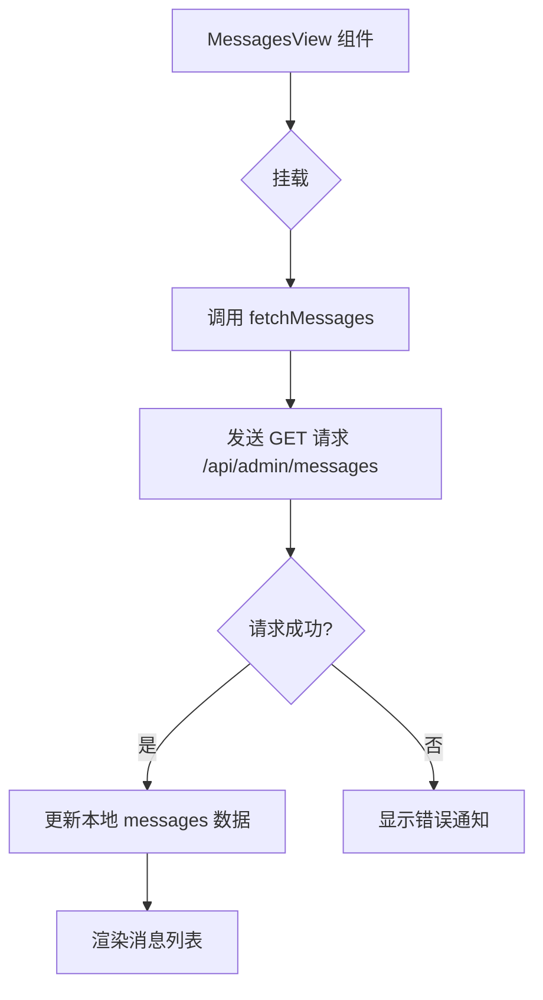
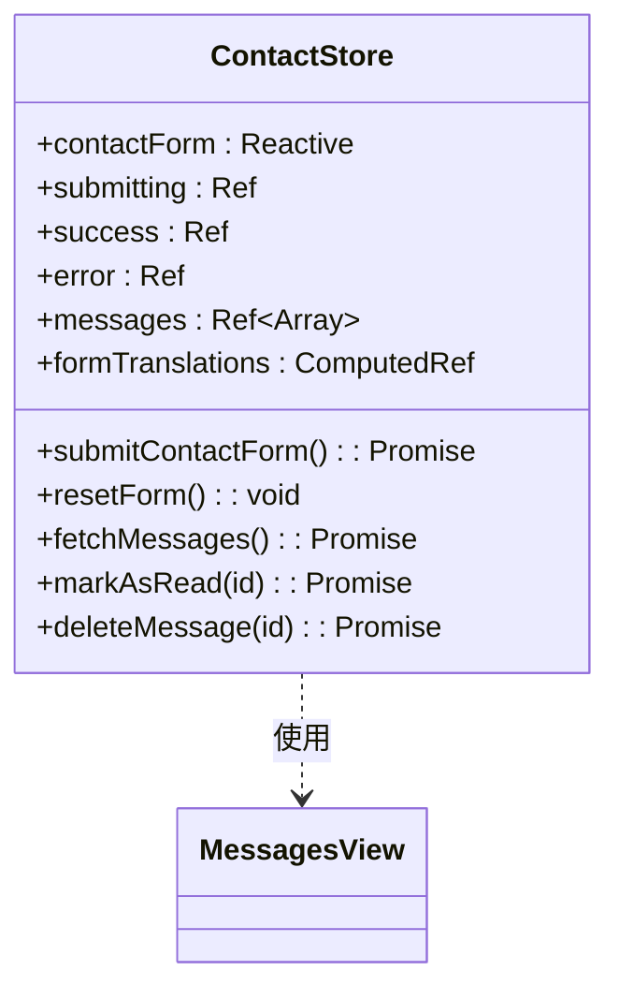
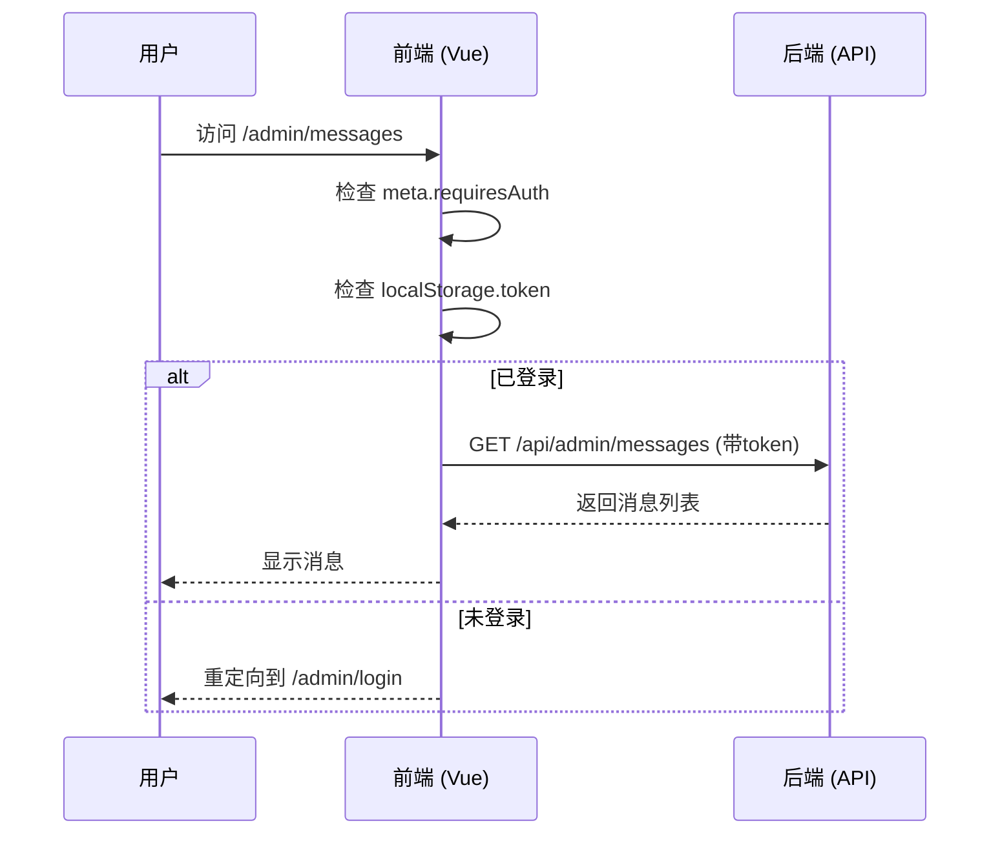

# 消息管理

<cite>
**本文档引用的文件**
- [MessagesView.vue](file://src/views/admin/MessagesView.vue)
- [contact.js](file://src/store/modules/contact.js)
- [index.js](file://src/api/index.js)
- [users.json](file://data/users.json)
</cite>

## 目录
1. [消息管理](#消息管理)
2. [核心功能实现](#核心功能实现)
3. [状态管理逻辑](#状态管理逻辑)
4. [权限控制机制](#权限控制机制)
5. [运维操作指南](#运维操作指南)
6. [开发者扩展说明](#开发者扩展说明)
7. [数据隐私保护](#数据隐私保护)

## 核心功能实现

消息管理模块的核心是 `MessagesView` 组件，它负责从后端获取用户通过联系表单提交的消息列表，并以表格形式展示。该组件位于 `src/views/admin/MessagesView.vue`，是管理员后台的一部分。

当管理员访问 `/admin/messages` 路径时，`MessagesView` 组件被加载。其界面包含一个“刷新”按钮和一个消息列表区域。消息列表会显示每条消息的姓名、联系方式（邮箱和电话）以及咨询内容等信息。未读消息会以特殊样式高亮显示，帮助管理员快速识别新消息。

组件通过调用 `useContactStore` 中的状态管理逻辑来获取数据。在组件挂载时，会自动执行 `fetchMessages` 方法，向服务器发起请求获取最新的消息列表。获取到数据后，组件会根据 `messages` 数组动态渲染出多条消息项。

**Section sources**
- [MessagesView.vue](file://src/views/admin/MessagesView.vue#L0-L294)

## 状态管理逻辑

消息的状态管理由 Pinia Store 模块 `contact.js` 实现，该文件位于 `src/store/modules/contact.js`。它定义了处理联系表单和消息管理所需的所有状态和方法。

### 消息获取 (`fetchMessages`)
此方法用于从后端获取所有消息列表。它通过 Axios 发起一个 GET 请求到 `/api/admin/messages` 接口。请求成功后，响应数据会被赋值给 `messages` 这个响应式变量，从而触发视图更新。

### 标记已读 (`markAsRead`)
此方法允许管理员将某条消息标记为已读。它接收一个消息 ID 作为参数，首先向 `/api/admin/messages/{id}/read` 接口发送 PUT 请求。请求成功后，它会立即在前端更新本地数据，将对应消息的 `read` 属性设置为 `true`，无需重新拉取整个列表，提升了用户体验。

### 删除消息 (`deleteMessage`)
此方法用于删除指定的消息。它同样接收一个消息 ID，向 `/api/admin/messages/{id}` 接口发送 DELETE 请求。请求成功后，它会直接从本地的 `messages` 数组中过滤掉该 ID 对应的消息，实现即时的视觉反馈。

**Section sources**
- [contact.js](file://src/store/modules/contact.js#L0-L134)

## 权限控制机制

系统通过 `users.json` 文件模拟了基于角色的权限控制。该文件位于 `data/users.json`，其中定义了一个用户名为 "admin"、密码为 "admin123" 的管理员账户，其角色（role）为 "admin"。

只有拥有管理员权限的用户才能访问 `/admin` 下的所有路由，包括消息管理页面。这通过 Vue Router 的路由守卫实现。在 `src/router/index.js` 中，所有需要管理员权限的子路由都设置了 `meta: { requiresAuth: true }`。全局前置守卫 `router.beforeEach` 会检查用户的登录状态（通过 localStorage 中的 token 判断），如果未登录，则重定向到登录页。

此外，API 请求拦截器也会在每个请求头中添加认证令牌（Authorization Bearer Token），确保后端能验证请求的合法性。结合 `users.json` 中的用户凭证，实现了完整的权限验证流程，确保只有授权管理员才能查看敏感的用户消息信息。

**Section sources**
- [users.json](file://data/users.json#L0-L8)
- [index.js](file://src/router/index.js#L100-L121)

## 运维操作指南

对于日常消息处理，运维人员可以遵循以下步骤：

1.  **登录系统**: 使用管理员账号（如：admin/admin123）登录后台管理系统。
2.  **访问消息中心**: 在左侧导航栏点击“消息管理”进入 `MessagesView` 页面。
3.  **查看与刷新**: 页面会自动加载消息列表。若需手动刷新，可点击顶部的“刷新”按钮。
4.  **处理新消息**:
    *   **标记为已读**: 对于已处理的消息，点击其右侧的“标记为已读”图标（对勾），系统会更新状态并给出成功提示。
    *   **删除消息**: 若消息无效或已归档，点击“删除消息”图标（垃圾桶）。系统会弹出确认对话框，确认后消息将被永久删除。
5.  **监控状态**: 页面右上角的通知区域会实时显示操作结果（成功或失败），帮助您确认操作是否生效。

**Section sources**
- [MessagesView.vue](file://src/views/admin/MessagesView.vue#L72-L181)
- [contact.js](file://src/store/modules/contact.js#L44-L134)

## 开发者扩展说明

开发者可以通过以下方式对消息管理模块进行扩展：

### 导出消息数据
要实现消息导出功能，可以在 `MessagesView` 或 `contact.js` 中新增一个 `exportMessages` 方法。该方法首先调用 `fetchMessages` 获取所有数据，然后使用 JavaScript 库（如 `xlsx` 或 `papaparse`）将数据转换为 Excel 或 CSV 格式，并触发浏览器下载。

### 集成邮件通知服务
为了在收到新消息时发送邮件通知，可以在后端 API 处理 `/api/contact` 提交请求的逻辑中集成邮件服务（如 Nodemailer）。当表单成功提交后，后端服务应调用邮件客户端，向预设的管理员邮箱发送一封包含摘要信息的提醒邮件。

### 对接 CRM 系统
对接 CRM 系统需要在后端创建一个新的服务层。当新的联系表单被提交时，除了存储到数据库，还应通过 HTTP 客户端（如 Axios）将数据推送到 CRM 系统的 Webhook 或 RESTful API 端点。建议使用队列（如 RabbitMQ）进行异步处理，避免阻塞主流程。

**Section sources**
- [index.js](file://src/api/index.js#L53-L94)
- [contact.js](file://src/store/modules/contact.js#L0-L47)

## 数据隐私保护

本系统实施了多项措施来保护用户的数据隐私：

*   **敏感信息脱敏显示**: 在 `MessagesView` 的模板中，虽然展示了邮箱和电话，但在实际生产环境中，可以进一步限制这些字段的显示长度，例如只显示前几位和后几位，中间用星号代替，防止信息被过度暴露。
*   **访问日志记录**: 尽管当前代码未直接体现，但最佳实践是在后端 API 层记录关键操作的日志。例如，在 `fetchMessages`、`markAsRead` 和 `deleteMessage` 等接口被调用时，后端应记录下操作者的 IP 地址、时间戳和操作类型，以便进行安全审计。
*   **权限最小化原则**: 通过严格的路由守卫和 API 认证，确保只有经过身份验证的管理员才能访问消息数据，普通访客无法查看任何敏感信息。

**Section sources**
- [MessagesView.vue](file://src/views/admin/MessagesView.vue#L30-L38)
- [index.js](file://src/api/index.js#L53-L94)