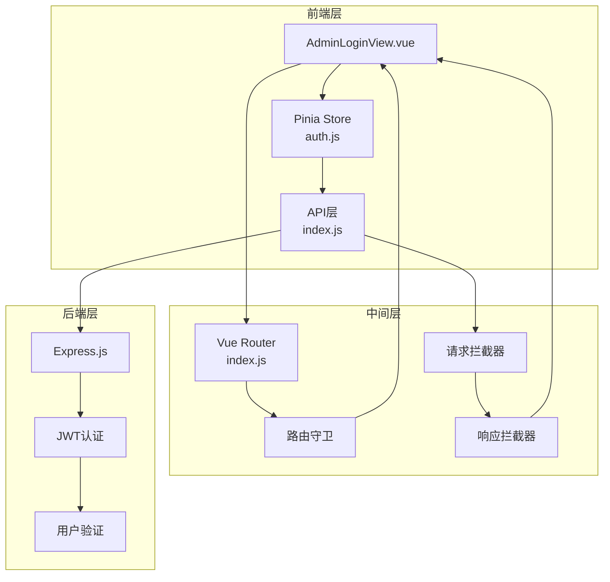
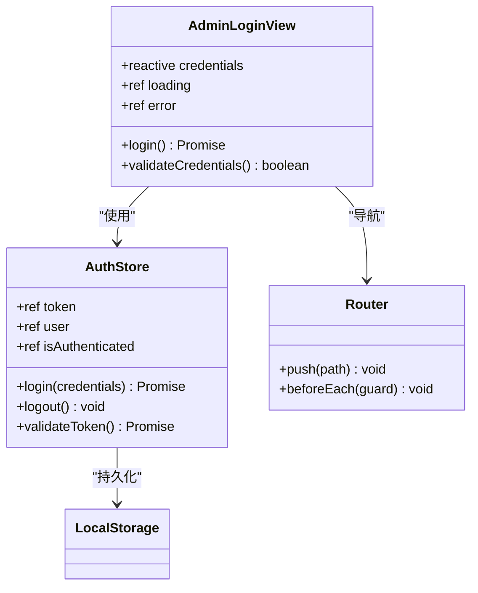
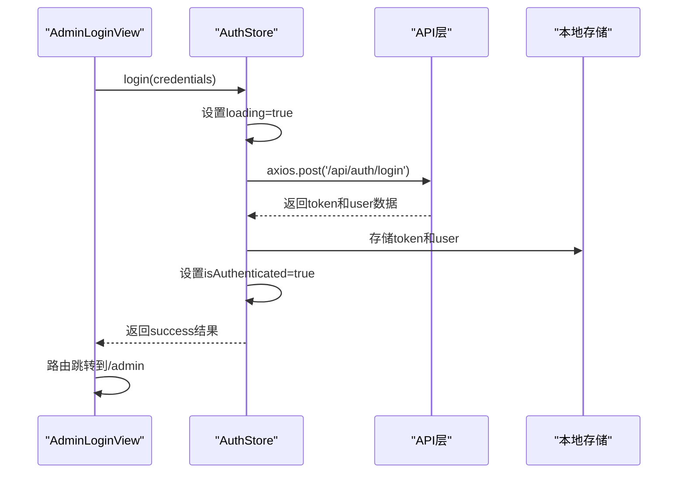
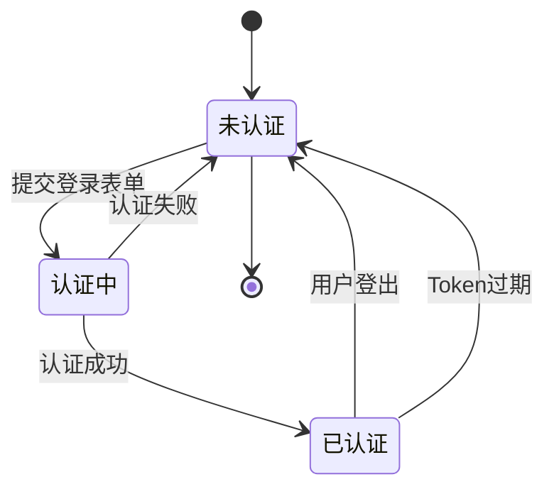
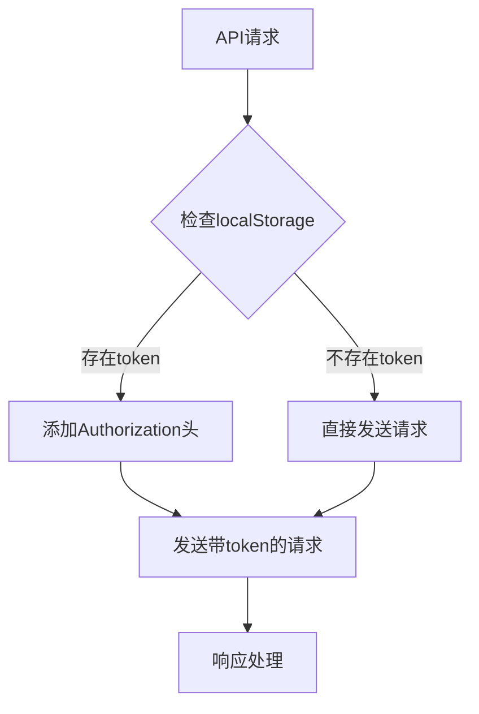
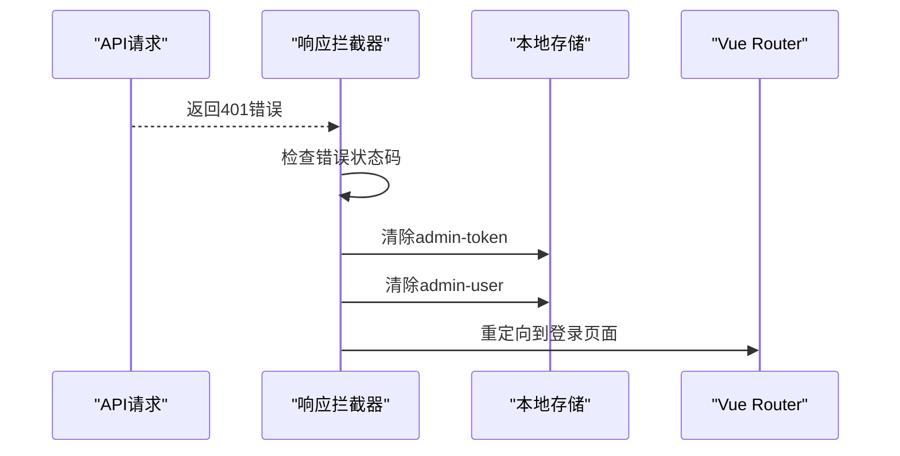
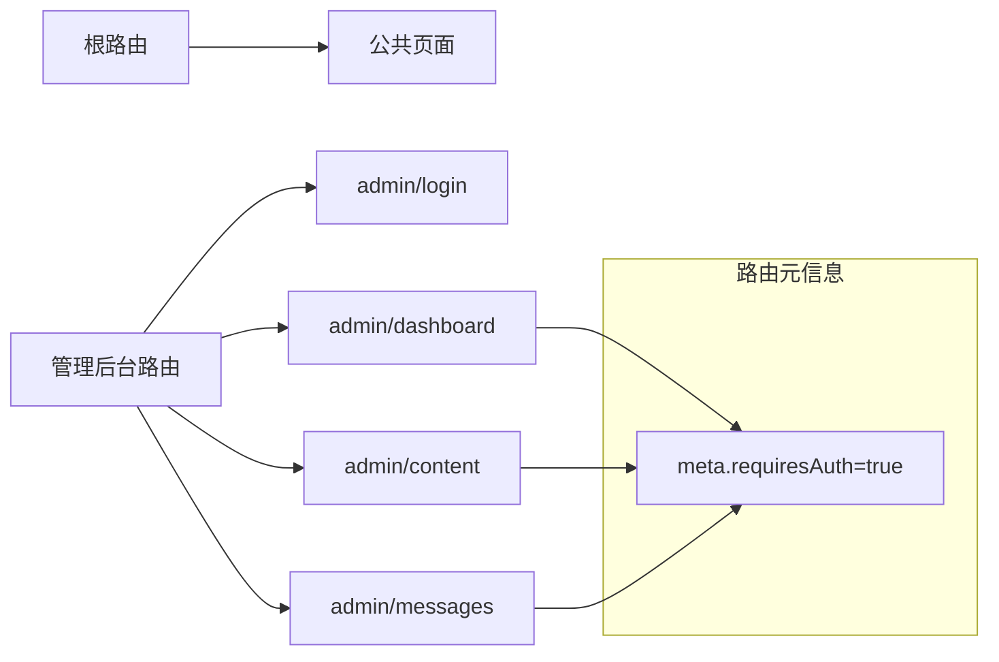
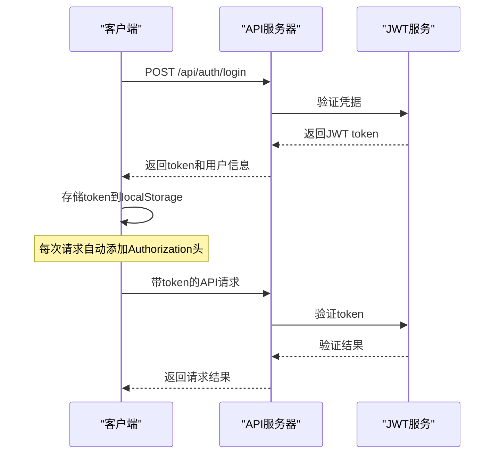
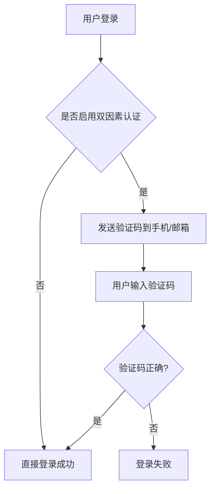
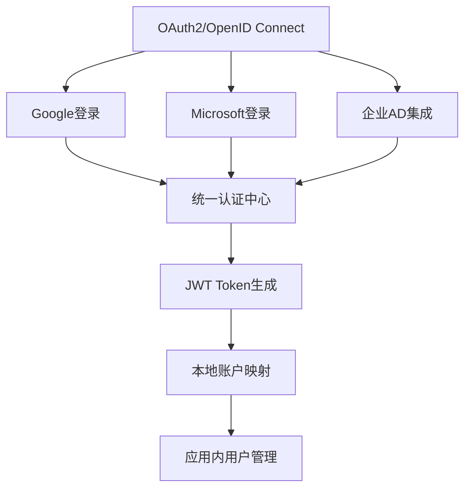

# 登录认证功能详细文档

<cite>
**本文档中引用的文件**
- [AdminLoginView.vue](file://src/views/admin/AdminLoginView.vue)
- [auth.js](file://src/store/modules/auth.js)
- [index.js](file://src/api/index.js)
- [index.js](file://src/router/index.js)
- [main.js](file://src/main.js)
- [app.js](file://app.js)
- [README.md](file://README.md)
</cite>

## 目录
1. [项目概述](#项目概述)
2. [管理员登录功能架构](#管理员登录功能架构)
3. [AdminLoginView组件分析](#adminloginview组件分析)
4. [认证状态管理](#认证状态管理)
5. [API请求拦截器](#api请求拦截器)
6. [路由守卫机制](#路由守卫机制)
7. [安全通信实现](#安全通信实现)
8. [扩展建议](#扩展建议)
9. [故障排除指南](#故障排除指南)
10. [总结](#总结)

## 项目概述

本项目是一个基于Vue 3的现代化企业官网，包含完整的前后端实现。项目采用现代化的前端技术栈，包括Vue 3 Composition API、Vue Router 4、Pinia状态管理和Axios请求库。其中，管理员登录功能是整个系统的核心安全组件，提供了完整的JWT认证机制和权限控制。

项目的主要技术特点：
- 使用Vue 3 Composition API构建响应式用户界面
- 采用Pinia进行状态管理，实现跨组件的认证状态共享
- 基于JWT的认证机制，支持token存储和自动刷新
- 完整的路由守卫机制，保护管理后台页面
- 前后端分离架构，支持RESTful API设计

## 管理员登录功能架构

管理员登录功能采用了分层架构设计，确保了代码的可维护性和安全性：



**图表来源**
- [AdminLoginView.vue](file://src/views/admin/AdminLoginView.vue#L1-L105)
- [auth.js](file://src/store/modules/auth.js#L1-L86)
- [index.js](file://src/api/index.js#L1-L95)
- [index.js](file://src/router/index.js#L1-L122)

## AdminLoginView组件分析

AdminLoginView是管理员登录的核心组件，采用了Vue 3的Composition API和响应式编程模式：

### 组件结构设计



**图表来源**
- [AdminLoginView.vue](file://src/views/admin/AdminLoginView.vue#L35-L45)
- [auth.js](file://src/store/modules/auth.js#L6-L15)

### 表单处理机制

AdminLoginView组件实现了完整的表单处理逻辑：

1. **响应式数据绑定**：使用`reactive`创建响应式的`credentials`对象，包含`username`和`password`字段
2. **表单验证**：通过Vue的内置验证机制确保输入字段的完整性
3. **异步登录处理**：`login`方法调用Pinia store的`login`方法，处理异步认证过程
4. **错误处理**：显示认证失败的错误信息，提供用户友好的反馈

### 视图层设计

组件采用了简洁的响应式设计，包含以下关键元素：

- **登录容器**：居中布局，最大宽度400px，提供良好的用户体验
- **品牌标识**：包含公司名称"朗德智能"和管理后台标题
- **表单控件**：用户名和密码输入框，支持键盘快捷键
- **错误提示**：当认证失败时显示具体的错误信息
- **加载状态**：登录按钮在认证过程中禁用并显示加载状态

**章节来源**
- [AdminLoginView.vue](file://src/views/admin/AdminLoginView.vue#L1-L105)

## 认证状态管理

认证状态管理是整个登录系统的核心，通过Pinia store实现了完整的状态生命周期管理：

### Store架构设计



**图表来源**
- [auth.js](file://src/store/modules/auth.js#L16-L44)
- [index.js](file://src/api/index.js#L60-L65)

### 状态持久化机制

AuthStore实现了完整的状态持久化机制：

1. **Token存储**：登录成功后，将JWT token存储到`localStorage`中
2. **用户信息持久化**：将用户基本信息序列化后存储到`localStorage`
3. **状态恢复**：应用启动时自动从`localStorage`恢复认证状态
4. **自动清理**：登出操作会清除所有相关的存储数据

### 认证状态管理流程



**图表来源**
- [auth.js](file://src/store/modules/auth.js#L46-L55)

### 验证和初始化机制

AuthStore提供了完整的验证和初始化机制：

1. **Token验证**：定期验证JWT token的有效性
2. **自动初始化**：应用启动时自动初始化认证状态
3. **错误处理**：处理token验证失败的情况，自动登出
4. **状态同步**：确保内存状态与持久化状态的一致性

**章节来源**
- [auth.js](file://src/store/modules/auth.js#L1-L86)

## API请求拦截器

API请求拦截器是实现安全通信的关键组件，确保每次请求都携带有效的认证信息：

### 请求拦截器实现



**图表来源**
- [index.js](file://src/api/index.js#L10-L22)

### 拦截器工作原理

请求拦截器的工作流程如下：

1. **Token提取**：从`localStorage`中获取`admin-token`
2. **头部添加**：如果token存在，在请求头中添加`Authorization: Bearer {token}`
3. **请求转发**：将修改后的请求继续发送到服务器
4. **错误处理**：拦截器本身不处理错误，将错误传递给响应拦截器

### 响应拦截器机制

响应拦截器实现了完整的错误处理和自动登出机制：



**图表来源**
- [index.js](file://src/api/index.js#L24-L40)

### 错误处理策略

响应拦截器实现了智能的错误处理策略：

1. **401错误处理**：自动清除认证信息并重定向到登录页面
2. **其他错误**：保持错误状态，让上层组件处理
3. **条件重定向**：只有在管理后台路径下才执行重定向
4. **用户体验**：提供清晰的错误提示和导航指引

**章节来源**
- [index.js](file://src/api/index.js#L1-L95)

## 路由守卫机制

路由守卫是保护管理后台页面的最后一道防线，确保只有经过认证的用户才能访问受保护的路由：

### 路由配置分析



**图表来源**
- [index.js](file://src/router/index.js#L75-L105)

### 路由守卫实现

路由守卫的核心实现逻辑：

```javascript
router.beforeEach((to, from, next) => {
  if (to.matched.some(record => record.meta.requiresAuth)) {
    const isLoggedIn = localStorage.getItem('admin-token')
    if (!isLoggedIn) {
      next({ name: 'admin-login' })
    } else {
      next()
    }
  } else {
    next()
  }
})
```

### 守卫机制特点

1. **条件检查**：只对带有`requiresAuth: true`元信息的路由生效
2. **快速判断**：使用`localStorage`进行快速的认证状态检查
3. **优雅重定向**：未认证用户被重定向到登录页面
4. **保持流畅**：已认证用户正常访问受保护页面

### 安全考虑

路由守卫的设计考虑了以下安全因素：

- **客户端验证**：虽然可以在客户端验证，但主要依赖后端的JWT验证
- **用户体验**：提供清晰的重定向路径和错误提示
- **性能优化**：使用简单的localStorage检查，避免不必要的API调用
- **一致性**：确保前端和后端的认证状态保持一致

**章节来源**
- [index.js](file://src/router/index.js#L107-L122)

## 安全通信实现

安全通信是整个认证系统的基础，通过多重机制确保数据传输的安全性：

### JWT认证流程



**图表来源**
- [auth.js](file://src/store/modules/auth.js#L16-L44)
- [index.js](file://src/api/index.js#L10-L22)

### 安全特性

1. **HTTPS支持**：推荐在生产环境中使用HTTPS加密传输
2. **Token过期**：JWT token包含过期时间，防止长期有效攻击
3. **自动清理**：登出时自动清除本地存储的token
4. **错误处理**：401错误自动触发登出流程

### 最佳实践

- **密钥管理**：在生产环境中使用强密钥并妥善保管
- **token存储**：使用localStorage存储token，平衡安全性和便利性
- **定期刷新**：可以实现token自动刷新机制
- **会话超时**：设置合理的会话超时时间

## 扩展建议

基于现有架构，以下是几个重要的扩展方向：

### 双因素认证集成



**扩展建议**：
1. **短信/邮件验证**：集成第三方短信服务提供商
2. **TOTP支持**：支持基于时间的一次性密码
3. **备用恢复码**：提供备用恢复码机制
4. **设备信任**：支持设备信任功能

### 第三方SSO集成



**扩展建议**：
1. **OAuth2集成**：支持主流的OAuth2提供商
2. **OpenID Connect**：实现标准的身份验证协议
3. **企业集成**：支持LDAP/AD集成
4. **单点登录**：实现企业内部的SSO解决方案

### 安全增强功能

1. **IP白名单**：限制管理员登录的IP地址范围
2. **设备指纹**：记录和验证设备特征
3. **异常登录检测**：监控异常登录行为
4. **访问日志**：记录所有认证相关的操作

## 故障排除指南

### 常见认证失败场景

#### 场景1：登录后无法访问管理后台

**症状**：登录成功但重定向到登录页面

**排查步骤**：
1. 检查`localStorage`中是否存在`admin-token`
2. 验证token是否有效（可通过JWT解码工具）
3. 检查路由守卫是否正确配置
4. 查看浏览器控制台是否有错误信息

**解决方案**：
```javascript
// 检查localStorage
console.log(localStorage.getItem('admin-token'));

// 手动测试路由守卫
const isLoggedIn = localStorage.getItem('admin-token');
console.log('认证状态:', !!isLoggedIn);
```

#### 场景2：API请求返回401错误

**症状**：登录后出现"未授权"错误

**排查步骤**：
1. 检查请求拦截器是否正确添加Authorization头
2. 验证token格式是否正确
3. 检查服务器端JWT配置
4. 查看响应拦截器的日志输出

**解决方案**：
```javascript
// 检查请求头
axios.interceptors.request.use(config => {
  console.log('请求头:', config.headers);
  return config;
});
```

#### 场景3：token过期问题

**症状**：登录后一段时间无法访问受保护页面

**排查步骤**：
1. 检查token的过期时间
2. 验证服务器端的token配置
3. 检查是否有自动刷新机制
4. 查看响应拦截器的处理逻辑

**解决方案**：
```javascript
// 实现token自动刷新
const refreshToken = async () => {
  try {
    const response = await axios.post('/api/auth/refresh', {
      token: localStorage.getItem('admin-token')
    });
    localStorage.setItem('admin-token', response.data.token);
    return true;
  } catch (error) {
    return false;
  }
};
```

### 调试技巧

1. **浏览器开发者工具**：使用Application面板检查localStorage
2. **网络面板**：监控API请求和响应
3. **控制台日志**：添加详细的调试日志
4. **Vue DevTools**：检查Pinia store的状态变化

### 性能优化建议

1. **减少localStorage访问**：缓存认证状态到内存
2. **批量API请求**：合并多个API调用
3. **懒加载组件**：按需加载管理后台组件
4. **CDN加速**：使用CDN加速静态资源加载

## 总结

本项目的管理员登录功能实现了一个完整、安全且易于扩展的认证系统。通过Vue 3的现代化架构、Pinia的状态管理、Axios的请求拦截机制和Vue Router的路由守卫，构建了一个健壮的前端认证解决方案。

### 核心优势

1. **安全性**：基于JWT的标准认证机制，支持token存储和自动清理
2. **易用性**：简洁的登录界面和流畅的用户体验
3. **可维护性**：模块化的代码结构和清晰的职责分工
4. **扩展性**：预留了双因素认证和SSO集成的扩展点

### 技术亮点

- **响应式设计**：适应各种设备尺寸的登录界面
- **状态持久化**：自动恢复用户的认证状态
- **错误处理**：完善的错误提示和自动登出机制
- **路由保护**：智能的路由守卫确保页面安全

### 发展方向

该项目为未来的功能扩展奠定了良好的基础，可以通过集成双因素认证、第三方SSO、设备管理和访问审计等功能，进一步提升系统的安全性和可用性。同时，建议在生产环境中完善安全配置，包括HTTPS部署、强密钥管理和定期的安全审计。