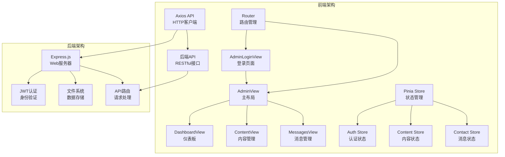
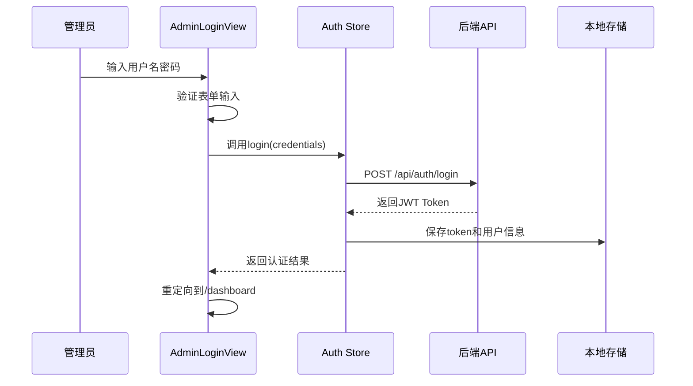
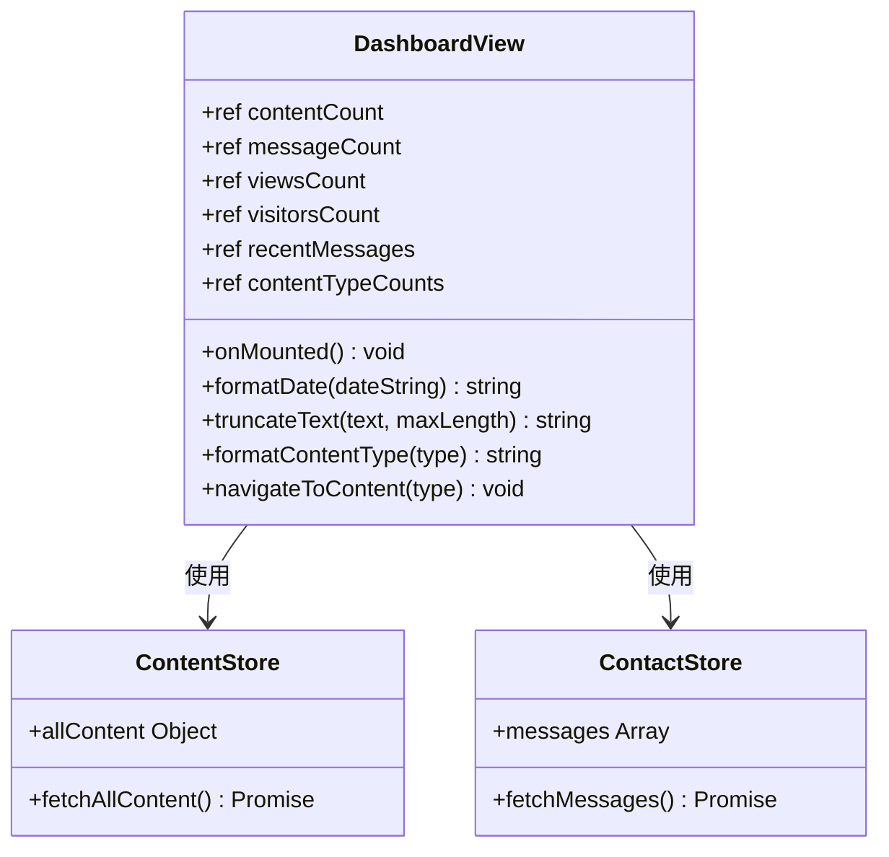
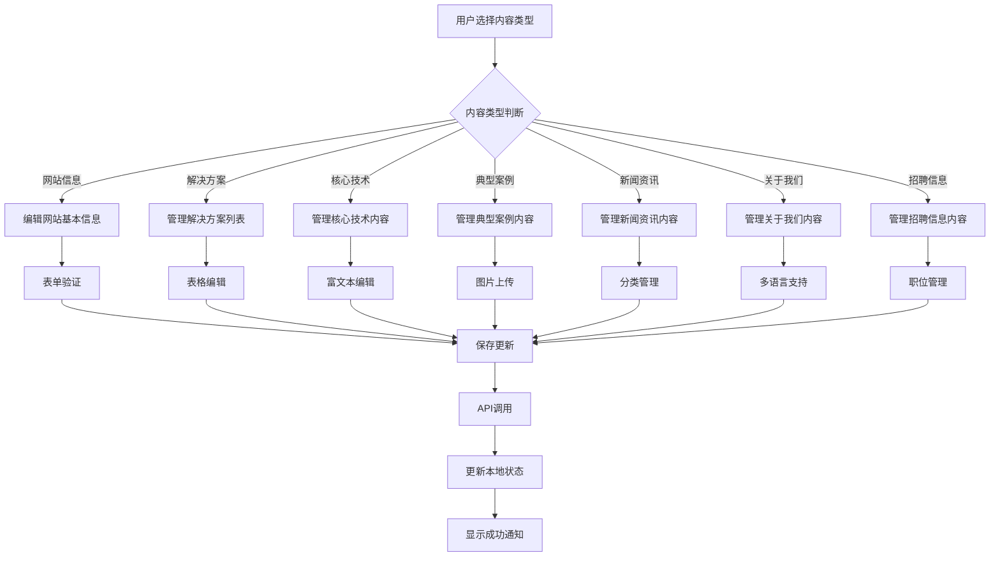
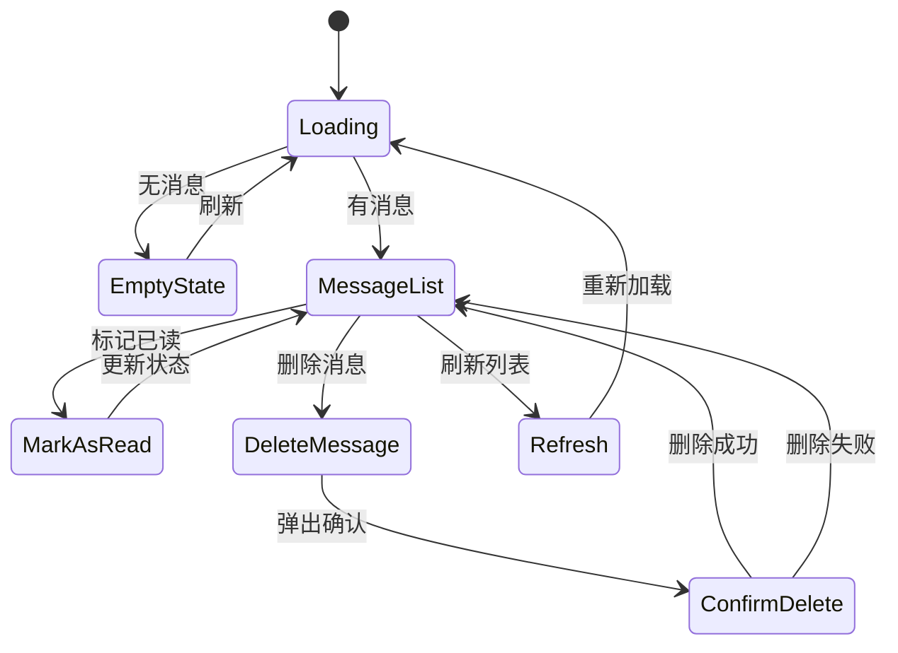
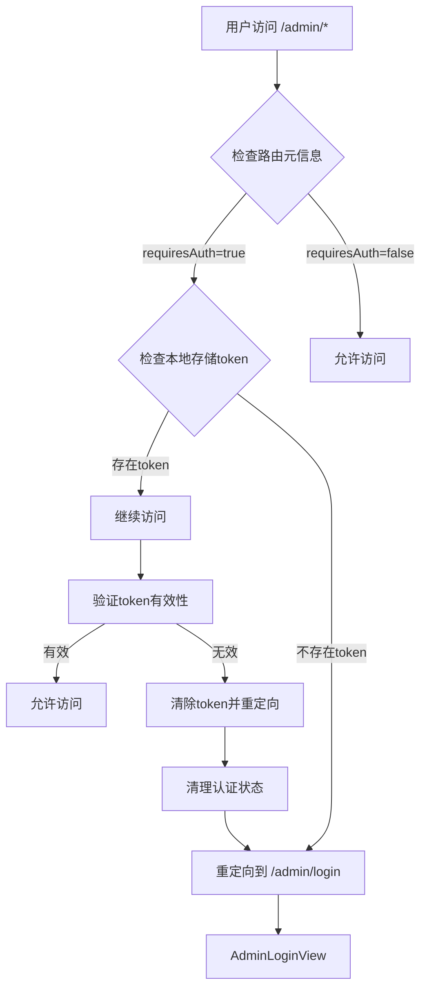
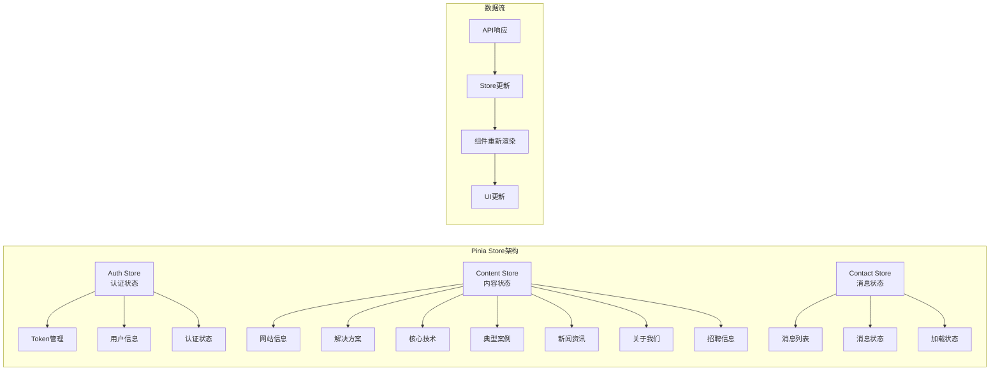
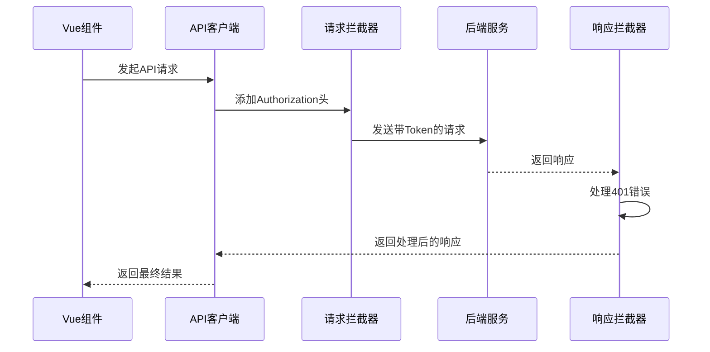

# 管理后台系统文档

<cite>
**本文档引用的文件**
- [AdminLoginView.vue](file://src/views/admin/AdminLoginView.vue)
- [DashboardView.vue](file://src/views/admin/DashboardView.vue)
- [ContentView.vue](file://src/views/admin/ContentView.vue)
- [MessagesView.vue](file://src/views/admin/MessagesView.vue)
- [AdminView.vue](file://src/views/admin/AdminView.vue)
- [auth.js](file://src/store/modules/auth.js)
- [content.js](file://src/store/modules/content.js)
- [contact.js](file://src/store/modules/contact.js)
- [index.js](file://src/router/index.js)
- [api/index.js](file://src/api/index.js)
- [content.json](file://data/content.json)
</cite>

## 目录
1. [简介](#简介)
2. [系统架构概述](#系统架构概述)
3. [核心组件分析](#核心组件分析)
4. [路由守卫机制](#路由守卫机制)
5. [状态管理](#状态管理)
6. [API接口设计](#api接口设计)
7. [扩展指南](#扩展指南)
8. [故障排除](#故障排除)
9. [总结](#总结)

## 简介

杭州朗德智能科技有限公司管理后台是一个基于Vue 3和Pinia的状态管理系统的完整内容管理系统。该系统提供了管理员登录、内容管理、消息管理和仪表板等功能，支持实时预览和保存修改，确保系统管理员能够高效地维护网站内容。

系统采用现代化的前端技术栈，包括Vue 3 Composition API、Vue Router 4、Pinia状态管理、Axios请求库和响应式设计，为管理员提供直观易用的操作界面。

## 系统架构概述

管理后台系统采用分层架构设计，包含视图层、状态管理层、路由层和API层：

**图表来源**
- [AdminLoginView.vue](file://src/views/admin/AdminLoginView.vue#L1-L105)
- [AdminView.vue](file://src/views/admin/AdminView.vue)
- [index.js](file://src/router/index.js#L1-L122)

## 核心组件分析

### AdminLoginView - 管理员登录组件

AdminLoginView是管理后台的入口点，负责收集用户名和密码并通过API完成JWT认证：

**图表来源**
- [AdminLoginView.vue](file://src/views/admin/AdminLoginView.vue#L45-L55)
- [auth.js](file://src/store/modules/auth.js#L15-L35)

登录组件实现了以下关键功能：
- 响应式表单验证
- 加载状态显示
- 错误消息处理
- 自动重定向到管理后台

**章节来源**
- [AdminLoginView.vue](file://src/views/admin/AdminLoginView.vue#L1-L105)

### DashboardView - 主控面板

DashboardView作为管理后台的核心仪表板，提供系统概览和快速访问功能：

**图表来源**
- [DashboardView.vue](file://src/views/admin/DashboardView.vue#L80-L120)
- [content.js](file://src/store/modules/content.js#L1-L50)
- [contact.js](file://src/store/modules/contact.js)

仪表板包含以下统计信息：
- 内容条目总数
- 联系消息数量
- 页面浏览次数
- 访问用户数量

**章节来源**
- [DashboardView.vue](file://src/views/admin/DashboardView.vue#L1-L364)

### ContentView - 内容编辑器

ContentView允许管理员编辑content.json中的各类文本与图片内容，实现实时预览与保存：

**图表来源**
- [ContentView.vue](file://src/views/admin/ContentView.vue#L15-L80)
- [content.js](file://src/store/modules/content.js#L100-L200)

ContentView支持以下内容类型：
- 网站基本信息（公司名称、口号、描述、联系方式）
- 解决方案（标题、描述、详细内容、图片）
- 核心技术（标题、描述、图标、详细内容、图片）
- 典型案例（标题、描述、图片、详情）
- 新闻资讯（标题、内容、分类、时间）
- 关于我们（公司介绍、团队信息、发展历程）
- 招聘信息（职位名称、要求、福利）

**章节来源**
- [ContentView.vue](file://src/views/admin/ContentView.vue#L1-L328)

### MessagesView - 消息管理器

MessagesView用于查看用户通过联系表单提交的消息，提供完整的CRUD操作：

**图表来源**
- [MessagesView.vue](file://src/views/admin/MessagesView.vue#L40-L120)

消息管理功能包括：
- 查看所有联系消息
- 标记消息为已读
- 删除消息
- 实时刷新消息列表
- 分页和排序支持

**章节来源**
- [MessagesView.vue](file://src/views/admin/MessagesView.vue#L1-L294)

## 路由守卫机制

路由守卫在保护/admin/*路径中的关键作用，防止未授权访问：

**图表来源**
- [index.js](file://src/router/index.js#L85-L100)

路由守卫实现了以下安全机制：
- 自动重定向到登录页面
- token有效性验证
- 自动登出功能
- 错误处理和用户体验优化

**章节来源**
- [index.js](file://src/router/index.js#L85-L100)

## 状态管理

系统使用Pinia作为状态管理工具，管理认证状态、内容状态和消息状态：

**图表来源**
- [auth.js](file://src/store/modules/auth.js#L1-L86)
- [content.js](file://src/store/modules/content.js#L1-L100)
- [contact.js](file://src/store/modules/contact.js)

状态管理特性：
- 响应式数据绑定
- 自动持久化到localStorage
- 异步操作处理
- 错误状态管理

**章节来源**
- [auth.js](file://src/store/modules/auth.js#L1-L86)
- [content.js](file://src/store/modules/content.js#L1-L199)

## API接口设计

系统通过统一的API客户端处理所有HTTP请求，支持拦截器和错误处理：

**图表来源**
- [api/index.js](file://src/api/index.js#L1-L95)

API接口分类：
- **认证接口**：登录、验证token、获取用户信息
- **内容接口**：获取内容、更新内容、上传图片
- **联系接口**：提交表单、获取消息、标记已读、删除消息

**章节来源**
- [api/index.js](file://src/api/index.js#L1-L95)

## 扩展指南

### 添加新的内容类型

要添加新的内容类型，需要修改以下几个文件：

1. **ContentView.vue** - 添加新的标签页和编辑器
2. **content.js** - 添加新的响应式数据对象
3. **API接口** - 添加相应的API调用
4. **后端路由** - 添加新的内容处理路由

### 扩展消息管理功能

可以扩展消息管理功能，添加以下特性：
- 消息搜索和过滤
- 批量操作功能
- 消息导出功能
- 自动回复功能

### 增强内容编辑器

可以增强内容编辑器的功能：
- 支持富文本编辑
- 添加媒体库管理
- 实现版本控制
- 支持多人协作编辑

## 故障排除

### 常见问题及解决方案

1. **登录失败**
   - 检查用户名和密码是否正确
   - 确认后端服务是否正常运行
   - 清除浏览器缓存和localStorage

2. **内容保存失败**
   - 检查网络连接状态
   - 确认后端API是否可用
   - 查看浏览器控制台错误信息

3. **路由重定向问题**
   - 检查localStorage中的token
   - 确认路由守卫配置
   - 验证后端认证服务

**章节来源**
- [AdminLoginView.vue](file://src/views/admin/AdminLoginView.vue#L45-L55)
- [api/index.js](file://src/api/index.js#L25-L45)

## 总结

杭州朗德智能科技有限公司管理后台是一个功能完善、架构清晰的内容管理系统。系统通过Vue 3的响应式特性和Pinia的状态管理，为管理员提供了直观易用的操作界面。

主要优势：
- **安全性**：完善的路由守卫和JWT认证机制
- **易用性**：直观的界面设计和丰富的编辑功能
- **扩展性**：模块化的架构便于功能扩展
- **性能**：响应式设计和高效的异步处理

系统管理员可以通过本指南快速掌握管理后台的各项功能，开发者也可以根据扩展指南轻松添加新功能或修改现有功能。随着业务的发展，系统可以进一步优化和扩展，以满足不断增长的管理需求。