# 朗德智能科技无人机系统项目概述

<cite>
**本文档中引用的文件**
- [README.md](file://README.md)
- [package.json](file://package.json)
- [src/main.js](file://src/main.js)
- [src/App.vue](file://src/App.vue)
- [src/router/index.js](file://src/router/index.js)
- [src/store/index.js](file://src/store/index.js)
- [src/store/modules/language.js](file://src/store/modules/language.js)
- [src/views/HomeView.vue](file://src/views/HomeView.vue)
- [src/components/DroneDefenseScene.vue](file://src/components/DroneDefenseScene.vue)
- [src/plugins/i18n.js](file://src/plugins/i18n.js)
</cite>

## 目录
1. [项目简介](#项目简介)
2. [技术架构概览](#技术架构概览)
3. [核心功能模块](#核心功能模块)
4. [3D可视化系统](#3D可视化系统)
5. [状态管理和国际化](#状态管理和国际化)
6. [路由系统](#路由系统)
7. [管理后台架构](#管理后台架构)
8. [性能优化策略](#性能优化策略)
9. [部署和维护](#部署和维护)
10. [总结](#总结)

## 项目简介

朗德智能科技无人机系统项目是一个面向未来的全栈Web应用程序，专为杭州朗德智能科技有限公司设计。该项目旨在展示公司的无人机及反无人机解决方案，提供一个支持中英文双语的响应式网站平台。

### 项目核心目标

- **技术展示平台**：全面展示朗德智能的无人机技术、反无人机系统和解决方案
- **多语言支持**：提供中文和英文双语界面，满足国际化业务需求
- **用户体验优化**：采用现代化前端技术栈，提供流畅的交互体验
- **内容管理系统**：内置管理后台，支持内容的动态更新和管理

### 技术特色

- **响应式设计**：适配各种设备尺寸，确保在桌面和移动设备上的最佳体验
- **3D可视化**：使用Three.js和GSAP实现逼真的无人机防御系统演示
- **实时交互**：提供动态的用户交互和视觉反馈
- **国际化支持**：完整的多语言切换机制，支持内容的动态翻译

## 技术架构概览

该项目采用现代化的前后端分离架构，结合了最新的Web技术栈：

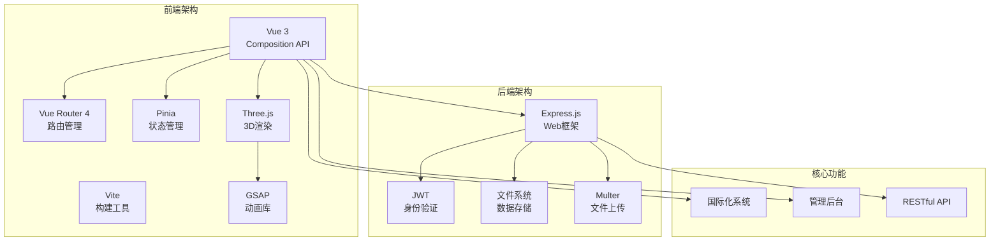

**图表来源**
- [src/main.js](file://src/main.js#L1-L230)
- [package.json](file://package.json#L1-L34)

### 前端技术栈

- **Vue 3**：使用Composition API提供更灵活的状态管理和更好的TypeScript支持
- **Vite**：快速的构建工具，提供热模块替换(HMR)和快速的开发服务器
- **Vue Router 4**：支持嵌套路由和异步组件加载
- **Pinia**：现代化的状态管理库，替代Vuex
- **Axios**：HTTP客户端，用于前后端通信
- **Three.js**：3D图形库，用于创建复杂的3D可视化效果
- **GSAP**：高性能动画库，用于复杂的动画序列

### 后端技术栈

- **Express.js**：轻量级Web框架，提供RESTful API服务
- **JWT**：JSON Web Token，用于用户身份验证和授权
- **Multer**：文件上传中间件，处理用户上传的文件
- **CORS**：跨域资源共享，允许前端应用访问后端API

**章节来源**
- [README.md](file://README.md#L1-L137)
- [package.json](file://package.json#L1-L34)

## 核心功能模块

### 首页展示模块

首页是整个网站的核心入口，采用模块化的布局设计：

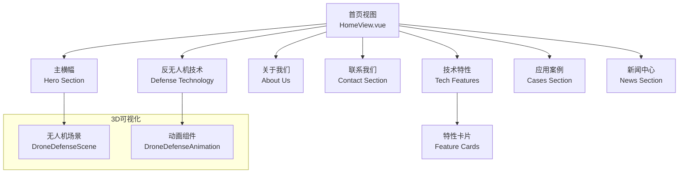

**图表来源**
- [src/views/HomeView.vue](file://src/views/HomeView.vue#L1-L800)
- [src/components/DroneDefenseScene.vue](file://src/components/DroneDefenseScene.vue#L1-L782)

### 技术展示模块

技术展示模块详细介绍了朗德智能的核心技术：

- **无人机探测系统**：多传感器融合探测，全天候监控
- **电子干扰系统**：定向干扰技术，阻断无人机控制链路
- **无人机拦截系统**：物理拦截手段，安全处置入侵无人机

### 案例展示模块

展示朗德智能的实际应用案例，包括：

- **国际机场防御**：为大型国际机场提供全方位反无人机保护
- **边境安全监控**：高性能侦察无人机系统
- **电力巡检**：专业工业无人机巡检系统

### 新闻中心模块

提供最新的公司动态和技术新闻，支持分类浏览：

- **企业新闻**：公司重大事件和里程碑
- **行业动态**：无人机行业的最新发展
- **媒体报道**：媒体对公司的报道和评价
- **技术博客**：深入的技术分析和解决方案

**章节来源**
- [src/views/HomeView.vue](file://src/views/HomeView.vue#L1-L800)

## 3D可视化系统

### DroneDefenseScene组件

DroneDefenseScene是项目中最复杂的技术组件之一，实现了完整的3D可视化效果：

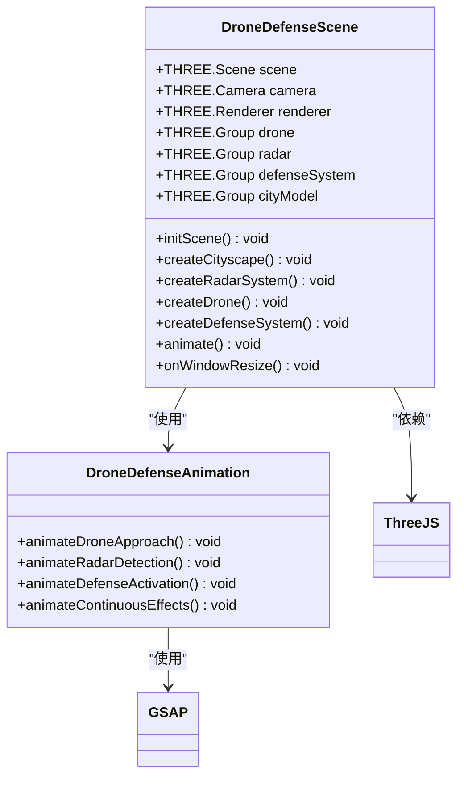

**图表来源**
- [src/components/DroneDefenseScene.vue](file://src/components/DroneDefenseScene.vue#L1-L782)

### 3D可视化实现原理

1. **场景初始化**：创建Three.js场景、相机和渲染器
2. **城市建模**：生成城市天际线，包括建筑物和地面
3. **设备建模**：创建雷达系统、无人机和防御系统
4. **动画系统**：使用GSAP实现复杂的动画序列
5. **交互控制**：响应用户操作和窗口大小变化

### 动画流程

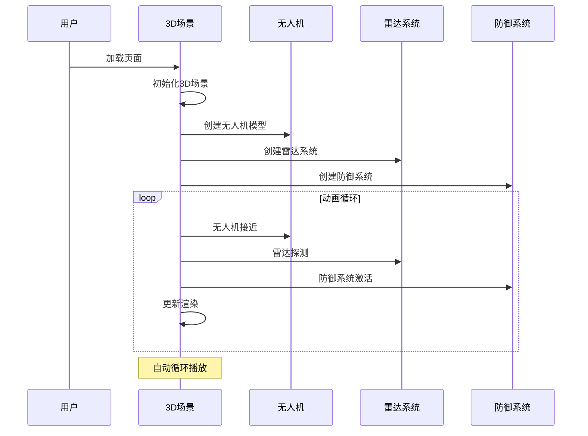

**图表来源**
- [src/components/DroneDefenseScene.vue](file://src/components/DroneDefenseScene.vue#L400-L600)

**章节来源**
- [src/components/DroneDefenseScene.vue](file://src/components/DroneDefenseScene.vue#L1-L782)

## 状态管理和国际化

### Pinia状态管理架构

项目使用Pinia作为状态管理解决方案，提供了清晰的状态管理层次：

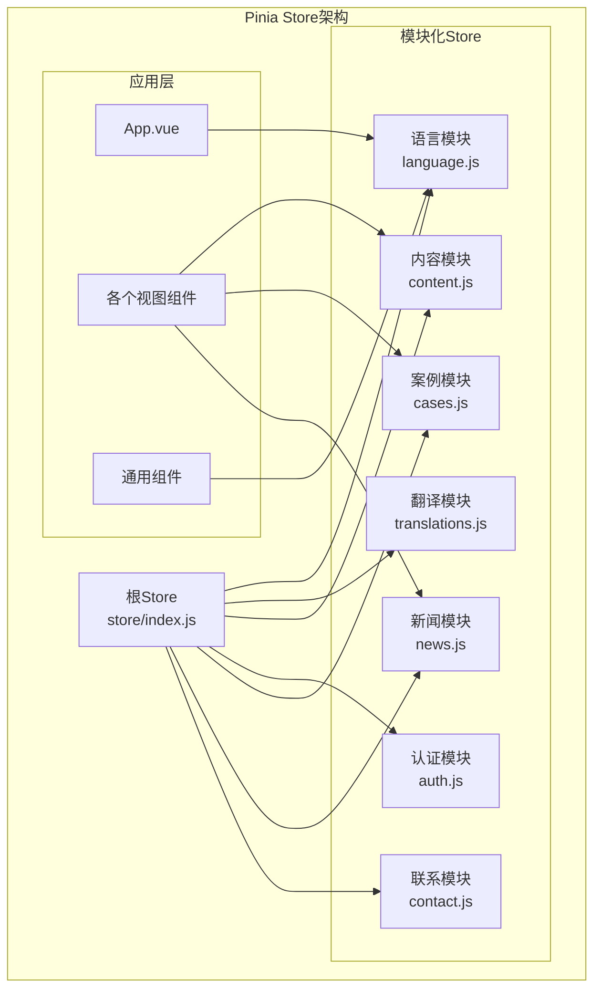

**图表来源**
- [src/store/index.js](file://src/store/index.js#L1-L6)
- [src/store/modules/language.js](file://src/store/modules/language.js#L1-L215)

### 语言切换机制

语言切换是项目的核心功能之一，实现了多层次的持久化和同步：

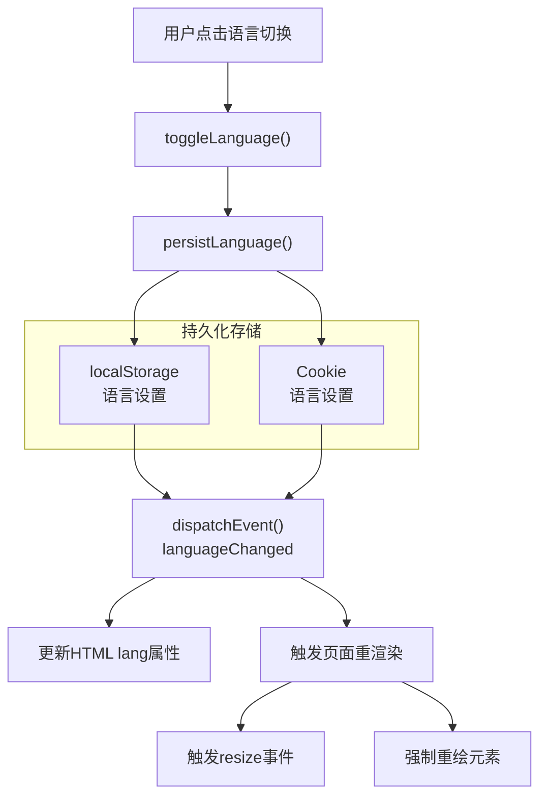

**图表来源**
- [src/store/modules/language.js](file://src/store/modules/language.js#L50-L150)

### 国际化插件

项目实现了完整的国际化系统，通过自定义插件提供全局翻译功能：

- **翻译键值对**：支持中英文的UI文本翻译
- **动态翻译**：运行时根据语言设置动态切换文本
- **指令支持**：提供`v-i18n`指令简化模板中的翻译
- **全局方法**：提供`$t()`、`$toggleLanguage()`等全局方法

**章节来源**
- [src/store/modules/language.js](file://src/store/modules/language.js#L1-L215)
- [src/plugins/i18n.js](file://src/plugins/i18n.js#L1-L72)

## 路由系统

### 路由架构设计

项目采用Vue Router 4实现复杂的路由管理：

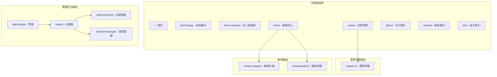

**图表来源**
- [src/router/index.js](file://src/router/index.js#L1-L122)

### 路由守卫和权限控制

项目实现了基于JWT的身份验证机制：

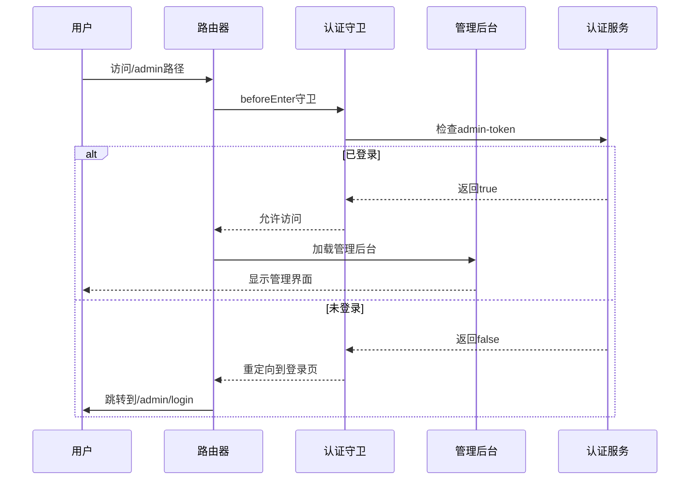

**图表来源**
- [src/router/index.js](file://src/router/index.js#L90-L110)

**章节来源**
- [src/router/index.js](file://src/router/index.js#L1-L122)

## 管理后台架构

### 后台功能模块

管理后台是项目的重要组成部分，提供了完整的CMS功能：

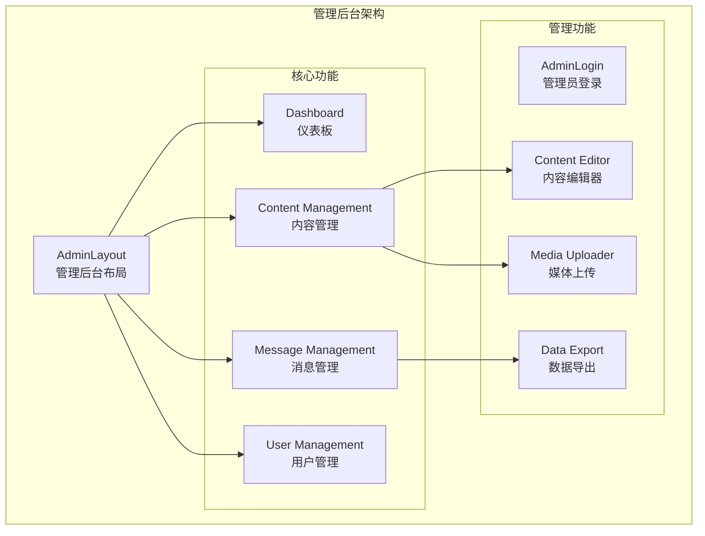

### 管理员认证流程

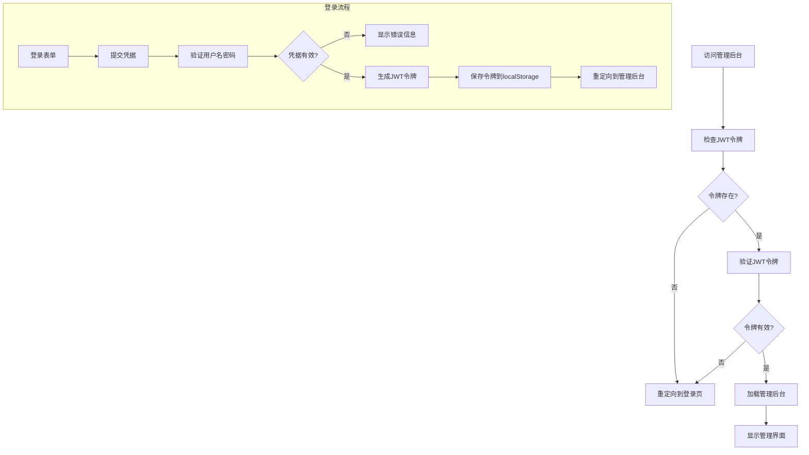

**章节来源**
- [src/router/index.js](file://src/router/index.js#L70-L90)

## 性能优化策略

### 前端性能优化

项目采用了多种性能优化策略：

1. **代码分割**：使用Vue Router的异步组件实现按需加载
2. **图片优化**：预加载关键图片，使用懒加载技术
3. **3D场景优化**：
   - 移动端降低渲染质量
   - 使用WebGL优化选项
   - 及时释放3D资源
4. **状态管理优化**：
   - 使用computed计算属性缓存结果
   - 避免不必要的状态更新
   - 合理使用watch监听器

### 加载性能优化

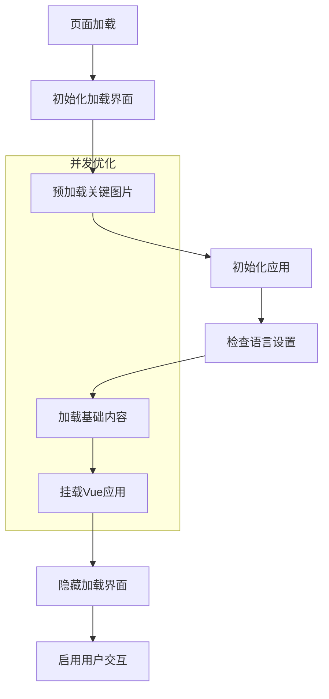

**图表来源**
- [src/main.js](file://src/main.js#L150-L230)

### 3D场景性能优化

3D可视化组件采用了专门的性能优化措施：

- **移动端适配**：减少几何体细分，降低渲染复杂度
- **资源管理**：及时释放不再使用的3D资源
- **动画优化**：使用requestAnimationFrame实现流畅动画
- **内存管理**：定期清理未使用的对象和纹理

**章节来源**
- [src/main.js](file://src/main.js#L150-L230)
- [src/components/DroneDefenseScene.vue](file://src/components/DroneDefenseScene.vue#L700-L782)

## 部署和维护

### 部署架构

项目支持多种部署方式：

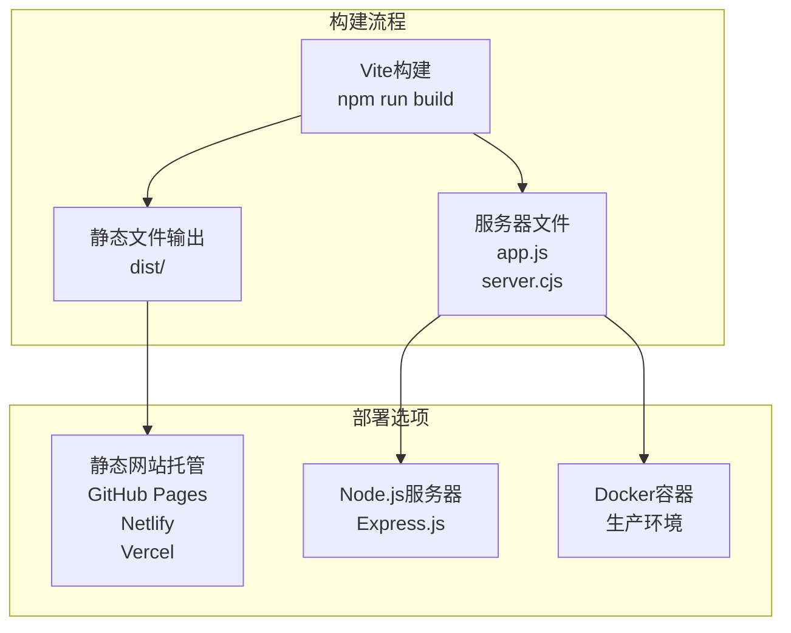

### 生产环境配置

项目提供了完整的生产环境配置：

- **环境变量**：支持不同环境的配置管理
- **安全配置**：HTTPS支持和安全头设置
- **性能优化**：压缩和缓存策略
- **监控和日志**：错误追踪和性能监控

### 维护建议

1. **定期更新**：保持依赖包的最新版本
2. **内容更新**：定期更新网站内容和功能
3. **性能监控**：监控网站性能和用户体验
4. **安全更新**：及时应用安全补丁

**章节来源**
- [README.md](file://README.md#L50-L137)

## 总结

朗德智能科技无人机系统项目是一个技术先进、功能完善的现代Web应用程序。项目成功地将无人机技术展示与现代化Web开发技术相结合，为用户提供了一个专业、直观且交互性强的展示平台。

### 项目亮点

1. **技术创新**：3D可视化技术的应用，生动展示了无人机防御系统的工作原理
2. **技术先进**：采用最新的Vue 3、Vite、Pinia等技术栈，确保了项目的现代化和可维护性
3. **用户体验**：响应式设计和流畅的动画效果，提供了优秀的用户体验
4. **国际化支持**：完整的多语言支持，满足国际化业务需求
5. **内容管理**：内置的管理后台，支持内容的动态更新和管理

### 技术价值

该项目不仅展示了朗德智能的技术实力，也为类似项目提供了宝贵的经验参考。其在3D可视化、状态管理、国际化等方面的实践，为现代Web应用开发提供了有价值的参考案例。

通过这个项目，朗德智能科技成功地建立了一个既能展示技术实力，又能提供优质用户体验的品牌展示平台，为公司的业务发展奠定了坚实的基础。