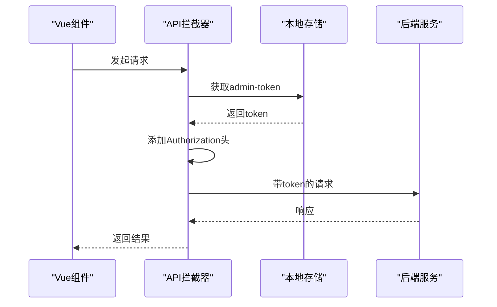
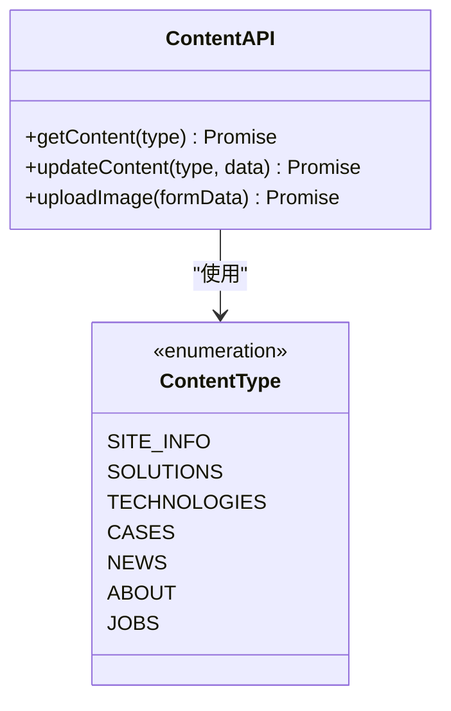
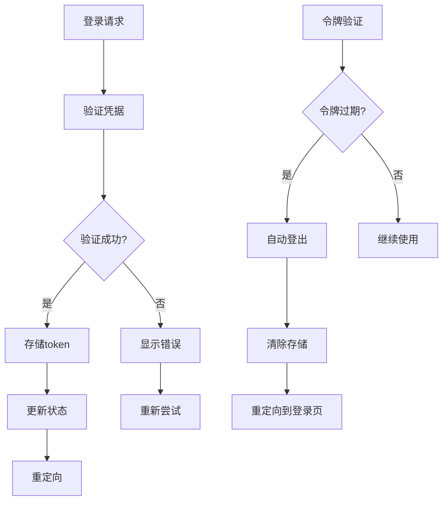
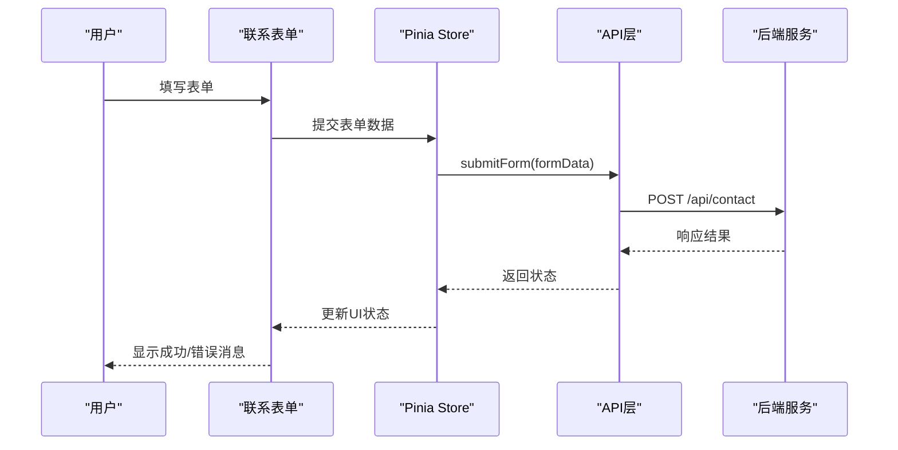
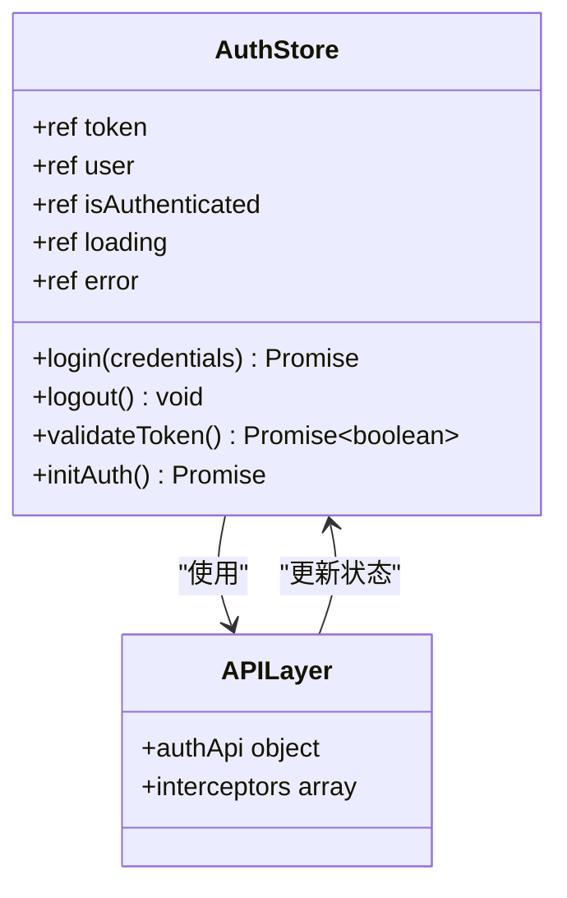
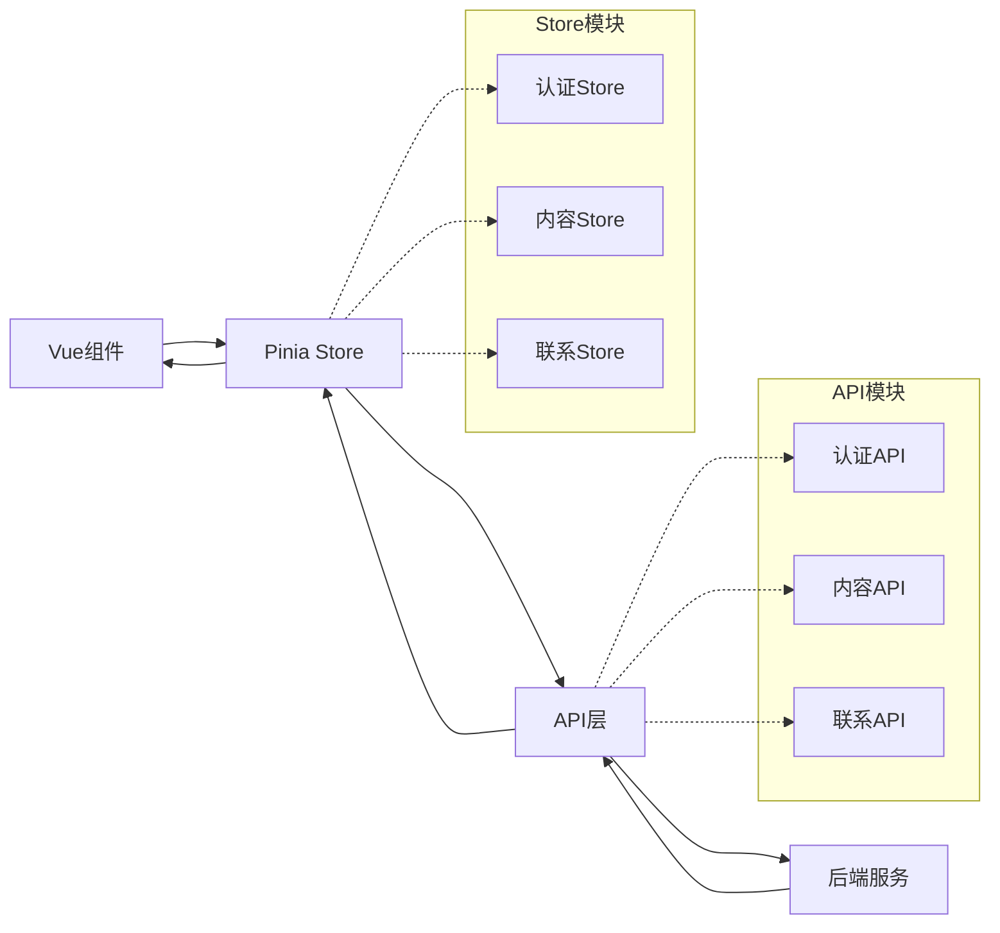
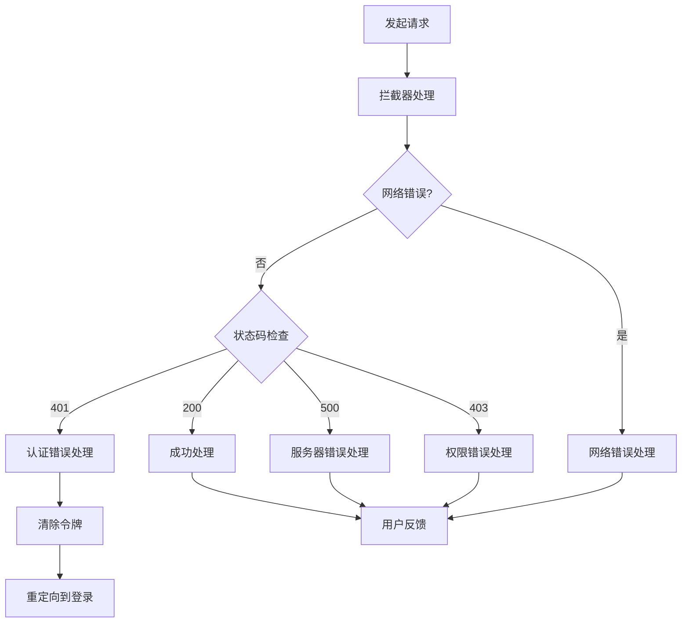

# API接口层解析

<cite>
**本文档中引用的文件**
- [src/api/index.js](file://src/api/index.js)
- [src/store/modules/auth.js](file://src/store/modules/auth.js)
- [src/store/modules/content.js](file://src/store/modules/content.js)
- [src/store/modules/contact.js](file://src/store/modules/contact.js)
- [src/router/index.js](file://src/router/index.js)
- [src/components/ContactForm.vue](file://src/components/ContactForm.vue)
- [app.js](file://app.js)
</cite>

## 目录
1. [概述](#概述)
2. [API服务架构](#api服务架构)
3. [核心API模块分析](#核心api模块分析)
4. [认证系统集成](#认证系统集成)
5. [数据流与状态管理](#数据流与状态管理)
6. [错误处理机制](#错误处理机制)
7. [最佳实践与设计模式](#最佳实践与设计模式)
8. [总结](#总结)

## 概述

本文档深入分析了项目中src/api/index.js文件定义的API服务封装机制，该模块通过Axios统一管理前端对后端Express服务的HTTP请求。API层作为前端与后端之间的桥梁，提供了标准化的请求处理、响应拦截、认证管理和错误处理等功能。

该API服务封装机制采用了模块化设计，将不同业务领域的API功能分别组织为独立的模块，包括内容管理API、认证API和联系表单API。这种设计不仅提高了代码的可维护性，还便于后续的功能扩展和测试。

## API服务架构

### Axios实例配置

API服务基于Axios库构建，提供了统一的HTTP客户端配置：

```javascript
// 创建axios实例
const api = axios.create({
  baseURL: '/api',
  timeout: 10000,
  headers: {
    'Content-Type': 'application/json'
  }
})
```

关键配置特点：
- **基础URL**: 设置为`/api`，便于后端路由匹配
- **超时时间**: 10秒超时设置，平衡响应速度与网络稳定性
- **默认头部**: JSON格式请求，确保前后端数据交换标准

### 请求拦截器设计



**图表来源**
- [src/api/index.js](file://src/api/index.js#L10-L20)

请求拦截器实现了自动认证令牌注入：

```javascript
api.interceptors.request.use(
  config => {
    const token = localStorage.getItem('admin-token')
    if (token) {
      config.headers.Authorization = `Bearer ${token}`
    }
    return config
  },
  error => {
    return Promise.reject(error)
  }
)
```

### 响应拦截器机制

响应拦截器提供了全局错误处理和认证状态管理：

```javascript
api.interceptors.response.use(
  response => {
    return response
  },
  error => {
    if (error.response) {
      if (error.response.status === 401) {
        localStorage.removeItem('admin-token')
        localStorage.removeItem('admin-user')
        if (window.location.pathname.startsWith('/admin')) {
          window.location.href = '/admin/login'
        }
      }
    }
    return Promise.reject(error)
  }
)
```

**章节来源**
- [src/api/index.js](file://src/api/index.js#L10-L40)

## 核心API模块分析

### 内容管理API

内容管理API负责网站静态内容的获取和管理：



**图表来源**
- [src/api/index.js](file://src/api/index.js#L42-L52)

#### API方法详解

1. **获取内容** (`getContent`)
```javascript
// 获取指定类型的内容
getContent: (type) => api.get(`/content/${type}`)
```
支持的内容类型包括：站点信息、解决方案、技术详情、案例研究、新闻资讯、关于我们、招聘信息等。

2. **更新内容** (`updateContent`)
```javascript
// 需要管理员权限的更新操作
updateContent: (type, data) => api.put(`/admin/content/${type}`, data)
```
此方法仅限管理员使用，用于CMS系统的数据更新。

3. **图片上传** (`uploadImage`)
```javascript
// 支持multipart/form-data的图片上传
uploadImage: (formData) => api.post('/admin/upload', formData, {
  headers: {
    'Content-Type': 'multipart/form-data'
  }
})
```

### 认证API

认证API模块处理用户身份验证和会话管理：



**图表来源**
- [src/api/index.js](file://src/api/index.js#L54-L64)

#### 认证方法实现

1. **用户登录** (`login`)
```javascript
login: (credentials) => api.post('/auth/login', credentials)
```
接收用户名和密码，返回JWT令牌和用户信息。

2. **令牌验证** (`validateToken`)
```javascript
validateToken: () => api.post('/auth/validate')
```
验证当前用户的认证状态，确保会话有效性。

3. **获取用户信息** (`getUserInfo`)
```javascript
getUserInfo: () => api.get('/auth/me')
```
获取当前登录用户的基本信息。

### 联系表单API

联系表单API处理用户咨询和消息管理：



**图表来源**
- [src/api/index.js](file://src/api/index.js#L66-L80)

#### 联系表单功能

1. **提交表单** (`submitForm`)
```javascript
submitForm: (formData) => api.post('/contact', formData)
```
支持多语言表单数据提交，自动添加语言标识。

2. **消息管理** (`getMessages`, `markAsRead`, `deleteMessage`)
```javascript
// 获取消息列表
getMessages: () => api.get('/admin/messages')

// 标记消息为已读
markAsRead: (id) => api.put(`/admin/messages/${id}/read`)

// 删除消息
deleteMessage: (id) => api.delete(`/admin/messages/${id}`)
```

**章节来源**
- [src/api/index.js](file://src/api/index.js#L42-L80)

## 认证系统集成

### Vuex/Pinia状态管理

认证状态通过Pinia store进行管理，实现了与API层的紧密集成：



**图表来源**
- [src/store/modules/auth.js](file://src/store/modules/auth.js#L5-L25)

### JWT令牌管理

认证系统采用JWT（JSON Web Token）进行身份验证：

1. **令牌存储**: 使用localStorage持久化存储
2. **自动注入**: 请求拦截器自动添加Authorization头
3. **自动清理**: 响应拦截器处理401错误并清理过期令牌

### 路由守卫集成

```javascript
// 路由守卫，用于管理员认证
router.beforeEach((to, from, next) => {
  if (to.matched.some(record => record.meta.requiresAuth)) {
    const isLoggedIn = localStorage.getItem('admin-token')
    if (!isLoggedIn) {
      next({ name: 'admin-login' })
    } else {
      next()
    }
  } else {
    next()
  }
})
```

**章节来源**
- [src/store/modules/auth.js](file://src/store/modules/auth.js#L5-L85)
- [src/router/index.js](file://src/router/index.js#L85-L95)

## 数据流与状态管理

### Pinia Store集成

API层与各个Pinia store模块紧密配合，形成了完整的数据流：



**图表来源**
- [src/store/modules/content.js](file://src/store/modules/content.js#L5-L15)
- [src/store/modules/contact.js](file://src/store/modules/contact.js#L5-L15)

### 数据同步机制

1. **初始化流程**: 各store模块在组件挂载时自动初始化数据
2. **状态更新**: API调用成功后更新store状态
3. **错误处理**: 统一的错误处理机制确保用户体验

### 语言国际化支持

API层支持多语言数据处理：

```javascript
// 联系表单API示例
submitContactForm: async () => {
  try {
    await axios.post('/api/contact', {
      ...contactForm,
      language: languageStore.language // 添加语言信息
    })
    // ...
  } catch (e) {
    const errorMessage = languageStore.isZh() 
      ? '提交失败，请稍后再试' 
      : 'Submission failed, please try again later'
    error.value = e.message || errorMessage
  }
}
```

**章节来源**
- [src/store/modules/content.js](file://src/store/modules/content.js#L15-L35)
- [src/store/modules/contact.js](file://src/store/modules/contact.js#L30-L50)

## 错误处理机制

### 分层错误处理

API层实现了多层次的错误处理策略：



**图表来源**
- [src/api/index.js](file://src/api/index.js#L22-L40)

### 错误处理策略

1. **网络错误**: 提供友好的错误提示，避免技术术语
2. **认证错误**: 自动清理认证信息并重定向到登录页面
3. **权限错误**: 根据用户角色提供适当的错误信息
4. **服务器错误**: 记录错误日志并显示通用错误消息

### 用户体验优化

```javascript
// 错误处理示例
const submitContactForm = async () => {
  submitting.value = true
  success.value = false
  error.value = null
  
  try {
    await axios.post('/api/contact', {
      ...contactForm,
      language: languageStore.language
    })
    success.value = true
    resetForm()
    return { success: true }
  } catch (e) {
    const errorMessage = languageStore.isZh() 
      ? '提交失败，请稍后再试' 
      : 'Submission failed, please try again later'
    
    error.value = e.message || errorMessage
    return { success: false, error: error.value }
  } finally {
    submitting.value = false
  }
}
```

**章节来源**
- [src/store/modules/contact.js](file://src/store/modules/contact.js#L30-L60)

## 最佳实践与设计模式

### 单一职责原则

每个API模块都遵循单一职责原则：

- **内容API**: 专注于网站内容的获取和管理
- **认证API**: 专门处理用户身份验证
- **联系API**: 负责用户咨询和消息管理

### 接口一致性

所有API方法都保持一致的命名规范和参数结构：

```javascript
// 统一的API调用模式
export const contentApi = {
  getContent: (type) => api.get(`/content/${type}`),
  updateContent: (type, data) => api.put(`/admin/content/${type}`, data),
  uploadImage: (formData) => api.post('/admin/upload', formData, {
    headers: {
      'Content-Type': 'multipart/form-data'
    }
  })
}
```

### 异步处理模式

采用Promise-based异步处理模式，确保良好的错误处理和用户体验：

```javascript
// 标准的异步API调用模式
const fetchData = async () => {
  try {
    const response = await api.get('/endpoint')
    return response.data
  } catch (error) {
    console.error('API Error:', error)
    throw error
  }
}
```

### 缓存策略

虽然当前实现主要依赖实时API调用，但可以通过以下方式扩展缓存功能：

1. **内存缓存**: 在store中缓存常用数据
2. **本地存储**: 缓存用户偏好和认证信息
3. **CDN缓存**: 对静态资源使用CDN加速

### 测试友好设计

API层的设计考虑了单元测试和集成测试的需求：

- **模块化**: 每个API模块都可以独立测试
- **依赖注入**: 可以轻松替换Axios实例进行测试
- **错误模拟**: 容易模拟各种错误场景

## 总结

该项目的API接口层展现了现代前端开发的最佳实践，通过Axios构建的统一HTTP客户端，实现了：

### 核心优势

1. **统一管理**: 通过单一入口点管理所有API调用
2. **自动认证**: 请求拦截器自动处理JWT令牌注入
3. **错误处理**: 分层的错误处理机制确保应用稳定性
4. **模块化设计**: 清晰的模块划分便于维护和扩展
5. **状态集成**: 与Pinia store深度集成，实现数据流的统一管理

### 技术亮点

- **响应式编程**: 基于Promise的异步处理模式
- **国际化支持**: 多语言数据处理能力
- **路由守卫**: 安全的管理员认证机制
- **错误恢复**: 自动的认证状态清理和重定向

### 扩展建议

1. **缓存优化**: 实现更复杂的缓存策略
2. **重试机制**: 添加网络请求重试功能
3. **监控集成**: 集成应用性能监控工具
4. **离线支持**: 考虑添加Service Worker支持

该API接口层设计为项目提供了坚实的技术基础，支持未来的功能扩展和性能优化，是一个值得借鉴的前端API设计范例。