# 3D反无人机动画组件深度解析

<cite>
**本文档引用的文件**
- [DroneDefenseAnimation.vue](file://src/components/DroneDefenseAnimation.vue)
- [DroneDefenseScene.vue](file://src/components/DroneDefenseScene.vue)
- [package.json](file://package.json)
- [main.css](file://src/assets/main.css)
- [App.vue](file://src/App.vue)
</cite>

## 目录
1. [项目概述](#项目概述)
2. [技术架构](#技术架构)
3. [核心组件分析](#核心组件分析)
4. [Three.js场景构建](#threejs场景构建)
5. [GSAP动画系统](#gsap动画系统)
6. [响应式设计实现](#响应式设计实现)
7. [性能优化策略](#性能优化策略)
8. [资源管理与清理](#资源管理与清理)
9. [故障排除指南](#故障排除指南)
10. [最佳实践建议](#最佳实践建议)

## 项目概述

本项目是一个基于Vue 3和Three.js的3D反无人机动画展示组件，提供了完整的3D场景渲染和动画效果。该组件包含两个主要的动画组件：`DroneDefenseAnimation.vue`和`DroneDefenseScene.vue`，分别展示了不同风格的反无人机系统演示。

### 主要特性

- **完整的3D场景渲染**：基于Three.js构建的高质量3D环境
- **流畅的动画系统**：使用GSAP实现复杂的动画效果
- **响应式设计**：适配不同设备和屏幕尺寸
- **性能优化**：针对移动端和桌面端的不同优化策略
- **资源管理**：完善的资源清理和内存管理机制

## 技术架构

### 核心依赖

项目使用以下关键技术栈：

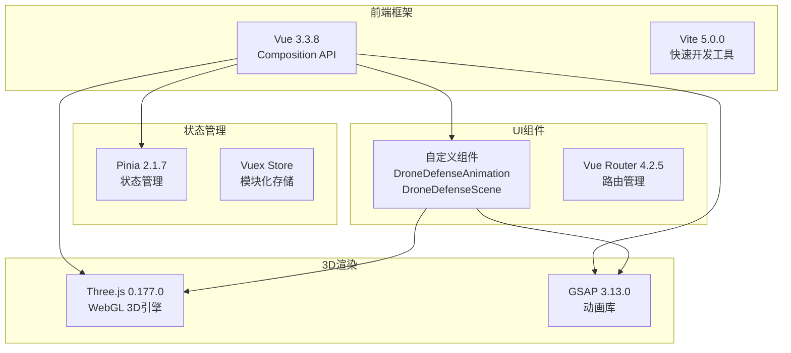

**图表来源**
- [package.json](file://package.json#L10-L20)
- [DroneDefenseAnimation.vue](file://src/components/DroneDefenseAnimation.vue#L1-L20)

### 项目结构

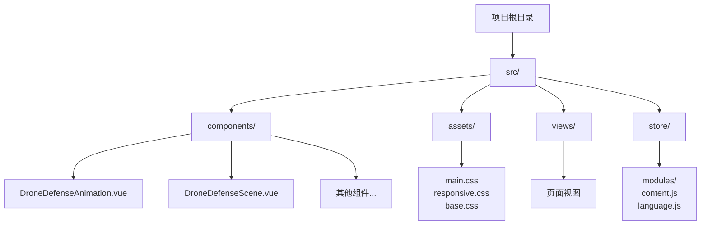

**章节来源**
- [DroneDefenseAnimation.vue](file://src/components/DroneDefenseAnimation.vue#L1-L50)
- [DroneDefenseScene.vue](file://src/components/DroneDefenseScene.vue#L1-L50)

## 核心组件分析

### DroneDefenseAnimation.vue 组件

这是主要的反无人机动画组件，负责展示完整的3D反无人机系统动画。

#### 组件结构

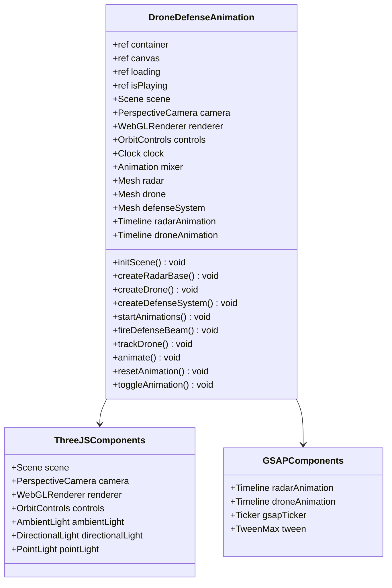

**图表来源**
- [DroneDefenseAnimation.vue](file://src/components/DroneDefenseAnimation.vue#L38-L84)
- [DroneDefenseAnimation.vue](file://src/components/DroneDefenseAnimation.vue#L150-L200)

#### 关键变量和状态

组件维护以下核心状态：

- **容器元素**：`container`和`canvas`用于DOM操作
- **加载状态**：`loading`控制加载动画显示
- **播放状态**：`isPlaying`控制动画播放暂停
- **Three.js实例**：场景、相机、渲染器、控制器等
- **动画实例**：雷达旋转、无人机飞行、防御系统追踪等

**章节来源**
- [DroneDefenseAnimation.vue](file://src/components/DroneDefenseAnimation.vue#L10-L20)

### DroneDefenseScene.vue 组件

这个组件提供了更复杂的城市背景下的反无人机系统演示。

#### 组件架构

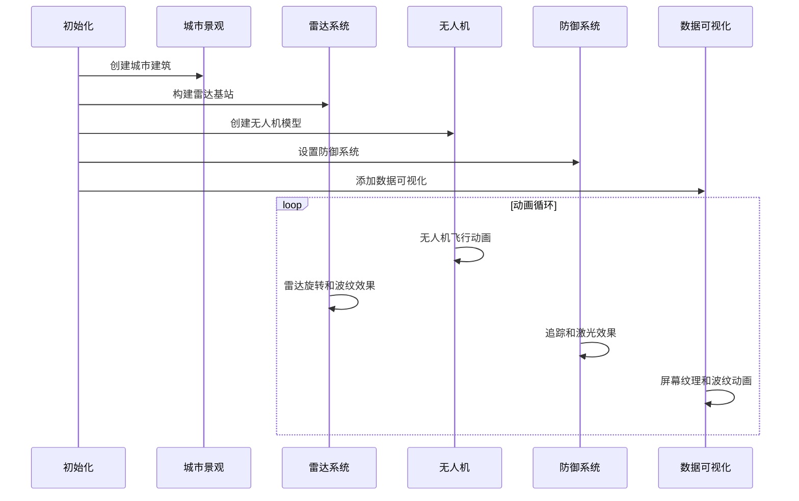

**图表来源**
- [DroneDefenseScene.vue](file://src/components/DroneDefenseScene.vue#L80-L120)
- [DroneDefenseScene.vue](file://src/components/DroneDefenseScene.vue#L200-L250)

**章节来源**
- [DroneDefenseScene.vue](file://src/components/DroneDefenseScene.vue#L1-L100)

## Three.js场景构建

### 场景初始化流程

Three.js场景的初始化遵循严格的步骤顺序：

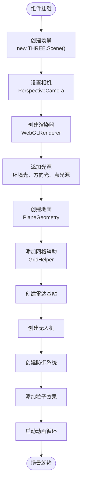

**图表来源**
- [DroneDefenseAnimation.vue](file://src/components/DroneDefenseAnimation.vue#L38-L84)
- [DroneDefenseAnimation.vue](file://src/components/DroneDefenseAnimation.vue#L150-L200)

### 相机设置与配置

相机配置是3D场景的核心部分：

```javascript
// 相机初始化
camera = new THREE.PerspectiveCamera(
  60,                                    // 视场角
  container.value.clientWidth / container.value.clientHeight, // 宽高比
  0.1,                                   // 近裁剪面
  1000                                   // 远裁剪面
);
camera.position.set(0, 5, 10);           // 初始位置
```

**关键配置要点**：
- **视场角**：60度提供适中的视野范围
- **宽高比**：动态计算适应容器尺寸
- **裁剪面**：合理设置避免渲染异常
- **初始位置**：5, 5, 10提供良好的视角

### 灯光系统配置

项目采用多层次的灯光系统：

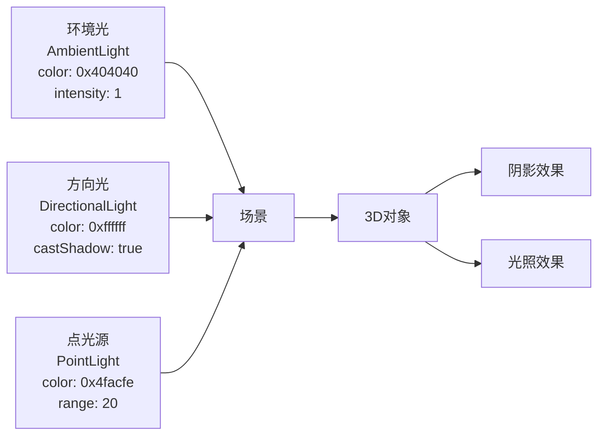

**图表来源**
- [DroneDefenseAnimation.vue](file://src/components/DroneDefenseAnimation.vue#L60-L84)

### 材质与纹理系统

材质系统支持多种渲染效果：

1. **标准材质**：`MeshStandardMaterial`用于真实感表面
2. **基础材质**：`MeshBasicMaterial`用于简单效果
3. **粒子材质**：`PointsMaterial`用于星系效果
4. **Canvas纹理**：动态生成的雷达屏幕纹理

**章节来源**
- [DroneDefenseAnimation.vue](file://src/components/DroneDefenseAnimation.vue#L150-L250)
- [DroneDefenseScene.vue](file://src/components/DroneDefenseScene.vue#L200-L300)

## GSAP动画系统

### 动画架构设计

GSAP动画系统采用分层架构，支持复杂的动画序列和交互：

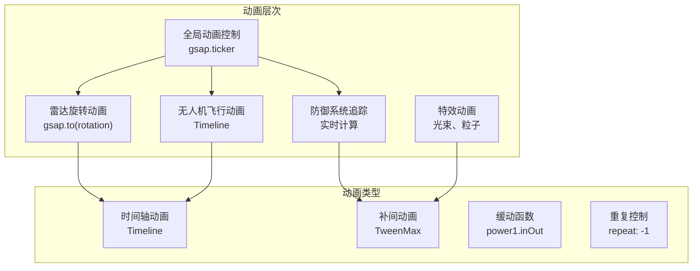

**图表来源**
- [DroneDefenseAnimation.vue](file://src/components/DroneDefenseAnimation.vue#L320-L370)
- [DroneDefenseScene.vue](file://src/components/DroneDefenseScene.vue#L439-L491)

### 雷达旋转动画

雷达旋转是系统的核心视觉效果：

```javascript
// 雷达旋转动画
radarAnimation = gsap.to(radar.rotation, {
  y: Math.PI * 2,        // 完整旋转
  duration: 5,           // 5秒完成
  repeat: -1,            // 无限循环
  ease: "none"           // 匀速旋转
});
```

**动画特点**：
- **匀速旋转**：使用`none`缓动确保一致性
- **无限循环**：`repeat: -1`实现持续效果
- **精确控制**：完整360度旋转

### 无人机飞行路径动画

无人机采用复杂的四段式飞行路径：

```mermaid
sequenceDiagram
participant Start as 起点(7,4,7)
participant P1 as 控制点1(7,4,-7)
participant P2 as 控制点2(-7,5,-7)
participant P3 as 控制点3(-7,4,7)
participant P4 as 控制点4(7,5,7)
participant End as 终点(7,4,7)
Start->>P1 : 第一段
P1->>P2 : 第二段
P2->>P3 : 第三段
P3->>P4 : 第四段
P4->>End : 第五段
End->>Start : 循环
```

**图表来源**
- [DroneDefenseAnimation.vue](file://src/components/DroneDefenseAnimation.vue#L330-L360)

### 实时追踪动画

防御系统对无人机进行实时追踪：

```javascript
// 防御系统追踪逻辑
const trackDrone = () => {
  if (defenseSystem && drone) {
    const defensePosition = new THREE.Vector3();
    defenseSystem.getWorldPosition(defensePosition);
    
    const dronePosition = new THREE.Vector3();
    drone.getWorldPosition(dronePosition);
    
    defenseSystem.lookAt(dronePosition);
    
    // 计算距离并触发拦截
    const distance = defensePosition.distanceTo(dronePosition);
    if (distance < 8) {
      fireDefenseBeam(defensePosition, dronePosition);
    }
  }
};
```

**章节来源**
- [DroneDefenseAnimation.vue](file://src/components/DroneDefenseAnimation.vue#L370-L420)
- [DroneDefenseAnimation.vue](file://src/components/DroneDefenseAnimation.vue#L420-L470)

## 响应式设计实现

### 设备检测与适配

系统根据设备类型自动调整渲染参数：

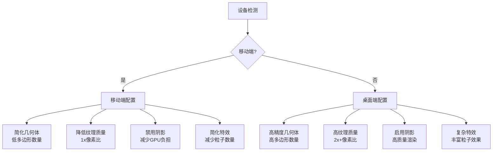

**图表来源**
- [DroneDefenseScene.vue](file://src/components/DroneDefenseScene.vue#L40-L50)
- [DroneDefenseScene.vue](file://src/components/DroneDefenseScene.vue#L132-L165)

### 渲染器优化配置

```javascript
// 响应式渲染器配置
renderer.setPixelRatio(isMobile.value ? 1 : Math.min(window.devicePixelRatio, 2));
renderer.powerPreference = "high-performance";
renderer.antialias = !isMobile.value;

// 场景优化
scene.matrixAutoUpdate = false;
scene.autoUpdate = false;
```

**优化策略**：
- **像素比限制**：移动端限制为1，避免过度渲染
- **抗锯齿开关**：移动端禁用提升性能
- **场景更新关闭**：手动控制更新时机

### 窗口尺寸调整处理

```javascript
const onWindowResize = () => {
  if (container.value && camera && renderer) {
    camera.aspect = container.value.clientWidth / container.value.clientHeight;
    camera.updateProjectionMatrix();
    renderer.setSize(container.value.clientWidth, container.value.clientHeight);
  }
};
```

**章节来源**
- [DroneDefenseScene.vue](file://src/components/DroneDefenseScene.vue#L470-L490)
- [DroneDefenseAnimation.vue](file://src/components/DroneDefenseAnimation.vue#L470-L480)

## 性能优化策略

### 几何体优化

1. **多边形数量控制**：移动端使用简化版本
2. **LOD系统**：根据距离动态调整细节级别
3. **实例化渲染**：大量相似物体使用实例化

### 材质优化

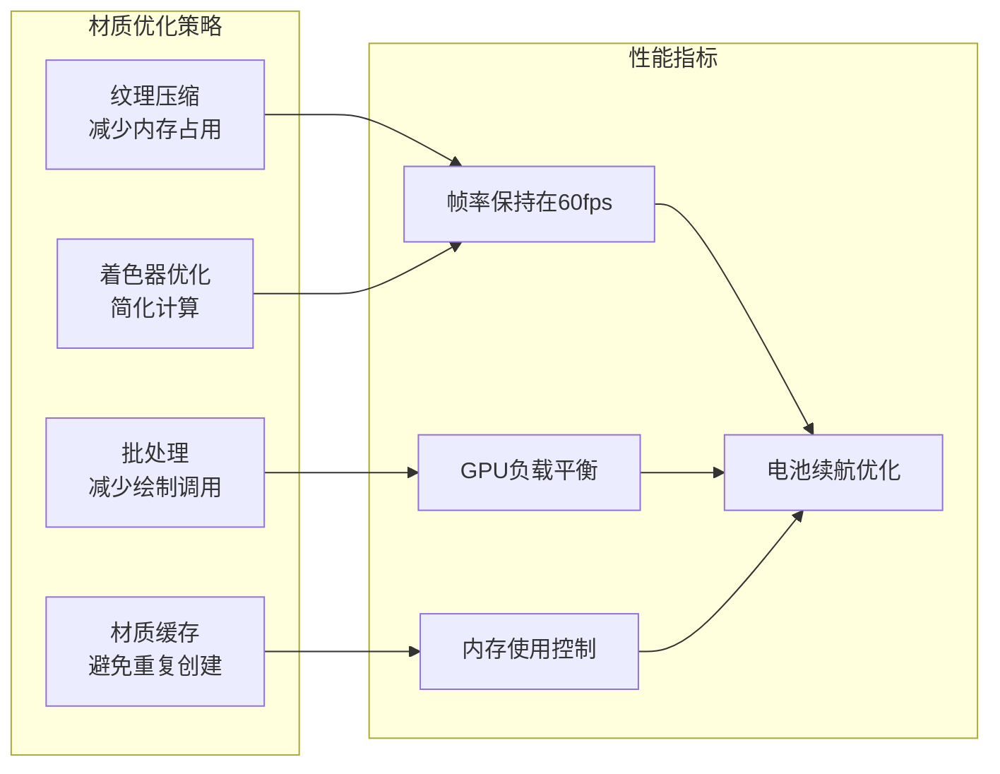

**图表来源**
- [DroneDefenseScene.vue](file://src/components/DroneDefenseScene.vue#L600-L650)

### 动画性能优化

```javascript
// 动画性能优化
const animate = () => {
  animationFrameId = requestAnimationFrame(animate);
  
  // 批量更新控制器
  if (controls) controls.update();
  
  // 条件渲染
  if (scene && camera && renderer) {
    renderer.render(scene, camera);
  }
};
```

**优化技巧**：
- **批量更新**：合并多个更新操作
- **条件渲染**：只在需要时进行渲染
- **帧率控制**：使用requestAnimationFrame

**章节来源**
- [DroneDefenseAnimation.vue](file://src/components/DroneDefenseAnimation.vue#L480-L500)
- [DroneDefenseScene.vue](file://src/components/DroneDefenseScene.vue#L439-L450)

## 资源管理与清理

### 内存泄漏防护

系统实现了完善的资源清理机制：

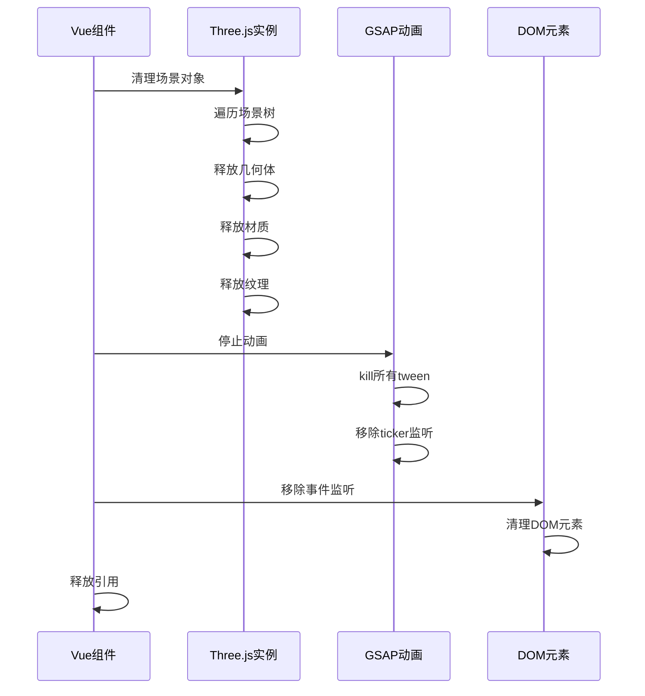

**图表来源**
- [DroneDefenseAnimation.vue](file://src/components/DroneDefenseAnimation.vue#L520-L585)
- [DroneDefenseScene.vue](file://src/components/DroneDefenseScene.vue#L605-L666)

### 资源释放代码

```javascript
// 完整的资源清理流程
onBeforeUnmount(() => {
  // 停止动画循环
  if (animationFrameId) {
    cancelAnimationFrame(animationFrameId);
  }
  
  // 移除事件监听
  window.removeEventListener('resize', onWindowResize);
  
  // 清理GSAP动画
  gsap.ticker.remove(trackDrone);
  if (radarAnimation) radarAnimation.kill();
  if (droneAnimation) droneAnimation.kill();
  
  // 清理Three.js资源
  if (renderer) {
    renderer.dispose();
  }
  
  if (controls) {
    controls.dispose();
  }
  
  // 清理场景
  if (scene) {
    scene.traverse((object) => {
      if (object.geometry) {
        object.geometry.dispose();
      }
      if (object.material) {
        if (Array.isArray(object.material)) {
          object.material.forEach(material => material.dispose());
        } else {
          object.material.dispose();
        }
      }
    });
  }
});
```

**清理策略**：
- **逐级释放**：从最外层到最内层逐步清理
- **引用清零**：确保不再有强引用
- **DOM清理**：移除所有事件监听器

**章节来源**
- [DroneDefenseAnimation.vue](file://src/components/DroneDefenseAnimation.vue#L520-L585)
- [DroneDefenseScene.vue](file://src/components/DroneDefenseScene.vue#L605-L666)

## 故障排除指南

### 常见问题与解决方案

#### 1. 渲染性能问题

**症状**：帧率下降，动画卡顿
**原因**：过多的几何体或复杂材质
**解决方案**：
```javascript
// 启用性能监控
console.log(`FPS: ${performance.now()}`);
console.log(`Memory: ${performance.memory.usedJSHeapSize}`);

// 动态调整细节级别
if (fps < 30) {
  // 降低渲染质量
  renderer.setPixelRatio(1);
  renderer.antialias = false;
}
```

#### 2. 内存泄漏

**症状**：页面长时间使用后变慢
**原因**：未正确清理资源
**解决方案**：
```javascript
// 检查内存使用
const checkMemoryLeaks = () => {
  const memoryInfo = performance.memory;
  if (memoryInfo.usedJSHeapSize > memoryInfo.totalJSHeapSize * 0.8) {
    console.warn('内存使用过高，可能有泄漏');
    // 强制垃圾回收（如果可用）
    if (window.gc) window.gc();
  }
};
```

#### 3. WebGL上下文丢失

**症状**：3D场景突然消失
**原因**：浏览器回收GPU资源
**解决方案**：
```javascript
// 监听WebGL上下文丢失
renderer.domElement.addEventListener('webglcontextlost', (event) => {
  event.preventDefault();
  console.log('WebGL上下文丢失，尝试恢复...');
  // 实现恢复逻辑
});

renderer.domElement.addEventListener('webglcontextrestored', () => {
  console.log('WebGL上下文已恢复');
  // 重新初始化渲染器
});
```

### 调试工具

#### 性能分析

```javascript
// 性能监控工具
const performanceMonitor = {
  fps: 0,
  frameCount: 0,
  lastTime: performance.now(),
  
  update() {
    const now = performance.now();
    this.frameCount++;
    
    if (now - this.lastTime >= 1000) {
      this.fps = this.frameCount;
      this.frameCount = 0;
      this.lastTime = now;
      console.log(`当前FPS: ${this.fps}`);
    }
  }
};
```

#### 内存监控

```javascript
// 内存使用监控
const memoryMonitor = {
  logMemoryUsage() {
    if (performance.memory) {
      const memInfo = performance.memory;
      console.log(`
        Used Heap: ${(memInfo.usedJSHeapSize / 1024 / 1024).toFixed(2)} MB
        Total Heap: ${(memInfo.totalJSHeapSize / 1024 / 1024).toFixed(2)} MB
        Limit: ${(memInfo.jsHeapSizeLimit / 1024 / 1024).toFixed(2)} MB
      `);
    }
  }
};
```

## 最佳实践建议

### 代码组织建议

1. **模块化设计**：将不同功能分离到独立模块
2. **类型安全**：使用TypeScript增强类型检查
3. **错误处理**：完善的异常捕获和恢复机制
4. **文档注释**：详细的代码注释和API文档

### 性能优化建议

1. **懒加载**：按需加载3D模型和纹理
2. **对象池**：重用频繁创建的对象
3. **批处理**：合并相似的渲染操作
4. **LOD系统**：根据距离动态调整细节

### 开发工作流

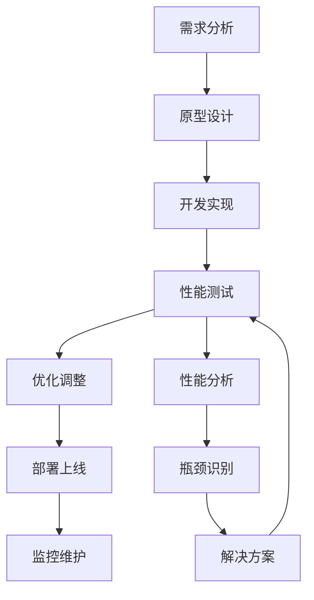

### 维护建议

1. **定期更新**：保持Three.js和GSAP版本最新
2. **兼容性测试**：在不同设备和浏览器上测试
3. **用户反馈**：收集用户使用体验反馈
4. **性能监控**：建立长期的性能监控体系

### 扩展功能建议

1. **交互功能**：添加鼠标点击和拖拽控制
2. **多语言支持**：国际化文本和语音
3. **VR支持**：WebXR兼容的虚拟现实体验
4. **数据可视化**：实时数据驱动的动画效果

通过以上全面的分析和指导，开发者可以更好地理解和维护这个3D反无人机动画系统，同时也可以在此基础上进行功能扩展和优化改进。