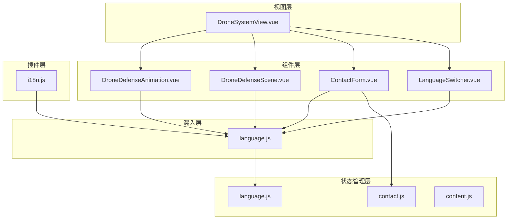
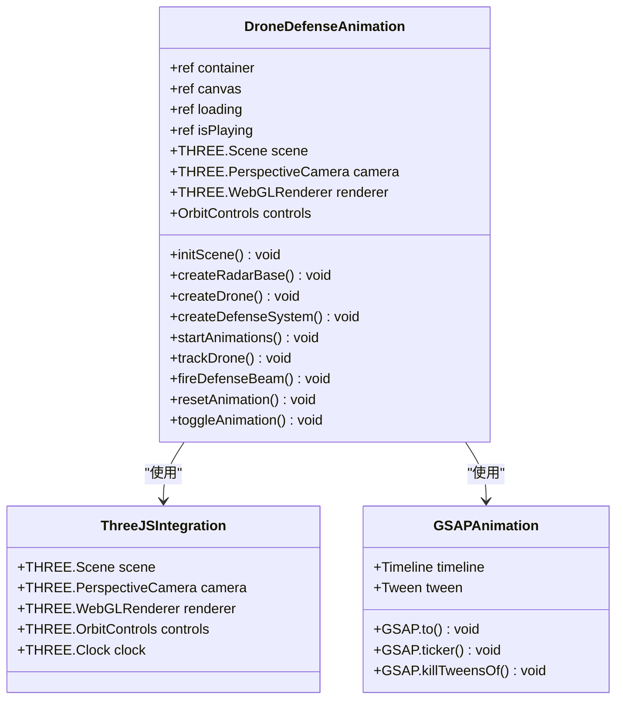
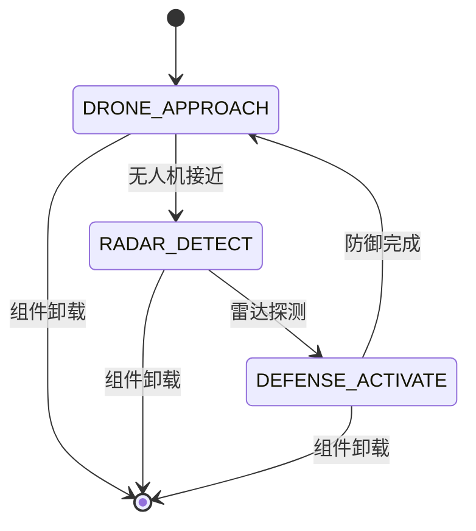
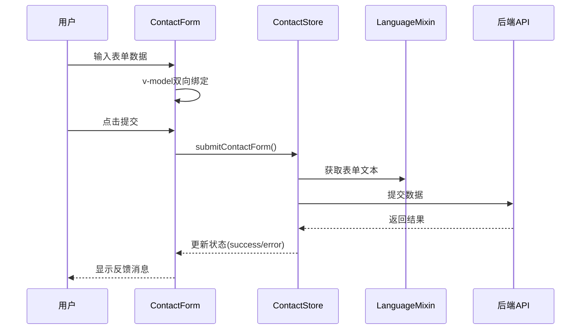
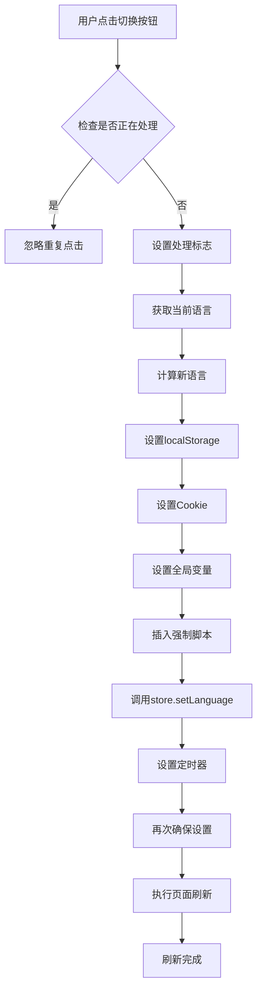
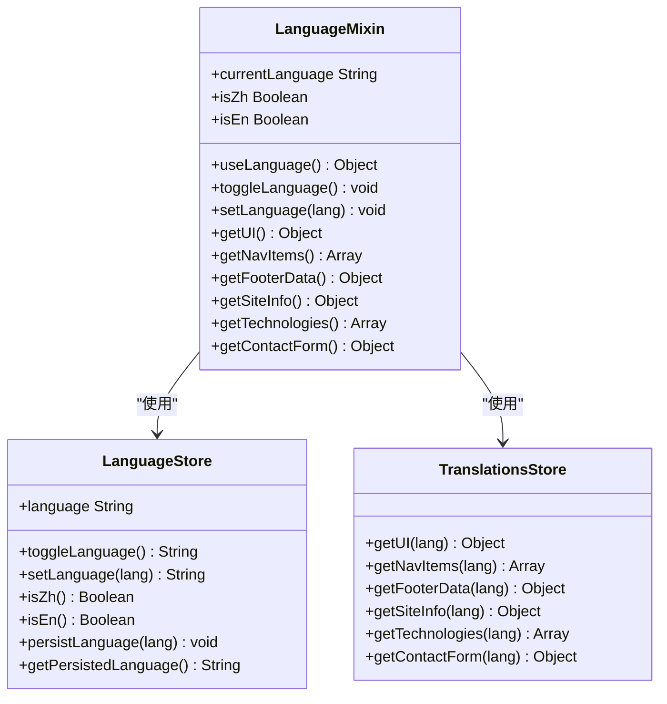
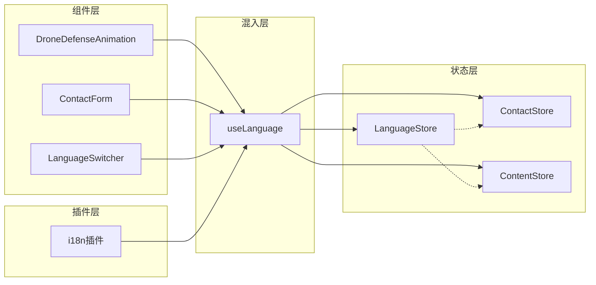

# UI组件体系

<cite>
**本文档中引用的文件**
- [DroneDefenseAnimation.vue](file://src/components/DroneDefenseAnimation.vue)
- [DroneDefenseScene.vue](file://src/components/DroneDefenseScene.vue)
- [ContactForm.vue](file://src/components/ContactForm.vue)
- [LanguageSwitcher.vue](file://src/components/LanguageSwitcher.vue)
- [language.js](file://src/mixins/language.js)
- [i18n.js](file://src/plugins/i18n.js)
- [language.js](file://src/store/modules/language.js)
- [DroneSystemView.vue](file://src/views/DroneSystemView.vue)
</cite>

## 目录
1. [简介](#简介)
2. [项目结构概览](#项目结构概览)
3. [核心3D动画组件](#核心3d动画组件)
4. [表单验证组件](#表单验证组件)
5. [多语言切换组件](#多语言切换组件)
6. [组件间协作架构](#组件间协作架构)
7. [接口规范与复用模式](#接口规范与复用模式)
8. [性能优化策略](#性能优化策略)
9. [故障排除指南](#故障排除指南)
10. [总结](#总结)

## 简介

本文档深入剖析了基于Vue 3的现代化前端UI组件体系，重点关注三个核心组件：DroneDefenseAnimation.vue、DroneDefenseScene.vue和ContactForm.vue，以及LanguageSwitcher.vue的多语言切换机制。该体系采用Composition API、Pinia状态管理、Three.js 3D渲染和GSAP动画库，构建了一个完整的、可复用的组件生态系统。

## 项目结构概览



**图表来源**
- [DroneDefenseAnimation.vue](file://src/components/DroneDefenseAnimation.vue#L1-L50)
- [DroneDefenseScene.vue](file://src/components/DroneDefenseScene.vue#L1-L50)
- [ContactForm.vue](file://src/components/ContactForm.vue#L1-L50)
- [LanguageSwitcher.vue](file://src/components/LanguageSwitcher.vue#L1-L50)

## 核心3D动画组件

### DroneDefenseAnimation.vue - 实时3D反无人机系统动画

DroneDefenseAnimation.vue是一个复杂的3D动画组件，集成了Three.js和GSAP两个强大的库，实现了逼真的反无人机系统演示动画。

#### 架构设计



**图表来源**
- [DroneDefenseAnimation.vue](file://src/components/DroneDefenseAnimation.vue#L25-L100)
- [DroneDefenseAnimation.vue](file://src/components/DroneDefenseAnimation.vue#L150-L250)

#### 关键功能实现

**1. Three.js场景初始化**

组件使用Composition API进行状态管理，通过ref创建响应式引用：

```javascript
// 组件状态
const container = ref(null);
const canvas = ref(null);
const loading = ref(true);
const isPlaying = ref(true);

// Three.js 变量
let scene, camera, renderer, controls;
let clock = new THREE.Clock();
let mixer;
```

**2. 雷达系统动画**

雷达系统包含多个组件：底座、柱体、雷达盘、天线和扫描光束：

```javascript
// 雷达扫描光束
const radarBeam = new THREE.Mesh(
  beamGeometry, 
  beamMaterial
);
radarBeam.position.y = -5;
radarBeam.rotation.x = Math.PI;
radar.add(radarBeam);

// 检测半径可视化
const detectionRadius = new THREE.Mesh(
  detectionGeometry, 
  detectionMaterial
);
detectionRadius.rotation.x = -Math.PI / 2;
detectionRadius.position.y = 0.05;
scene.add(detectionRadius);
```

**3. 无人机飞行轨迹**

使用GSAP Timeline实现复杂的无人机飞行路径动画：

```javascript
const droneTimeline = gsap.timeline({
  repeat: -1,
  yoyo: true
});

droneTimeline.to(drone.position, {
  x: 7,
  y: 4,
  z: -7,
  duration: 5,
  ease: "power1.inOut"
});
```

**4. 防御系统追踪逻辑**

防御系统能够智能追踪无人机并发射拦截光束：

```javascript
const trackDrone = () => {
  if (defenseSystem && drone) {
    const defensePosition = new THREE.Vector3();
    defenseSystem.getWorldPosition(defensePosition);
    
    const dronePosition = new THREE.Vector3();
    drone.getWorldPosition(dronePosition);
    
    defenseSystem.lookAt(dronePosition);
    
    const distance = defensePosition.distanceTo(dronePosition);
    
    if (distance < 8) {
      if (drone.position.y > 0.5) {
        fireDefenseBeam(defensePosition, dronePosition);
      }
    }
  }
};
```

**节来源**
- [DroneDefenseAnimation.vue](file://src/components/DroneDefenseAnimation.vue#L1-L663)

### DroneDefenseScene.vue - 城市环境3D演示

DroneDefenseScene.vue提供了更加复杂的城市环境3D演示，包含完整的动画循环和多阶段展示。

#### 动画阶段管理



**图表来源**
- [DroneDefenseScene.vue](file://src/components/DroneDefenseScene.vue#L30-L50)

#### 性能优化策略

组件针对不同设备进行了性能优化：

```javascript
// 设备检测
const isMobile = computed(() => {
  return window.innerWidth <= 768;
});

// 根据设备调整渲染参数
renderer.setPixelRatio(isMobile.value ? 
  Math.min(window.devicePixelRatio, 2) : 
  window.devicePixelRatio
);
renderer.antialias = !isMobile.value;
```

**节来源**
- [DroneDefenseScene.vue](file://src/components/DroneDefenseScene.vue#L1-L782)

## 表单验证组件

### ContactForm.vue - 多语言表单验证系统

ContactForm.vue展示了现代Vue 3表单处理的最佳实践，结合Pinia状态管理和语言混入。

#### 表单状态管理



**图表来源**
- [ContactForm.vue](file://src/components/ContactForm.vue#L40-L60)
- [ContactForm.vue](file://src/components/ContactForm.vue#L70-L90)

#### 表单字段设计

组件支持多种输入类型：

```vue
<!-- 名称字段 -->
<div class="form-group">
  <label for="name">{{ formText.name }}</label>
  <input 
    type="text" 
    id="name" 
    v-model="contactForm.name" 
    class="form-control" 
    required
  >
</div>

<!-- 下拉菜单字段 -->
<div class="form-group">
  <label for="subject">{{ formText.subject }}</label>
  <select 
    id="subject" 
    v-model="contactForm.subject" 
    class="form-control" 
    required
  >
    <option value="" disabled selected>
      -- {{ isZh ? '请选择' : 'Please select' }} --
    </option>
    <option 
      v-for="(option, index) in formText.subjectOptions" 
      :key="index" 
      :value="option"
    >
      {{ option }}
    </option>
  </select>
</div>
```

#### 错误处理机制

```javascript
const submitForm = async () => {
  await contactStore.submitContactForm()
}
```

组件通过Pinia store的状态来管理提交过程：

- `submitting`: 提交状态
- `success`: 成功状态
- `error`: 错误状态

**节来源**
- [ContactForm.vue](file://src/components/ContactForm.vue#L1-L155)

## 多语言切换组件

### LanguageSwitcher.vue - 全局语言切换机制

LanguageSwitcher.vue实现了复杂的多语言切换逻辑，包括本地存储持久化、Cookie备份和页面刷新机制。

#### 语言切换流程



**图表来源**
- [LanguageSwitcher.vue](file://src/components/LanguageSwitcher.vue#L40-L120)

#### 语言持久化策略

组件采用了多重持久化策略确保语言设置的可靠性：

```javascript
// 首先直接设置localStorage和cookie
localStorage.setItem('language', newLang);
document.cookie = `language=${newLang}; path=/; max-age=${60*60*24*30}`;

// 设置全局变量
window.__reloadLanguage = newLang;

// 插入强制确保语言设置的脚本
const forceScript = document.createElement('script');
forceScript.textContent = `
  window.__forceLanguage = "${newLang}";
  localStorage.setItem('language', "${newLang}");
  document.cookie = 'language=${newLang}; path=/; max-age=${60*60*24*30}';
`;
```

#### 语言混入系统



**图表来源**
- [language.js](file://src/mixins/language.js#L10-L50)
- [language.js](file://src/store/modules/language.js#L50-L100)

**节来源**
- [LanguageSwitcher.vue](file://src/components/LanguageSwitcher.vue#L1-L184)
- [language.js](file://src/mixins/language.js#L1-L127)
- [language.js](file://src/store/modules/language.js#L1-L215)

## 组件间协作架构

### 状态管理集成



**图表来源**
- [DroneDefenseAnimation.vue](file://src/components/DroneDefenseAnimation.vue#L1-L30)
- [ContactForm.vue](file://src/components/ContactForm.vue#L40-L60)
- [LanguageSwitcher.vue](file://src/components/LanguageSwitcher.vue#L20-L40)

### 事件通信机制

组件通过以下方式进行通信：

1. **Props传递**: 父组件向子组件传递配置
2. **Events发射**: 子组件向父组件发送状态变更
3. **Pinia共享状态**: 多个组件共享同一状态
4. **全局事件**: 语言切换等全局操作

**节来源**
- [DroneSystemView.vue](file://src/views/DroneSystemView.vue#L1-L100)

## 接口规范与复用模式

### 组件接口设计

#### DroneDefenseAnimation.vue Props

```javascript
// 组件属性定义
const props = defineProps({
  width: {
    type: Number,
    default: 800
  },
  height: {
    type: Number,
    default: 400
  },
  autoPlay: {
    type: Boolean,
    default: true
  }
});
```

#### ContactForm.vue Props

```javascript
// 组件属性定义
const props = defineProps({
  initialData: {
    type: Object,
    default: () => ({})
  },
  showSuccess: {
    type: Boolean,
    default: true
  }
});
```

#### 复用模式

组件采用以下复用模式：

1. **插槽模式**: 支持自定义内容
2. **配置模式**: 通过props灵活配置
3. **事件模式**: 支持外部事件监听
4. **状态模式**: 通过Pinia共享状态

### 在View组件中的复用

DroneSystemView.vue展示了组件的典型复用模式：

```vue
<template>
  <div class="drone-system-page">
    <!-- 3D动画组件 -->
    <DroneDefenseAnimation 
      :width="800" 
      :height="400" 
      auto-play
    />
    
    <!-- 表单组件 -->
    <ContactForm 
      :initial-data="contactData"
      @form-submitted="handleFormSubmit"
    />
    
    <!-- 语言切换组件 -->
    <LanguageSwitcher 
      :floating="true"
      @language-changed="handleLanguageChange"
    />
  </div>
</template>
```

**节来源**
- [DroneSystemView.vue](file://src/views/DroneSystemView.vue#L1-L50)

## 性能优化策略

### 3D组件性能优化

1. **设备适配**: 根据设备性能调整渲染质量
2. **资源预加载**: 提前加载必要的3D模型
3. **内存管理**: 及时释放Three.js资源
4. **动画优化**: 使用GSAP的高效动画引擎

### 表单组件优化

1. **懒加载**: 表单内容按需加载
2. **防抖处理**: 避免频繁的状态更新
3. **缓存机制**: 缓存翻译文本和配置

### 语言切换优化

1. **异步处理**: 语言切换不阻塞主线程
2. **渐进式加载**: 分步骤执行切换逻辑
3. **错误恢复**: 提供降级方案

## 故障排除指南

### 常见问题及解决方案

#### 3D动画组件问题

**问题**: Three.js资源加载失败
**解决方案**: 
- 检查网络连接
- 验证GLTF模型路径
- 确认浏览器WebGL支持

**问题**: 动画卡顿
**解决方案**:
- 降低渲染质量
- 减少复杂度
- 使用requestAnimationFrame优化

#### 表单验证问题

**问题**: 表单提交失败
**解决方案**:
- 检查网络请求
- 验证服务器端点
- 查看控制台错误信息

**问题**: 翻译文本不显示
**解决方案**:
- 检查语言状态
- 验证翻译数据
- 确认store状态

#### 语言切换问题

**问题**: 切换后页面不刷新
**解决方案**:
- 检查localStorage设置
- 验证Cookie配置
- 确认全局事件触发

**节来源**
- [DroneDefenseAnimation.vue](file://src/components/DroneDefenseAnimation.vue#L600-L663)
- [LanguageSwitcher.vue](file://src/components/LanguageSwitcher.vue#L150-L184)

## 总结

本文档详细分析了基于Vue 3的现代化UI组件体系，重点展示了三个核心组件的设计理念和实现细节：

1. **DroneDefenseAnimation.vue** 展示了复杂3D动画的实现，通过Three.js和GSAP的完美结合，实现了逼真的反无人机系统演示。

2. **DroneDefenseScene.vue** 提供了更加完整的城市环境3D演示，包含了多阶段动画管理和设备性能优化。

3. **ContactForm.vue** 体现了现代表单处理的最佳实践，结合Pinia状态管理和语言混入，提供了完整的表单验证和提交流程。

4. **LanguageSwitcher.vue** 实现了复杂的多语言切换机制，包括本地存储持久化、Cookie备份和页面刷新机制。

该组件体系采用了模块化的架构设计，通过Composition API、Pinia状态管理、TypeScript类型安全和ESLint代码规范，构建了一个高质量、可维护的前端组件库。组件间的协作通过props、events、pinia状态管理和全局事件实现，形成了一个完整的生态系统。

这种设计不仅提高了代码的可复用性和可维护性，也为未来的功能扩展奠定了坚实的基础。通过合理的性能优化策略和错误处理机制，确保了组件在各种环境下的稳定运行。