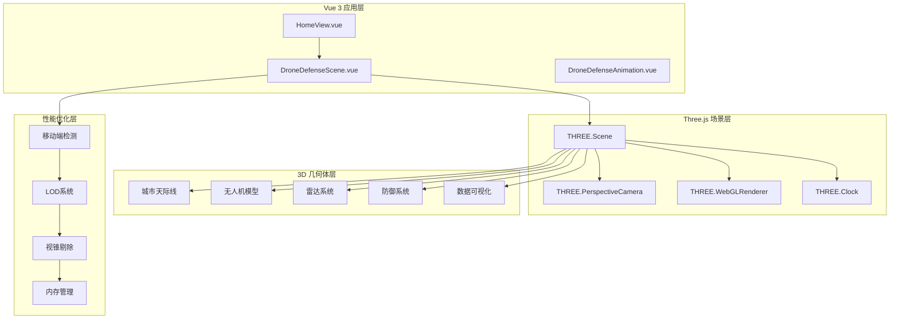
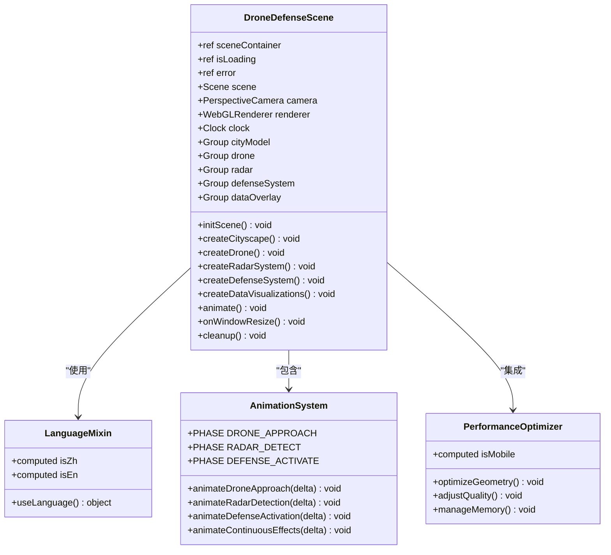
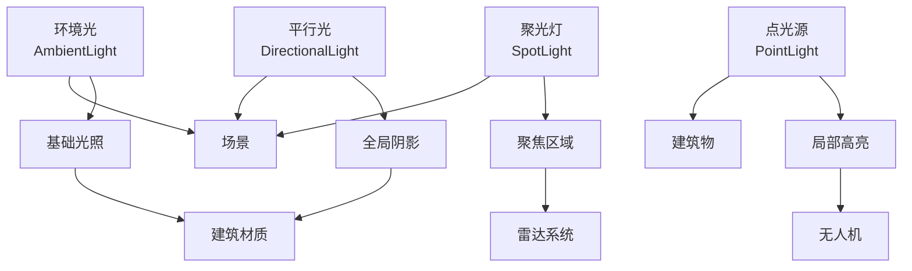
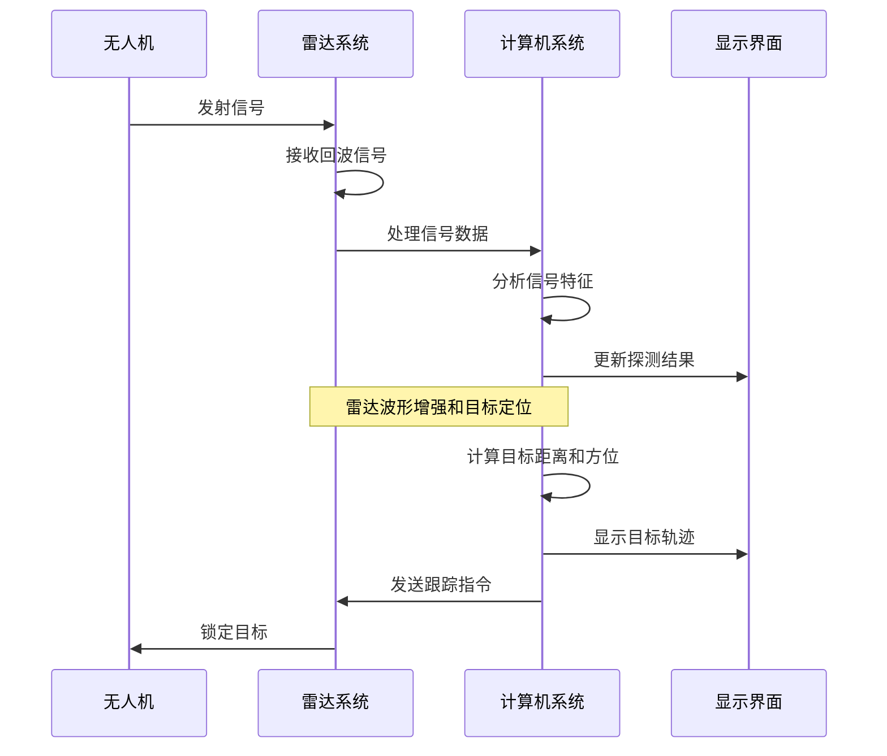
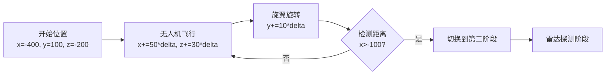
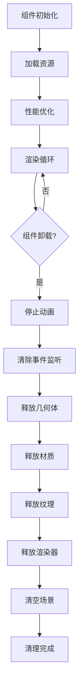
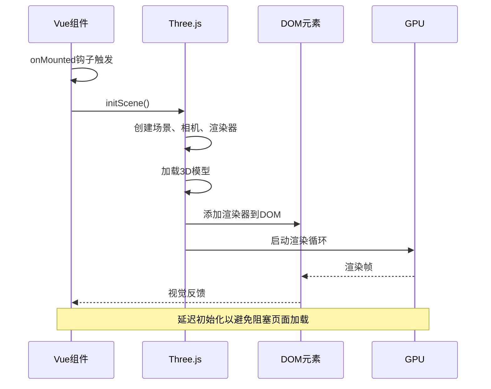

# 反无人机系统场景组件

<cite>
**本文档引用的文件**
- [DroneDefenseScene.vue](file://src/components/DroneDefenseScene.vue)
- [DroneDefenseAnimation.vue](file://src/components/DroneDefenseAnimation.vue)
- [HomeView.vue](file://src/views/HomeView.vue)
- [language.js](file://src/mixins/language.js)
- [package.json](file://package.json)
</cite>

## 目录
1. [项目概述](#项目概述)
2. [组件架构设计](#组件架构设计)
3. [核心功能模块](#核心功能模块)
4. [动画系统详解](#动画系统详解)
5. [性能优化策略](#性能优化策略)
6. [移动端适配](#移动端适配)
7. [数据可视化效果](#数据可视化效果)
8. [组件生命周期管理](#组件生命周期管理)
9. [错误处理机制](#错误处理机制)
10. [最佳实践建议](#最佳实践建议)

## 项目概述

DroneDefenseScene.vue是基于Vue 3和Three.js构建的高性能3D场景组件，作为网站首页的核心视觉元素，展现了智能反无人机系统的完整工作流程。该组件采用现代化的WebGL技术栈，实现了复杂的3D动画效果和交互体验。

### 技术栈分析

项目采用以下核心技术：
- **Vue 3 Composition API**：提供响应式状态管理和组件化开发
- **Three.js 0.177.0**：强大的3D图形库，支持WebGL渲染
- **GSAP**：高性能动画库，用于复杂的动画序列控制
- **Pinia**：状态管理库，用于全局状态共享
- **Vite**：现代化构建工具，提供快速开发体验

**章节来源**
- [package.json](file://package.json#L1-L34)
- [DroneDefenseScene.vue](file://src/components/DroneDefenseScene.vue#L1-L50)

## 组件架构设计

### 整体架构图



**图表来源**
- [DroneDefenseScene.vue](file://src/components/DroneDefenseScene.vue#L30-L80)
- [HomeView.vue](file://src/views/HomeView.vue#L1-L50)

### 组件层次结构



**图表来源**
- [DroneDefenseScene.vue](file://src/components/DroneDefenseScene.vue#L15-L50)
- [language.js](file://src/mixins/language.js#L10-L30)

**章节来源**
- [DroneDefenseScene.vue](file://src/components/DroneDefenseScene.vue#L1-L100)
- [language.js](file://src/mixins/language.js#L1-L50)

## 核心功能模块

### 城市天际线生成算法

城市天际线是场景的基础框架，采用程序化生成技术创建逼真的城市环境。

#### 几何体生成策略

```javascript
// 建筑物几何体库
const buildingGeometries = [
  new THREE.BoxGeometry(20, 100, 20),
  new THREE.BoxGeometry(30, 60, 30),
  new THREE.BoxGeometry(15, 120, 15),
  new THREE.BoxGeometry(25, 80, 25),
  new THREE.BoxGeometry(40, 40, 40)
];

// 动态生成建筑物
for (let i = 0; i < buildingCount; i++) {
  const geoIndex = Math.floor(Math.random() * buildingGeometries.length);
  const building = new THREE.Mesh(buildingGeometries[geoIndex], buildingMaterial);
  
  // 随机位置分布
  building.position.x = (Math.random() - 0.5) * 500;
  building.position.z = (Math.random() - 0.5) * 500;
  building.position.y = buildingGeometries[geoIndex].parameters.height / 2 - 50;
  
  cityModel.add(building);
}
```

#### 光照系统设计



**图表来源**
- [DroneDefenseScene.vue](file://src/components/DroneDefenseScene.vue#L80-L120)

### 雷达系统探测逻辑

雷达系统是整个反无人机系统的核心感知设备，负责目标检测和跟踪。

#### 雷达组件结构

```javascript
// 雷达基座
const baseGeometry = new THREE.CylinderGeometry(20, 25, 10, isMobile ? 16 : 32);
const baseMaterial = new THREE.MeshPhongMaterial({
  color: 0x78716c,
  emissive: 0x292524,
  specular: 0xffffff
});

// 雷达碟形天线
const dishGeometry = new THREE.SphereGeometry(15, isMobile ? 16 : 32, isMobile ? 8 : 16, 0, Math.PI);
const dishMaterial = new THREE.MeshPhongMaterial({
  color: 0xf8fafc,
  emissive: 0x94a3b8,
  side: THREE.DoubleSide
});

// 雷达波效果
const radarWaveGeometry = new THREE.RingGeometry(5, 60, isMobile ? 16 : 32);
const radarWaveMaterial = new THREE.MeshBasicMaterial({
  color: 0x38bdf8,
  side: THREE.DoubleSide,
  transparent: true,
  opacity: 0
});
```

#### 探测算法流程



**图表来源**
- [DroneDefenseScene.vue](file://src/components/DroneDefenseScene.vue#L150-L200)

### 防御系统响应机制

防御系统在检测到威胁后启动完整的拦截流程。

#### 激活阶段动画

```javascript
// 防御系统瞄准无人机
const targetDir = new THREE.Vector3().subVectors(drone.position, defenseSystem.position).normalize();
defenseSystem.children[2].quaternion.setFromUnitVectors(new THREE.Vector3(0, 1, 0), targetDir);

// 防御系统灯光闪烁
defenseSystem.children[3].material.emissiveIntensity = 0.5 + Math.sin(phaseTime * 10) * 0.5;

// 创建激光效果
if (phaseTime > 1 && phaseTime < 3) {
  const laserGeometry = new THREE.CylinderGeometry(0.5, 0.5, 100, isMobile ? 4 : 8);
  const laserMaterial = new THREE.MeshBasicMaterial({
    color: 0x38bdf8,
    transparent: true,
    opacity: 0.8
  });
  const laser = new THREE.Mesh(laserGeometry, laserMaterial);
  
  // 计算激光位置和方向
  const barrelEnd = new THREE.Vector3(0, 0, -7.5).applyQuaternion(defenseSystem.children[2].quaternion).add(defenseSystem.children[2].position);
  laser.position.copy(barrelEnd).add(defenseSystem.position);
  laser.quaternion.copy(defenseSystem.children[2].quaternion);
  
  scene.add(laser);
  
  // 短暂显示后移除激光
  setTimeout(() => {
    scene.remove(laser);
  }, 100);
}
```

**章节来源**
- [DroneDefenseScene.vue](file://src/components/DroneDefenseScene.vue#L150-L300)

## 动画系统详解

### 三阶段动画流程

组件实现了三个核心动画阶段，每个阶段都有独特的视觉效果和交互逻辑。

#### 第一阶段：无人机接近



**图表来源**
- [DroneDefenseScene.vue](file://src/components/DroneDefenseScene.vue#L400-L450)

#### 第二阶段：雷达检测

```javascript
// 雷达碟形天线旋转
radar.children[1].rotation.z += 1 * delta;

// 雷达波效果
if (radarWave.material.opacity < 0.8) {
  radarWave.material.opacity += delta;
}
radarWave.scale.x += 2 * delta;
radarWave.scale.y += 2 * delta;
radarWave.scale.z += 2 * delta;

// 雷达锁定无人机
const radarToTarget = new THREE.Vector3().subVectors(drone.position, radar.position).normalize();
radar.children[2].quaternion.setFromUnitVectors(new THREE.Vector3(0, 1, 0), radarToTarget);
```

#### 第三阶段：防御激活

```javascript
// 防御系统瞄准无人机
const targetDir = new THREE.Vector3().subVectors(drone.position, defenseSystem.position).normalize();
defenseSystem.children[2].quaternion.setFromUnitVectors(new THREE.Vector3(0, 1, 0), targetDir);

// 防御系统灯光闪烁
defenseSystem.children[3].material.emissiveIntensity = 0.5 + Math.sin(phaseTime * 10) * 0.5;

// 无人机被击中效果
if (phaseTime > 2) {
  drone.rotation.x += delta * 2;
  drone.position.y -= 20 * delta;
}
```

### 持续动画效果

除了主要的三阶段动画，场景还包含多种持续的视觉效果：

```javascript
// 数据波纹动画
dataOverlay.children.forEach((child, index) => {
  if (index > 0) { // 波纹
    child.rotation.z += 0.2 * delta;
    child.scale.x = 1 + Math.sin(phaseTime + index) * 0.1;
    child.scale.y = 1 + Math.sin(phaseTime + index) * 0.1;
    child.scale.z = 1 + Math.sin(phaseTime + index) * 0.1;
  }
});

// 相机轻微移动，增加动态感
camera.position.x = Math.sin(phaseTime * 0.2) * 20;
camera.position.y = 100 + Math.sin(phaseTime * 0.1) * 10;
camera.lookAt(0, 0, 0);
```

**章节来源**
- [DroneDefenseScene.vue](file://src/components/DroneDefenseScene.vue#L400-L600)

## 性能优化策略

### 动态几何体复杂度调整

组件根据设备性能动态调整3D模型的复杂度：

```javascript
// 移动端减少建筑物数量以提高性能
const buildingCount = isMobile.value ? 20 : 50;

// 移动端减少窗户数量以提高性能
if (!isMobile.value) {
  const windowRows = Math.floor(buildingGeometries[geoIndex].parameters.height / windowSpacing);
  const windowCols = Math.floor(buildingGeometries[geoIndex].parameters.width / windowSpacing);
}

// 移动端减少网格线密度以提高性能
const gridHelper = new THREE.GridHelper(1000, isMobile.value ? 20 : 50, 0x38bdf8, 0x103a65);
```

### 渲染器优化设置

```javascript
// 设置渲染器优化选项
renderer.setPixelRatio(isMobile.value ? 1 : Math.min(window.devicePixelRatio, 2));
renderer.powerPreference = "high-performance";
renderer.antialias = !isMobile.value;

// 开启场景优化
scene.matrixAutoUpdate = false;
scene.autoUpdate = false;
```

### 内存管理策略



**图表来源**
- [DroneDefenseScene.vue](file://src/components/DroneDefenseScene.vue#L700-L782)

**章节来源**
- [DroneDefenseScene.vue](file://src/components/DroneDefenseScene.vue#L200-L300)
- [DroneDefenseScene.vue](file://src/components/DroneDefenseScene.vue#L700-L782)

## 移动端适配

### 自适应布局策略

组件通过计算属性检测设备类型并调整渲染参数：

```javascript
// 设备检测
const isMobile = computed(() => {
  return window.innerWidth <= 768;
});

// 动态调整像素比
renderer.setPixelRatio(isMobile.value ? Math.min(window.devicePixelRatio, 2) : window.devicePixelRatio);

// 动态调整几何体复杂度
const buildingCount = isMobile.value ? 20 : 50;
const gridHelper = new THREE.GridHelper(1000, isMobile.value ? 20 : 50, 0x38bdf8, 0x103a65);
```

### 移动端特殊处理

```javascript
// 移动端禁用阴影以提高性能
spotLight.castShadow = isMobile.value ? false : true;

// 移动端简化抗锯齿
renderer.antialias = !isMobile.value;

// 移动端降低纹理分辨率
const screenTexture = createRadarScreenTexture();
screenTexture.repeat.set(isMobile.value ? 0.5 : 1, isMobile.value ? 0.5 : 1);
```

**章节来源**
- [DroneDefenseScene.vue](file://src/components/DroneDefenseScene.vue#L60-L80)
- [DroneDefenseScene.vue](file://src/components/DroneDefenseScene.vue#L200-L250)

## 数据可视化效果

### 雷达屏幕纹理生成

组件使用Canvas API动态生成雷达屏幕纹理：

```javascript
const createRadarScreenTexture = () => {
  const canvas = document.createElement('canvas');
  canvas.width = isMobile.value ? 128 : 256;
  canvas.height = isMobile.value ? 128 : 256;
  const context = canvas.getContext('2d');
  
  // 背景
  context.fillStyle = '#0f172a';
  context.fillRect(0, 0, canvas.width, canvas.height);
  
  // 网格线
  context.strokeStyle = '#38bdf8';
  context.lineWidth = 1;
  
  // 绘制网格
  context.beginPath();
  for (let i = 0; i < canvas.width; i += isMobile.value ? 64 : 32) {
    context.moveTo(i, 0);
    context.lineTo(i, canvas.height);
    context.moveTo(0, i);
    context.lineTo(canvas.width, i);
  }
  context.stroke();
  
  // 绘制雷达扫描线
  context.strokeStyle = '#4ade80';
  context.lineWidth = 2;
  context.beginPath();
  context.arc(canvas.width / 2, canvas.height / 2, canvas.width * 0.4, 0, Math.PI / 2);
  context.stroke();
  
  // 绘制雷达中心
  context.fillStyle = '#38bdf8';
  context.beginPath();
  context.arc(canvas.width / 2, canvas.height / 2, 5, 0, Math.PI * 2);
  context.fill();
  
  const texture = new THREE.CanvasTexture(canvas);
  return texture;
};
```

### 信号波纹效果

```javascript
// 创建信号波纹
for (let i = 0; i < 3; i++) {
  const waveGeometry = new THREE.RingGeometry(5 + i * 10, 8 + i * 10, isMobile.value ? 16 : 32);
  const waveMaterial = new THREE.MeshBasicMaterial({
    color: 0x38bdf8,
    side: THREE.DoubleSide,
    transparent: true,
    opacity: 0.3 - i * 0.1
  });
  const wave = new THREE.Mesh(waveGeometry, waveMaterial);
  wave.position.set(0, 100 + i * 10, 0);
  wave.rotation.x = Math.PI / 2;
  dataOverlay.add(wave);
}
```

**章节来源**
- [DroneDefenseScene.vue](file://src/components/DroneDefenseScene.vue#L350-L400)
- [DroneDefenseScene.vue](file://src/components/DroneDefenseScene.vue#L300-L350)

## 组件生命周期管理

### 初始化流程



**图表来源**
- [DroneDefenseScene.vue](file://src/components/DroneDefenseScene.vue#L600-L650)

### 资源清理机制

```javascript
// 组件卸载前清理资源
onBeforeUnmount(() => {
  // 停止动画循环
  if (window.animationFrameId) {
    cancelAnimationFrame(window.animationFrameId);
  }

  window.removeEventListener('resize', onWindowResize);
  if (sceneContainer.value && renderer) {
    sceneContainer.value.removeChild(renderer.domElement);
  }
  
  // 释放资源
  scene.traverse((object) => {
    if (object.geometry) {
      object.geometry.dispose();
    }
    
    if (object.material) {
      if (Array.isArray(object.material)) {
        object.material.forEach(material => {
          if (material.map) material.map.dispose();
          material.dispose();
        });
      } else {
        if (object.material.map) object.material.map.dispose();
        object.material.dispose();
      }
    }
  });
  
  // 清除场景中的所有对象
  while(scene.children.length > 0){ 
    scene.remove(scene.children[0]); 
  }
  
  // 释放渲染器
  if (renderer) {
    renderer.dispose();
    renderer.forceContextLoss();
    renderer = null;
  }
});
```

**章节来源**
- [DroneDefenseScene.vue](file://src/components/DroneDefenseScene.vue#L600-L700)
- [DroneDefenseScene.vue](file://src/components/DroneDefenseScene.vue#L700-L782)

## 错误处理机制

### 加载状态管理

组件提供了完整的加载状态管理：

```javascript
// 加载状态
const isLoading = ref(true);
const error = ref(false);

// 延迟初始化以避免阻塞页面加载
setTimeout(() => {
  try {
    initScene();
    isLoading.value = false;
  } catch (e) {
    console.error('Scene initialization failed:', e);
    error.value = true;
    isLoading.value = false;
  }
}, 100);
```

### 错误界面设计

```html
<div v-if="error" class="error-overlay">
  <p>{{ isZh ? '加载失败，请刷新页面重试' : 'Loading failed, please refresh the page' }}</p>
</div>
```

### 异常恢复机制

```javascript
// 错误处理和恢复
const handleError = (error) => {
  console.error('Scene error:', error);
  error.value = true;
  
  // 提供用户友好的错误提示
  setTimeout(() => {
    // 可以在这里实现自动重试逻辑
  }, 3000);
};
```

**章节来源**
- [DroneDefenseScene.vue](file://src/components/DroneDefenseScene.vue#L10-L20)
- [DroneDefenseScene.vue](file://src/components/DroneDefenseScene.vue#L600-L620)

## 最佳实践建议

### 代码组织建议

1. **模块化设计**：将不同功能分离到独立的方法中
2. **性能监控**：定期检查内存使用情况和渲染性能
3. **错误边界**：为关键操作添加适当的错误处理
4. **资源管理**：确保所有3D资源都能正确释放

### 性能优化建议

1. **LOD系统**：为远处物体使用简化版本
2. **视锥剔除**：只渲染可见物体
3. **纹理压缩**：使用适合Web的纹理格式
4. **批处理渲染**：合并相似材质的物体

### 用户体验建议

1. **渐进式加载**：先显示基本效果，再加载高质量内容
2. **触摸友好**：为移动设备提供合适的交互方式
3. **无障碍支持**：考虑色盲用户和屏幕阅读器
4. **响应式设计**：确保在各种设备上都能正常显示

### 维护性建议

1. **文档完善**：为复杂算法添加详细注释
2. **测试覆盖**：编写单元测试验证核心功能
3. **版本兼容**：保持与最新Three.js版本的兼容性
4. **性能基准**：建立性能测试基准线

这个组件展示了现代Web 3D应用的最佳实践，通过精心设计的架构和优化策略，为用户提供了沉浸式的视觉体验，同时保持了良好的性能和可维护性。