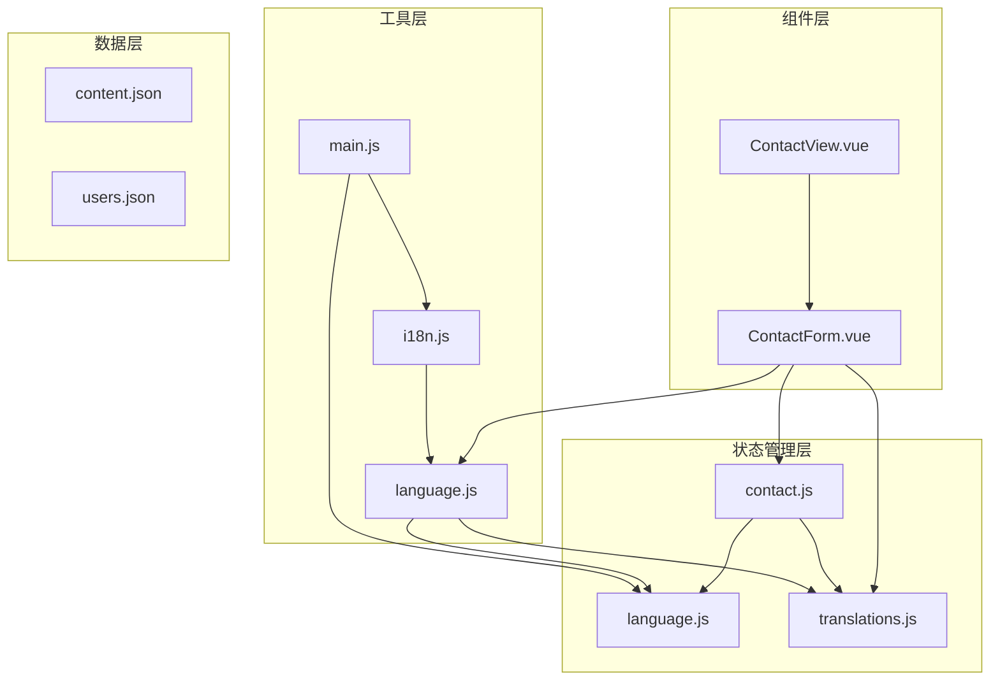
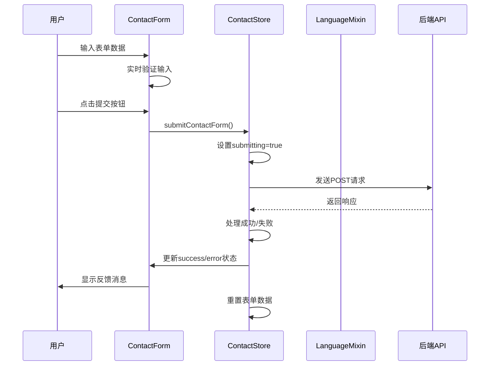
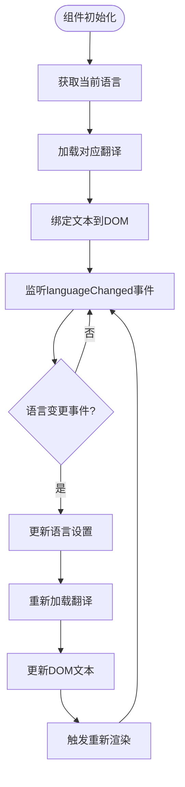
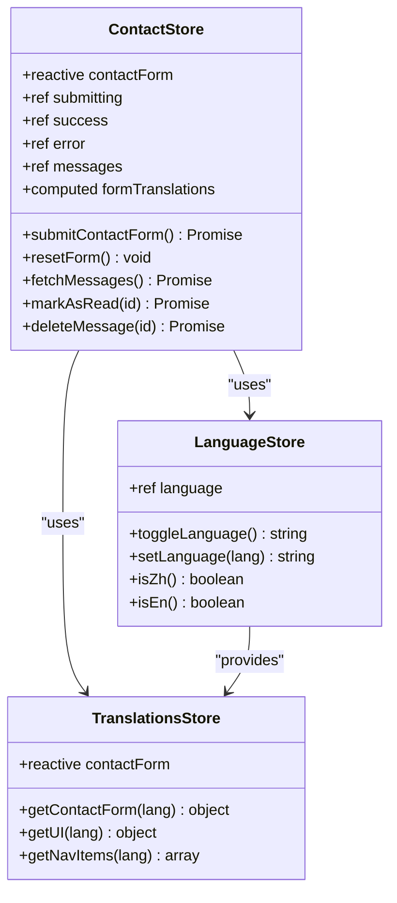
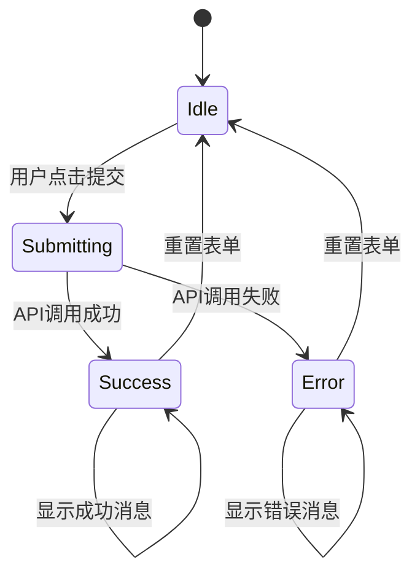
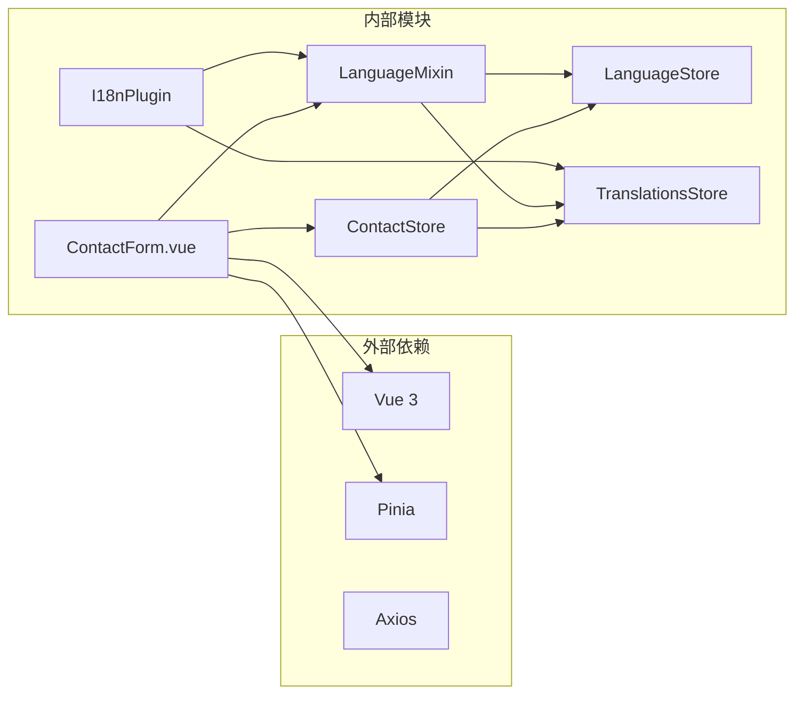
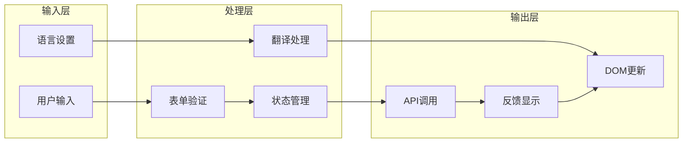

# 联系表单组件详细文档

<cite>
**本文档中引用的文件**
- [ContactForm.vue](file://src/components/ContactForm.vue)
- [contact.js](file://src/store/modules/contact.js)
- [language.js](file://src/mixins/language.js)
- [translations.js](file://src/store/modules/translations.js)
- [language.js](file://src/store/modules/language.js)
- [i18n.js](file://src/plugins/i18n.js)
- [main.js](file://src/main.js)
- [ContactView.vue](file://src/views/ContactView.vue)
</cite>

## 目录
1. [简介](#简介)
2. [项目结构概览](#项目结构概览)
3. [核心组件分析](#核心组件分析)
4. [架构概览](#架构概览)
5. [详细组件分析](#详细组件分析)
6. [依赖关系分析](#依赖关系分析)
7. [性能考虑](#性能考虑)
8. [故障排除指南](#故障排除指南)
9. [结论](#结论)

## 简介

ContactForm.vue是一个高度集成的响应式联系表单组件，专为多语言Web应用程序设计。该组件集成了Pinia状态管理、多语言支持、表单验证和现代化的用户界面设计。它提供了完整的表单提交流程，包括实时验证、状态管理、成功/失败反馈以及无障碍访问支持。

该组件采用了现代化的Vue 3 Composition API，结合TypeScript类型安全和响应式编程范式，为用户提供流畅的交互体验。通过精心设计的组件架构，实现了代码的高内聚低耦合，便于维护和扩展。

## 项目结构概览



**图表来源**
- [ContactForm.vue](file://src/components/ContactForm.vue#L1-L155)
- [contact.js](file://src/store/modules/contact.js#L1-L135)
- [language.js](file://src/mixins/language.js#L1-L127)

**章节来源**
- [ContactForm.vue](file://src/components/ContactForm.vue#L1-L155)
- [ContactView.vue](file://src/views/ContactView.vue#L1-L264)

## 核心组件分析

### ContactForm.vue 组件架构

ContactForm.vue采用了模块化的组件设计，将模板、脚本和样式分离，实现了清晰的关注点分离：

```javascript
// 主要数据结构
const contactForm = reactive({
  name: '',
  email: '',
  phone: '',
  subject: '',
  company: '',
  message: ''
})

// 表单状态管理
const submitting = ref(false)
const success = ref(false)
const error = ref(null)
```

组件支持五种不同的输入字段：
- **姓名字段**：必填文本输入
- **邮箱字段**：必填电子邮件格式验证
- **电话字段**：必填电话号码格式验证
- **主题选择**：下拉菜单选项
- **留言内容**：多行文本区域

**章节来源**
- [ContactForm.vue](file://src/components/ContactForm.vue#L1-L155)
- [contact.js](file://src/store/modules/contact.js#L15-L25)

## 架构概览



**图表来源**
- [ContactForm.vue](file://src/components/ContactForm.vue#L1-L155)
- [contact.js](file://src/store/modules/contact.js#L30-L50)

## 详细组件分析

### 表单验证机制

ContactForm.vue实现了多层次的验证机制：

#### 1. HTML5原生验证
```html
<input type="text" id="name" v-model="contactForm.name" class="form-control" required>
<input type="email" id="email" v-model="contactForm.email" class="form-control" required>
<input type="tel" id="phone" v-model="contactForm.phone" class="form-control" required>
<textarea id="message" v-model="contactForm.message" class="form-control" rows="5" required></textarea>
```

#### 2. Pinia状态管理验证
```javascript
const submitContactForm = async () => {
  submitting.value = true
  success.value = false
  error.value = null
  
  try {
    await axios.post('/api/contact', {
      ...contactForm,
      language: languageStore.language
    })
    
    success.value = true
    resetForm()
    return { success: true }
  } catch (e) {
    const errorMessage = languageStore.isZh() 
      ? '提交失败，请稍后再试' 
      : 'Submission failed, please try again later'
    
    error.value = e.message || errorMessage
    return { success: false, error: error.value }
  } finally {
    submitting.value = false
  }
}
```

### 多语言文本绑定机制

#### 语言切换流程



**图表来源**
- [language.js](file://src/mixins/language.js#L15-L45)
- [i18n.js](file://src/plugins/i18n.js#L40-L70)

#### 翻译数据结构

```javascript
// 联系表单翻译数据
const contactForm = reactive({
  zh: {
    name: '您的姓名',
    email: '电子邮箱',
    phone: '联系电话',
    company: '公司名称',
    subject: '咨询主题',
    message: '留言内容',
    submit: '提交信息',
    success: '信息已成功提交，我们将尽快与您联系！',
    error: '提交失败，请稍后再试或直接联系我们',
    required: '此项为必填',
    emailInvalid: '请输入有效的电子邮箱',
    phoneInvalid: '请输入有效的电话号码',
    subjectOptions: ['产品咨询', '技术支持', '合作洽谈', '其他问题']
  },
  en: {
    name: 'Your Name',
    email: 'Email',
    phone: 'Phone',
    company: 'Company',
    subject: 'Subject',
    message: 'Message',
    submit: 'Submit',
    success: 'Information submitted successfully, we will contact you soon!',
    error: 'Submission failed, please try again later or contact us directly',
    required: 'This field is required',
    emailInvalid: 'Please enter a valid email',
    phoneInvalid: 'Please enter a valid phone number',
    subjectOptions: ['Product Inquiry', 'Technical Support', 'Business Cooperation', 'Other Questions']
  }
})
```

### Pinia状态管理集成

#### Store结构设计



**图表来源**
- [contact.js](file://src/store/modules/contact.js#L10-L135)
- [language.js](file://src/store/modules/language.js#L70-L120)
- [translations.js](file://src/store/modules/translations.js#L580-L630)

#### 状态同步机制

```javascript
// 从Pinia store获取响应式引用
const contactStore = useContactStore()
const { contactForm, submitting, success, error } = storeToRefs(contactStore)

// 计算属性获取翻译文本
const formText = computed(() => getContactForm())
```

### 提交流程控制

#### 提交状态管理



**图表来源**
- [contact.js](file://src/store/modules/contact.js#L30-L50)

#### 成功/失败反馈机制

```javascript
// 成功反馈
<div v-if="success" class="alert alert-success">
  {{ formText.success }}
</div>

// 错误反馈
<div v-if="error" class="alert alert-error">
  {{ formText.error }}
</div>

// 提交按钮禁用状态
<button type="submit" class="btn" :disabled="submitting">
  <span v-if="submitting">{{ isZh ? '提交中...' : 'Submitting...' }}</span>
  <span v-else>{{ formText.submit }}</span>
</button>
```

**章节来源**
- [ContactForm.vue](file://src/components/ContactForm.vue#L40-L50)
- [contact.js](file://src/store/modules/contact.js#L30-L50)

### 响应式样式设计

#### CSS变量系统

```css
:root {
  --light-bg: #ffffff;
  --primary-color: #4facfe;
  --secondary-color: #00f2fe;
  --text-color: #334155;
  --border-color: #e2e8f0;
  --shadow: 0 4px 6px rgba(0, 0, 0, 0.1);
  --transition: all 0.3s ease;
}

.contact-form {
  background: var(--light-bg);
  padding: 30px;
  border-radius: 8px;
}

.form-control {
  margin-bottom: 5px;
  width: 100%;
  padding: 12px;
  border-radius: 6px;
  border: 1px solid var(--border-color);
  font-size: 16px;
  transition: var(--transition);
}

.form-control:focus {
  border-color: var(--primary-color);
  box-shadow: 0 0 0 3px rgba(79, 172, 254, 0.2);
  outline: none;
}
```

#### 响应式断点设计

```css
/* 中等屏幕 */
@media (max-width: 992px) {
  .contact-content {
    flex-direction: column;
  }
  
  .contact-info {
    margin-bottom: 30px;
  }
}

/* 小屏幕 */
@media (max-width: 768px) {
  .contact-info {
    grid-template-columns: 1fr;
  }
  
  .contact-form-container {
    padding: 20px;
  }
}
```

### 无障碍访问支持

#### 键盘导航支持

```html
<!-- 标签与输入框关联 -->
<label for="name">{{ formText.name }}</label>
<input type="text" id="name" v-model="contactForm.name" class="form-control" required>

<!-- 下拉菜单无障碍支持 -->
<select id="subject" v-model="contactForm.subject" class="form-control" required>
  <option value="" disabled selected>-- {{ isZh ? '请选择' : 'Please select' }} --</option>
  <option v-for="(option, index) in formText.subjectOptions" :key="index" :value="option">
    {{ option }}
  </option>
</select>
```

#### 屏幕阅读器友好

```javascript
// 语义化HTML结构
<form @submit.prevent="submitForm">
  <div class="form-group">
    <label for="name">{{ formText.name }}</label>
    <input type="text" id="name" v-model="contactForm.name" class="form-control" required>
  </div>
</form>
```

**章节来源**
- [ContactForm.vue](file://src/components/ContactForm.vue#L1-L155)

## 依赖关系分析

### 组件依赖图



**图表来源**
- [ContactForm.vue](file://src/components/ContactForm.vue#L50-L60)
- [contact.js](file://src/store/modules/contact.js#L1-L10)

### 数据流分析



**图表来源**
- [ContactForm.vue](file://src/components/ContactForm.vue#L50-L70)
- [contact.js](file://src/store/modules/contact.js#L30-L50)

**章节来源**
- [ContactForm.vue](file://src/components/ContactForm.vue#L50-L70)
- [contact.js](file://src/store/modules/contact.js#L1-L135)

## 性能考虑

### 优化策略

1. **懒加载组件**：仅在需要时加载ContactForm组件
2. **状态缓存**：使用Pinia进行状态缓存，避免重复计算
3. **事件防抖**：对频繁触发的事件进行防抖处理
4. **内存管理**：及时清理事件监听器和定时器

### 性能监控

```javascript
// 开发模式下的性能监控
if (process.env.NODE_ENV === 'development') {
  console.time('formValidation')
  // 表单验证逻辑
  console.timeEnd('formValidation')
}
```

## 故障排除指南

### 常见问题及解决方案

#### 1. 表单提交失败
**症状**：点击提交按钮后显示错误消息
**原因**：网络连接问题或API服务不可用
**解决方案**：
```javascript
// 检查网络连接
const checkNetwork = () => {
  if (!navigator.onLine) {
    error.value = '网络连接已断开，请检查网络设置'
    return false
  }
  return true
}
```

#### 2. 翻译文本不显示
**症状**：表单文本显示为英文或空白
**原因**：语言状态不同步
**解决方案**：
```javascript
// 强制刷新语言状态
const forceRefreshLanguage = () => {
  languageStore.setLanguage(languageStore.language)
}
```

#### 3. 样式不生效
**症状**：表单样式显示异常
**原因**：CSS变量未正确设置
**解决方案**：
```css
/* 确保CSS变量定义完整 */
:root {
  --primary-color: #4facfe;
  --light-bg: #ffffff;
  --border-color: #e2e8f0;
}
```

**章节来源**
- [contact.js](file://src/store/modules/contact.js#L40-L50)
- [language.js](file://src/mixins/language.js#L15-L45)

## 结论

ContactForm.vue组件展现了现代Vue.js应用的最佳实践，通过精心设计的架构实现了以下目标：

### 主要优势

1. **模块化设计**：清晰的组件分离和职责划分
2. **状态管理**：高效的Pinia状态管理模式
3. **多语言支持**：完整的国际化解决方案
4. **响应式设计**：适配各种设备和屏幕尺寸
5. **无障碍访问**：符合WCAG标准的可访问性设计
6. **性能优化**：合理的性能优化策略

### 扩展建议

1. **自定义验证规则**：可以添加更复杂的验证逻辑
2. **文件上传功能**：支持附件上传
3. **CAPTCHA集成**：增加机器人防护
4. **实时预览**：表单内容实时预览功能
5. **数据分析**：集成表单提交数据分析

该组件为构建高质量的多语言Web应用程序提供了坚实的基础，其设计理念和实现方式值得在类似项目中借鉴和应用。