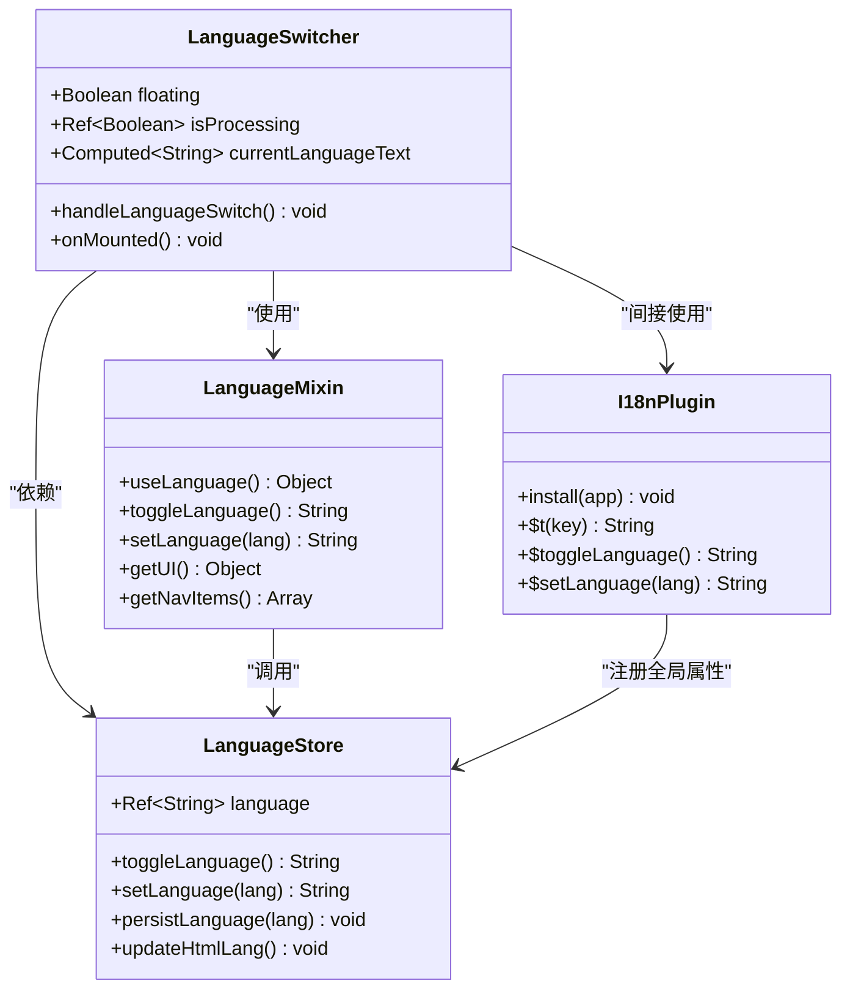
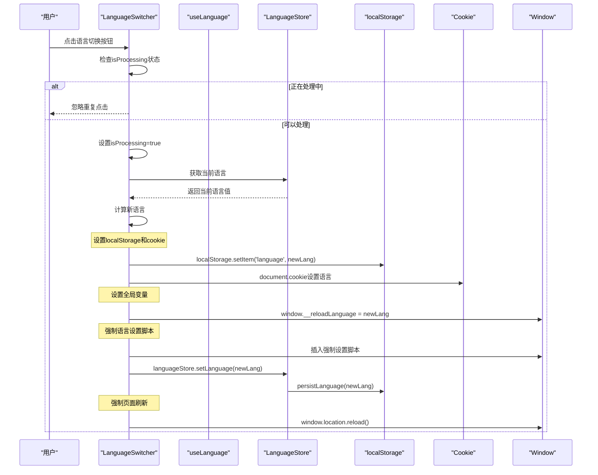
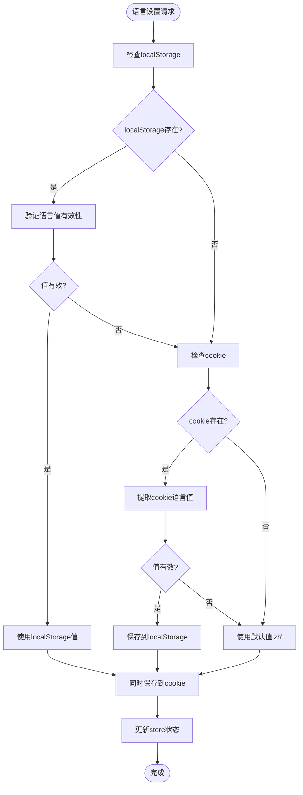
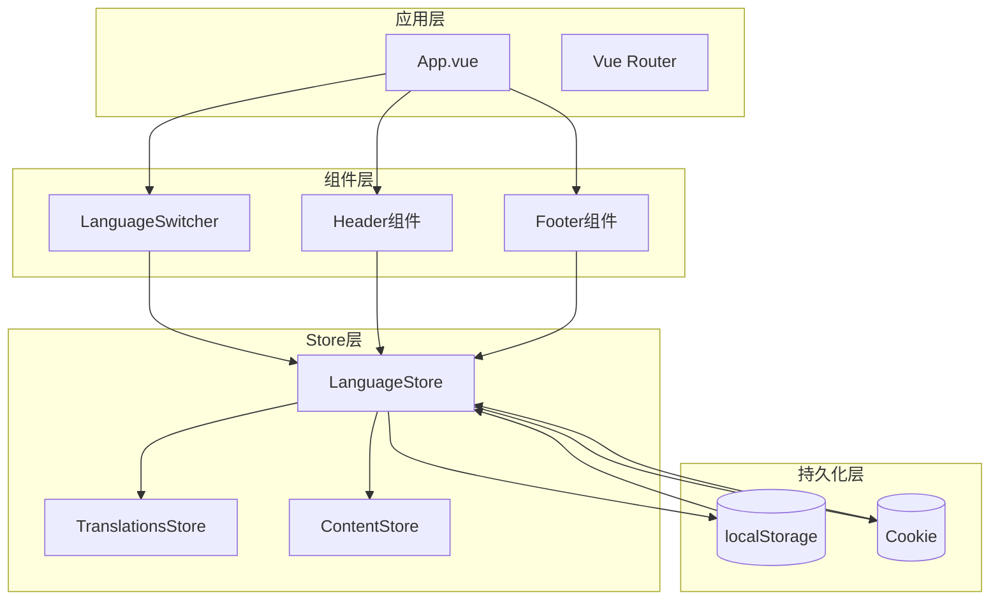
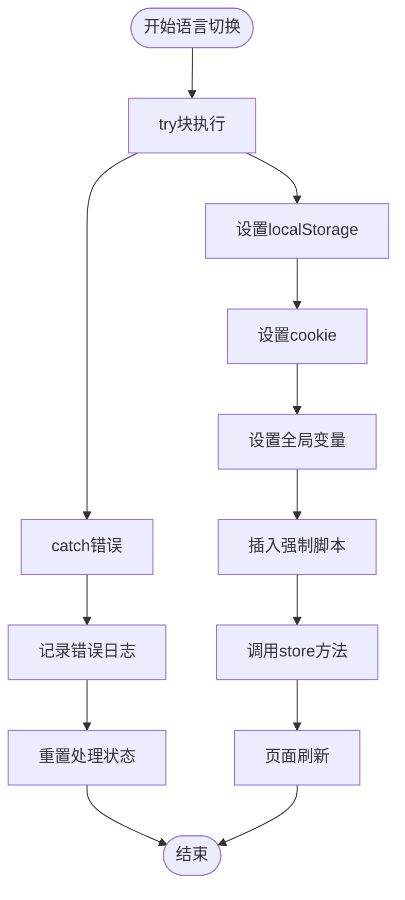

# 语言切换组件深入分析

<cite>
**本文档中引用的文件**
- [LanguageSwitcher.vue](file://src/components/LanguageSwitcher.vue)
- [language.js](file://src/mixins/language.js)
- [language.js](file://src/store/modules/language.js)
- [translations.js](file://src/store/modules/translations.js)
- [i18n.js](file://src/plugins/i18n.js)
- [main.js](file://src/main.js)
- [App.vue](file://src/App.vue)
</cite>

## 目录
1. [概述](#概述)
2. [组件架构分析](#组件架构分析)
3. [语言切换机制详解](#语言切换机制详解)
4. [持久化存储策略](#持久化存储策略)
5. [全局状态管理](#全局状态管理)
6. [防重复点击机制](#防重复点击机制)
7. [错误处理与调试](#错误处理与调试)
8. [响应式设计与浮动定位](#响应式设计与浮动定位)
9. [性能优化策略](#性能优化策略)
10. [故障排除指南](#故障排除指南)

## 概述

LanguageSwitcher.vue是一个专门用于语言切换的Vue 3组件，位于项目的核心国际化系统中。该组件不仅提供了基本的语言切换功能，还实现了复杂的持久化策略、状态同步机制和性能优化方案。

### 核心特性

- **双语言支持**：支持中文(zh)和英文(en)两种语言
- **持久化存储**：通过localStorage和cookie双重保障
- **防重复点击**：防止用户快速多次点击导致的状态混乱
- **全局状态同步**：确保组件状态与全局store保持一致
- **响应式设计**：支持浮动定位模式和移动端适配
- **强制页面刷新**：确保语言切换后的完整重渲染

## 组件架构分析



**图表来源**
- [LanguageSwitcher.vue](file://src/components/LanguageSwitcher.vue#L1-L184)
- [language.js](file://src/mixins/language.js#L1-L127)
- [language.js](file://src/store/modules/language.js#L1-L215)

**章节来源**
- [LanguageSwitcher.vue](file://src/components/LanguageSwitcher.vue#L1-L184)
- [language.js](file://src/mixins/language.js#L1-L127)

## 语言切换机制详解

### 切换流程分析

语言切换的核心逻辑通过`handleLanguageSwitch`方法实现，该方法包含了完整的状态转换和持久化流程：



**图表来源**
- [LanguageSwitcher.vue](file://src/components/LanguageSwitcher.vue#L40-L95)
- [language.js](file://src/store/modules/language.js#L80-L120)

### 语言切换算法

语言切换算法采用了简洁而有效的逻辑：

```javascript
// 计算新语言
const currentLang = languageStore.language;
const newLang = currentLang === 'zh' ? 'en' : 'zh';
```

这种算法的优势：
- **线性时间复杂度**：O(1)，切换操作非常快速
- **确定性行为**：始终在zh和en之间切换
- **状态一致性**：确保不会出现无效的语言值

**章节来源**
- [LanguageSwitcher.vue](file://src/components/LanguageSwitcher.vue#L40-L95)

## 持久化存储策略

### 双重存储机制

项目采用了localStorage和cookie的双重存储策略，确保语言设置的可靠性和跨会话持久性：



**图表来源**
- [language.js](file://src/store/modules/language.js#L10-L45)

### 存储同步策略

```javascript
// 持久化保存语言设置
function persistLanguage(lang) {
  // 保存到localStorage
  localStorage.setItem('language', lang);
  
  // 同时保存到cookie，作为备份
  document.cookie = `language=${lang}; path=/; max-age=${60*60*24*30}`;
}
```

这种策略的优点：
- **冗余备份**：即使localStorage损坏，仍可通过cookie恢复
- **跨浏览器兼容**：某些浏览器可能限制localStorage大小
- **会话持久性**：cookie具有更长的有效期

**章节来源**
- [language.js](file://src/store/modules/language.js#L47-L65)

## 全局状态管理

### Pinia Store集成

LanguageSwitcher组件通过Pinia store进行全局状态管理，确保整个应用的语言状态一致性：



**图表来源**
- [main.js](file://src/main.js#L1-L230)
- [language.js](file://src/store/modules/language.js#L67-L215)

### 状态同步机制

组件挂载时会执行状态一致性检查：

```javascript
// 组件挂载时检查语言设置
if (localStorage.getItem('language') !== languageStore.language) {
  console.log('警告：localStorage和store不一致，同步为:', languageStore.language);
  localStorage.setItem('language', languageStore.language);
}
```

这种机制确保：
- **启动时一致性**：应用启动时自动修复状态不一致问题
- **跨组件同步**：不同组件间保持语言状态同步
- **调试友好**：提供明确的日志输出便于调试

**章节来源**
- [LanguageSwitcher.vue](file://src/components/LanguageSwitcher.vue#L100-L105)

## 防重复点击机制

### 状态控制策略

为了防止用户快速多次点击导致的状态混乱，组件实现了防重复点击机制：

```javascript
// 防止重复点击
const isProcessing = ref(false);

const handleLanguageSwitch = () => {
  if (isProcessing.value) {
    console.log('语言切换正在处理中，忽略重复点击');
    return;
  }
  
  isProcessing.value = true;
  // ... 执行切换逻辑
  // ... 最后恢复状态
  isProcessing.value = false;
}
```

### 机制优势

- **用户体验**：避免因快速点击导致的界面混乱
- **状态安全**：防止并发操作引发的状态不一致
- **调试支持**：清晰的日志记录便于问题排查

**章节来源**
- [LanguageSwitcher.vue](file://src/components/LanguageSwitcher.vue#L35-L40)

## 错误处理与调试

### 完整的错误处理流程

组件实现了全面的错误处理机制：



**图表来源**
- [LanguageSwitcher.vue](file://src/components/LanguageSwitcher.vue#L40-L95)

### 调试信息输出

组件提供了丰富的调试信息：

```javascript
console.log('语言切换按钮被点击，当前语言:', languageStore.language, '，类型:', typeof languageStore.language);
console.log(`手动设置localStorage['language']从${currentLang}(${typeof currentLang})到${newLang}(${typeof newLang})`);
console.log('设置后的localStorage值:', localStorage.getItem('language'));
console.log('设置后的cookie:', document.cookie);
```

这些日志信息帮助开发者：
- 追踪语言切换的完整流程
- 诊断状态不一致问题
- 分析持久化存储的正确性

**章节来源**
- [LanguageSwitcher.vue](file://src/components/LanguageSwitcher.vue#L40-L95)

## 响应式设计与浮动定位

### 浮动定位模式

LanguageSwitcher组件支持浮动定位模式，特别适合移动端和桌面端的便捷访问：

```javascript
// 组件属性定义
const props = defineProps({
  floating: {
    type: Boolean,
    default: false
  }
})
```

当启用浮动模式时，组件会应用特殊的CSS样式：

```css
.language-switcher.floating {
  position: fixed;
  bottom: 30px;
  right: 30px;
  z-index: 999;
}
```

### 响应式样式适配

组件提供了完善的响应式设计：

```css
@media (max-width: 767px) {
  .language-switcher.floating {
    bottom: 20px;
    right: 20px;
  }
  
  .lang-btn {
    padding: 10px 18px;
  }
}
```

这种设计考虑了：
- **移动端体验**：在小屏幕上提供合适的间距
- **视觉层次**：确保浮动按钮不会遮挡主要内容
- **交互便利性**：提供足够大的点击区域

**章节来源**
- [LanguageSwitcher.vue](file://src/components/LanguageSwitcher.vue#L1-L184)

## 性能优化策略

### 强制页面刷新策略

为了确保语言切换后的完整重渲染，组件采用了强制页面刷新的策略：

```javascript
setTimeout(() => {
  // 再次确保语言设置正确
  localStorage.setItem('language', newLang);
  window.__reloadLanguage = newLang;
  
  // 然后刷新页面
  window.location.reload();
}, 100);
```

这种策略的优势：
- **状态一致性**：确保所有组件都使用新的语言设置
- **缓存清理**：清除可能存在的旧语言缓存
- **资源重载**：重新加载新的语言资源文件

### 渐进式加载优化

主应用入口文件实现了渐进式加载优化：

```javascript
// 预加载关键图片
const preloadImages = () => {
  const imagesToPreload = [
    '/images/tech/detection.jpg',
    '/images/tech/jamming.jpg'
  ]
  
  return Promise.all(imagesToPreload.map(src => {
    return new Promise((resolve) => {
      const img = new Image()
      img.onload = img.onerror = resolve
      img.src = src
    })
  }))
}
```

这种优化包括：
- **关键资源预加载**：优先加载最重要的图片资源
- **异步加载**：不阻塞应用的主要渲染流程
- **错误容错**：图片加载失败不影响整体应用

**章节来源**
- [main.js](file://src/main.js#L40-L60)
- [LanguageSwitcher.vue](file://src/components/LanguageSwitcher.vue#L85-L95)

## 故障排除指南

### 常见问题诊断

#### 问题1：语言切换后状态不一致

**症状**：点击语言切换按钮后，页面显示的语言与预期不符

**诊断步骤**：
1. 检查localStorage中的语言值
2. 查看cookie中的语言设置
3. 验证store中的language状态
4. 检查全局变量window.__reloadLanguage

**解决方案**：
```javascript
// 手动同步状态
localStorage.setItem('language', languageStore.language);
document.cookie = `language=${languageStore.language}; path=/; max-age=${60*60*24*30}`;
```

#### 问题2：页面刷新后语言丢失

**症状**：页面刷新后恢复到默认语言

**诊断步骤**：
1. 检查localStorage和cookie的持久化设置
2. 验证应用启动时的语言初始化逻辑
3. 查看是否有JavaScript错误阻止初始化

**解决方案**：
- 确保持久化函数正常工作
- 检查应用入口文件的语言初始化代码
- 验证浏览器的localStorage权限

#### 问题3：浮动按钮位置异常

**症状**：浮动语言切换按钮出现在不正确的位置

**诊断步骤**：
1. 检查CSS样式是否正确加载
2. 验证响应式媒体查询是否生效
3. 查看z-index层级冲突

**解决方案**：
- 确保scoped样式正确应用
- 检查CSS优先级设置
- 调整z-index值解决层级问题

**章节来源**
- [LanguageSwitcher.vue](file://src/components/LanguageSwitcher.vue#L100-L105)
- [main.js](file://src/main.js#L60-L120)

## 总结

LanguageSwitcher.vue组件展现了现代Vue 3应用中语言切换系统的最佳实践。通过精心设计的架构、完善的错误处理、可靠的持久化策略和优秀的用户体验，该组件成功地解决了多语言应用中的核心挑战。

### 主要成就

1. **可靠性**：通过localStorage和cookie的双重保障，确保语言设置的持久性
2. **一致性**：完整的状态同步机制保证了全局状态的一致性
3. **性能**：合理的缓存策略和渐进式加载优化提升了用户体验
4. **可维护性**：清晰的代码结构和丰富的调试信息便于维护
5. **扩展性**：模块化的设计使得未来扩展新的语言支持变得容易

这个组件不仅是技术实现的典范，更是用户体验设计的优秀案例，为构建高质量的国际化Web应用提供了宝贵的参考。