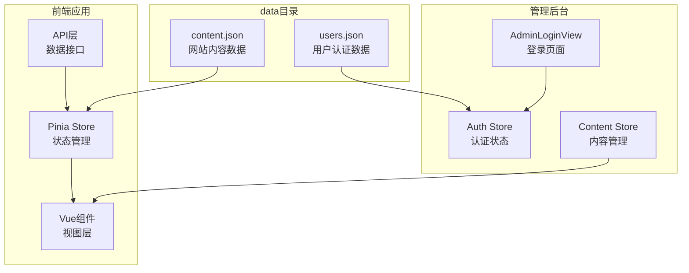
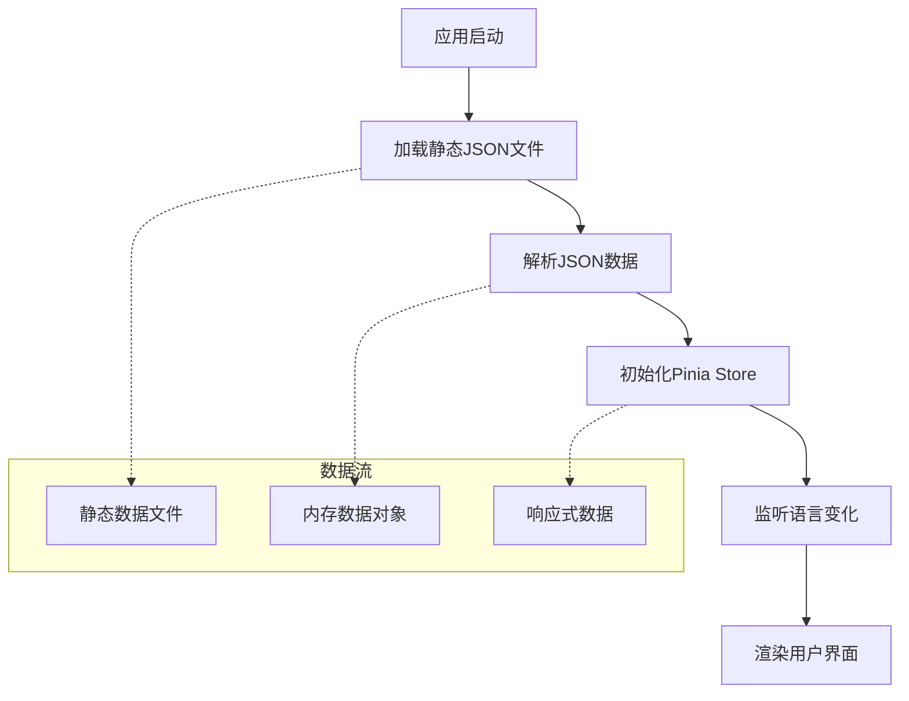
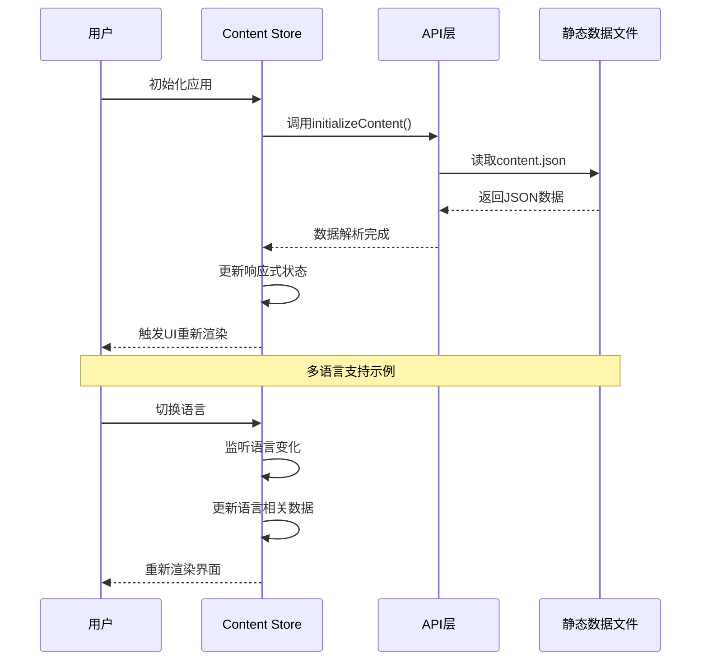
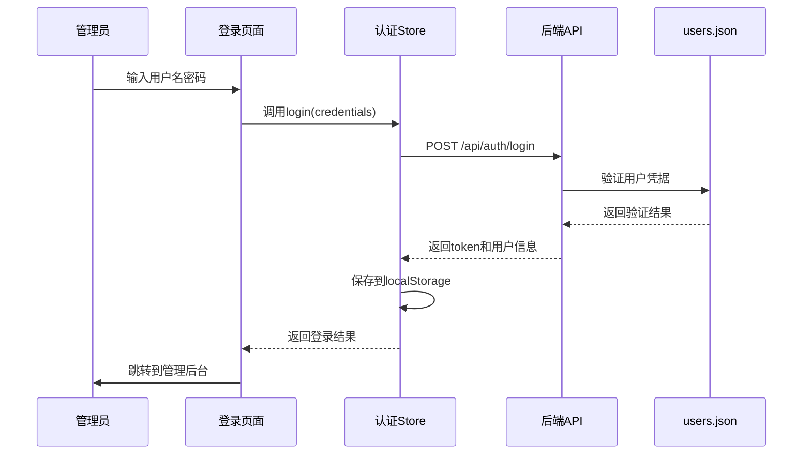
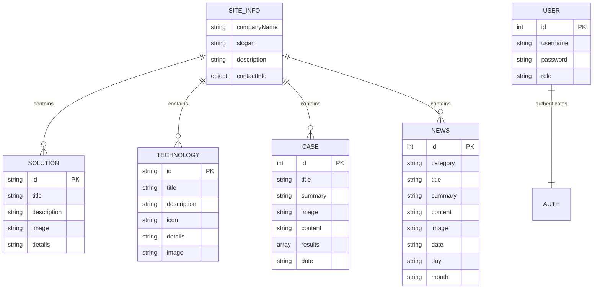
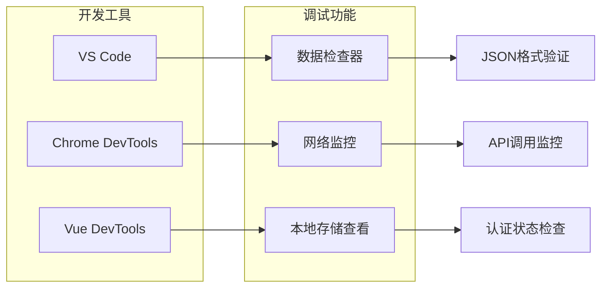

# data目录详解

<cite>
**本文档引用的文件**
- [content.json](file://data/content.json)
- [users.json](file://data/users.json)
- [content.js](file://src/store/modules/content.js)
- [auth.js](file://src/store/modules/auth.js)
- [index.js](file://src/api/index.js)
- [AdminLoginView.vue](file://src/views/admin/AdminLoginView.vue)
</cite>

## 目录

1. [简介](#简介)
2. [项目结构概览](#项目结构概览)
3. [核心数据文件分析](#核心数据文件分析)
4. [数据管理模式](#数据管理模式)
5. [前端数据加载机制](#前端数据加载机制)
6. [管理员认证流程](#管理员认证流程)
7. [数据格式设计原则](#数据格式设计原则)
8. [开发调试影响](#开发调试影响)
9. [总结](#总结)

## 简介

data目录是整个应用程序的核心数据层，包含了两个关键的JSON文件：`content.json`和`users.json`。这些文件采用了静态数据管理模式，为前端应用提供了完整的网站内容和用户认证数据。这种设计模式在开发阶段提供了极大的便利性，同时也为内容管理和维护带来了灵活性。

## 项目结构概览



**图表来源**
- [content.json](file://data/content.json#L1-L28)
- [users.json](file://data/users.json#L1-L8)
- [content.js](file://src/store/modules/content.js#L1-L50)
- [auth.js](file://src/store/modules/auth.js#L1-L30)

## 核心数据文件分析

### content.json - 网站内容数据

`content.json`文件包含了网站的所有静态内容数据，采用多语言支持的设计模式：

```json
{
  "site-info": {
    "companyName": "杭州朗德智能科技有限公司",
    "slogan": "智能科技，创造可能",
    "description": "用智能科技赋能产业升级，驱动未来创新",
    "contactInfo": {
      "address": "浙江省杭州市滨江区科技园区创新大厦A座15楼",
      "phone": "0571-8888 9999",
      "email": "info@landeintelligent.com"
    }
  },
  "solutions": [
    {
      "id": "automation",
      "title": "工业自动化解决方案",
      "description": "为制造业提供智能化、自动化的生产线解决方案，提高生产效率，降低人力成本。",
      "image": "/images/solution-1.jpg",
      "details": "我们的工业自动化解决方案融合了先进的自动化控制技术与人工智能算法，可根据企业生产需求进行量身定制..."
    }
  ]
}
```

**节点来源**
- [content.json](file://data/content.json#L1-L28)

#### 数据结构特点

1. **多语言支持**：虽然当前content.json只包含中文内容，但整体架构支持国际化扩展
2. **模块化设计**：内容按功能模块组织，便于管理和维护
3. **媒体资源关联**：所有图片资源都采用相对路径，便于部署时的资源管理
4. **层次化结构**：采用清晰的数据层级，便于前端组件直接映射

### users.json - 用户认证数据

`users.json`文件是一个极简的用户认证数据模型：

```json
[
  {
    "id": 1,
    "username": "admin",
    "password": "admin123",
    "role": "admin"
  }
]
```

**节点来源**
- [users.json](file://data/users.json#L1-L8)

#### 数据结构特点

1. **简单明了**：仅包含最基本的用户信息和认证凭据
2. **角色基础**：支持基本的角色权限控制
3. **易于扩展**：可以轻松添加更多用户或扩展字段
4. **安全性考虑**：在开发环境中使用明文密码，生产环境应替换为加密存储

## 数据管理模式

### 静态数据优势



**图表来源**
- [content.js](file://src/store/modules/content.js#L20-L40)
- [auth.js](file://src/store/modules/auth.js#L5-L15)

### 数据管理模式的优势

1. **开发便捷性**：
   - 无需数据库配置
   - 即开即用，减少部署复杂度
   - 支持热重载和实时编辑

2. **性能优化**：
   - 减少API调用开销
   - 数据预加载，提升首屏速度
   - 缓存友好，减少服务器压力

3. **内容管理灵活性**：
   - 支持版本控制
   - 可以通过Git追踪内容变更
   - 易于进行A/B测试和内容实验

## 前端数据加载机制

### Pinia Store集成

前端通过Pinia状态管理库来加载和管理这些静态数据：

```javascript
// content.js中的核心加载逻辑
const initializeContent = async () => {
  if (loading.value) return
  
  try {
    loading.value = true
    error.value = null
    
    // 模拟API调用，实际上直接使用本地数据
    await new Promise(resolve => setTimeout(resolve, 100))
    
    refreshTrigger.value++
    isInitialized.value = true
  } catch (err) {
    console.error('Failed to initialize content:', err)
    error.value = err
  } finally {
    loading.value = false
  }
}
```

**节点来源**
- [content.js](file://src/store/modules/content.js#L25-L45)

### 数据响应式更新



**图表来源**
- [content.js](file://src/store/modules/content.js#L15-L30)
- [index.js](file://src/api/index.js#L1-L30)

### 多语言数据处理

系统实现了完整的多语言支持机制：

```javascript
// 多语言数据结构
const siteInfo = reactive({
  zh: {
    companyName: '杭州朗德智能科技有限公司',
    slogan: '智能反无人机，守护空域安全',
    description: '领先的反无人机系统及反无人机解决方案提供商',
    contactInfo: {
      address: '浙江省杭州市滨江区科技园区创新大厦A座15楼',
      phone: '0571-8888 9999',
      email: 'info@landedrone.com'
    }
  },
  en: {
    companyName: 'Hangzhou Lande Intelligent Technology Co., Ltd.',
    slogan: 'Smart Anti-Drone Systems, Securing Airspace',
    description: 'Leading provider of anti-drone systems and solutions',
    contactInfo: {
      address: '15F, Building A, Innovation Tower, Science & Technology Park, Binjiang District, Hangzhou, Zhejiang',
      phone: '0571-8888 9999',
      email: 'info@landedrone.com'
    }
  }
})
```

**节点来源**
- [content.js](file://src/store/modules/content.js#L45-L85)

## 管理员认证流程

### 认证数据交互



**图表来源**
- [AdminLoginView.vue](file://src/views/admin/AdminLoginView.vue#L40-L50)
- [auth.js](file://src/store/modules/auth.js#L10-L35)
- [index.js](file://src/api/index.js#L60-L70)

### 认证状态管理

```javascript
// 认证Store的核心逻辑
const login = async (credentials) => {
  loading.value = true
  error.value = null
  
  try {
    // 实际项目中调用API，这里模拟用户验证
    const response = await axios.post('/api/auth/login', credentials)
    
    if (response.data.token) {
      token.value = response.data.token
      user.value = response.data.user
      isAuthenticated.value = true
      
      // 保存到本地存储
      localStorage.setItem('admin-token', token.value)
      localStorage.setItem('admin-user', JSON.stringify(user.value))
      
      return { success: true }
    } else {
      throw new Error('认证失败')
    }
  } catch (e) {
    error.value = e.message || '登录失败，请检查账号和密码'
    return { success: false, error: error.value }
  } finally {
    loading.value = false
  }
}
```

**节点来源**
- [auth.js](file://src/store/modules/auth.js#L10-L35)

### 安全机制

系统实现了多层次的安全保障：

1. **本地存储加密**：敏感信息存储在localStorage中
2. **会话管理**：基于token的无状态认证
3. **权限控制**：基于角色的访问控制
4. **自动登出**：401错误自动清理认证状态

## 数据格式设计原则

### 统一的数据结构规范



**图表来源**
- [content.json](file://data/content.json#L1-L28)
- [users.json](file://data/users.json#L1-L8)
- [content.js](file://src/store/modules/content.js#L45-L200)

### 设计原则总结

1. **一致性**：所有数据对象遵循相同的结构模式
2. **可扩展性**：预留扩展字段，支持未来功能添加
3. **语义化**：字段命名直观易懂，符合业务逻辑
4. **标准化**：采用统一的数据格式和编码规范
5. **国际化**：支持多语言内容的灵活扩展

### 字段设计规范

```javascript
// 示例：标准化的数据字段定义
const standardizedFields = {
  // 基础标识符
  id: '唯一标识符，字符串或数字类型',
  title: '标题字段，支持多语言',
  description: '描述字段，简洁明了',
  
  // 媒体资源
  image: '图片资源路径，相对路径优先',
  icon: '图标资源，使用FontAwesome类名',
  
  // 内容详情
  content: '详细内容，支持富文本格式',
  details: '技术细节，面向专业用户',
  
  // 时间信息
  date: '标准日期格式 YYYY-MM-DD',
  day: '日期天数',
  month: '月份显示格式 MM / YYYY'
}
```

## 开发调试影响

### 开发环境优势

1. **零配置启动**：无需数据库设置即可运行完整应用
2. **实时编辑**：修改JSON文件后立即生效，无需重启服务
3. **离线开发**：可以在没有网络连接的情况下进行开发
4. **版本控制友好**：所有内容变更都可以通过Git追踪

### 调试工具支持



### 性能优化策略

1. **数据缓存**：首次加载后缓存在内存中
2. **懒加载**：按需加载非关键内容
3. **压缩传输**：JSON文件经过压缩处理
4. **CDN支持**：静态资源可通过CDN加速

### 内容管理便利性

1. **可视化编辑**：支持使用JSON编辑器进行内容管理
2. **批量操作**：可以批量修改多个内容项
3. **模板化**：支持内容模板的复用
4. **版本回滚**：可以通过Git回滚到之前的版本

## 总结

data目录下的`content.json`和`users.json`文件构成了整个应用程序的核心数据层，采用静态数据管理模式为前端应用提供了完整的解决方案。这种设计模式具有以下显著优势：

### 技术优势

1. **简化部署**：无需复杂的数据库配置，降低了部署难度
2. **提升性能**：减少API调用开销，提升应用响应速度
3. **增强稳定性**：静态数据减少了运行时错误的可能性
4. **改善开发体验**：支持热重载和实时编辑，提高开发效率

### 内容管理优势

1. **灵活性**：支持多语言内容的灵活扩展
2. **可维护性**：清晰的数据结构便于内容维护
3. **版本控制**：通过Git可以精确追踪内容变更历史
4. **协作友好**：多个开发者可以并行编辑不同的内容模块

### 应用场景适用性

这种静态数据管理模式特别适合以下应用场景：

- **内容导向型网站**：如企业官网、博客、知识库等
- **原型开发**：快速搭建应用原型，验证业务逻辑
- **教育演示**：用于教学演示，展示数据结构和API设计
- **小型项目**：对于用户量不大、内容更新频率不高的应用

通过深入理解这些核心数据文件的设计原理和使用方式，开发者可以更好地利用这一数据管理模式，构建高质量的Web应用程序。同时，这种设计也为未来的功能扩展和系统升级奠定了良好的基础。