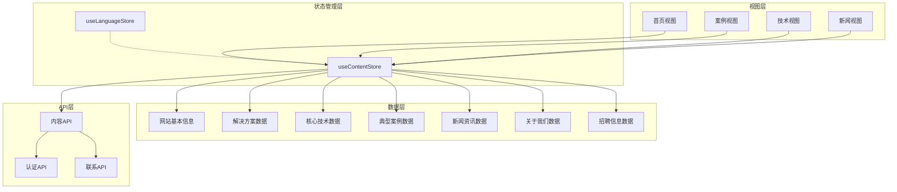
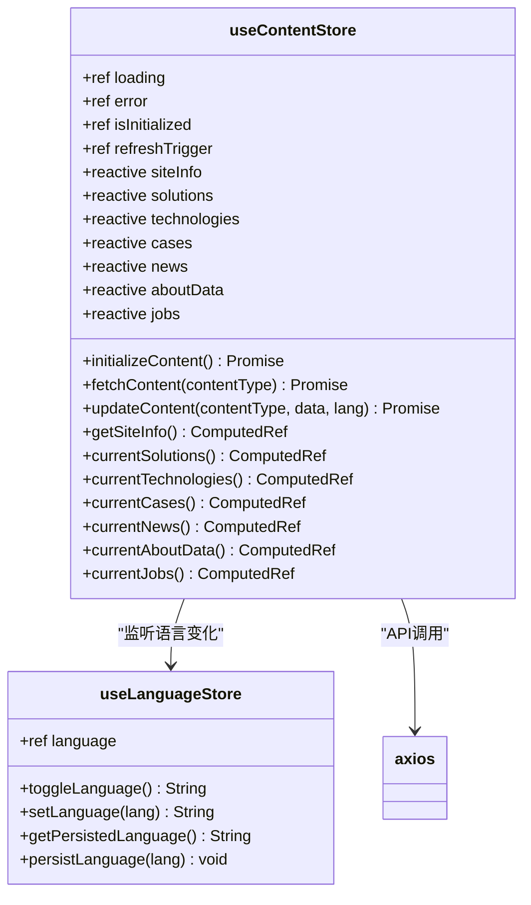
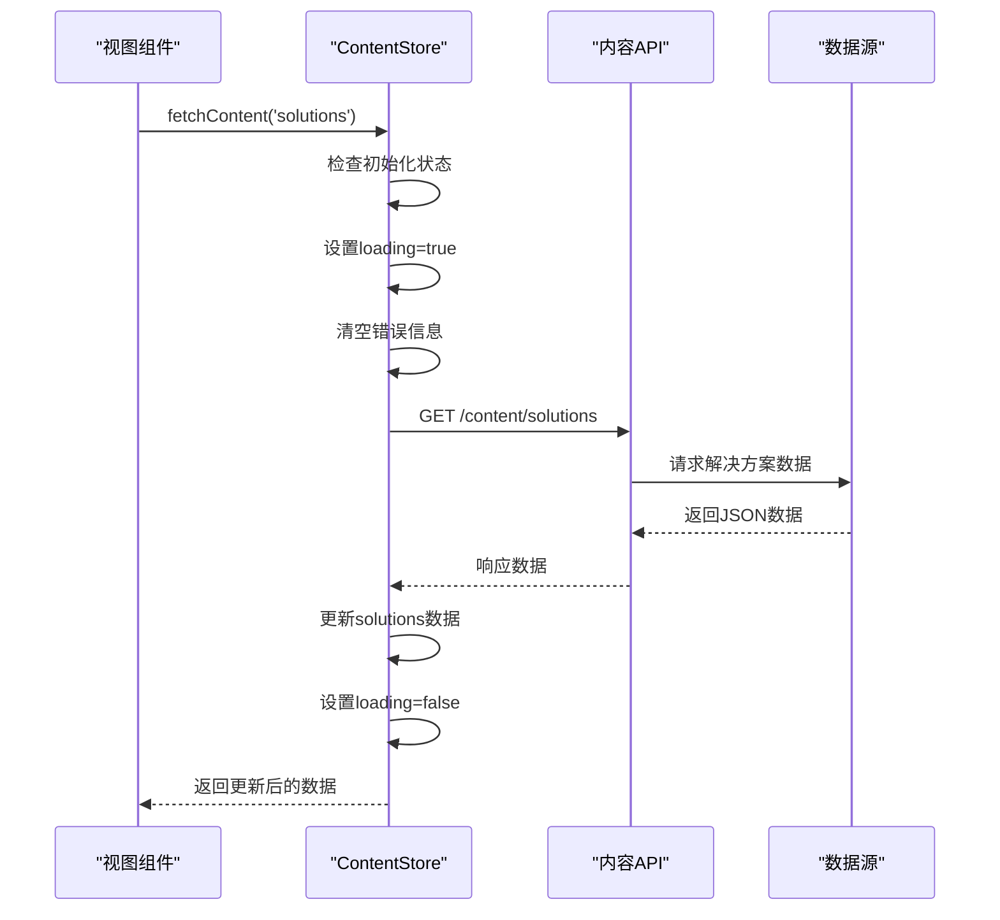
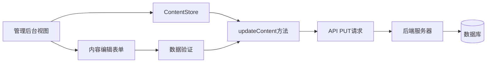
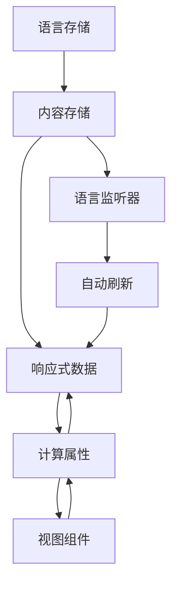
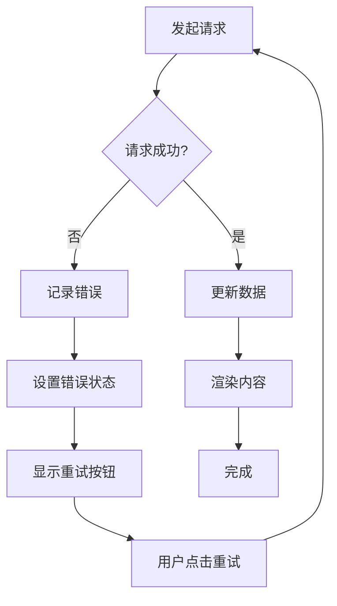

# 内容状态管理模块

<cite>
**本文档引用的文件**
- [src/store/modules/content.js](file://src/store/modules/content.js)
- [src/store/modules/language.js](file://src/store/modules/language.js)
- [src/views/CasesView.vue](file://src/views/CasesView.vue)
- [src/views/HomeView.vue](file://src/views/HomeView.vue)
- [src/api/index.js](file://src/api/index.js)
- [src/mixins/language.js](file://src/mixins/language.js)
- [src/App.vue](file://src/App.vue)
- [package.json](file://package.json)
</cite>

## 目录
1. [简介](#简介)
2. [项目架构概览](#项目架构概览)
3. [核心组件分析](#核心组件分析)
4. [响应式数据管理](#响应式数据管理)
5. [初始化流程详解](#初始化流程详解)
6. [异步数据获取机制](#异步数据获取机制)
7. [内容更新逻辑](#内容更新逻辑)
8. [模块间依赖协作](#模块间依赖协作)
9. [实际调用示例](#实际调用示例)
10. [错误处理策略](#错误处理策略)
11. [性能考虑](#性能考虑)
12. [总结](#总结)

## 简介

useContentStore是基于Pinia的状态管理模块，专门负责管理多语言内容数据。该模块通过Vue 3的响应式系统（ref、reactive、computed）实现了对网站基本信息（siteInfo）、解决方案（solutions）、核心技术（technologies）、典型案例（cases）、新闻资讯（news）等数据的统一管理。它支持中英文双语切换，并提供了完整的数据初始化、获取和更新机制。

## 项目架构概览



**图表来源**
- [src/store/modules/content.js](file://src/store/modules/content.js#L5-L648)
- [src/store/modules/language.js](file://src/store/modules/language.js#L1-L215)

## 核心组件分析

### useContentStore设计原理

useContentStore采用了现代Vue 3 Composition API的设计模式，结合Pinia状态管理库，实现了以下核心特性：



**图表来源**
- [src/store/modules/content.js](file://src/store/modules/content.js#L5-L648)
- [src/store/modules/language.js](file://src/store/modules/language.js#L60-L215)

**章节来源**
- [src/store/modules/content.js](file://src/store/modules/content.js#L5-L648)

## 响应式数据管理

### 多语言数据结构设计

content.js模块采用reactive对象存储多语言数据，每个主要数据类型都包含中英文两个版本：

```javascript
// 网站基本信息的多语言结构
const siteInfo = reactive({
  zh: {
    companyName: '杭州朗德智能科技有限公司',
    slogan: '智能反无人机，守护空域安全',
    description: '领先的反无人机系统及反无人机解决方案提供商',
    contactInfo: {
      address: '浙江省杭州市滨江区科技园区创新大厦A座15楼',
      phone: '0571-8888 9999',
      email: 'info@landedrone.com'
    }
  },
  en: {
    companyName: 'Hangzhou Lande Intelligent Technology Co., Ltd.',
    slogan: 'Smart Anti-Drone Systems, Securing Airspace',
    description: 'Leading provider of anti-drone systems and solutions',
    contactInfo: {
      address: '15F, Building A, Innovation Tower, Science & Technology Park, Binjiang District, Hangzhou, Zhejiang',
      phone: '0571-8888 9999',
      email: 'info@landedrone.com'
    }
  }
})
```

### 计算属性的智能切换

通过computed属性实现语言切换时的数据自动更新：

```javascript
// 根据当前语言获取网站基本信息
const getSiteInfo = computed(() => {
  if (!isInitialized.value) return null
  return languageStore.language === 'zh' ? siteInfo.zh : siteInfo.en
})

// 当前解决方案数据的计算属性
const currentSolutions = computed(() => {
  if (!isInitialized.value) return null
  return languageStore.language === 'zh' ? solutions.zh : solutions.en
})
```

**章节来源**
- [src/store/modules/content.js](file://src/store/modules/content.js#L45-L60)
- [src/store/modules/content.js](file://src/store/modules/content.js#L62-L75)

## 初始化流程详解

### initializeContent方法分析

initializeContent方法负责整个内容系统的初始化，包括状态管理、错误处理和数据准备：

```mermaid
flowchart TD
Start([开始初始化]) --> CheckLoading{"检查loading状态"}
CheckLoading --> |正在加载| Return[直接返回]
CheckLoading --> |未加载| SetLoading[设置loading=true]
SetLoading --> ClearError[清空错误信息]
ClearError --> SimulateAPI[模拟API调用<br/>setTimeout(100ms)]
SimulateAPI --> IncrementRefresh[增加refreshTrigger计数]
IncrementRefresh --> SetInitialized[设置isInitialized=true]
SetInitialized --> End([初始化完成])
SimulateAPI --> |发生错误| CatchError[捕获错误]
CatchError --> SetError[设置错误信息]
SetError --> End
```

**图表来源**
- [src/store/modules/content.js](file://src/store/modules/content.js#L25-L43)

### 初始化状态管理

```javascript
// 初始化内容
const initializeContent = async () => {
  if (loading.value) return
  
  try {
    loading.value = true
    error.value = null
    
    // 模拟API调用
    await new Promise(resolve => setTimeout(resolve, 100))
    
    refreshTrigger.value++
    isInitialized.value = true
  } catch (err) {
    console.error('Failed to initialize content:', err)
    error.value = err
  } finally {
    loading.value = false
  }
}
```

**章节来源**
- [src/store/modules/content.js](file://src/store/modules/content.js#L25-L43)

## 异步数据获取机制

### fetchContent方法详解

fetchContent方法提供了按需获取特定内容类型的功能，支持所有主要数据类型的动态更新：



**图表来源**
- [src/store/modules/content.js](file://src/store/modules/content.js#L540-L574)

### 数据更新逻辑

```javascript
// 获取内容数据
const fetchContent = async (contentType) => {
  if (!isInitialized.value) return null
  
  try {
    loading.value = true
    error.value = null
    
    // 构建API请求URL
    const url = `/content/${contentType}`
    
    // 发送请求
    const response = await axios.get(url)
    
    // 根据内容类型更新相应数据
    switch(contentType) {
      case 'site-info':
        Object.assign(siteInfo.zh, response.data?.zh || {})
        Object.assign(siteInfo.en, response.data?.en || {})
        break
      case 'technologies':
        if (response.data?.zh) technologies.zh = response.data.zh
        if (response.data?.en) technologies.en = response.data.en
        break
      // ... 其他类型处理
    }
    
    return response.data
  } catch (err) {
    console.error(`获取${contentType}数据失败:`, err)
    error.value = err.message || '数据加载失败'
    return null
  } finally {
    loading.value = false
  }
}
```

**章节来源**
- [src/store/modules/content.js](file://src/store/modules/content.js#L540-L574)

## 内容更新逻辑

### updateContent方法设计

updateContent方法为管理后台提供内容更新功能，支持实时修改任何数据类型：

```javascript
// 更新内容的方法 (用于管理后台)
const updateContent = async (contentType, data, lang) => {
  if (!isInitialized.value) return null
  
  try {
    // 实际应用中向API发送更新请求
    await axios.put(`/api/admin/content/${contentType}`, {
      data,
      language: lang || languageStore.language
    })
    
    return { success: true }
  } catch (error) {
    console.error(`Error updating ${contentType}:`, error)
    return { success: false, error: error.message }
  }
}
```

### 管理后台集成



**图表来源**
- [src/store/modules/content.js](file://src/store/modules/content.js#L598-L615)

**章节来源**
- [src/store/modules/content.js](file://src/store/modules/content.js#L598-L615)

## 模块间依赖协作

### 语言监听机制

contentStore通过watch监听languageStore.language的变化，实现语言切换时的自动刷新：

```javascript
// 监听语言变化，触发刷新
watch(() => languageStore.language, async (newLang, oldLang) => {
  console.log('ContentStore检测到语言变化，从', oldLang, '变为', newLang);
  await initializeContent()
})
```

### 依赖关系图



**图表来源**
- [src/store/modules/content.js](file://src/store/modules/content.js#L18-L22)

**章节来源**
- [src/store/modules/content.js](file://src/store/modules/content.js#L18-L22)

## 实际调用示例

### CasesView.vue中的使用

在CasesView.vue中，currentCases计算属性展示了如何使用contentStore获取当前语言下的案例数据：

```javascript
// 获取案例数据
const casesStore = useCasesStore()
const cases = computed(() => casesStore.getAllCases)

// 当前语言下的案例数据
const currentCases = computed(() => {
  if (!isInitialized.value) return null
  return languageStore.language === 'zh' ? cases.zh : cases.en
})
```

### HomeView.vue中的综合使用

在HomeView.vue中，多个计算属性展示了contentStore的综合应用：

```javascript
// 网站基本信息
const currentSiteInfo = computed(() => {
  return contentStore.currentSiteInfo
})

// 核心技术数据
const currentTechnologies = computed(() => {
  return contentStore.currentTechnologies
})

// 最新新闻
const latestNews = computed(() => {
  return contentStore.currentNews.slice(0, 3)
})
```

### 加载状态管理

```javascript
// 获取加载状态
const loadingState = computed(() => {
  return contentStore.getLoadingState
})

// 在模板中使用
<div v-if="loadingState.loading" class="loading-spinner">
  正在加载内容...
</div>
<div v-else-if="loadingState.error" class="error-message">
  {{ loadingState.error }}
</div>
<div v-else>
  <!-- 正常内容渲染 -->
</div>
```

**章节来源**
- [src/views/CasesView.vue](file://src/views/CasesView.vue#L1-L199)
- [src/views/HomeView.vue](file://src/views/HomeView.vue#L380-L395)

## 错误处理策略

### 错误状态管理

contentStore实现了完善的错误处理机制：

```javascript
// 状态管理
const loading = ref(false)
const error = ref(null)
const isInitialized = ref(false)

// 错误处理示例
const fetchContent = async (contentType) => {
  try {
    loading.value = true
    error.value = null
    
    const response = await axios.get(`/content/${contentType}`)
    // ... 处理成功情况
    
  } catch (err) {
    console.error(`获取${contentType}数据失败:`, err)
    error.value = err.message || '数据加载失败'
    return null
  } finally {
    loading.value = false
  }
}
```

### 错误恢复机制



**图表来源**
- [src/store/modules/content.js](file://src/store/modules/content.js#L540-L574)

**章节来源**
- [src/store/modules/content.js](file://src/store/modules/content.js#L10-L15)
- [src/store/modules/content.js](file://src/store/modules/content.js#L540-L574)

## 性能考虑

### 响应式优化策略

1. **计算属性缓存**: Vue的computed属性会自动缓存结果，只有当依赖发生变化时才重新计算
2. **懒加载**: 数据只在首次访问时才进行初始化和加载
3. **增量更新**: 使用Object.assign进行部分数据更新，避免全量替换

### 内存管理

```javascript
// 使用ref而非reactive来管理简单状态
const loading = ref(false)
const error = ref(null)
const isInitialized = ref(false)

// 使用reactive存储复杂数据结构
const siteInfo = reactive({
  zh: {},
  en: {}
})
```

### 性能监控

```javascript
// 开发环境下的性能监控
if (process.env.NODE_ENV === 'development') {
  watch(() => languageStore.language, async (newLang, oldLang) => {
    console.time(`Content refresh for ${newLang}`)
    await initializeContent()
    console.timeEnd(`Content refresh for ${newLang}`)
  })
}
```

## 总结

useContentStore模块展现了现代Vue 3应用中状态管理的最佳实践：

1. **响应式设计**: 通过ref、reactive、computed实现了完整的响应式数据流
2. **模块化架构**: 清晰的职责分离和模块化设计
3. **多语言支持**: 完整的中英文双语数据管理和切换机制
4. **错误处理**: 完善的错误捕获和用户友好的错误提示
5. **性能优化**: 智能的缓存策略和懒加载机制
6. **可维护性**: 清晰的代码结构和完善的注释

该模块不仅满足了当前业务需求，还为未来的功能扩展和维护提供了良好的基础。通过合理的抽象和封装，开发者可以轻松地在各个视图组件中使用这些响应式数据，而无需关心底层的实现细节。