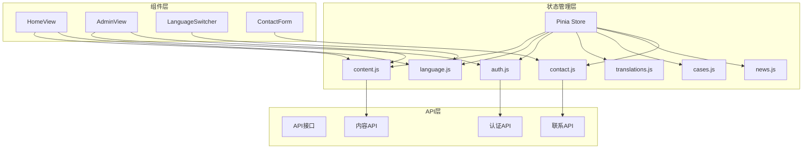
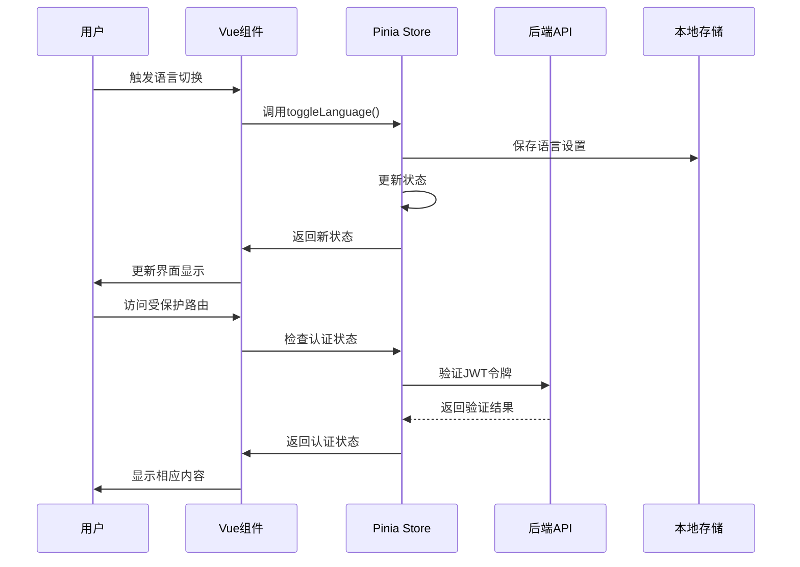
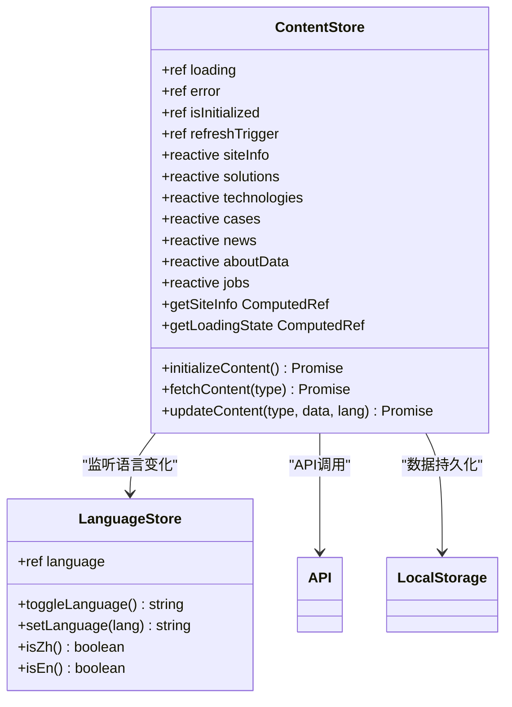
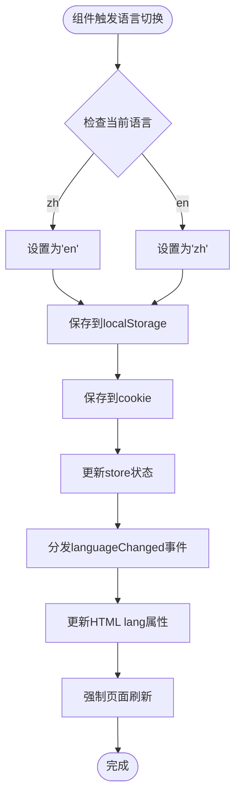
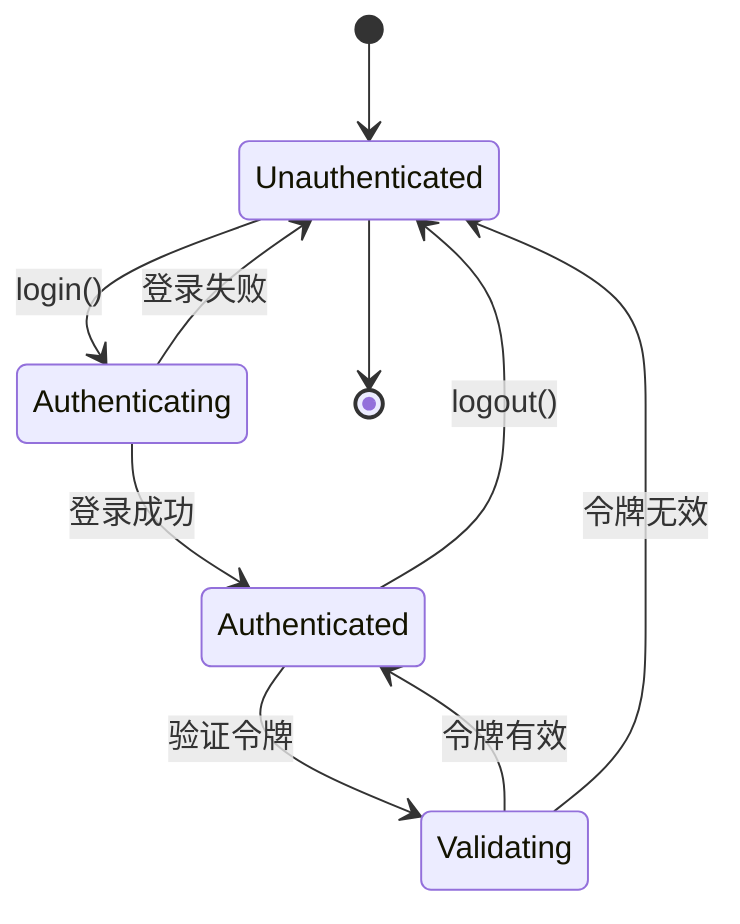
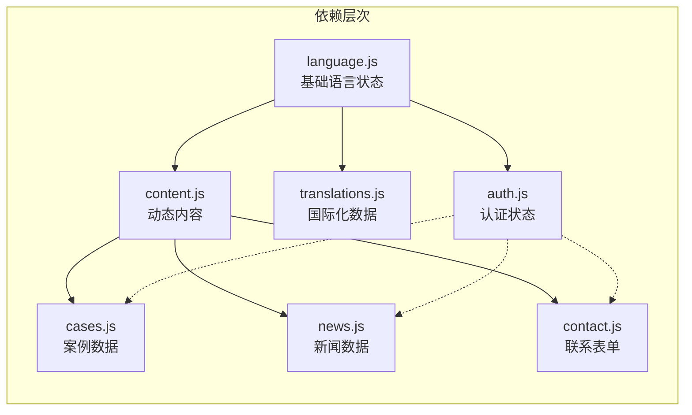
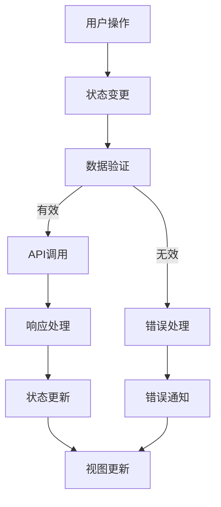

现在我已经收集了足够的信息来创建关于状态管理模块的文档。让我开始生成文档：

<docs>
# 状态管理模块

<cite>
**本文档引用的文件**
- [src/store/modules/content.js](file://src/store/modules/content.js)
- [src/store/modules/language.js](file://src/store/modules/language.js)
- [src/store/modules/auth.js](file://src/store/modules/auth.js)
- [src/store/modules/translations.js](file://src/store/modules/translations.js)
- [src/store/modules/cases.js](file://src/store/modules/cases.js)
- [src/store/modules/news.js](file://src/store/modules/news.js)
- [src/store/modules/contact.js](file://src/store/modules/contact.js)
- [src/store/index.js](file://src/store/index.js)
- [src/api/index.js](file://src/api/index.js)
- [src/router/index.js](file://src/router/index.js)
- [src/components/LanguageSwitcher.vue](file://src/components/LanguageSwitcher.vue)
- [src/views/HomeView.vue](file://src/views/HomeView.vue)
</cite>

## 目录
1. [概述](#概述)
2. [项目结构](#项目结构)
3. [核心状态模块](#核心状态模块)
4. [架构概览](#架构概览)
5. [详细模块分析](#详细模块分析)
6. [模块间依赖关系](#模块间依赖关系)
7. [数据流与同步机制](#数据流与同步机制)
8. [性能考虑](#性能考虑)
9. [故障排除指南](#故障排除指南)
10. [结论](#结论)

## 概述

本文档全面解析了基于Pinia的状态管理模块设计与协作机制。项目采用了模块化的状态管理模式，将不同的业务逻辑分离到独立的模块中，实现了清晰的职责划分和高效的组件间通信。

核心状态模块包括：
- **content.js**: 管理全站动态内容数据流，实现与API的同步策略
- **language.js**: 实现语言状态持久化与响应式更新
- **auth.js**: 安全存储JWT令牌并控制路由访问权限
- **translations.js**: 提供国际化翻译数据管理
- **cases.js, news.js, contact.js**: 分别管理案例、新闻和联系表单数据

## 项目结构



**图表来源**
- [src/store/index.js](file://src/store/index.js#L1-L6)
- [src/store/modules/content.js](file://src/store/modules/content.js#L1-L20)
- [src/store/modules/language.js](file://src/store/modules/language.js#L1-L20)

## 核心状态模块

### 模块组织结构

项目采用模块化设计，每个状态模块负责特定的业务领域：

```javascript
// src/store/index.js - 模块导出结构
export * from './modules/content'
export * from './modules/auth'
export * from './modules/contact'
export * from './modules/cases'
export * from './modules/news'
```

这种设计模式的优势：
- **单一职责**: 每个模块专注于特定的数据管理
- **可维护性**: 模块间松耦合，便于单独测试和维护
- **可扩展性**: 新功能可以轻松添加到相应模块中
- **代码复用**: 共享逻辑可以在模块间共享

**章节来源**
- [src/store/index.js](file://src/store/index.js#L1-L6)

## 架构概览



**图表来源**
- [src/store/modules/language.js](file://src/store/modules/language.js#L50-L80)
- [src/store/modules/auth.js](file://src/store/modules/auth.js#L15-L45)
- [src/api/index.js](file://src/api/index.js#L10-L30)

## 详细模块分析

### Content模块 - 动态内容管理

Content模块是整个应用的核心数据管理模块，负责管理网站的所有动态内容：



**图表来源**
- [src/store/modules/content.js](file://src/store/modules/content.js#L10-L50)
- [src/store/modules/language.js](file://src/store/modules/language.js#L40-L80)

#### 核心功能特性

1. **响应式语言切换**: 自动监听语言变化并刷新内容
2. **异步数据加载**: 支持从API获取和本地数据源
3. **数据持久化**: 通过refreshTrigger强制刷新机制
4. **错误处理**: 完善的错误捕获和状态管理

#### 状态管理最佳实践

```javascript
// 监听语言变化的优雅实现
watch(() => languageStore.language, async (newLang, oldLang) => {
  console.log('ContentStore检测到语言变化，从', oldLang, '变为', newLang);
  await initializeContent()
})

// 异步操作的状态管理
const fetchContent = async (contentType) => {
  if (!isInitialized.value) return null
  
  try {
    loading.value = true
    error.value = null
    
    // API调用逻辑...
    
    loading.value = false
    return response.data
  } catch (err) {
    error.value = err.message || '数据加载失败'
    loading.value = false
    return null
  }
}
```

**章节来源**
- [src/store/modules/content.js](file://src/store/modules/content.js#L20-L30)
- [src/store/modules/content.js](file://src/store/modules/content.js#L541-L580)

### Language模块 - 语言状态管理

Language模块实现了复杂的语言状态持久化和响应式更新机制：



**图表来源**
- [src/store/modules/language.js](file://src/store/modules/language.js#L50-L120)

#### 持久化策略

Language模块采用了多层次的持久化策略：

```javascript
// 从多个来源读取语言设置
function getPersistedLanguage() {
  let lang = null;
  
  // 优先从localStorage读取
  try {
    lang = localStorage.getItem('language');
  } catch (e) {
    console.error('从localStorage读取语言失败:', e);
  }
  
  // 如果localStorage没有，尝试从cookie读取
  if (!lang || (lang !== 'zh' && lang !== 'en')) {
    try {
      const cookies = document.cookie.split(';');
      for (let cookie of cookies) {
        const [name, value] = cookie.trim().split('=');
        if (name === 'language') {
          lang = value;
          break;
        }
      }
    } catch (e) {
      console.error('从cookie读取语言失败:', e);
    }
  }
  
  // 如果都没有或无效，使用默认值'zh'
  if (!lang || (lang !== 'zh' && lang !== 'en')) {
    lang = 'zh';
  }
  
  return lang;
}
```

#### 响应式更新机制

```javascript
// 监听语言变化并强制刷新
watch(language, (newLang) => {
  console.log('Language changed to:', newLang);
  
  // 确保localStorage和当前语言值一致
  if (localStorage.getItem('language') !== newLang) {
    console.log('修正localStorage中的语言:', localStorage.getItem('language'), '->', newLang);
    persistLanguage(newLang);
  }
})
```

**章节来源**
- [src/store/modules/language.js](file://src/store/modules/language.js#L10-L50)
- [src/store/modules/language.js](file://src/store/modules/language.js#L180-L215)

### Auth模块 - 认证状态管理

Auth模块负责管理用户的认证状态和JWT令牌：



**图表来源**
- [src/store/modules/auth.js](file://src/store/modules/auth.js#L15-L50)

#### 认证流程

```javascript
// 登录操作
const login = async (credentials) => {
  loading.value = true
  error.value = null
  
  try {
    const response = await axios.post('/api/auth/login', credentials)
    
    if (response.data.token) {
      token.value = response.data.token
      user.value = response.data.user
      isAuthenticated.value = true
      
      // 保存到本地存储
      localStorage.setItem('admin-token', token.value)
      localStorage.setItem('admin-user', JSON.stringify(user.value))
      
      return { success: true }
    } else {
      throw new Error('认证失败')
    }
  } catch (e) {
    error.value = e.message || '登录失败，请检查账号和密码'
    return { success: false, error: error.value }
  } finally {
    loading.value = false
  }
}

// 令牌验证
const validateToken = async () => {
  if (!token.value) return false
  
  try {
    const response = await axios.post('/api/auth/validate', { token: token.value })
    return response.data.valid
  } catch (e) {
    logout()
    return false
  }
}
```

**章节来源**
- [src/store/modules/auth.js](file://src/store/modules/auth.js#L15-L45)

### Translations模块 - 国际化管理

Translations模块提供了完整的国际化支持，管理所有界面文本：

```javascript
// 导航项的国际化数据
const navItems = reactive({
  zh: [
    { text: '首页', link: '/', id: 'home' },
    { text: '反无人机系统', link: '/technology', id: 'technology' },
    { text: '无人机系统', link: '/drone-system', id: 'drone-system' },
    { text: '应用案例', link: '/cases', id: 'cases' },
    { text: '新闻中心', link: '/news', id: 'news' },
    { text: '关于我们', link: '/about', id: 'about' },
    { text: '招聘信息', link: '/join', id: 'join' }
  ],
  en: [
    { text: 'Home', link: '/', id: 'home' },
    { text: 'Anti-UAV System', link: '/technology', id: 'technology' },
    { text: 'Drone Systems', link: '/drone-system', id: 'drone-system' },
    { text: 'Case Studies', link: '/cases', id: 'cases' },
    { text: 'News', link: '/news', id: 'news' },
    { text: 'About Us', link: '/about', id: 'about' },
    { text: 'Careers', link: '/join', id: 'join' }
  ]
})
```

**章节来源**
- [src/store/modules/translations.js](file://src/store/modules/translations.js#L10-L30)

## 模块间依赖关系



**图表来源**
- [src/store/modules/content.js](file://src/store/modules/content.js#L1-L10)
- [src/store/modules/language.js](file://src/store/modules/language.js#L1-L10)

### 依赖注入模式

Content模块通过依赖注入的方式获取语言状态：

```javascript
// 在content.js中使用语言store
import { useLanguageStore } from './language'

export const useContentStore = defineStore('content', () => {
  // 获取语言store
  const languageStore = useLanguageStore()
  
  // 监听语言变化
  watch(() => languageStore.language, async (newLang, oldLang) => {
    console.log('ContentStore检测到语言变化，从', oldLang, '变为', newLang);
    await initializeContent()
  })
  
  return {
    // ...其他状态和方法
  }
})
```

**章节来源**
- [src/store/modules/content.js](file://src/store/modules/content.js#L1-L15)

## 数据流与同步机制

### 单向数据流

项目采用了严格的单向数据流模式：



**图表来源**
- [src/store/modules/content.js](file://src/store/modules/content.js#L541-L580)
- [src/store/modules/auth.js](file://src/store/modules/auth.js#L15-L45)

### 强制刷新机制

Content模块实现了独特的强制刷新机制来确保数据一致性：

```javascript
// 添加一个强制刷新的标记
const refreshTrigger = ref(0)

// 监听语言变化，触发刷新
watch(() => languageStore.language, async (newLang, oldLang) => {
  console.log('ContentStore检测到语言变化，从', oldLang, '变为', newLang);
  await initializeContent()
})

// 在数据更新时递增刷新计数器
refreshTrigger.value++
```

这种机制确保了：
- **数据一致性**: 语言切换时强制重新加载数据
- **性能优化**: 避免不必要的重复加载
- **用户体验**: 平滑的数据切换体验

**章节来源**
- [src/store/modules/content.js](file://src/store/modules/content.js#L15-L30)
- [src/store/modules/content.js](file://src/store/modules/content.js#L20-L30)

## 性能考虑

### 状态缓存