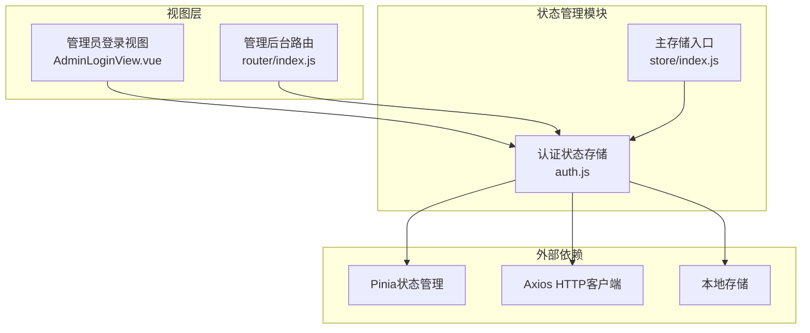
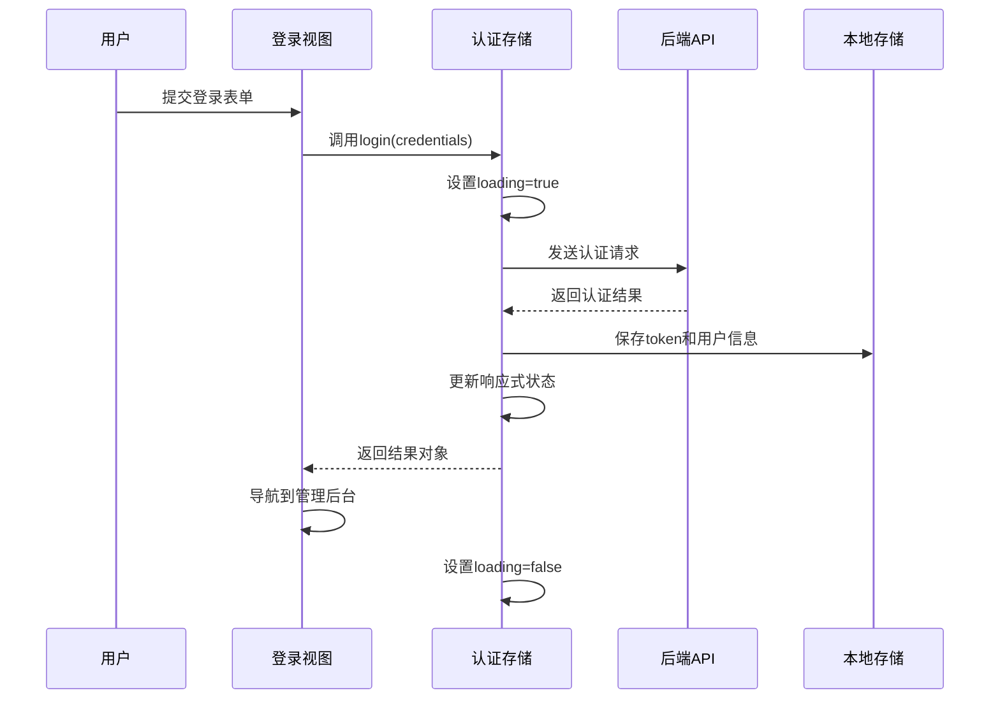
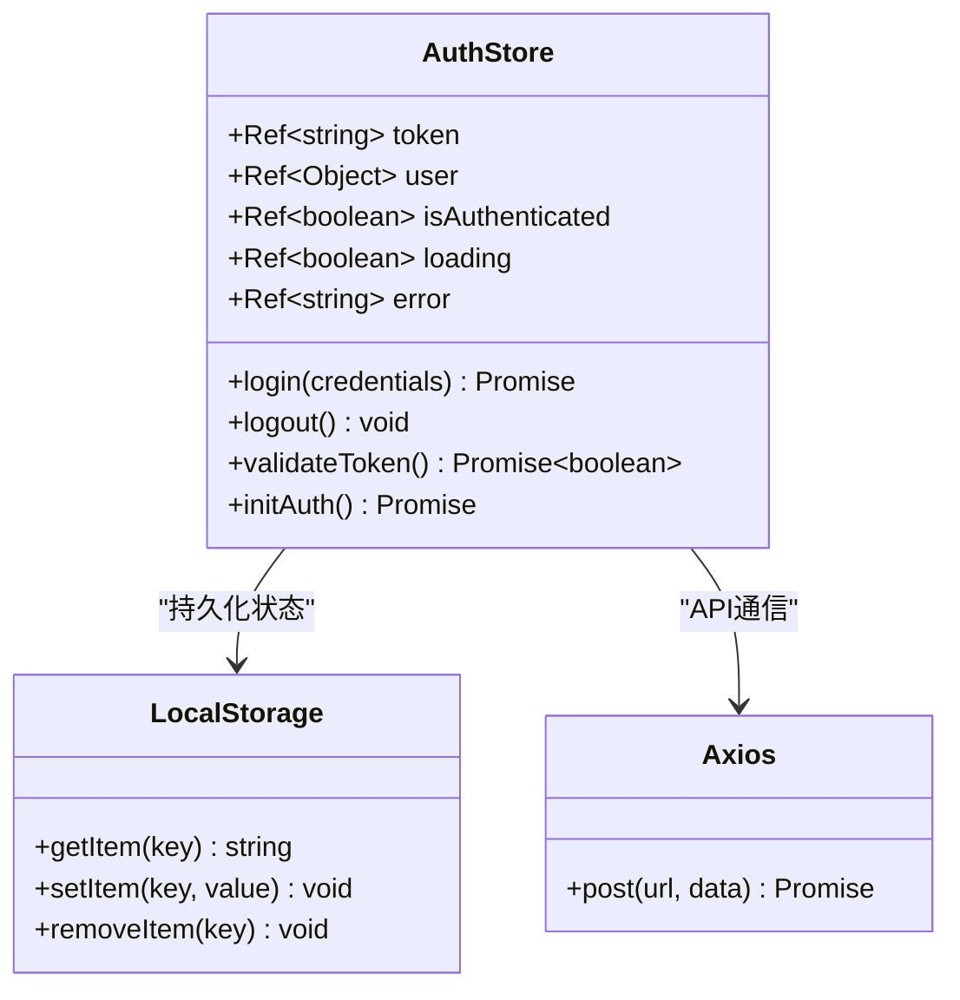
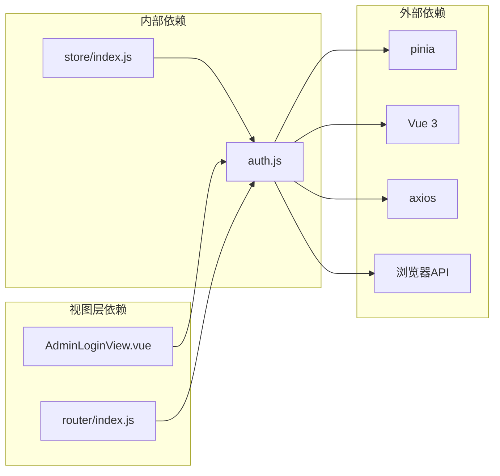

# 认证状态管理模块

<cite>
**本文档引用的文件**
- [auth.js](file://src/store/modules/auth.js)
- [AdminLoginView.vue](file://src/views/admin/AdminLoginView.vue)
- [router/index.js](file://src/router/index.js)
- [store/index.js](file://src/store/index.js)
</cite>

## 目录
1. [简介](#简介)
2. [项目结构](#项目结构)
3. [核心组件](#核心组件)
4. [架构概览](#架构概览)
5. [详细组件分析](#详细组件分析)
6. [依赖关系分析](#依赖关系分析)
7. [性能考虑](#性能考虑)
8. [故障排除指南](#故障排除指南)
9. [结论](#结论)

## 简介

认证状态管理模块是基于Vue 3和Pinia的状态管理系统，专门设计用于管理管理员用户的认证状态。该模块提供了完整的认证生命周期管理，包括登录、登出、令牌验证和状态持久化等功能。通过响应式状态管理和本地存储机制，确保用户会话的连续性和安全性。

## 项目结构

认证状态管理模块位于项目的`src/store/modules/`目录下，采用模块化设计，便于维护和扩展。整个认证系统遵循单一职责原则，将认证相关的所有状态和操作集中在一个独立的模块中。



**图表来源**
- [auth.js](file://src/store/modules/auth.js#L1-L86)
- [store/index.js](file://src/store/index.js#L1-L5)

## 核心组件

认证状态管理模块的核心组件包括响应式状态变量、认证方法和状态持久化机制。这些组件协同工作，提供完整的认证服务。

**章节来源**
- [auth.js](file://src/store/modules/auth.js#L1-L86)

## 架构概览

认证状态管理模块采用现代化的前端架构模式，结合Vue 3的组合式API和Pinia的状态管理库，构建了一个高效、可维护的认证系统。



**图表来源**
- [auth.js](file://src/store/modules/auth.js#L12-L37)
- [AdminLoginView.vue](file://src/views/admin/AdminLoginView.vue#L47-L52)

## 详细组件分析

### 响应式状态定义与初始化

认证状态管理模块使用Pinia的`defineStore`函数创建认证存储，包含以下核心响应式状态：

```javascript
const token = ref(localStorage.getItem('admin-token') || '')
const user = ref(JSON.parse(localStorage.getItem('admin-user') || '{}'))
const isAuthenticated = ref(!!token.value)
const loading = ref(false)
const error = ref(null)
```

这些状态变量具有以下特点：
- **token**: 存储JWT令牌，从本地存储初始化
- **user**: 存储用户信息对象，支持JSON序列化
- **isAuthenticated**: 基于token值计算的认证状态
- **loading**: 表示认证操作的加载状态
- **error**: 存储认证过程中的错误信息



**图表来源**
- [auth.js](file://src/store/modules/auth.js#L6-L10)
- [auth.js](file://src/store/modules/auth.js#L12-L37)

### 登录方法完整流程

登录方法实现了完整的认证流程，包括错误处理和状态更新：

```javascript
const login = async (credentials) => {
  loading.value = true
  error.value = null
  
  try {
    const response = await axios.post('/api/auth/login', credentials)
    
    if (response.data.token) {
      token.value = response.data.token
      user.value = response.data.user
      isAuthenticated.value = true
      
      localStorage.setItem('admin-token', token.value)
      localStorage.setItem('admin-user', JSON.stringify(user.value))
      
      return { success: true }
    } else {
      throw new Error('认证失败')
    }
  } catch (e) {
    error.value = e.message || '登录失败，请检查账号和密码'
    return { success: false, error: error.value }
  } finally {
    loading.value = false
  }
}
```

该方法的关键特性：
1. **状态管理**: 设置加载状态并在操作完成后重置
2. **错误处理**: 捕获网络错误和认证失败
3. **状态持久化**: 将认证信息保存到本地存储
4. **响应格式**: 返回标准化的成功/失败结果对象

**章节来源**
- [auth.js](file://src/store/modules/auth.js#L12-L37)

### 登出功能实现

登出功能负责清理所有认证状态和本地存储数据：

```javascript
const logout = () => {
  token.value = ''
  user.value = {}
  isAuthenticated.value = false
  
  localStorage.removeItem('admin-token')
  localStorage.removeItem('admin-user')
}
```

此实现确保：
- **状态清理**: 清空所有响应式状态
- **数据清理**: 移除本地存储中的敏感信息
- **一致性保证**: 维护状态和存储的一致性

**章节来源**
- [auth.js](file://src/store/modules/auth.js#L39-L46)

### 令牌验证机制

令牌验证功能用于检查现有令牌的有效性：

```javascript
const validateToken = async () => {
  if (!token.value) return false
  
  try {
    const response = await axios.post('/api/auth/validate', { token: token.value })
    return response.data.valid
  } catch (e) {
    logout()
    return false
  }
}
```

验证机制的特点：
- **条件检查**: 仅在存在有效令牌时执行验证
- **自动清理**: 验证失败时自动登出
- **异常处理**: 处理网络错误和服务器异常

**章节来源**
- [auth.js](file://src/store/modules/auth.js#L48-L57)

### 初始化认证状态

初始化方法在应用启动时恢复之前的认证状态：

```javascript
const initAuth = async () => {
  if (token.value) {
    const isValid = await validateToken()
    isAuthenticated.value = isValid
    if (!isValid) logout()
  }
}
```

初始化流程：
1. **令牌检查**: 检查是否存在本地存储的令牌
2. **有效性验证**: 调用验证接口确认令牌有效性
3. **状态同步**: 根据验证结果更新认证状态
4. **清理机制**: 无效令牌时自动清理

**章节来源**
- [auth.js](file://src/store/modules/auth.js#L59-L65)

### 管理员登录视图集成

管理员登录视图展示了如何在实际应用中使用认证存储：

```javascript
const login = async () => {
  const result = await authStore.login(credentials)
  if (result.success) {
    router.push('/admin')
  }
}
```

视图组件的关键特性：
- **状态绑定**: 使用`storeToRefs`解构认证状态
- **表单处理**: 收集用户输入的凭据信息
- **导航控制**: 成功登录后导航到管理后台
- **错误显示**: 显示认证过程中的错误信息

**章节来源**
- [AdminLoginView.vue](file://src/views/admin/AdminLoginView.vue#L47-L52)

### 路由守卫权限控制

路由配置中包含了基于认证状态的权限控制：

```javascript
router.beforeEach((to, from, next) => {
  if (to.matched.some(record => record.meta.requiresAuth)) {
    const isLoggedIn = localStorage.getItem('admin-token')
    if (!isLoggedIn) {
      next({ name: 'admin-login' })
    } else {
      next()
    }
  } else {
    next()
  }
})
```

路由守卫的功能：
- **权限检查**: 检查目标路由是否需要认证
- **状态验证**: 使用本地存储检查认证状态
- **重定向逻辑**: 未认证时重定向到登录页面
- **无权限访问**: 允许访问公开路由

**章节来源**
- [router/index.js](file://src/router/index.js#L95-L110)

## 依赖关系分析

认证状态管理模块的依赖关系清晰明确，避免了循环依赖问题：



**图表来源**
- [auth.js](file://src/store/modules/auth.js#L1-L3)
- [store/index.js](file://src/store/index.js#L1-L5)

**章节来源**
- [auth.js](file://src/store/modules/auth.js#L1-L86)
- [store/index.js](file://src/store/index.js#L1-L5)

## 性能考虑

认证状态管理模块在设计时充分考虑了性能优化：

1. **响应式优化**: 使用Pinia的响应式系统，只在状态变化时触发重新渲染
2. **本地存储**: 减少不必要的API调用，提高应用启动速度
3. **错误缓存**: 避免重复的认证失败请求
4. **内存管理**: 及时清理过期的认证信息

## 故障排除指南

### 常见问题及解决方案

1. **登录失败**
   - 检查网络连接和API端点
   - 验证用户名和密码的正确性
   - 查看浏览器控制台的错误信息

2. **认证状态不一致**
   - 清除浏览器本地存储
   - 检查localStorage权限设置
   - 验证令牌格式和有效期

3. **路由重定向问题**
   - 检查路由配置中的meta字段
   - 验证localStorage中是否存在令牌
   - 确认路由守卫的逻辑正确性

**章节来源**
- [auth.js](file://src/store/modules/auth.js#L25-L37)
- [router/index.js](file://src/router/index.js#L95-L110)

## 结论

认证状态管理模块是一个设计精良、功能完整的认证系统，它成功地将Vue 3的响应式编程模型与Pinia的状态管理相结合。该模块不仅提供了基本的认证功能，还包含了错误处理、状态持久化和权限控制等高级特性。

模块的主要优势包括：
- **简洁明了**: API设计直观易懂
- **健壮可靠**: 完善的错误处理和状态管理
- **易于维护**: 模块化设计便于扩展和修改
- **性能优秀**: 最小化不必要的重新渲染和API调用

通过这个认证状态管理模块，开发者可以轻松构建安全可靠的管理员后台系统，为用户提供流畅的认证体验。