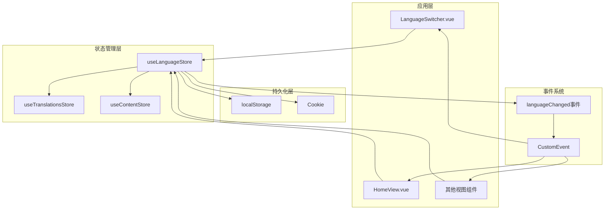
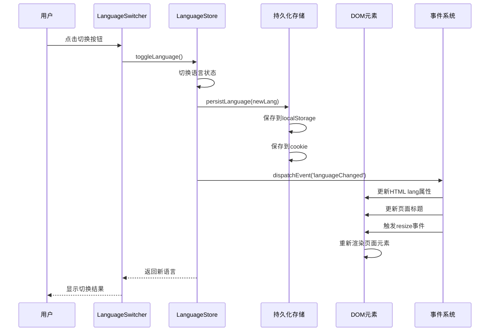
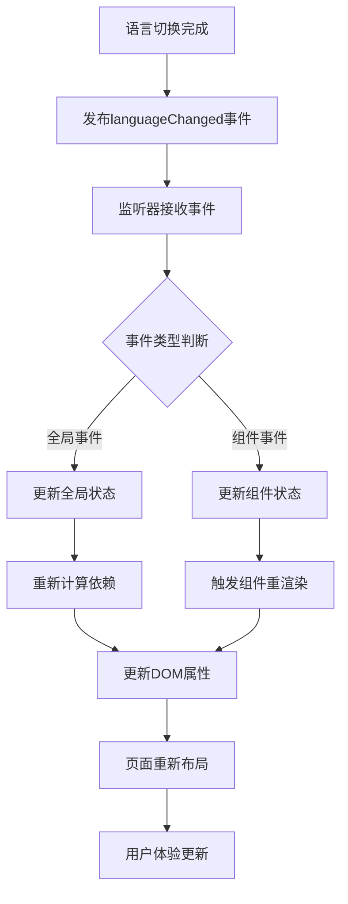
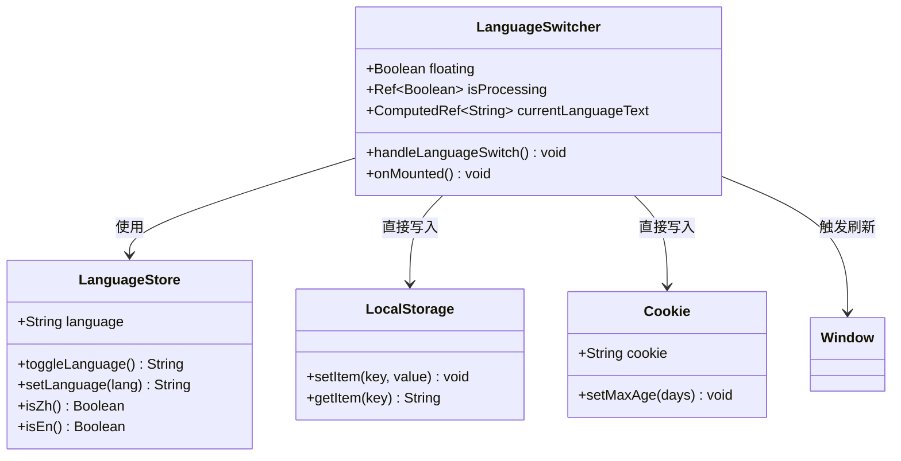

# 语言状态管理模块

<cite>
**本文档中引用的文件**
- [src/store/modules/language.js](file://src/store/modules/language.js)
- [src/components/LanguageSwitcher.vue](file://src/components/LanguageSwitcher.vue)
- [src/mixins/language.js](file://src/mixins/language.js)
- [src/main.js](file://src/main.js)
- [src/store/modules/translations.js](file://src/store/modules/translations.js)
- [src/plugins/i18n.js](file://src/plugins/i18n.js)
- [src/views/HomeView.vue](file://src/views/HomeView.vue)
- [package.json](file://package.json)
</cite>

## 目录
1. [项目概述](#项目概述)
2. [核心架构](#核心架构)
3. [语言状态持久化机制](#语言状态持久化机制)
4. [语言切换逻辑](#语言切换逻辑)
5. [UI更新链路](#ui更新链路)
6. [辅助方法详解](#辅助方法详解)
7. [组件集成分析](#组件集成分析)
8. [性能优化策略](#性能优化策略)
9. [故障排除指南](#故障排除指南)
10. [总结](#总结)

## 项目概述

该项目是一个基于Vue 3和Pinia的状态管理语言切换系统，专为多语言网站设计。系统采用双重存储策略（localStorage和cookie）确保语言设置的持久性，通过事件驱动的方式实现实时的UI更新，为用户提供流畅的多语言体验。

### 核心特性

- **双重持久化存储**：同时保存到localStorage和cookie，确保数据可靠性
- **智能回退机制**：当主要存储失效时自动回退到备用存储
- **事件驱动更新**：通过自定义事件实现组件间的解耦通信
- **渐进式刷新**：采用分阶段的页面刷新策略，提升用户体验
- **完整生命周期管理**：从初始化到销毁的全过程状态管理

## 核心架构



**图表来源**
- [src/store/modules/language.js](file://src/store/modules/language.js#L1-L215)
- [src/components/LanguageSwitcher.vue](file://src/components/LanguageSwitcher.vue#L1-L184)

## 语言状态持久化机制

### getPersistedLanguage函数分析

`getPersistedLanguage`函数实现了智能的语言设置读取策略，采用三重检查机制确保数据完整性：

```javascript
function getPersistedLanguage() {
  let lang = null;
  
  // 首先从localStorage读取
  try {
    lang = localStorage.getItem('language');
    console.log('从localStorage读取语言:', lang);
  } catch (e) {
    console.error('从localStorage读取语言失败:', e);
  }
  
  // 如果localStorage没有，尝试从cookie读取
  if (!lang || (lang !== 'zh' && lang !== 'en')) {
    try {
      const cookies = document.cookie.split(';');
      for (let cookie of cookies) {
        const [name, value] = cookie.trim().split('=');
        if (name === 'language') {
          lang = value;
          console.log('从cookie读取语言:', lang);
          break;
        }
      }
    } catch (e) {
      console.error('从cookie读取语言失败:', e);
    }
  }
  
  // 如果都没有或无效，使用默认值'zh'
  if (!lang || (lang !== 'zh' && lang !== 'en')) {
    lang = 'zh';
    console.log('使用默认语言:', lang);
  }
  
  return lang;
}
```

**关键特性：**

1. **错误隔离**：每个存储读取操作都在独立的try-catch块中进行
2. **智能验证**：不仅检查是否存在，还验证值的有效性（必须是'zh'或'en'）
3. **回退机制**：当主要存储失效时自动尝试备用存储
4. **默认保护**：确保始终返回有效的语言值

### persistLanguage函数分析

`persistLanguage`函数实现了双重存储写入策略，确保语言设置的可靠性：

```javascript
function persistLanguage(lang) {
  if (lang !== 'zh' && lang !== 'en') {
    console.warn('无效的语言值，不保存:', lang);
    return;
  }
  
  // 保存到localStorage
  try {
    localStorage.setItem('language', lang);
    console.log('已保存到localStorage:', localStorage.getItem('language'));
  } catch (e) {
    console.error('保存到localStorage失败:', e);
  }
  
  // 同时保存到cookie，作为备份
  try {
    document.cookie = `language=${lang}; path=/; max-age=${60*60*24*30}`; // 30天过期
    console.log('已保存到cookie');
  } catch (e) {
    console.error('保存到cookie失败:', e);
  }
}
```

**容错设计特点：**

1. **输入验证**：严格检查语言值的有效性
2. **双重写入**：同时写入两个存储位置
3. **错误处理**：每个写入操作都有独立的错误处理
4. **过期策略**：cookie设置30天有效期，平衡持久性和清理

**章节来源**
- [src/store/modules/language.js](file://src/store/modules/language.js#L1-L60)

## 语言切换逻辑

### toggleLanguage方法详解

`toggleLanguage`方法是语言切换的核心逻辑，实现了完整的状态转换流程：



**图表来源**
- [src/store/modules/language.js](file://src/store/modules/language.js#L62-L120)
- [src/components/LanguageSwitcher.vue](file://src/components/LanguageSwitcher.vue#L40-L100)

### 切换流程的关键步骤

1. **状态计算**：根据当前语言计算新语言
2. **持久化保存**：调用`persistLanguage`保存到两个存储
3. **状态更新**：更新Pinia store中的语言状态
4. **事件发布**：触发`languageChanged`自定义事件
5. **DOM更新**：更新HTML lang属性和页面元信息
6. **页面刷新**：通过多种方式强制页面重新渲染

### setLanguage方法对比

`setLanguage`方法提供了直接设置特定语言的功能：

```javascript
const setLanguage = (lang) => {
  if (lang === 'zh' || lang === 'en') {
    console.log('设置语言为:', lang);
    
    // 使用增强的持久化保存方法
    persistLanguage(lang);
    
    // 更新状态
    language.value = lang;
    
    // 发布语言变化事件
    document.dispatchEvent(new CustomEvent('languageChanged', { detail: lang }));
    
    // 更新HTML标签的lang属性
    updateHtmlLang();
    return lang;
  }
  return language.value;
}
```

**章节来源**
- [src/store/modules/language.js](file://src/store/modules/language.js#L62-L120)

## UI更新链路

### HTML属性更新机制

`updateHtmlLang`方法负责更新页面的HTML语言属性和元信息：

```javascript
const updateHtmlLang = () => {
  const htmlRoot = document.getElementById('htmlRoot') || document.documentElement;
  if (htmlRoot) {
    htmlRoot.setAttribute('lang', language.value === 'zh' ? 'zh-CN' : 'en');
    console.log('已更新HTML lang属性:', htmlRoot.getAttribute('lang'));
  }
  
  // 更新页面标题和描述
  if (language.value === 'zh') {
    document.title = '朗德智能 - 智能无人机与反无人机解决方案提供商';
    document.querySelector('meta[name="description"]')?.setAttribute('content', 
      '朗德智能科技是领先的无人机系统及反无人机解决方案提供商，致力于空域安全防护');
  } else {
    document.title = 'Lande Intelligent - Smart Drone and Anti-Drone Solution Provider';
    document.querySelector('meta[name="description"]')?.setAttribute('content', 
      'Lande Intelligent Technology is a leading provider of drone systems and anti-drone solutions, committed to airspace security protection');
  }
}
```

### 事件驱动的UI更新

系统采用事件驱动模式实现组件间的解耦通信：



**图表来源**
- [src/plugins/i18n.js](file://src/plugins/i18n.js#L40-L71)

### 渐进式页面刷新策略

为了确保页面完全响应语言变化，系统采用了多层次的刷新策略：

```javascript
setTimeout(() => {
  // 触发窗口resize事件，使页面重新计算布局
  window.dispatchEvent(new Event('resize'));
  
  // 强制重新渲染页面元素
  document.querySelectorAll('.page-content').forEach(el => {
    // 微小改变opacity以触发重绘
    el.style.opacity = '0.99';
    setTimeout(() => {
      el.style.opacity = '1';
    }, 10);
  });
  
  // 尝试重新加载页面内容区域
  const contentElements = document.querySelectorAll('.news-list, .tech-sections, .case-grid');
  contentElements.forEach(el => {
    // 临时添加class触发重绘
    el.classList.add('language-changed');
    setTimeout(() => {
      el.classList.remove('language-changed');
    }, 50);
  });
}, 50);
```

**章节来源**
- [src/store/modules/language.js](file://src/store/modules/language.js#L122-L150)

## 辅助方法详解

### currentLanguageText计算属性

`currentLanguageText`方法实现了切换按钮文案的动态显示：

```javascript
// 当前语言文字显示
const currentLanguageText = () => {
  return language.value === 'zh' ? 'EN' : '中'
}
```

这个方法的巧妙之处在于：
- **双向显示**：中文环境下显示"EN"，英文环境下显示"中"
- **用户体验**：让用户知道当前正在使用的语言
- **简洁明了**：只显示语言缩写，节省空间

### isZh和isEn辅助方法

这两个方法提供了便捷的语言判断功能：

```javascript
// 判断是否为中文
const isZh = () => language.value === 'zh'

// 判断是否为英文
const isEn = () => language.value === 'en'
```

**应用场景：**
- 条件渲染：根据语言显示不同的内容
- 功能开关：启用或禁用特定功能
- 数据格式化：根据语言调整日期、数字等格式

### useLanguage混入分析

`useLanguage`混入提供了丰富的语言相关功能：

```javascript
export function useLanguage() {
  // 使用store
  const languageStore = useLanguageStore()
  const translationsStore = useTranslationsStore()
  
  // 当前语言
  const currentLanguage = computed(() => languageStore.language)
  
  // 是否为中文
  const isZh = computed(() => languageStore.isZh())
  
  // 是否为英文
  const isEn = computed(() => languageStore.isEn())
  
  // 切换语言
  const toggleLanguage = () => languageStore.toggleLanguage()
  
  // 设置特定语言
  const setLanguage = (lang) => languageStore.setLanguage(lang)
  
  // 获取翻译内容
  const getUI = () => translationsStore.getUI(currentLanguage.value)
  const getNavItems = () => translationsStore.getNavItems(currentLanguage.value)
  const getFooterData = () => translationsStore.getFooterData(currentLanguage.value)
  
  return {
    currentLanguage,
    isZh,
    isEn,
    toggleLanguage,
    setLanguage,
    getUI,
    getNavItems,
    getFooterData
  }
}
```

**章节来源**
- [src/store/modules/language.js](file://src/store/modules/language.js#L152-L180)
- [src/mixins/language.js](file://src/mixins/language.js#L1-L50)

## 组件集成分析

### LanguageSwitcher组件分析

`LanguageSwitcher.vue`组件展示了语言切换按钮的完整实现：



**图表来源**
- [src/components/LanguageSwitcher.vue](file://src/components/LanguageSwitcher.vue#L1-L50)
- [src/store/modules/language.js](file://src/store/modules/language.js#L1-L30)

### 组件生命周期管理

组件在挂载时执行以下初始化操作：

```javascript
onMounted(() => {
  // 将路由实例暴露给全局，以便language-refresh.js可以访问
  window.__vueRouter = router;
  
  // 组件挂载时检查语言设置
  console.log('LanguageSwitcher挂载，当前语言:', languageStore.language, '，localStorage中:', localStorage.getItem('language'));
  
  // 确保localStorage和store一致
  if (localStorage.getItem('language') !== languageStore.language) {
    console.log('警告：localStorage和store不一致，同步为:', languageStore.language);
    localStorage.setItem('language', languageStore.language);
  }
})
```

### 防重复点击机制

组件实现了防重复点击的保护机制：

```javascript
const handleLanguageSwitch = () => {
  if (isProcessing.value) {
    console.log('语言切换正在处理中，忽略重复点击');
    return;
  }
  
  isProcessing.value = true;
  // ... 切换逻辑
}
```

**章节来源**
- [src/components/LanguageSwitcher.vue](file://src/components/LanguageSwitcher.vue#L40-L120)

## 性能优化策略

### 存储访问优化

系统采用了多种策略来优化存储访问性能：

1. **缓存机制**：在内存中缓存语言设置
2. **批量操作**：同时更新多个存储位置
3. **异步处理**：非关键操作采用异步执行
4. **条件写入**：只有在必要时才执行写入操作

### 事件处理优化

事件系统的优化策略：

```javascript
// 添加语言变化监听器
const updateText = () => {
  const currentUi = translationsStore.getUI(languageStore.language)
  el.textContent = currentUi[binding.value] || binding.value
}

// 保存监听器引用以便清除
el._i18nHandler = () => updateText()
document.addEventListener('languageChanged', el._i18nHandler)
```

### 页面刷新优化

系统采用渐进式的页面刷新策略，避免全页面重载：

1. **局部刷新**：只刷新需要更新的组件
2. **延迟处理**：使用setTimeout避免阻塞主线程
3. **渐进增强**：逐步应用样式变化
4. **资源复用**：重用已加载的资源

## 故障排除指南

### 常见问题诊断

1. **语言设置丢失**
   - 检查localStorage是否可用
   - 验证cookie设置是否正确
   - 查看浏览器隐私设置

2. **切换后页面不更新**
   - 检查languageChanged事件是否正常触发
   - 验证DOM元素的监听器是否正确绑定
   - 确认CSS类名是否正确应用

3. **性能问题**
   - 监控事件监听器的数量
   - 检查是否有内存泄漏
   - 优化重绘和重排操作

### 调试工具和技巧

系统提供了详细的调试日志：

```javascript
// 在各个关键点添加日志输出
console.log('从localStorage读取语言:', lang);
console.log('从cookie读取语言:', lang);
console.log('使用默认语言:', lang);
console.log('切换语言，当前语言:', language.value);
console.log('触发languageChanged事件:', newLang);
```

### 错误恢复机制

系统具备多层次的错误恢复能力：

1. **存储层恢复**：当一个存储失效时自动切换到另一个
2. **状态层恢复**：通过watch监听确保状态一致性
3. **UI层恢复**：通过事件重试机制确保界面更新

**章节来源**
- [src/main.js](file://src/main.js#L1-L100)
- [src/store/modules/language.js](file://src/store/modules/language.js#L181-L215)

## 总结

该语言状态管理模块展现了现代前端应用中状态管理的最佳实践：

### 核心优势

1. **可靠性**：双重存储策略确保数据持久性
2. **性能**：事件驱动架构减少不必要的重渲染
3. **可维护性**：清晰的职责分离和模块化设计
4. **用户体验**：渐进式刷新和即时反馈机制

### 设计亮点

- **容错设计**：完善的错误处理和回退机制
- **解耦架构**：通过事件系统实现组件间解耦
- **渐进增强**：分阶段的更新策略提升用户体验
- **统一接口**：标准化的API设计便于扩展

### 扩展建议

1. **国际化扩展**：支持更多语言和地区变体
2. **配置化**：允许运行时配置存储策略
3. **监控集成**：添加性能监控和错误追踪
4. **测试覆盖**：完善单元测试和集成测试

这个语言状态管理模块不仅解决了多语言网站的核心需求，更为整个应用的国际化奠定了坚实的基础，体现了现代前端开发中对用户体验和技术架构的平衡追求。