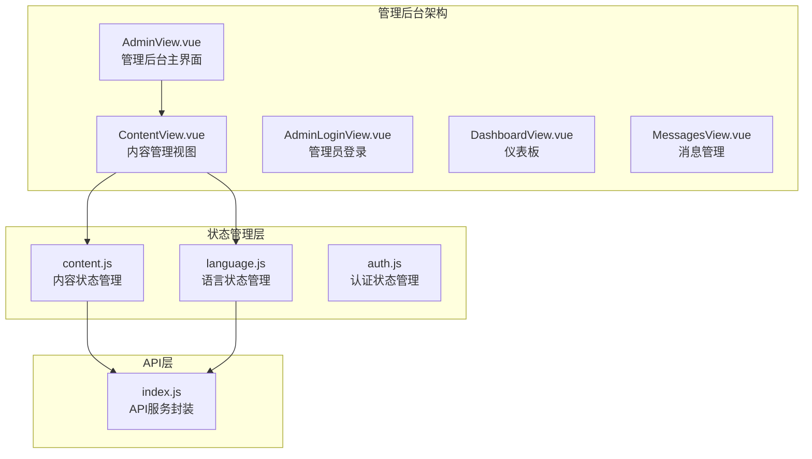
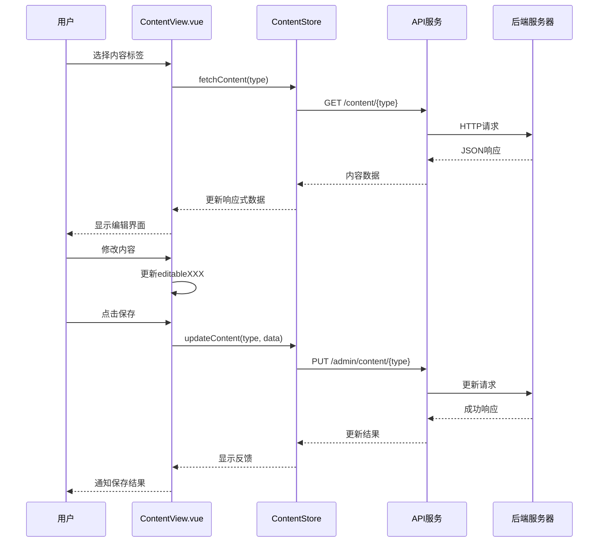
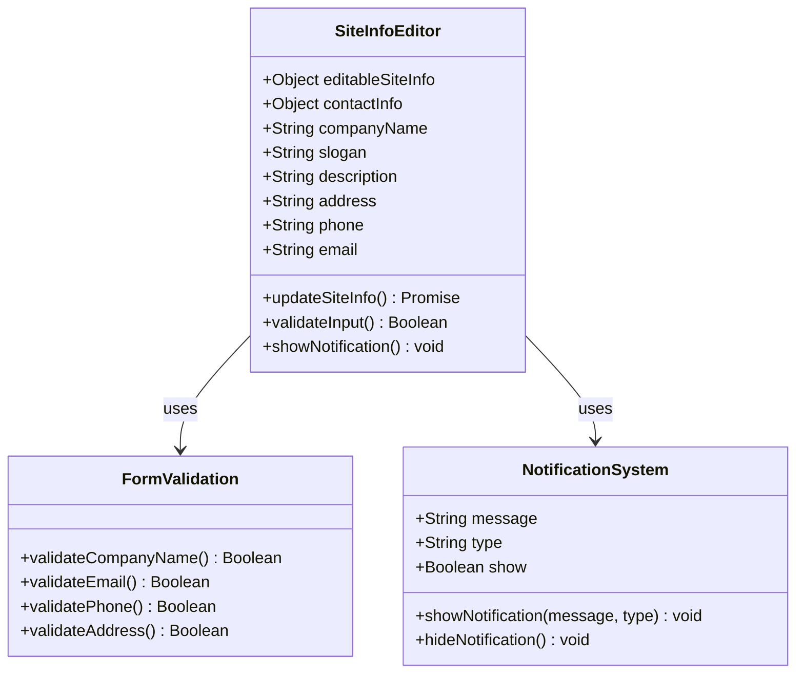
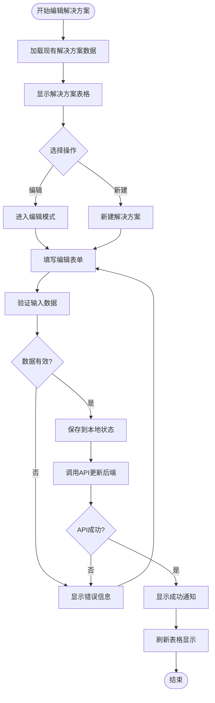
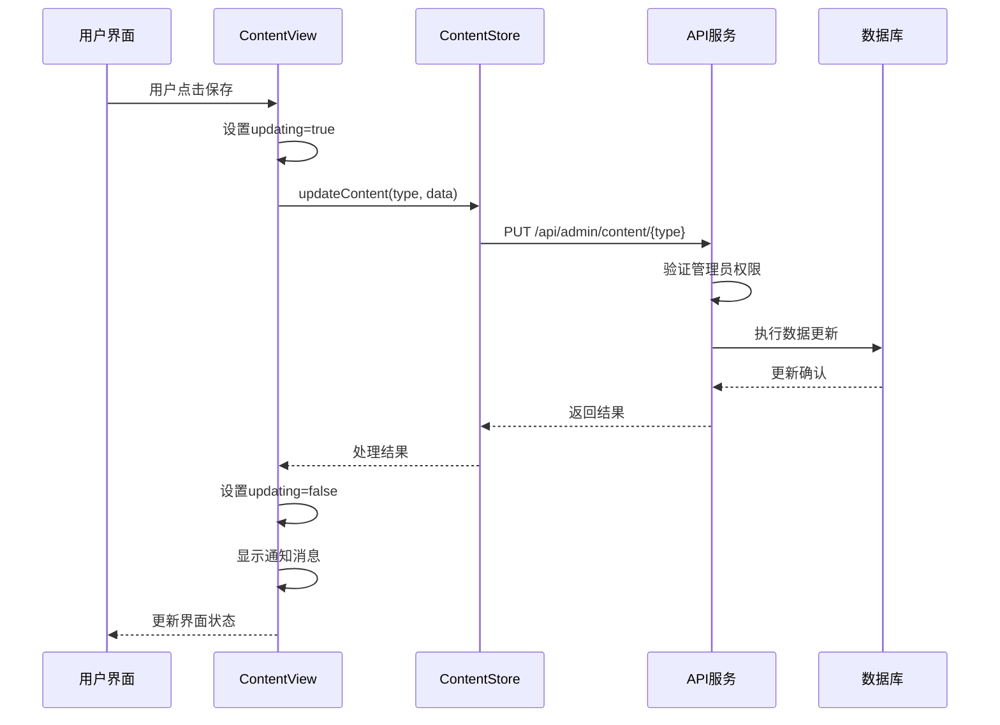
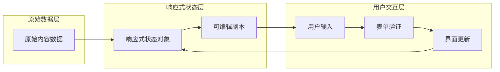
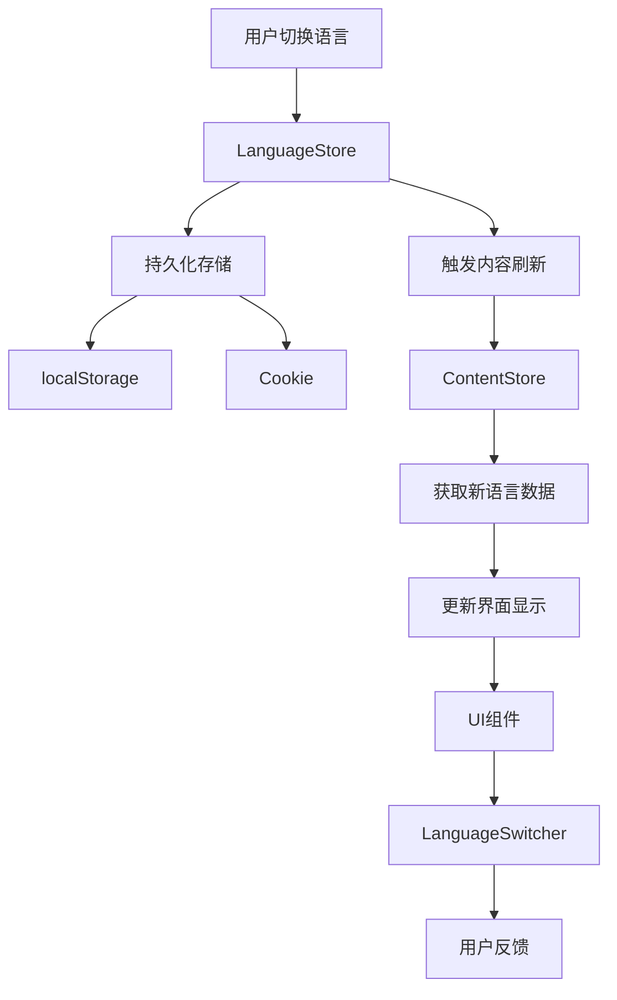

# 内容管理视图

<cite>
**本文档引用的文件**
- [ContentView.vue](file://src/views/admin/ContentView.vue)
- [content.js](file://src/store/modules/content.js)
- [language.js](file://src/mixins/language.js)
- [language.js](file://src/store/modules/language.js)
- [index.js](file://src/api/index.js)
- [main.js](file://src/main.js)
- [App.vue](file://src/App.vue)
</cite>

## 目录
1. [简介](#简介)
2. [项目结构概览](#项目结构概览)
3. [核心组件分析](#核心组件分析)
4. [架构概览](#架构概览)
5. [详细组件分析](#详细组件分析)
6. [数据流分析](#数据流分析)
7. [多语言支持机制](#多语言支持机制)
8. [性能考虑](#性能考虑)
9. [故障排除指南](#故障排除指南)
10. [结论](#结论)

## 简介

ContentView.vue是系统的核心内容管理界面，为管理员提供了全面的站点内容编辑功能。该组件作为管理后台的主要界面，允许用户对网站的各种内容进行实时编辑和管理，包括网站基本信息、解决方案、核心技术、典型案例、新闻资讯、关于我们和招聘信息等模块。

该组件采用了现代化的Vue 3 Composition API设计模式，结合Pinia状态管理库，实现了响应式的数据绑定和高效的组件交互。通过精心设计的标签页系统，用户可以轻松地在不同的内容类别之间切换，每个标签页都提供了专门的编辑界面和操作控件。

## 项目结构概览

ContentView.vue位于管理后台的视图层，与其他核心组件形成了清晰的分层架构：



**图表来源**
- [ContentView.vue](file://src/views/admin/ContentView.vue#L1-L328)
- [content.js](file://src/store/modules/content.js#L1-L648)
- [language.js](file://src/store/modules/language.js#L1-L215)

**章节来源**
- [ContentView.vue](file://src/views/admin/ContentView.vue#L1-L328)
- [main.js](file://src/main.js#L1-L199)

## 核心组件分析

ContentView.vue组件采用了模块化的设计思想，将不同的内容管理功能分离到独立的标签页中。每个标签页都对应着网站的一个主要功能模块：

### 标签页系统

组件定义了七个主要的标签页，每个标签页都有明确的功能定位：

```javascript
const tabs = [
  { id: 'site-info', name: '网站信息' },
  { id: 'solutions', name: '解决方案' },
  { id: 'technologies', name: '核心技术' },
  { id: 'cases', name: '典型案例' },
  { id: 'news', name: '新闻资讯' },
  { id: 'about', name: '关于我们' },
  { id: 'jobs', name: '招聘信息' }
]
```

这种设计使得管理员可以：
- **按需访问**：根据需要选择要编辑的内容类别
- **界面简洁**：每次只显示相关的编辑控件
- **操作直观**：每个标签页都有明确的功能标识

### 数据绑定机制

组件使用了Vue 3的响应式系统来管理编辑状态：

```javascript
// 可编辑的数据对象
const editableSiteInfo = reactive({ ...siteInfo.value })
const editableSolutions = ref([...solutions.value])
const currentSolution = reactive({})
```

这种设计确保了：
- **双向数据绑定**：用户输入会实时反映到数据模型中
- **状态隔离**：原始数据保持不变，只有编辑副本会被修改
- **内存效率**：只复制必要的数据结构

**章节来源**
- [ContentView.vue](file://src/views/admin/ContentView.vue#L70-L120)
- [content.js](file://src/store/modules/content.js#L40-L100)

## 架构概览

ContentView.vue组件遵循了现代前端应用的最佳实践，采用了分层架构设计：



**图表来源**
- [ContentView.vue](file://src/views/admin/ContentView.vue#L150-L200)
- [content.js](file://src/store/modules/content.js#L500-L550)
- [index.js](file://src/api/index.js#L40-L60)

## 详细组件分析

### 网站基本信息编辑

网站基本信息编辑是最基础的内容管理功能，包含了公司核心信息的维护：



**图表来源**
- [ContentView.vue](file://src/views/admin/ContentView.vue#L15-L60)
- [content.js](file://src/store/modules/content.js#L40-L80)

网站基本信息包含以下核心字段：
- **公司名称**：显示在网站头部和标题栏
- **公司口号**：体现企业核心价值的简短描述
- **网站描述**：SEO优化的重要内容
- **联系信息**：包括地址、电话、邮箱等

### 解决方案管理系统

解决方案管理是系统的核心功能之一，支持对无人机相关解决方案的完整生命周期管理：



**图表来源**
- [ContentView.vue](file://src/views/admin/ContentView.vue#L65-L150)
- [content.js](file://src/store/modules/content.js#L80-L150)

解决方案数据结构包括：
- **唯一标识符**：用于区分不同解决方案
- **标题**：简短的解决方案名称
- **简短描述**：概述解决方案的核心功能
- **详细内容**：深入的技术说明和应用场景
- **图片URL**：展示解决方案的视觉素材

### 通用内容更新机制

ContentView.vue实现了统一的内容更新机制，确保所有内容类型的更新操作都遵循相同的流程：



**图表来源**
- [ContentView.vue](file://src/views/admin/ContentView.vue#L150-L200)
- [content.js](file://src/store/modules/content.js#L550-L600)

**章节来源**
- [ContentView.vue](file://src/views/admin/ContentView.vue#L65-L200)
- [content.js](file://src/store/modules/content.js#L80-L200)

## 数据流分析

ContentView.vue的数据流设计体现了现代前端应用的响应式编程理念：

### 单向数据流

组件严格遵循单向数据流原则：

1. **数据初始化**：组件挂载时从Pinia store获取初始数据
2. **状态更新**：用户操作触发数据变更，更新本地响应式状态
3. **数据同步**：通过API服务将变更同步到后端数据库
4. **状态反馈**：接收后端响应，更新组件状态并显示用户反馈

### 状态管理策略



**图表来源**
- [ContentView.vue](file://src/views/admin/ContentView.vue#L100-L150)
- [content.js](file://src/store/modules/content.js#L40-L100)

这种设计的优势包括：
- **数据一致性**：避免了状态混乱和竞态条件
- **调试友好**：数据流向清晰，便于问题排查
- **性能优化**：Vue的响应式系统只更新必要的DOM节点

**章节来源**
- [ContentView.vue](file://src/views/admin/ContentView.vue#L100-L200)
- [content.js](file://src/store/modules/content.js#L40-L150)

## 多语言支持机制

ContentView.vue与系统的多语言支持机制紧密集成，确保内容管理功能能够正确处理多语言内容：

### 语言切换机制

系统通过多个层次的语言管理机制确保一致性：



**图表来源**
- [language.js](file://src/store/modules/language.js#L50-L150)
- [language.js](file://src/mixins/language.js#L10-L50)

### 内容数据的语言处理

ContentStore中的内容数据采用双语言结构：

```javascript
// 内容数据的语言结构
const siteInfo = reactive({
  zh: {
    companyName: '杭州朗德智能科技有限公司',
    slogan: '智能反无人机，守护空域安全',
    description: '领先的反无人机系统及反无人机解决方案提供商',
    contactInfo: {
      address: '浙江省杭州市滨江区科技园区创新大厦A座15楼',
      phone: '0571-8888 9999',
      email: 'info@landedrone.com'
    }
  },
  en: {
    companyName: 'Hangzhou Lande Intelligent Technology Co., Ltd.',
    slogan: 'Smart Anti-Drone Systems, Securing Airspace',
    description: 'Leading provider of anti-drone systems and solutions',
    contactInfo: {
      address: '15F, Building A, Innovation Tower, Science & Technology Park, Binjiang District, Hangzhou, Zhejiang',
      phone: '0571-8888 9999',
      email: 'info@landedrone.com'
    }
  }
})
```

### 语言切换的自动同步

当用户切换语言时，系统会自动：
1. **更新语言设置**：保存到localStorage和cookie
2. **触发内容刷新**：重新获取对应语言的内容数据
3. **更新界面显示**：切换所有可见文本的语言版本
4. **保持状态一致性**：确保编辑状态与新语言版本同步

**章节来源**
- [content.js](file://src/store/modules/content.js#L40-L100)
- [language.js](file://src/store/modules/language.js#L50-L150)
- [language.js](file://src/mixins/language.js#L10-L100)

## 性能考虑

ContentView.vue在设计时充分考虑了性能优化，采用了多种策略来确保良好的用户体验：

### 延迟加载策略

组件采用了智能的延迟加载机制：

```javascript
onMounted(async () => {
  // 初始加载所有内容数据
  await Promise.all([
    contentStore.fetchContent('site-info'),
    contentStore.fetchContent('solutions'),
    contentStore.fetchContent('technologies'),
    contentStore.fetchContent('cases'),
    contentStore.fetchContent('news'),
    contentStore.fetchContent('about'),
    contentStore.fetchContent('jobs')
  ])
  
  // 更新可编辑的数据
  Object.assign(editableSiteInfo, siteInfo.value)
  editableSolutions.value = [...solutions.value]
})
```

这种设计的优势：
- **并行加载**：同时获取多个内容类型的数据
- **用户体验**：减少首次渲染的等待时间
- **错误隔离**：某个内容加载失败不会影响其他内容

### 内存优化

组件采用了多种内存优化策略：

1. **浅拷贝优化**：只复制必要的数据结构
2. **响应式代理**：利用Vue的响应式系统减少不必要的DOM更新
3. **及时清理**：在组件卸载时清理事件监听器和定时器

### 界面渲染优化

```css
/* 使用CSS动画优化界面过渡效果 */
.content-tabs button {
  transition: var(--transition);
}

/* 防止重复渲染 */
.modal {
  /* 使用fixed定位减少重排 */
  position: fixed;
  /* 添加will-change属性优化动画性能 */
  will-change: transform;
}
```

## 故障排除指南

ContentView.vue组件在运行过程中可能会遇到各种问题，以下是常见的故障场景和解决方案：

### 常见问题诊断

#### 1. 内容加载失败

**症状**：页面显示空白或加载错误信息
**原因**：API请求失败或网络连接问题
**解决方案**：
- 检查浏览器开发者工具中的网络请求
- 验证后端服务是否正常运行
- 确认管理员权限是否正确

#### 2. 语言切换失效

**症状**：切换语言后界面文本没有变化
**原因**：语言状态不同步或缓存问题
**解决方案**：
```javascript
// 强制刷新语言状态
localStorage.setItem('language', 'zh')
document.cookie = 'language=zh; path=/; max-age=2592000'
location.reload()
```

#### 3. 保存操作失败

**症状**：点击保存按钮后没有反应或显示错误
**原因**：权限不足或数据格式错误
**解决方案**：
- 检查管理员登录状态
- 验证输入数据的完整性
- 查看控制台错误信息

### 调试技巧

#### 开发者工具使用

1. **Vue DevTools**：检查组件状态和Pinia store
2. **Network面板**：监控API请求和响应
3. **Console面板**：查看错误日志和调试信息

#### 日志记录

组件内置了详细的日志记录功能：

```javascript
console.log('ContentStore检测到语言变化，从', oldLang, '变为', newLang)
console.log('更新后的language.value:', language.value, '，类型:', typeof language.value)
```

这些日志可以帮助开发者快速定位问题。

**章节来源**
- [ContentView.vue](file://src/views/admin/ContentView.vue#L200-L250)
- [content.js](file://src/store/modules/content.js#L500-L550)

## 结论

ContentView.vue作为系统的核心内容管理界面，展现了现代前端应用开发的最佳实践。通过精心设计的架构和组件化思维，它成功地实现了：

### 主要优势

1. **模块化设计**：清晰的功能划分和职责分离
2. **响应式体验**：流畅的用户交互和即时的状态反馈
3. **多语言支持**：完善的国际化功能和语言切换机制
4. **性能优化**：智能的加载策略和内存管理
5. **错误处理**：健壮的异常处理和用户友好的反馈机制

### 技术亮点

- **Composition API**：充分利用Vue 3的新特性
- **Pinia状态管理**：现代化的状态管理模式
- **异步数据处理**：优雅的Promise和async/await使用
- **类型安全**：严格的类型检查和错误预防

### 应用场景

ContentView.vue适用于各种内容管理系统，特别是需要：
- **多语言支持**：面向国际用户的网站
- **实时编辑**：需要频繁更新内容的平台
- **管理员权限**：需要权限控制的后台系统
- **响应式设计**：适配多种设备的Web应用

该组件不仅满足了当前业务需求，也为未来的功能扩展奠定了坚实的基础。通过持续的优化和改进，它将继续为用户提供优秀的管理体验。