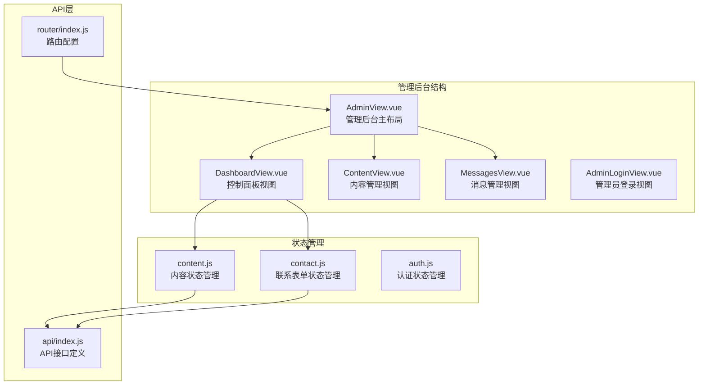
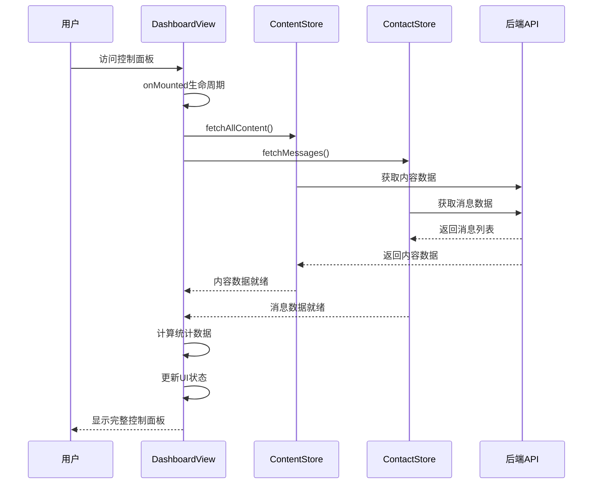
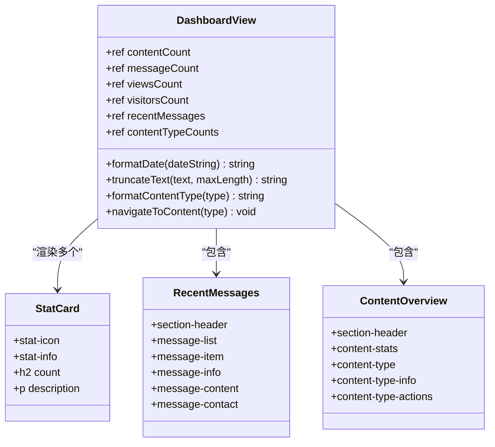
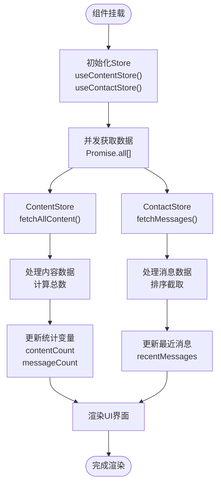
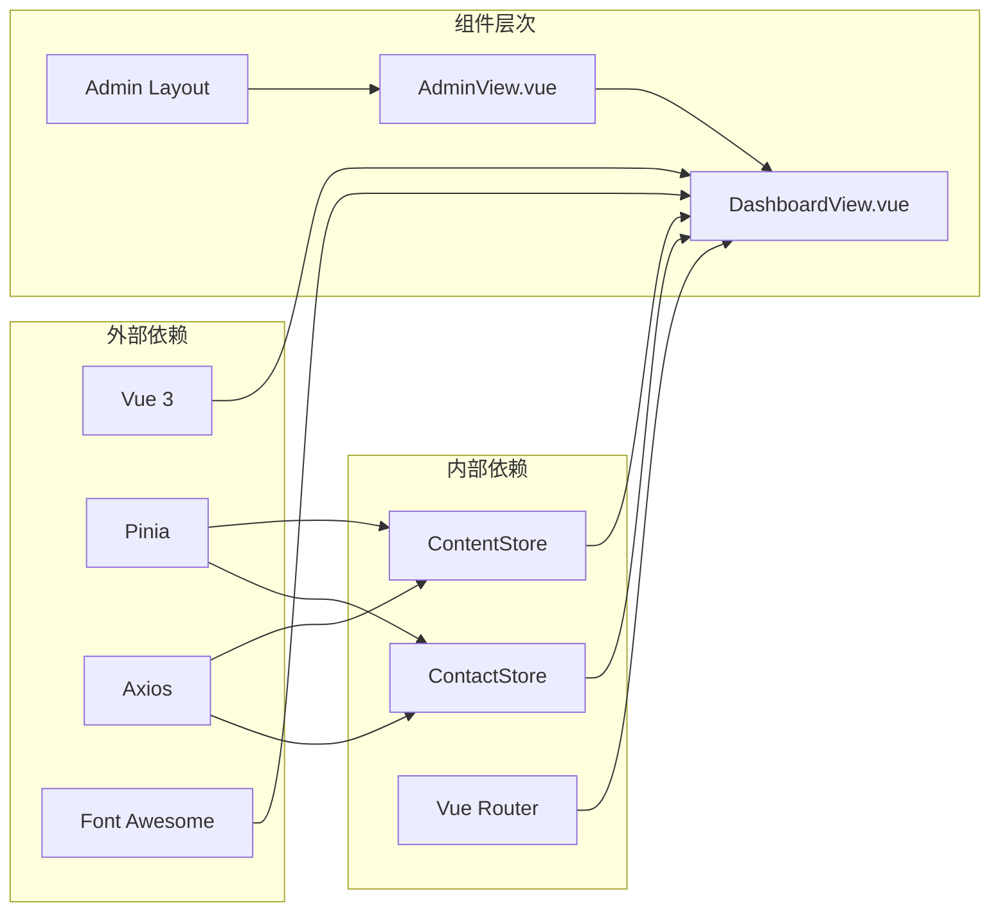

# 控制面板视图

<cite>
**本文档引用的文件**
- [DashboardView.vue](file://src/views/admin/DashboardView.vue)
- [content.js](file://src/store/modules/content.js)
- [contact.js](file://src/store/modules/contact.js)
- [main.css](file://src/assets/main.css)
- [index.js](file://src/api/index.js)
- [index.js](file://src/router/index.js)
</cite>

## 目录
1. [简介](#简介)
2. [项目结构](#项目结构)
3. [核心组件分析](#核心组件分析)
4. [架构概览](#架构概览)
5. [详细组件分析](#详细组件分析)
6. [依赖关系分析](#依赖关系分析)
7. [性能考虑](#性能考虑)
8. [故障排除指南](#故障排除指南)
9. [结论](#结论)

## 简介

DashboardView.vue是基于Vue 3和Pinia的状态管理系统的现代化控制面板组件，专门设计用于展示关键运营指标和管理功能。该组件通过聚合新闻数量、案例总数、用户消息统计等核心数据，以直观的卡片和图表形式呈现给管理员用户，提供了一个统一的数据可视化界面。

该组件采用了响应式设计原则，确保在不同屏幕尺寸下均能保持良好的可读性和用户体验。通过异步调用Pinia store模块获取统计数据，在数据加载过程中显示适当的等待状态，保证了系统的可靠性和用户体验。

## 项目结构

DashboardView.vue位于项目的管理后台视图目录中，作为整个管理系统的核心控制面板：



**图表来源**
- [DashboardView.vue](file://src/views/admin/DashboardView.vue#L1-L364)
- [content.js](file://src/store/modules/content.js#L1-L648)
- [contact.js](file://src/store/modules/contact.js#L1-L135)

**章节来源**
- [DashboardView.vue](file://src/views/admin/DashboardView.vue#L1-L364)
- [index.js](file://src/router/index.js#L1-L122)

## 核心组件分析

DashboardView.vue是一个功能完整的Vue 3组件，包含了以下核心功能模块：

### 统计卡片区域
组件首先展示四个关键统计指标卡片：
- **内容条目**：显示所有内容类型的总数量
- **联系消息**：统计收到的联系表单消息数量
- **页面浏览**：模拟的页面浏览统计（当前为随机值）
- **访问用户**：模拟的独立访客统计（当前为随机值）

### 最近消息区域
显示最新的5条联系消息，包含：
- 发送者姓名和联系方式
- 消息内容预览（截断显示）
- 发送时间格式化
- 查看全部链接

### 内容概览区域
展示各种内容类型的统计信息：
- 解决方案、核心技术、案例展示、新闻动态等类型
- 每种类型的具体数量统计
- 快速跳转到相应管理页面的功能按钮

**章节来源**
- [DashboardView.vue](file://src/views/admin/DashboardView.vue#L1-L100)
- [DashboardView.vue](file://src/views/admin/DashboardView.vue#L101-L200)

## 架构概览

DashboardView.vue采用了现代前端架构模式，结合了Vue 3的Composition API和Pinia状态管理：



**图表来源**
- [DashboardView.vue](file://src/views/admin/DashboardView.vue#L80-L100)
- [content.js](file://src/store/modules/content.js#L400-L450)
- [contact.js](file://src/store/modules/contact.js#L70-L90)

## 详细组件分析

### 组件结构与模板

DashboardView.vue采用语义化的HTML结构，配合CSS Grid布局实现响应式设计：



**图表来源**
- [DashboardView.vue](file://src/views/admin/DashboardView.vue#L1-L50)
- [DashboardView.vue](file://src/views/admin/DashboardView.vue#L101-L200)

### Pinia Store集成

组件通过Pinia实现了与后端数据的异步交互：



**图表来源**
- [DashboardView.vue](file://src/views/admin/DashboardView.vue#L80-L100)
- [content.js](file://src/store/modules/content.js#L400-L450)
- [contact.js](file://src/store/modules/contact.js#L70-L90)

### 响应式设计实现

组件采用了渐进增强的响应式设计策略：

```css
/* 默认桌面布局 */
.stats-grid {
  display: grid;
  grid-template-columns: repeat(4, 1fr);
  gap: 20px;
}

/* 中等屏幕适配 */
@media (max-width: 992px) {
  .stats-grid {
    grid-template-columns: repeat(2, 1fr);
  }
  
  .dashboard-sections {
    grid-template-columns: 1fr;
  }
}

/* 小屏幕适配 */
@media (max-width: 576px) {
  .stats-grid {
    grid-template-columns: 1fr;
  }
}
```

**章节来源**
- [DashboardView.vue](file://src/views/admin/DashboardView.vue#L300-L364)

### 数据处理与转换

组件实现了多种数据处理功能：

#### 日期格式化
```javascript
const formatDate = (dateString) => {
  const date = new Date(dateString)
  return date.toLocaleDateString('zh-CN', { year: 'numeric', month: 'long', day: 'numeric' })
}
```

#### 文本截断
```javascript
const truncateText = (text, maxLength) => {
  if (text.length <= maxLength) return text
  return text.substring(0, maxLength) + '...'
}
```

#### 内容类型映射
```javascript
const formatContentType = (type) => {
  const typeMap = {
    'solutions': '解决方案',
    'technologies': '核心技术',
    'cases': '案例展示',
    'news': '新闻动态',
    'about': '关于我们',
    'partners': '合作伙伴'
  }
  return typeMap[type] || type
}
```

**章节来源**
- [DashboardView.vue](file://src/views/admin/DashboardView.vue#L101-L150)

## 依赖关系分析

DashboardView.vue与系统中的其他组件存在清晰的依赖关系：



**图表来源**
- [DashboardView.vue](file://src/views/admin/DashboardView.vue#L1-L20)
- [content.js](file://src/store/modules/content.js#L1-L10)
- [contact.js](file://src/store/modules/contact.js#L1-L10)

**章节来源**
- [DashboardView.vue](file://src/views/admin/DashboardView.vue#L1-L30)
- [content.js](file://src/store/modules/content.js#L1-L20)
- [contact.js](file://src/store/modules/contact.js#L1-L20)

## 性能考虑

### 异步数据加载优化
组件采用了Promise.all()实现并发数据加载，避免了串行请求导致的性能瓶颈。这种设计确保了所有统计数据能够同时获取，提高了整体响应速度。

### 内存管理
通过使用ref()和computed()等Vue 3响应式API，组件能够有效地管理内存使用，避免不必要的重新渲染。

### 缓存策略
虽然当前版本使用的是模拟数据，但通过Pinia store的缓存机制，可以在实际应用中实现数据的持久化存储和智能缓存。

## 故障排除指南

### 常见问题与解决方案

#### 数据加载失败
如果统计数据未能正确显示，可能是由于：
1. API端点不可用
2. 网络连接问题
3. 认证令牌过期

**解决方案**：
- 检查浏览器开发者工具中的网络请求
- 验证API端点的可用性
- 确认管理员登录状态

#### 响应式布局问题
在某些设备上可能出现布局错乱的情况：

**解决方案**：
- 检查CSS媒体查询规则
- 验证viewport meta标签设置
- 测试不同屏幕尺寸下的显示效果

**章节来源**
- [DashboardView.vue](file://src/views/admin/DashboardView.vue#L80-L100)
- [content.js](file://src/store/modules/content.js#L400-L450)

## 结论

DashboardView.vue是一个设计精良的控制面板组件，它成功地将复杂的数据可视化需求转化为简洁直观的用户界面。通过采用现代前端技术栈和最佳实践，该组件不仅提供了优秀的用户体验，还具备良好的可维护性和扩展性。

### 主要优势
- **模块化设计**：清晰的组件结构和职责分离
- **响应式布局**：适应不同设备和屏幕尺寸
- **异步数据处理**：高效的并发数据加载机制
- **状态管理**：通过Pinia实现统一的状态管理
- **可扩展性**：易于添加新的统计指标和功能模块

### 未来扩展建议
1. **实时数据推送**：集成WebSocket实现实时数据更新
2. **趋势分析图表**：添加折线图或柱状图展示历史数据趋势
3. **性能监控**：集成系统性能指标监控功能
4. **访问日志展示**：添加详细的访问统计和行为分析
5. **自定义仪表板**：允许管理员自定义显示的统计指标

该组件为管理后台提供了一个坚实的基础，通过持续的优化和功能扩展，可以进一步提升系统的管理效率和用户体验。