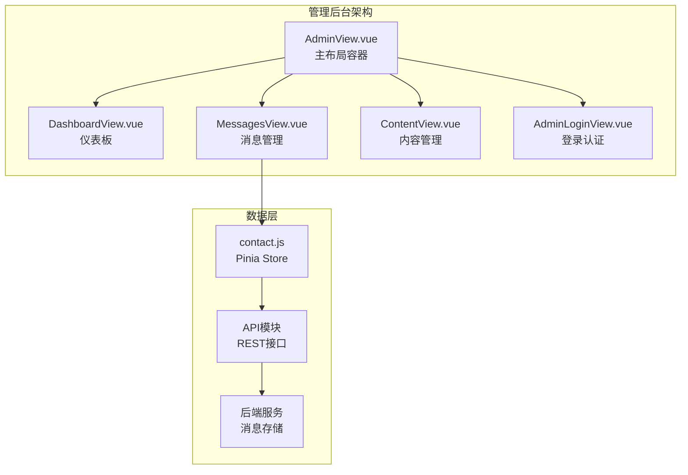
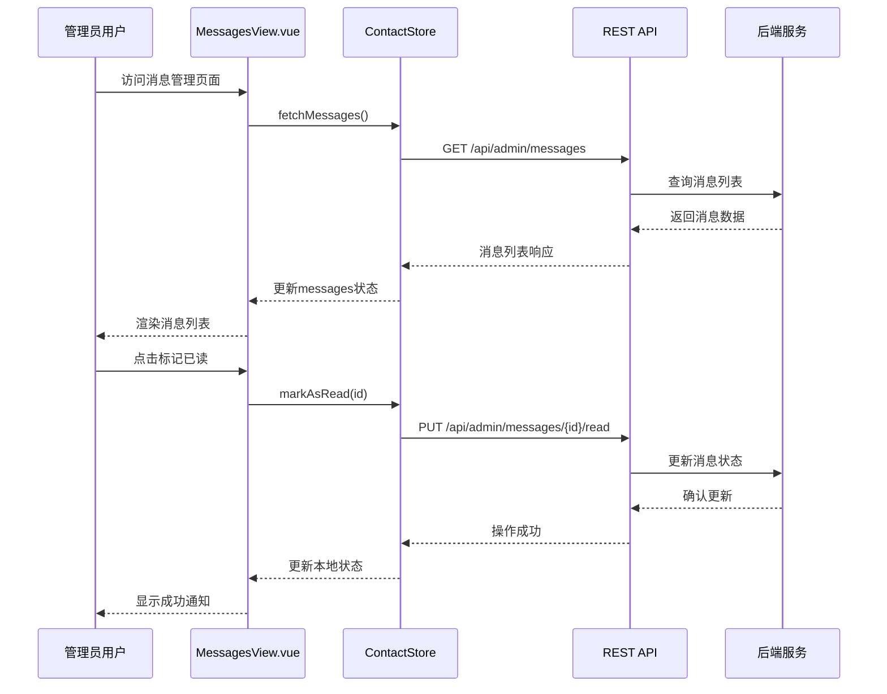
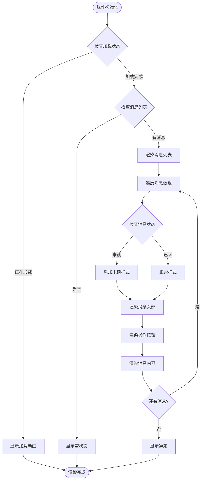
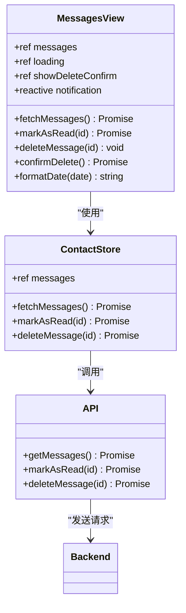
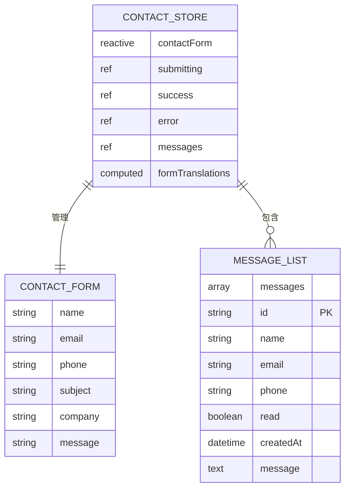
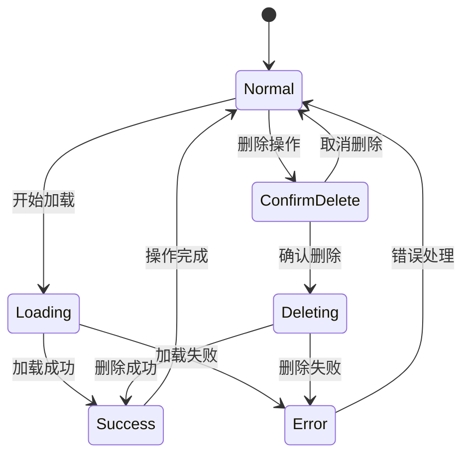
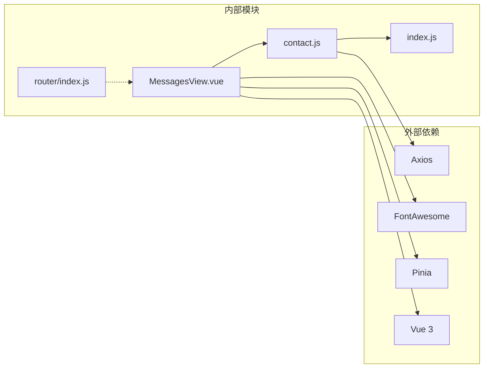

# 消息管理视图

<cite>
**本文档引用的文件**
- [MessagesView.vue](file://src/views/admin/MessagesView.vue)
- [contact.js](file://src/store/modules/contact.js)
- [index.js](file://src/api/index.js)
- [ContactForm.vue](file://src/components/ContactForm.vue)
- [main.css](file://src/assets/main.css)
- [index.js](file://src/router/index.js)
</cite>

## 目录
1. [简介](#简介)
2. [项目结构](#项目结构)
3. [核心组件](#核心组件)
4. [架构概览](#架构概览)
5. [详细组件分析](#详细组件分析)
6. [依赖关系分析](#依赖关系分析)
7. [性能考虑](#性能考虑)
8. [故障排除指南](#故障排除指南)
9. [结论](#结论)

## 简介

MessagesView.vue是无人机防御系统管理后台的核心组件之一，专门负责展示和管理来自联系表单的用户消息。该组件提供了完整的消息列表展示、状态标记、删除操作等管理功能，通过与Pinia store模块紧密集成，实现了高效的数据管理和用户交互体验。

该组件采用现代化的Vue 3 Composition API设计，结合响应式编程模式，为管理员提供了直观的消息管理界面。通过RESTful API与后端服务通信，支持实时刷新、批量操作和状态同步等功能。

## 项目结构

消息管理视图组件位于管理后台的层级结构中，与其他管理组件协同工作：



**图表来源**
- [MessagesView.vue](file://src/views/admin/MessagesView.vue#L1-L294)
- [contact.js](file://src/store/modules/contact.js#L1-L135)
- [index.js](file://src/router/index.js#L70-L95)

**章节来源**
- [MessagesView.vue](file://src/views/admin/MessagesView.vue#L1-L294)
- [index.js](file://src/router/index.js#L70-L95)

## 核心组件

MessagesView.vue组件包含以下核心功能模块：

### 消息列表展示模块
- **动态消息渲染**：基于v-for指令循环渲染消息列表
- **状态视觉化**：未读消息通过特殊样式标识
- **联系信息展示**：姓名、邮箱、电话等基本信息
- **时间戳显示**：格式化的创建时间展示

### 操作控制模块
- **刷新功能**：手动刷新消息列表
- **标记已读**：单个消息标记为已读状态
- **删除操作**：安全确认后的消息删除
- **批量处理**：支持多条消息的批量操作

### 用户交互模块
- **加载状态指示**：异步操作时的加载动画
- **空状态处理**：无消息时的友好提示
- **通知系统**：操作结果的即时反馈
- **模态对话框**：删除确认的安全机制

**章节来源**
- [MessagesView.vue](file://src/views/admin/MessagesView.vue#L1-L294)
- [contact.js](file://src/store/modules/contact.js#L60-L135)

## 架构概览

消息管理视图采用分层架构设计，确保了组件的可维护性和扩展性：



**图表来源**
- [MessagesView.vue](file://src/views/admin/MessagesView.vue#L60-L120)
- [contact.js](file://src/store/modules/contact.js#L60-L135)
- [index.js](file://src/api/index.js#L75-L94)

## 详细组件分析

### MessagesView.vue 组件分析

#### 模板结构分析

组件采用语义化的HTML结构，通过条件渲染实现不同的状态展示：



**图表来源**
- [MessagesView.vue](file://src/views/admin/MessagesView.vue#L1-L50)

#### 数据流分析

组件通过Pinia store实现数据的单向流动：



**图表来源**
- [MessagesView.vue](file://src/views/admin/MessagesView.vue#L50-L120)
- [contact.js](file://src/store/modules/contact.js#L60-L135)

#### 核心方法实现

**消息获取方法**：
```javascript
const fetchMessages = async () => {
  loading.value = true
  try {
    const result = await contactStore.fetchMessages()
    if (result.success) {
      messages.value = contactStore.messages
    } else {
      showNotification(`获取消息失败: ${result.error}`, 'error')
    }
  } catch (error) {
    showNotification(`获取消息失败: ${error.message}`, 'error')
  } finally {
    loading.value = false
  }
}
```

**状态标记方法**：
```javascript
const markAsRead = async (id) => {
  try {
    const result = await contactStore.markAsRead(id)
    if (result.success) {
      showNotification('消息已标记为已读', 'success')
    } else {
      showNotification(`操作失败: ${result.error}`, 'error')
    }
  } catch (error) {
    showNotification(`操作失败: ${error.message}`, 'error')
  }
}
```

**章节来源**
- [MessagesView.vue](file://src/views/admin/MessagesView.vue#L60-L120)
- [contact.js](file://src/store/modules/contact.js#L60-L135)

### ContactStore 数据管理

ContactStore模块负责管理所有与联系表单相关的状态和业务逻辑：

#### 状态管理结构



**图表来源**
- [contact.js](file://src/store/modules/contact.js#L10-L30)

#### API调用封装

Store模块对API调用进行了统一的封装和错误处理：

```javascript
// 获取消息列表
const fetchMessages = async () => {
  try {
    const response = await axios.get('/api/admin/messages')
    messages.value = response.data
    return { success: true }
  } catch (e) {
    console.error('Error fetching messages:', e)
    return { success: false, error: e.message }
  }
}

// 标记消息为已读
const markAsRead = async (id) => {
  try {
    await axios.put(`/api/admin/messages/${id}/read`)
    
    // 更新本地数据
    const index = messages.value.findIndex(msg => msg.id === id)
    if (index !== -1) {
      messages.value[index].read = true
    }
    
    return { success: true }
  } catch (e) {
    console.error(`Error marking message ${id} as read:`, e)
    return { success: false, error: e.message }
  }
}
```

**章节来源**
- [contact.js](file://src/store/modules/contact.js#L60-L135)

### 样式设计与用户体验

组件采用了现代化的CSS设计原则，注重用户体验和视觉一致性：

#### 视觉层次结构

- **卡片式布局**：每个消息项作为独立的卡片展示
- **状态区分**：未读消息通过颜色和边框突出显示
- **图标系统**：使用FontAwesome图标增强交互提示
- **响应式设计**：适配不同屏幕尺寸的设备

#### 交互反馈机制



**图表来源**
- [MessagesView.vue](file://src/views/admin/MessagesView.vue#L120-L180)

**章节来源**
- [MessagesView.vue](file://src/views/admin/MessagesView.vue#L180-L294)
- [main.css](file://src/assets/main.css#L1-L328)

## 依赖关系分析

消息管理视图组件的依赖关系体现了清晰的分层架构：



**图表来源**
- [MessagesView.vue](file://src/views/admin/MessagesView.vue#L50-L55)
- [contact.js](file://src/store/modules/contact.js#L1-L5)

### 关键依赖说明

**Vue 3 Composition API**：提供响应式数据绑定和生命周期管理
**Pinia Store**：集中式状态管理，实现组件间数据共享
**Axios HTTP客户端**：处理前后端通信，支持Promise和错误处理
**FontAwesome图标库**：提供丰富的图标资源，增强用户界面

**章节来源**
- [MessagesView.vue](file://src/views/admin/MessagesView.vue#L50-L55)
- [contact.js](file://src/store/modules/contact.js#L1-L5)

## 性能考虑

### 渲染优化策略

1. **虚拟滚动**：对于大量消息列表，可以考虑实现虚拟滚动技术
2. **懒加载**：支持分页加载，避免一次性渲染过多数据
3. **缓存机制**：利用浏览器缓存减少重复请求
4. **防抖处理**：对频繁触发的操作进行防抖优化

### 数据管理优化

1. **状态持久化**：关键状态可以在localStorage中持久化
2. **增量更新**：只更新变化的数据，避免全量重新渲染
3. **内存管理**：及时清理不需要的组件实例和事件监听器

## 故障排除指南

### 常见问题及解决方案

**问题1：消息列表无法加载**
- 检查网络连接状态
- 验证API端点可用性
- 确认管理员身份验证

**问题2：标记已读功能失效**
- 检查后端服务状态
- 验证消息ID的有效性
- 查看控制台错误日志

**问题3：删除操作异常**
- 确认删除确认对话框正确显示
- 检查后端权限验证
- 验证消息ID参数传递

**章节来源**
- [MessagesView.vue](file://src/views/admin/MessagesView.vue#L60-L120)
- [contact.js](file://src/store/modules/contact.js#L60-L135)

## 结论

MessagesView.vue组件展现了现代前端开发的最佳实践，通过合理的架构设计和组件化思维，实现了高效、可维护的消息管理功能。该组件不仅提供了完整的用户交互体验，还通过与后端服务的紧密集成，确保了数据的一致性和可靠性。

组件的设计充分考虑了可扩展性和维护性，为未来的功能扩展预留了充足的空间。无论是日常的消息查看、状态管理还是批量操作，该组件都能够提供稳定可靠的服务支撑。

通过本文档的详细分析，开发者可以深入理解该组件的工作原理，并能够基于现有架构进行功能扩展或优化改进。