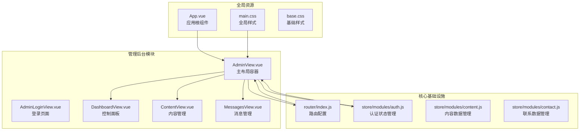
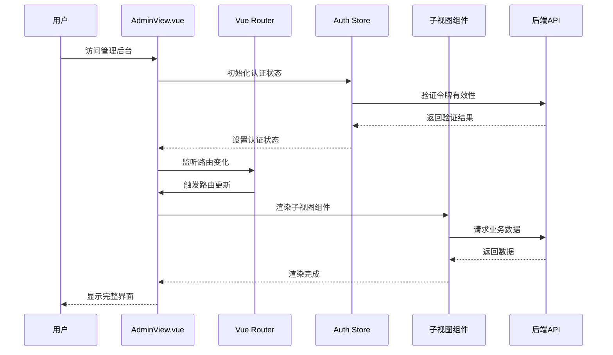
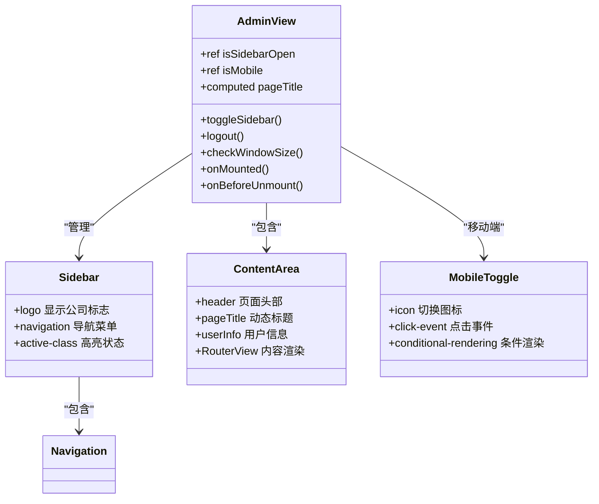
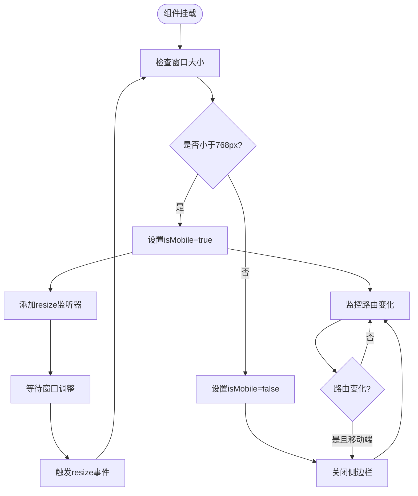
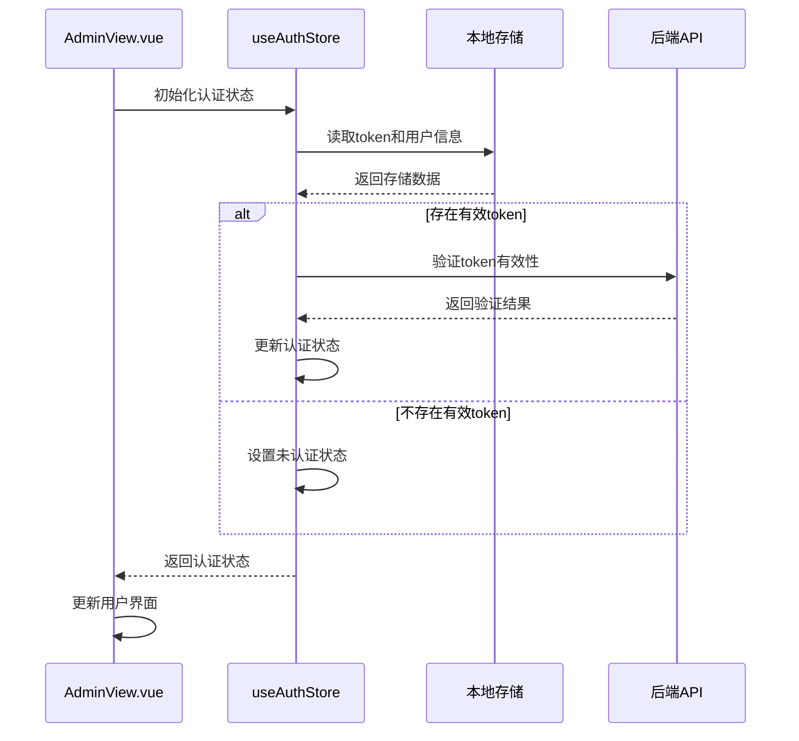
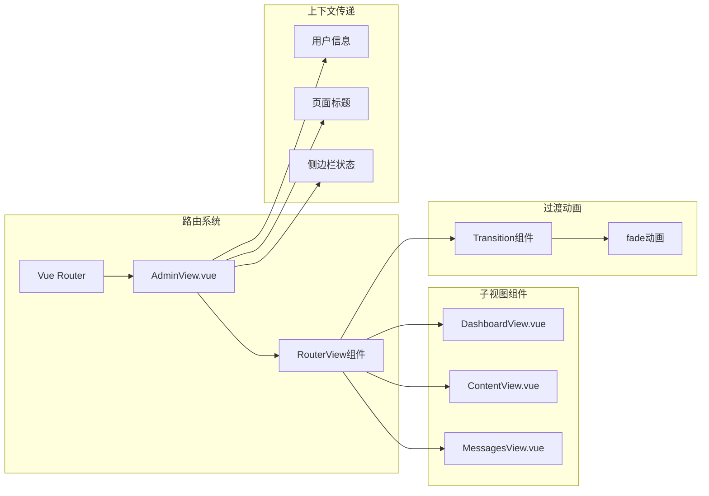
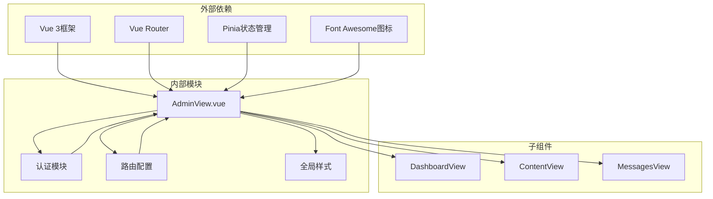

# 管理后台主布局容器

<cite>
**本文档引用的文件**
- [AdminView.vue](file://src/views/admin/AdminView.vue)
- [router/index.js](file://src/router/index.js)
- [store/modules/auth.js](file://src/store/modules/auth.js)
- [DashboardView.vue](file://src/views/admin/DashboardView.vue)
- [ContentView.vue](file://src/views/admin/ContentView.vue)
- [MessagesView.vue](file://src/views/admin/MessagesView.vue)
- [App.vue](file://src/App.vue)
- [main.css](file://src/assets/main.css)
</cite>

## 目录
1. [简介](#简介)
2. [项目结构](#项目结构)
3. [核心组件分析](#核心组件分析)
4. [架构概览](#架构概览)
5. [详细组件分析](#详细组件分析)
6. [依赖关系分析](#依赖关系分析)
7. [性能考虑](#性能考虑)
8. [故障排除指南](#故障排除指南)
9. [结论](#结论)

## 简介

AdminView.vue是朗德智能管理系统的核心布局组件，负责管理后台的整体界面结构和用户体验。该组件实现了响应式设计、侧边栏导航、内容区域动态渲染以及移动端适配等核心功能。通过Vue Router的集成，它能够优雅地处理子路由的过渡动画，并提供统一的页面标题动态生成机制。

## 项目结构

管理后台采用模块化的Vue 3架构，主要包含以下关键文件：



**图表来源**
- [AdminView.vue](file://src/views/admin/AdminView.vue#L1-L144)
- [router/index.js](file://src/router/index.js#L1-L122)
- [store/modules/auth.js](file://src/store/modules/auth.js#L1-L86)

**章节来源**
- [AdminView.vue](file://src/views/admin/AdminView.vue#L1-L144)
- [router/index.js](file://src/router/index.js#L1-L122)

## 核心组件分析

AdminView.vue作为管理后台的主布局容器，具有以下核心特性：

### 响应式布局系统

组件采用CSS Grid布局实现响应式设计：
- **桌面端**：250px侧边栏 + 自适应内容区域
- **移动端**：全屏内容区域，侧边栏固定定位
- **自动切换**：基于窗口宽度检测设备类型

### 侧边栏导航系统

侧边栏包含完整的导航菜单，支持：
- **多级路由**：控制面板、内容管理、消息管理
- **状态高亮**：根据当前路由自动高亮对应菜单项
- **移动端交互**：点击切换按钮显示/隐藏侧边栏

### 内容区域动态渲染

通过Vue Router的`RouterView`组件实现：
- **过渡动画**：使用`<Transition>`组件实现淡入淡出效果
- **上下文传递**：向子组件传递完整的路由上下文
- **性能优化**：使用`v-slot`语法提高渲染效率

**章节来源**
- [AdminView.vue](file://src/views/admin/AdminView.vue#L1-L144)

## 架构概览

AdminView.vue在整个应用架构中扮演着关键角色，连接前端界面与后端服务：



**图表来源**
- [AdminView.vue](file://src/views/admin/AdminView.vue#L75-L85)
- [store/modules/auth.js](file://src/store/modules/auth.js#L45-L55)

## 详细组件分析

### 组件结构与模板分析

AdminView.vue采用简洁的HTML结构，包含三个主要区域：



**图表来源**
- [AdminView.vue](file://src/views/admin/AdminView.vue#L1-L144)

#### 侧边栏组件分析

侧边栏是管理后台的核心导航组件，包含以下功能：

1. **Logo区域**：显示公司名称和管理后台标识
2. **导航菜单**：提供四个主要功能入口
3. **响应式控制**：根据设备类型显示/隐藏

```javascript
// 导航菜单配置
const navigationItems = [
  { name: 'admin-dashboard', icon: 'fa-tachometer-alt', text: '控制面板' },
  { name: 'admin-content', icon: 'fa-edit', text: '内容管理' },
  { name: 'admin-messages', icon: 'fa-envelope', text: '消息管理' },
  { name: 'logout', icon: 'fa-sign-out-alt', text: '退出登录' }
]
```

#### 内容区域分析

内容区域负责渲染具体的业务页面，具有以下特点：

1. **动态标题**：根据当前路由自动生成页面标题
2. **用户信息**：显示当前登录用户的用户名
3. **过渡动画**：使用Vue Transition组件实现平滑切换

**章节来源**
- [AdminView.vue](file://src/views/admin/AdminView.vue#L1-L144)

### 响应式切换机制

AdminView.vue实现了智能的响应式切换机制：



**图表来源**
- [AdminView.vue](file://src/views/admin/AdminView.vue#L75-L85)

#### 移动端适配逻辑

移动端适配通过以下机制实现：

1. **窗口尺寸检测**：实时监控窗口宽度变化
2. **状态同步**：根据设备类型同步isMobile状态
3. **侧边栏控制**：在移动端自动关闭侧边栏
4. **交互优化**：提供专门的移动端切换按钮

**章节来源**
- [AdminView.vue](file://src/views/admin/AdminView.vue#L75-L85)

### 认证状态管理

AdminView.vue与Pinia状态管理库深度集成：



**图表来源**
- [store/modules/auth.js](file://src/store/modules/auth.js#L45-L55)
- [AdminView.vue](file://src/views/admin/AdminView.vue#L75-L85)

#### 认证初始化流程

认证状态的初始化过程包括以下步骤：

1. **数据读取**：从localStorage读取token和用户信息
2. **状态验证**：调用API验证token的有效性
3. **状态更新**：根据验证结果更新认证状态
4. **错误处理**：处理无效token的情况

**章节来源**
- [store/modules/auth.js](file://src/store/modules/auth.js#L45-L55)
- [AdminView.vue](file://src/views/admin/AdminView.vue#L75-L85)

### 子路由渲染机制

AdminView.vue通过Vue Router实现灵活的子路由渲染：



**图表来源**
- [AdminView.vue](file://src/views/admin/AdminView.vue#L45-L55)
- [router/index.js](file://src/router/index.js#L65-L85)

#### 过渡动画实现

子路由的过渡动画通过以下方式实现：

1. **动画配置**：使用Vue Transition组件
2. **模式设置**：采用out-in模式确保流畅过渡
3. **组件传递**：通过v-slot语法传递子组件实例
4. **样式定义**：在全局样式中定义动画规则

**章节来源**
- [AdminView.vue](file://src/views/admin/AdminView.vue#L45-L55)

## 依赖关系分析

AdminView.vue与多个系统组件存在复杂的依赖关系：



**图表来源**
- [AdminView.vue](file://src/views/admin/AdminView.vue#L1-L10)
- [router/index.js](file://src/router/index.js#L1-L10)
- [store/modules/auth.js](file://src/store/modules/auth.js#L1-L10)

### 外部依赖分析

AdminView.vue依赖以下外部库和框架：

1. **Vue 3 Composition API**：提供响应式数据绑定和生命周期管理
2. **Vue Router**：实现路由管理和导航功能
3. **Pinia**：提供状态管理和服务注入
4. **Font Awesome**：提供图标支持和视觉反馈

### 内部模块依赖

组件与内部模块的依赖关系包括：

1. **路由配置**：依赖router/index.js中的路由定义
2. **认证模块**：依赖store/modules/auth.js中的状态管理
3. **全局样式**：依赖src/assets/main.css中的样式定义
4. **子组件**：依赖各个业务视图组件的功能实现

**章节来源**
- [AdminView.vue](file://src/views/admin/AdminView.vue#L1-L10)
- [router/index.js](file://src/router/index.js#L1-L10)
- [store/modules/auth.js](file://src/store/modules/auth.js#L1-L10)

## 性能考虑

AdminView.vue在设计时充分考虑了性能优化：

### 渲染性能优化

1. **条件渲染**：移动端切换按钮仅在需要时显示
2. **懒加载**：子组件采用异步导入方式
3. **事件节流**：resize事件监听器经过适当处理
4. **内存管理**：组件卸载时正确清理事件监听器

### 状态管理优化

1. **响应式缓存**：computed属性避免重复计算
2. **状态分离**：将不同状态分离到独立的ref变量
3. **批量更新**：使用storeToRefs减少不必要的响应式开销

### 样式性能优化

1. **CSS Grid布局**：利用现代浏览器的高性能布局引擎
2. **硬件加速**：使用transform和opacity属性触发动画硬件加速
3. **选择器优化**：避免复杂CSS选择器影响渲染性能

## 故障排除指南

### 常见问题与解决方案

#### 侧边栏显示异常

**问题描述**：侧边栏在移动端无法正常显示或隐藏

**可能原因**：
1. CSS样式冲突导致position属性失效
2. JavaScript事件监听器未正确绑定
3. 状态变量isSidebarOpen值不正确

**解决方案**：
```javascript
// 检查CSS样式
console.log(getComputedStyle(document.querySelector('.admin-sidebar')).position)

// 手动触发状态更新
isSidebarOpen.value = !isSidebarOpen.value
```

#### 认证状态不一致

**问题描述**：用户已登录但界面显示未认证状态

**可能原因**：
1. localStorage中的token已过期
2. API验证接口返回错误
3. 状态同步机制出现异常

**解决方案**：
```javascript
// 强制重新初始化认证状态
await authStore.initAuth()
// 或手动清除无效token
localStorage.removeItem('admin-token')
```

#### 移动端适配问题

**问题描述**：在移动设备上界面布局错乱

**可能原因**：
1. viewport meta标签配置不当
2. CSS媒体查询规则不匹配
3. JavaScript窗口尺寸检测错误

**解决方案**：
```html
<!-- 确保正确的viewport配置 -->
<meta name="viewport" content="width=device-width, initial-scale=1.0">

<!-- 检查CSS媒体查询 -->
@media (max-width: 768px) {
  .admin-layout {
    grid-template-columns: 1fr;
  }
}
```

**章节来源**
- [AdminView.vue](file://src/views/admin/AdminView.vue#L75-L85)
- [store/modules/auth.js](file://src/store/modules/auth.js#L45-L55)

## 结论

AdminView.vue作为朗德智能管理系统的核心布局组件，展现了现代Vue 3应用开发的最佳实践。通过精心设计的响应式架构、高效的认证管理机制和优雅的用户体验设计，该组件成功实现了管理后台的统一界面和流畅交互。

### 主要优势

1. **响应式设计**：完美适配各种设备尺寸，提供一致的用户体验
2. **模块化架构**：清晰的组件分离和依赖管理
3. **性能优化**：合理的渲染策略和状态管理
4. **可维护性**：良好的代码组织和注释规范

### 技术亮点

1. **Composition API**：充分利用Vue 3的新特性提升开发效率
2. **Pinia状态管理**：现代化的状态管理模式
3. **CSS Grid布局**：高效的响应式布局方案
4. **Transition动画**：平滑的用户体验过渡效果

### 改进建议

1. **错误边界**：增加错误处理和降级机制
2. **国际化支持**：扩展多语言支持能力
3. **主题定制**：提供更灵活的主题配置选项
4. **性能监控**：集成性能监控和分析工具

AdminView.vue不仅是一个功能完善的管理后台布局组件，更是现代前端开发技术的优秀实践案例，为类似项目的开发提供了宝贵的参考价值。