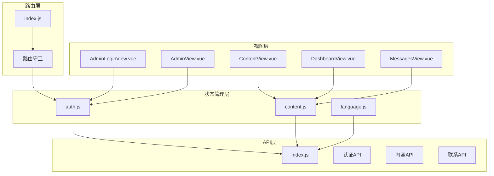
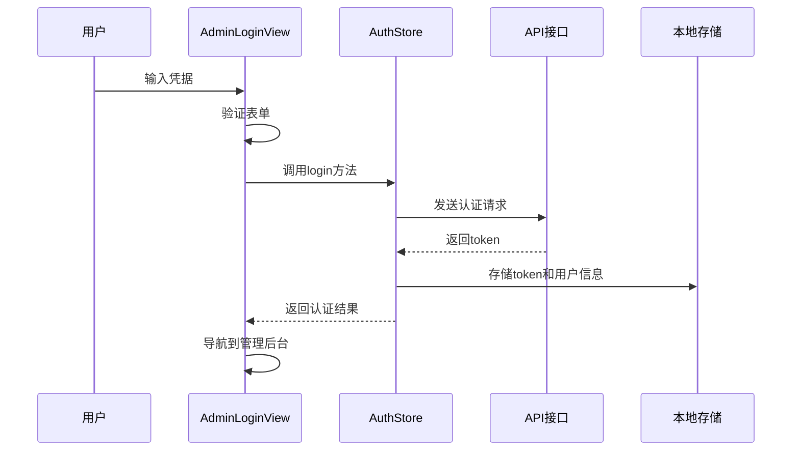
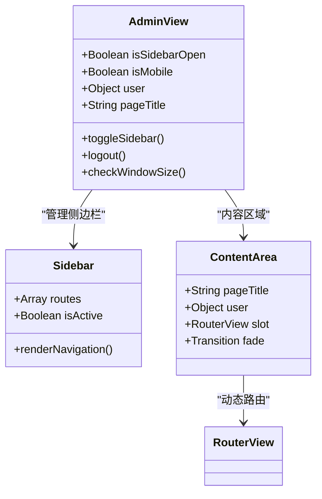
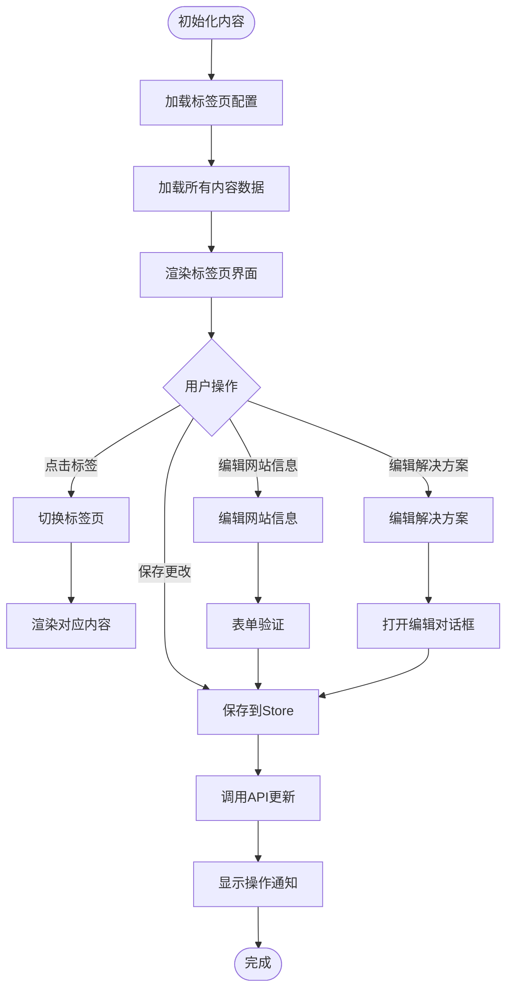
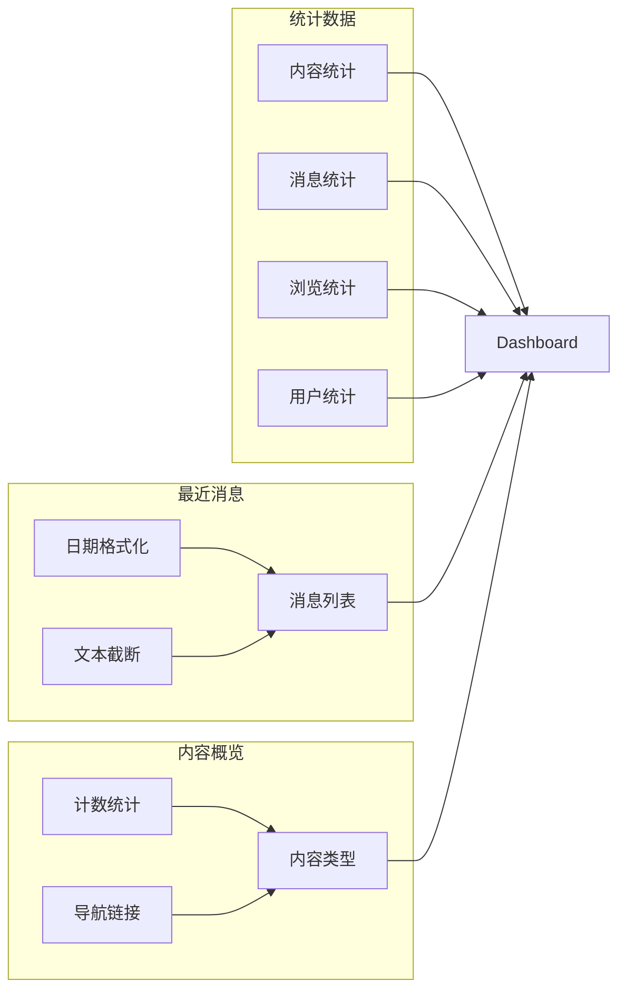
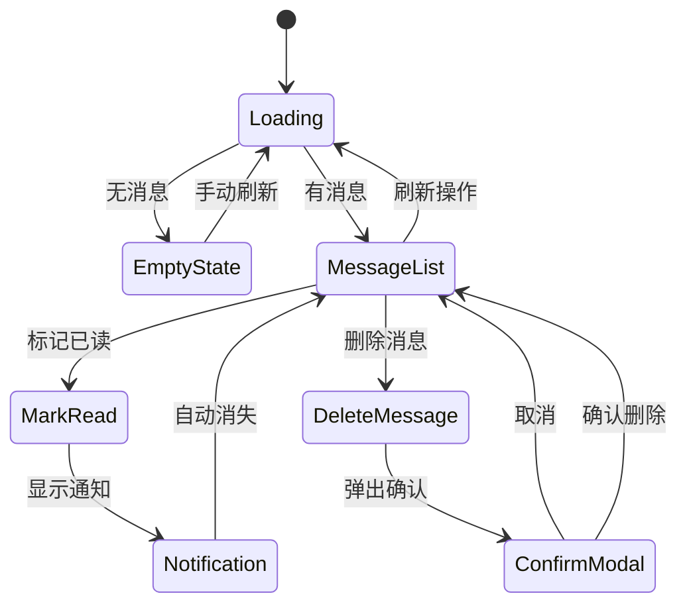
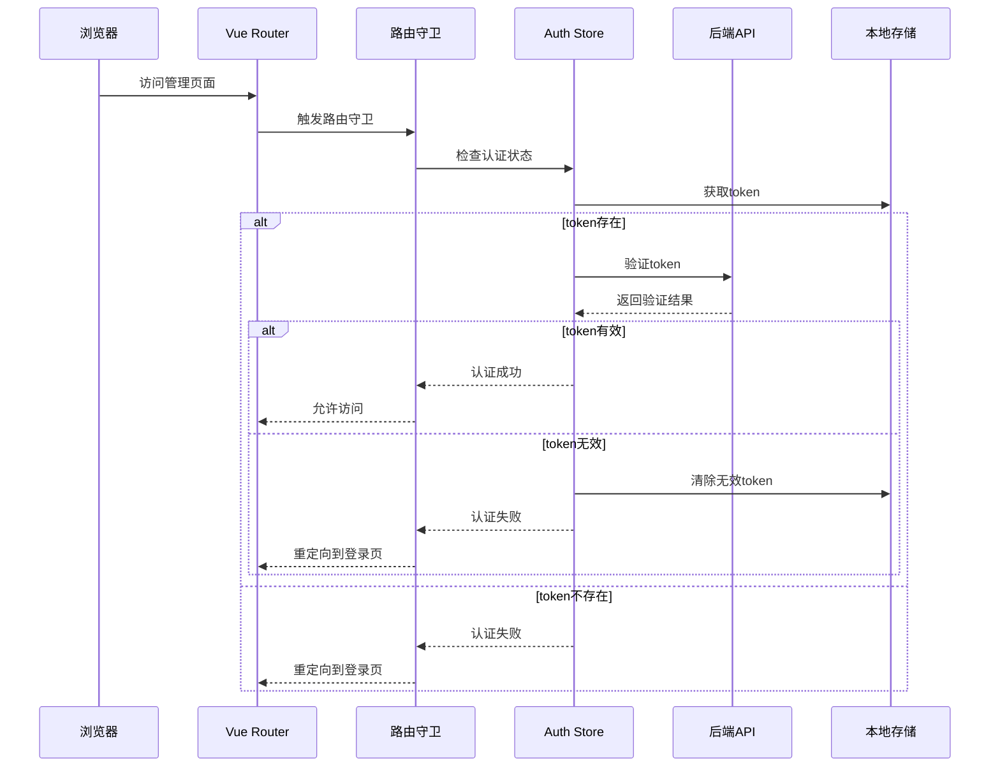
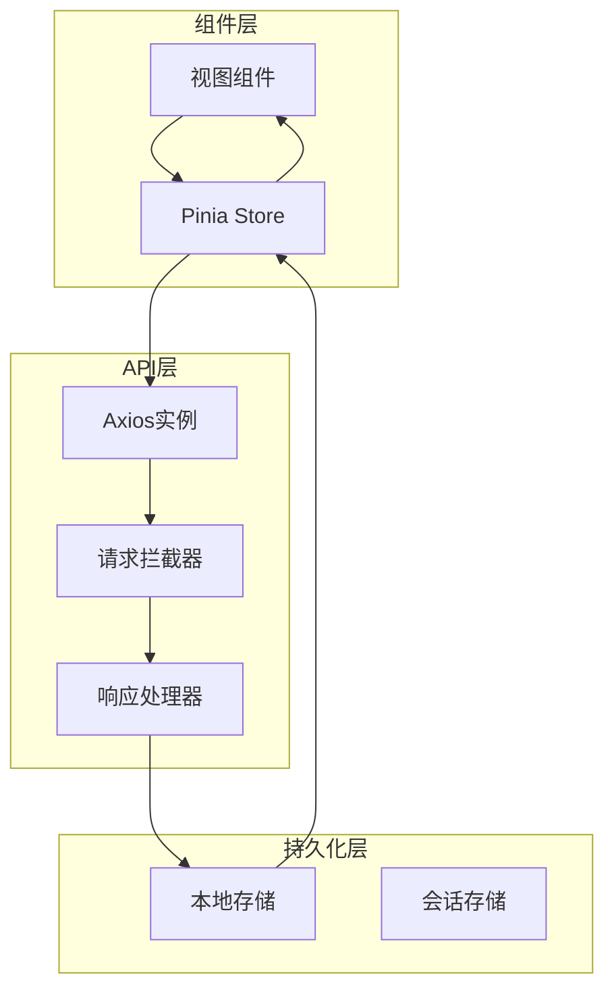
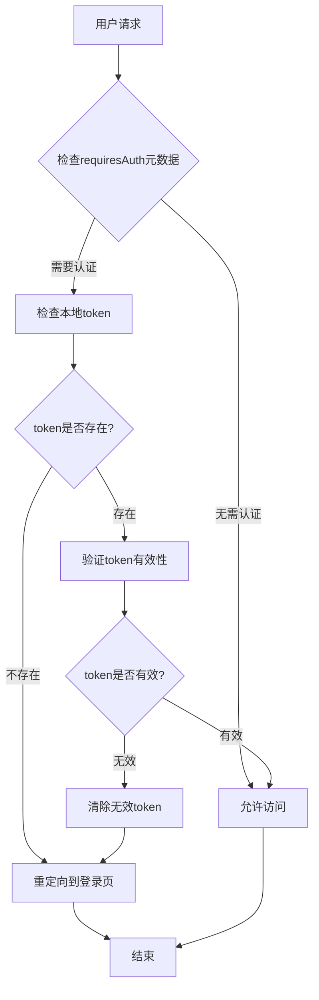

# 管理后台视图结构

<cite>
**本文档引用的文件**
- [AdminLoginView.vue](file://src/views/admin/AdminLoginView.vue)
- [AdminView.vue](file://src/views/admin/AdminView.vue)
- [ContentView.vue](file://src/views/admin/ContentView.vue)
- [DashboardView.vue](file://src/views/admin/DashboardView.vue)
- [MessagesView.vue](file://src/views/admin/MessagesView.vue)
- [auth.js](file://src/store/modules/auth.js)
- [content.js](file://src/store/modules/content.js)
- [index.js](file://src/api/index.js)
- [index.js](file://src/router/index.js)
</cite>

## 目录
1. [简介](#简介)
2. [项目架构概览](#项目架构概览)
3. [核心视图组件分析](#核心视图组件分析)
4. [认证系统架构](#认证系统架构)
5. [数据流与状态管理](#数据流与状态管理)
6. [路由守卫与安全机制](#路由守卫与安全机制)
7. [性能考虑](#性能考虑)
8. [故障排除指南](#故障排除指南)
9. [总结](#总结)

## 简介

本文档详细阐述了朗德智能管理后台的前端视图架构设计。该系统采用Vue 3 Composition API构建，提供了完整的管理界面，包括用户认证、内容管理、数据可视化和消息处理等功能模块。系统通过Pinia状态管理、Vue Router路由管理和Axios API客户端实现了高度模块化和可维护的架构设计。

## 项目架构概览

管理后台采用分层架构设计，主要分为视图层、状态管理层、API层和路由层：

**图表来源**
- [AdminLoginView.vue](file://src/views/admin/AdminLoginView.vue#L1-L105)
- [AdminView.vue](file://src/views/admin/AdminView.vue#L1-L144)
- [auth.js](file://src/store/modules/auth.js#L1-L86)
- [content.js](file://src/store/modules/content.js#L1-L648)

## 核心视图组件分析

### AdminLoginView.vue - 认证入口组件

AdminLoginView是管理后台的认证入口，负责用户身份验证和token管理：

**图表来源**
- [AdminLoginView.vue](file://src/views/admin/AdminLoginView.vue#L45-L55)
- [auth.js](file://src/store/modules/auth.js#L15-L35)

该组件的核心特性：
- **响应式表单验证**：使用Vue 3的reactive API实现双向绑定
- **状态管理集成**：通过Pinia store管理认证状态
- **错误处理**：提供友好的错误提示信息
- **用户体验优化**：加载状态指示和禁用提交按钮

**章节来源**
- [AdminLoginView.vue](file://src/views/admin/AdminLoginView.vue#L1-L105)

### AdminView.vue - 主布局容器

AdminView作为主布局容器，提供了统一的管理界面框架：

**图表来源**
- [AdminView.vue](file://src/views/admin/AdminView.vue#L40-L80)

AdminView的关键功能：
- **响应式布局**：根据屏幕尺寸自动调整侧边栏显示
- **动态标题**：根据当前路由动态设置页面标题
- **用户信息显示**：展示当前登录用户的用户名
- **路由守卫集成**：与全局路由守卫协同工作

**章节来源**
- [AdminView.vue](file://src/views/admin/AdminView.vue#L1-L144)

### ContentView.vue - 内容管理系统

ContentView实现了复杂的内容管理功能，支持多语言和多种内容类型的编辑：

**图表来源**
- [ContentView.vue](file://src/views/admin/ContentView.vue#L150-L250)

ContentView的核心特性：
- **多标签页管理**：支持网站信息、解决方案、核心技术等内容类型
- **实时编辑**：使用reactive对象实现实时数据绑定
- **模态编辑器**：解决方案编辑采用独立的模态对话框
- **批量操作**：支持一次性加载所有内容数据

**章节来源**
- [ContentView.vue](file://src/views/admin/ContentView.vue#L1-L328)

### DashboardView.vue - 数据可视化组件

DashboardView提供了直观的数据统计和概览功能：

**图表来源**
- [DashboardView.vue](file://src/views/admin/DashboardView.vue#L1-L100)

DashboardView的主要功能：
- **统计卡片**：四个关键指标的可视化展示
- **最近消息**：显示最新的5条联系消息
- **内容概览**：展示各种内容类型的统计信息
- **交互式导航**：支持直接跳转到相关内容管理页面

**章节来源**
- [DashboardView.vue](file://src/views/admin/DashboardView.vue#L1-L364)

### MessagesView.vue - 消息管理组件

MessagesView专门处理联系表单消息的管理功能：

**图表来源**
- [MessagesView.vue](file://src/views/admin/MessagesView.vue#L1-L100)

MessagesView的功能特点：
- **消息列表展示**：支持未读消息高亮显示
- **批量操作**：支持标记已读和删除操作
- **确认对话框**：删除操作需要二次确认
- **加载状态管理**：提供加载动画和错误处理

**章节来源**
- [MessagesView.vue](file://src/views/admin/MessagesView.vue#L1-L294)

## 认证系统架构

管理后台的认证系统采用了多层次的安全架构：

**图表来源**
- [index.js](file://src/router/index.js#L85-L95)
- [auth.js](file://src/store/modules/auth.js#L45-L60)

认证系统的安全特性：
- **本地存储加密**：token和用户信息存储在localStorage中
- **自动验证**：每次页面加载时自动验证token有效性
- **401自动处理**：API响应401时自动清除认证信息并重定向
- **会话管理**：支持手动登出和自动过期处理

**章节来源**
- [auth.js](file://src/store/modules/auth.js#L1-L86)
- [index.js](file://src/api/index.js#L20-L40)

## 数据流与状态管理

系统采用Pinia作为状态管理工具，实现了清晰的数据流架构：

**图表来源**
- [content.js](file://src/store/modules/content.js#L1-L50)
- [index.js](file://src/api/index.js#L1-L30)

数据流的关键特性：
- **单向数据流**：数据从API流向组件，避免状态混乱
- **响应式更新**：使用Vue 3的响应式系统实现自动更新
- **异步操作**：所有API调用都是异步的，支持loading状态
- **错误边界**：每个操作都有完善的错误处理机制

**章节来源**
- [content.js](file://src/store/modules/content.js#L1-L648)

## 路由守卫与安全机制

路由守卫确保只有经过认证的用户才能访问管理页面：

**图表来源**
- [index.js](file://src/router/index.js#L85-L95)

路由守卫的安全机制：
- **元数据标记**：通过meta.requiresAuth标记需要认证的路由
- **自动重定向**：未认证用户自动重定向到登录页面
- **状态同步**：路由守卫与认证状态保持同步
- **错误处理**：处理认证相关的异常情况

**章节来源**
- [index.js](file://src/router/index.js#L85-L95)

## 性能考虑

系统在多个层面进行了性能优化：

### 组件级优化
- **懒加载**：使用动态导入实现组件懒加载
- **条件渲染**：使用v-if/v-show优化DOM渲染
- **事件节流**：对频繁触发的操作进行节流处理

### 状态管理优化
- **计算属性缓存**：使用computed缓存复杂计算结果
- **响应式拆分**：将大型对象拆分为多个小的响应式对象
- **状态订阅**：只订阅必要的状态变化

### API调用优化
- **请求合并**：批量获取相关数据减少API调用次数
- **缓存策略**：实现数据缓存避免重复请求
- **错误重试**：对临时性错误实现自动重试机制

## 故障排除指南

### 常见问题与解决方案

**认证问题**
- **症状**：无法登录或频繁被重定向到登录页
- **原因**：token过期或本地存储损坏
- **解决方案**：清除浏览器缓存和localStorage，重新登录

**内容加载失败**
- **症状**：内容管理页面空白或显示错误
- **原因**：API连接失败或数据格式错误
- **解决方案**：检查网络连接，验证API端点可用性

**路由跳转异常**
- **症状**：页面无法正确跳转或显示404
- **原因**：路由配置错误或守卫逻辑异常
- **解决方案**：检查路由定义和meta配置

**章节来源**
- [auth.js](file://src/store/modules/auth.js#L45-L60)
- [index.js](file://src/api/index.js#L20-L40)

## 总结

朗德智能管理后台的前端架构展现了现代Vue 3应用的最佳实践。通过合理的组件拆分、清晰的状态管理和完善的安全机制，系统实现了高度的可维护性和用户体验。各个视图组件各司其职，认证系统安全可靠，数据流清晰可控，为管理后台提供了坚实的技术基础。

该架构设计充分体现了以下优势：
- **模块化设计**：每个组件职责明确，便于维护和扩展
- **安全性保障**：多层次的认证和授权机制确保系统安全
- **用户体验**：响应式设计和流畅的交互提升了使用体验
- **可扩展性**：良好的架构设计支持未来功能的扩展