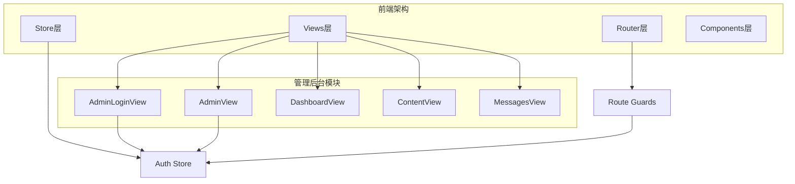
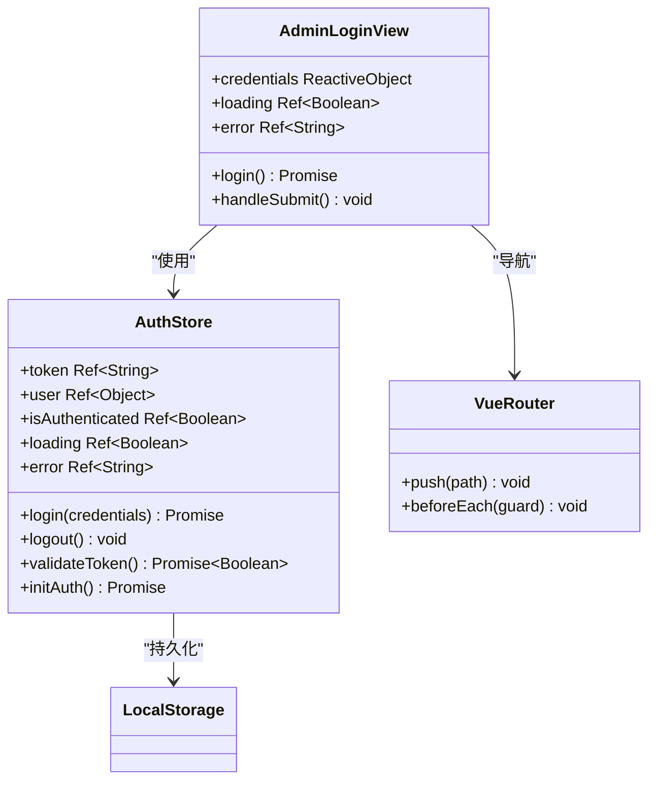
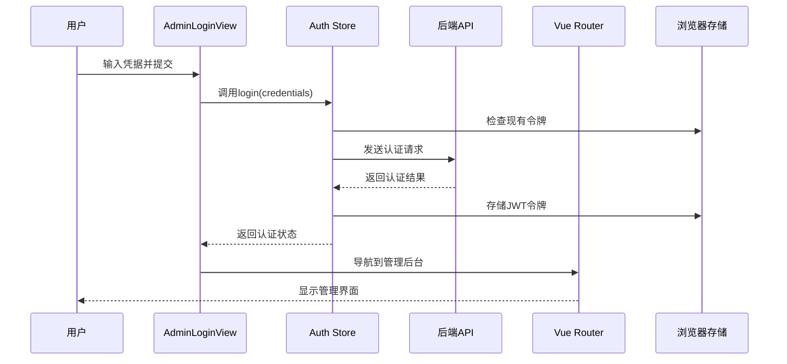
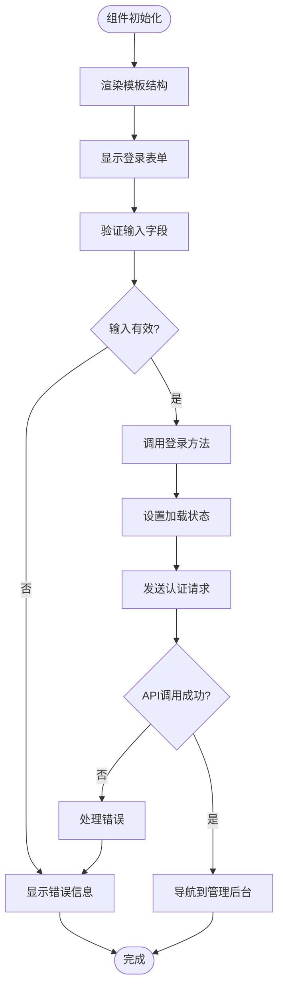
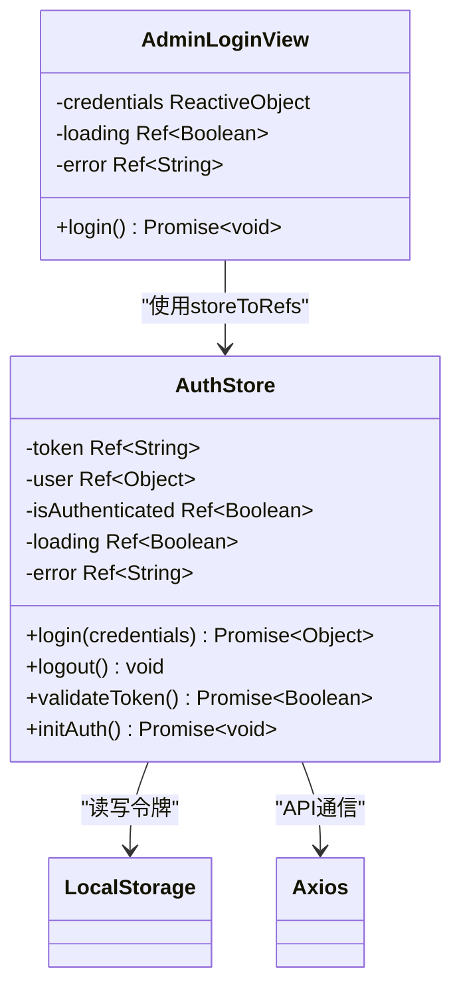
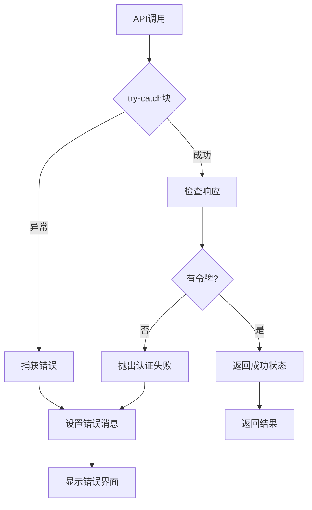
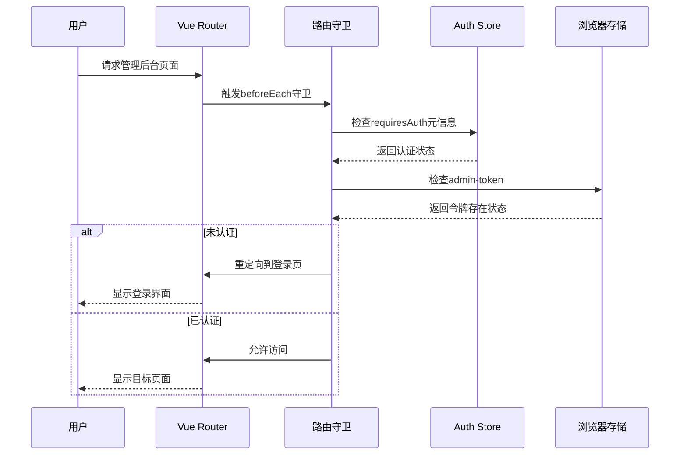
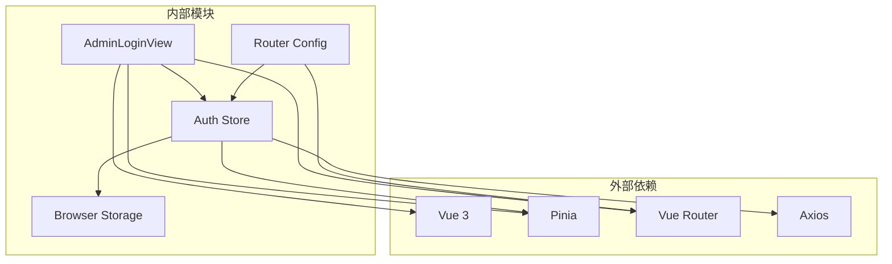

# 管理员登录视图实现机制

<cite>
**本文档引用的文件**
- [AdminLoginView.vue](file://src/views/admin/AdminLoginView.vue)
- [auth.js](file://src/store/modules/auth.js)
- [index.js](file://src/router/index.js)
- [AdminView.vue](file://src/views/admin/AdminView.vue)
- [store/index.js](file://src/store/index.js)
- [users.json](file://data/users.json)
</cite>

## 目录
1. [简介](#简介)
2. [项目结构概览](#项目结构概览)
3. [核心组件分析](#核心组件分析)
4. [架构概览](#架构概览)
5. [详细组件分析](#详细组件分析)
6. [依赖关系分析](#依赖关系分析)
7. [性能考虑](#性能考虑)
8. [故障排除指南](#故障排除指南)
9. [结论](#结论)

## 简介

AdminLoginView.vue是朗德智能管理系统的核心认证组件，负责处理管理员用户的登录流程。该组件采用现代化的Vue 3 Composition API设计，结合Pinia状态管理和Vue Router路由系统，实现了完整的用户认证和授权机制。

该视图组件不仅提供了简洁直观的登录界面，还通过响应式表单设计确保用户体验的流畅性。它与Pinia的auth模块紧密集成，实现了状态管理、错误处理和加载状态的统一控制。

## 项目结构概览

该项目采用模块化的前端架构，将功能按领域进行组织：



**图表来源**
- [AdminLoginView.vue](file://src/views/admin/AdminLoginView.vue#L1-L105)
- [AdminView.vue](file://src/views/admin/AdminView.vue#L1-L144)
- [auth.js](file://src/store/modules/auth.js#L1-L86)

**章节来源**
- [AdminLoginView.vue](file://src/views/admin/AdminLoginView.vue#L1-L105)
- [index.js](file://src/router/index.js#L1-L122)

## 核心组件分析

### AdminLoginView.vue组件结构

AdminLoginView.vue采用了标准的Vue 3单文件组件结构，包含模板、脚本和样式三个部分：



**图表来源**
- [AdminLoginView.vue](file://src/views/admin/AdminLoginView.vue#L44-L56)
- [auth.js](file://src/store/modules/auth.js#L6-L85)

**章节来源**
- [AdminLoginView.vue](file://src/views/admin/AdminLoginView.vue#L1-L105)
- [auth.js](file://src/store/modules/auth.js#L1-L86)

## 架构概览

系统采用分层架构设计，确保关注点分离和代码可维护性：



**图表来源**
- [AdminLoginView.vue](file://src/views/admin/AdminLoginView.vue#L50-L56)
- [auth.js](file://src/store/modules/auth.js#L13-L42)
- [index.js](file://src/router/index.js#L88-L98)

## 详细组件分析

### 模板结构分析

AdminLoginView.vue的模板结构设计注重用户体验和响应式布局：



**图表来源**
- [AdminLoginView.vue](file://src/views/admin/AdminLoginView.vue#L1-L42)
- [auth.js](file://src/store/modules/auth.js#L13-L42)

### 响应式表单设计

组件使用Vue 3的reactive API创建响应式数据对象：

```javascript
const credentials = reactive({
  username: '',
  password: ''
})
```

这种设计模式的优势：
- **自动响应性**：当credentials对象的属性发生变化时，视图会自动更新
- **类型安全**：TypeScript环境下提供更好的类型推断
- **简洁语法**：相比ref()更符合直觉的数据操作方式

### Pinia状态管理集成

组件通过Pinia实现状态共享和持久化：



**图表来源**
- [AdminLoginView.vue](file://src/views/admin/AdminLoginView.vue#L44-L56)
- [auth.js](file://src/store/modules/auth.js#L6-L85)

### JWT令牌安全存储

系统采用localStorage安全存储JWT令牌：

```javascript
// 登录成功后的存储逻辑
localStorage.setItem('admin-token', token.value)
localStorage.setItem('admin-user', JSON.stringify(user.value))

// 登出时的清理逻辑
localStorage.removeItem('admin-token')
localStorage.removeItem('admin-user')
```

这种实现方式的特点：
- **安全性**：避免在内存中长期持有敏感信息
- **持久性**：即使页面刷新也能保持登录状态
- **简单性**：无需复杂的加密算法

### 错误处理机制

组件实现了完善的错误处理和用户反馈机制：



**图表来源**
- [auth.js](file://src/store/modules/auth.js#L13-L42)

**章节来源**
- [AdminLoginView.vue](file://src/views/admin/AdminLoginView.vue#L1-L105)
- [auth.js](file://src/store/modules/auth.js#L1-L86)

### Vue Router导航机制

登录成功后，组件通过Vue Router导航到管理后台：

```javascript
const login = async () => {
  const result = await authStore.login(credentials)
  if (result.success) {
    router.push('/admin')
  }
}
```

这种设计的优势：
- **声明式导航**：使用push方法而非编程式导航
- **类型安全**：利用路由名称而非硬编码路径
- **错误处理**：通过返回值判断导航时机

### 路由守卫协作

系统通过路由守卫确保未授权访问被有效拦截：



**图表来源**
- [index.js](file://src/router/index.js#L88-L98)
- [auth.js](file://src/store/modules/auth.js#L54-L66)

**章节来源**
- [AdminLoginView.vue](file://src/views/admin/AdminLoginView.vue#L50-L56)
- [index.js](file://src/router/index.js#L88-L98)

## 依赖关系分析

系统的依赖关系体现了清晰的分层架构：



**图表来源**
- [AdminLoginView.vue](file://src/views/admin/AdminLoginView.vue#L44-L56)
- [auth.js](file://src/store/modules/auth.js#L1-L3)
- [index.js](file://src/router/index.js#L1-L3)

**章节来源**
- [AdminLoginView.vue](file://src/views/admin/AdminLoginView.vue#L44-L56)
- [auth.js](file://src/store/modules/auth.js#L1-L86)
- [index.js](file://src/router/index.js#L1-L122)

## 性能考虑

### 组件性能优化

1. **懒加载路由**：管理后台路由采用动态导入，减少初始包体积
2. **条件渲染**：错误信息仅在需要时显示，避免不必要的DOM操作
3. **防抖处理**：登录按钮禁用状态防止重复提交

### 状态管理优化

1. **选择性订阅**：使用storeToRefs只订阅必要的状态
2. **响应式计算**：利用computed函数避免不必要的重新计算
3. **内存管理**：及时清理事件监听器和定时器

### 安全性考虑

1. **HTTPS传输**：所有认证请求通过HTTPS加密传输
2. **令牌过期**：支持令牌验证和自动登出机制
3. **CSRF防护**：配合后端实现跨站请求伪造防护

## 故障排除指南

### 常见问题及解决方案

#### 登录失败问题

**症状**：输入正确的凭据但无法登录
**可能原因**：
1. 后端API不可用
2. 网络连接问题
3. 凭据格式错误

**解决步骤**：
1. 检查网络连接状态
2. 验证API端点可用性
3. 查看浏览器开发者工具中的网络请求
4. 确认凭据格式正确

#### 认证状态不一致

**症状**：已登录但页面显示未认证
**可能原因**：
1. 本地存储损坏
2. 令牌验证失败
3. 路由守卫配置错误

**解决步骤**：
1. 清除浏览器本地存储
2. 重新登录系统
3. 检查路由守卫配置
4. 验证令牌有效性

#### 导航问题

**症状**：登录成功后无法跳转到管理后台
**可能原因**：
1. 路由配置错误
2. 路由守卫逻辑问题
3. 编程式导航错误

**解决步骤**：
1. 检查路由配置中的meta字段
2. 验证路由守卫的逻辑
3. 确认导航方法的使用正确性

**章节来源**
- [auth.js](file://src/store/modules/auth.js#L54-L66)
- [index.js](file://src/router/index.js#L88-L98)

## 结论

AdminLoginView.vue展现了现代Vue 3应用的最佳实践，通过以下关键特性实现了完整的管理员登录功能：

### 技术亮点

1. **现代化架构**：采用Vue 3 Composition API和Pinia状态管理
2. **响应式设计**：提供良好的用户体验和视觉效果
3. **安全可靠**：实现JWT令牌的安全存储和传输
4. **错误处理**：完善的错误处理和用户反馈机制
5. **路由集成**：与Vue Router深度集成的认证流程

### 设计优势

- **模块化**：清晰的职责分离和模块化设计
- **可维护性**：易于理解和扩展的代码结构
- **可测试性**：独立的状态管理和简单的业务逻辑
- **可扩展性**：支持未来功能的平滑扩展

### 最佳实践

该组件为Vue 3应用开发提供了优秀的参考模板，特别是在认证流程、状态管理和用户体验方面的设计思路值得借鉴。通过合理的架构设计和技术选型，成功实现了既安全又易用的管理员登录系统。