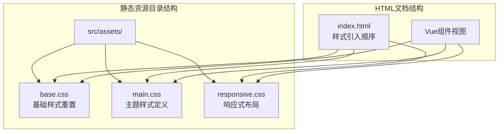
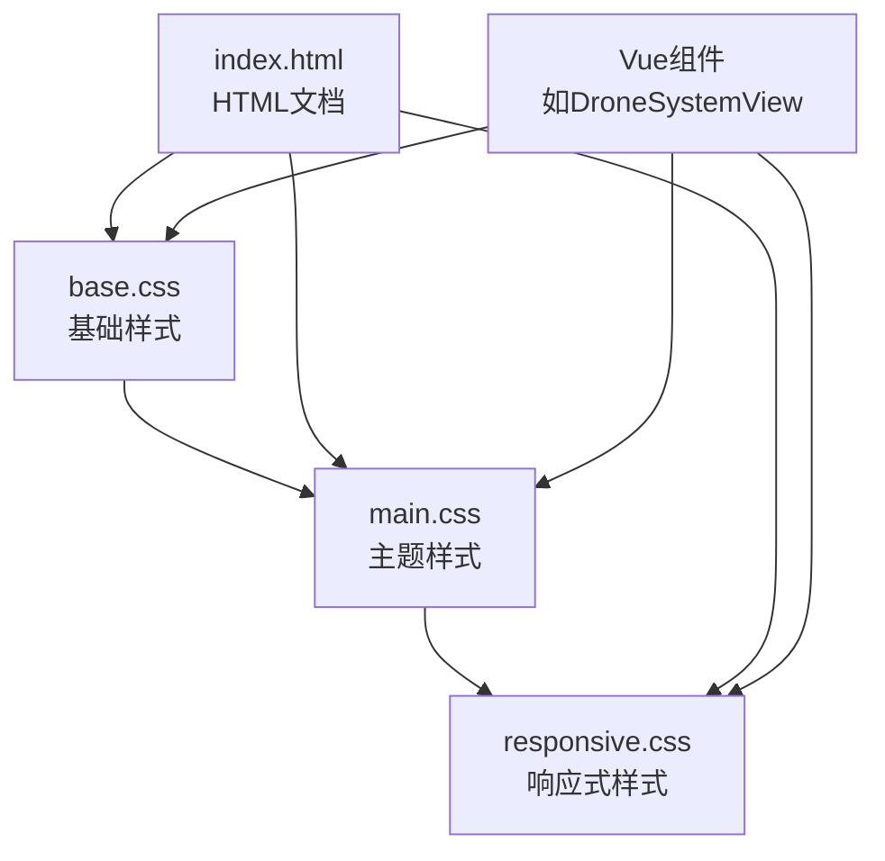
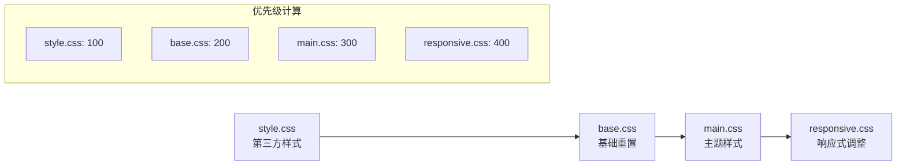
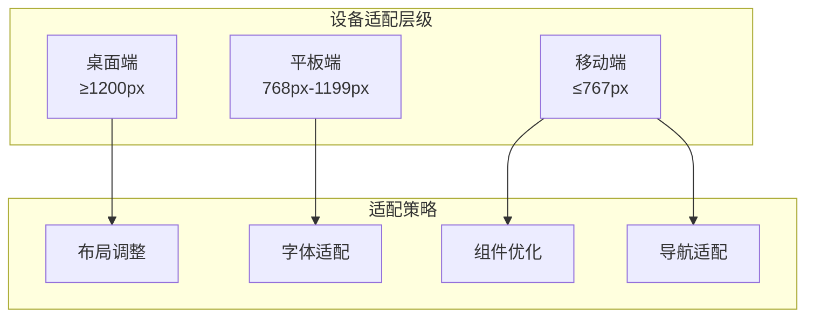

# 静态资源管理

<cite>
**本文档引用的文件**
- [src/assets/base.css](file://src/assets/base.css)
- [src/assets/main.css](file://src/assets/main.css)
- [src/assets/responsive.css](file://src/assets/responsive.css)
- [index.html](file://index.html)
- [src/views/DroneSystemView.vue](file://src/views/DroneSystemView.vue)
- [src/views/HomeView.vue](file://src/views/HomeView.vue)
</cite>

## 目录
1. [简介](#简介)
2. [项目结构概览](#项目结构概览)
3. [CSS资源组织架构](#css资源组织架构)
4. [基础样式重置系统](#基础样式重置系统)
5. [主题样式定义](#主题样式定义)
6. [响应式布局策略](#响应式布局策略)
7. [样式加载优先级与层叠机制](#样式加载优先级与层叠机制)
8. [组件视觉呈现协同](#组件视觉呈现协同)
9. [跨设备兼容性保障](#跨设备兼容性保障)
10. [性能优化考虑](#性能优化考虑)
11. [总结](#总结)

## 简介

本文档深入分析了DroneSystem项目中src/assets目录下CSS资源的组织结构与样式设计策略。该项目采用了分层化的CSS架构，通过base.css、main.css和responsive.css三个核心文件，构建了一个完整而灵活的样式系统，为DroneSystemView、HomeView等组件提供了统一且美观的视觉呈现。

## 项目结构概览

项目的静态资源管理遵循模块化设计理念，将样式资源按照功能和用途进行合理划分：



**图表来源**
- [src/assets/base.css](file://src/assets/base.css#L1-L50)
- [src/assets/main.css](file://src/assets/main.css#L1-L20)
- [src/assets/responsive.css](file://src/assets/responsive.css#L1-L30)

## CSS资源组织架构

### 分层设计原则

项目采用了三层CSS架构，每层都有明确的职责分工：

1. **基础层（base.css）**：提供全局样式重置和基础元素样式
2. **主题层（main.css）**：定义页面特定的主题样式和组件样式
3. **响应式层（responsive.css）**：实现跨设备的响应式布局调整

### 文件依赖关系



**图表来源**
- [src/assets/main.css](file://src/assets/main.css#L1-L5)
- [index.html](file://index.html#L1-L50)

**章节来源**
- [src/assets/base.css](file://src/assets/base.css#L1-L449)
- [src/assets/main.css](file://src/assets/main.css#L1-L328)
- [src/assets/responsive.css](file://src/assets/responsive.css#L1-L955)

## 基础样式重置系统

### CSS变量系统

base.css采用了现代CSS变量系统，建立了完整的色彩体系和设计令牌：

```css
:root {
  --primary-color: #0ea5e9;
  --secondary-color: #0284c7;
  --accent-color: #38bdf8;
  --text-color: #1e293b;
  --bg-color: #ffffff;
  --light-bg: #f1f5f9;
  --dark-bg: #0f172a;
  --border-color: #e2e8f0;
  --shadow: 0 4px 6px rgba(0, 0, 0, 0.1);
  --transition: all 0.3s ease;
  
  /* 新增科技感颜色 */
  --tech-gradient: linear-gradient(90deg, #4facfe 0%, #00f2fe 100%);
  --tech-blue: #0ea5e9;
  --tech-dark: #0f172a;
  --tech-glow: 0 0 15px rgba(56, 189, 248, 0.5);
}
```

### 全局样式重置

```css
* {
  margin: 0;
  padding: 0;
  box-sizing: border-box;
}

html {
  scroll-behavior: smooth;
}

body {
  font-family: 'SF Pro Display', 'PingFang SC', 'Microsoft YaHei', sans-serif;
  color: var(--text-color);
  line-height: 1.6;
  overflow-x: hidden;
  background-color: var(--bg-color);
}
```

### 基础组件样式

项目定义了多个基础组件的样式规范：

- **按钮系统**：包括`.btn`和`.btn-secondary`两种主要按钮类型
- **导航系统**：复杂的导航栏样式，支持固定定位和滚动效果
- **容器系统**：`.container`类提供统一的布局容器
- **表单系统**：标准化的表单元素样式

**章节来源**
- [src/assets/base.css](file://src/assets/base.css#L1-L449)

## 主题样式定义

### 主页特定样式

main.css继承了base.css的基础样式，并扩展了页面特定的主题样式：

```css
@import './base.css';

/* 主页特定样式 */
.page-content {
  padding-top: 80px;
}

/* 主横幅 */
.hero {
  height: 100vh;
  min-height: 600px;
  background: linear-gradient(rgba(15, 23, 42, 0.7), rgba(15, 23, 42, 0.7)), url('/images/hero-bg.jpg');
  background-size: cover;
  background-position: center;
  color: var(--light-text);
  display: flex;
  align-items: center;
  text-align: center;
}
```

### 组件样式系统

#### 按钮样式系统

```css
.btn {
  display: inline-block;
  background: var(--tech-gradient);
  color: var(--light-text);
  padding: 12px 30px;
  border-radius: 4px;
  font-weight: 600;
  text-align: center;
  border: none;
  cursor: pointer;
  transition: var(--transition);
  box-shadow: 0 4px 12px rgba(56, 189, 248, 0.2);
}

.btn:hover {
  transform: translateY(-2px);
  box-shadow: var(--tech-glow);
}
```

#### 后台管理系统样式

```css
.admin-layout {
  display: grid;
  grid-template-columns: 250px 1fr;
  min-height: 100vh;
}

.admin-sidebar {
  background-color: var(--dark-bg);
  color: var(--light-text);
  padding: 20px 0;
}

.admin-content {
  padding: 20px;
}
```

### 动画系统

项目实现了完整的CSS动画系统：

```css
/* 动画 */
.fade-enter-active,
.fade-leave-active {
  transition: opacity 0.5s;
}

.fade-enter-from,
.fade-leave-to {
  opacity: 0;
}
```

**章节来源**
- [src/assets/main.css](file://src/assets/main.css#L1-L328)

## 响应式布局策略

### 媒体查询架构

responsive.css实现了完整的响应式布局策略，支持从桌面端到移动端的完整适配：

```css
/* 大屏幕设备 (1200px以上) */
@media (min-width: 1200px) {
  .container {
    max-width: 1140px;
  }
}

/* 中等屏幕设备 (992px-1199px) */
@media (max-width: 1199px) {
  .container {
    max-width: 960px;
  }
  
  .hero-content h2 {
    font-size: 3rem;
  }
  
  .section-title {
    font-size: 2.2rem;
  }
}
```

### 移动端优化

```css
/* 手机设备 (576px-767px) */
@media (max-width: 767px) {
  .container {
    max-width: 540px;
  }
  
  /* 优化主横幅在移动端的显示 */
  .hero {
    min-height: 100vh;
    align-items: flex-start;
  }
  
  .hero-content-wrapper {
    padding: 120px 0 60px;
  }
  
  /* 移动菜单 */
  .mobile-menu-btn {
    display: flex;
  }
  
  nav {
    position: fixed;
    top: 0;
    right: -100%;
    width: 85%;
    max-width: 350px;
    height: 100vh;
    background: linear-gradient(135deg, rgba(15, 23, 42, 0.98) 0%, rgba(30, 41, 59, 0.99) 100%);
    backdrop-filter: blur(20px);
    box-shadow: -5px 0 30px rgba(0, 0, 0, 0.3);
    z-index: 1001;
    transition: all 0.4s cubic-bezier(0.19, 1, 0.22, 1);
    padding: 90px 25px 40px;
    overflow-y: auto;
  }
}
```

### 网格系统响应式

```css
/* 平板设备 (768px-991px) */
@media (max-width: 991px) {
  .solutions-grid,
  .tech-showcase {
    grid-template-columns: repeat(2, 1fr);
    gap: 20px;
  }
  
  .about-stats {
    grid-template-columns: repeat(3, 1fr);
  }
}
```

**章节来源**
- [src/assets/responsive.css](file://src/assets/responsive.css#L1-L955)

## 样式加载优先级与层叠机制

### HTML中的引入顺序

index.html中样式的引入顺序严格遵循CSS层叠规则：

```html
<link rel="stylesheet" href="style.css">
<link rel="stylesheet" href="src/assets/base.css">
<link rel="stylesheet" href="src/assets/main.css">
<link rel="stylesheet" href="src/assets/responsive.css">
```

这种顺序确保了：
1. **基础样式优先**：base.css中的全局重置和基础样式最先加载
2. **主题样式覆盖**：main.css中的主题样式在基础样式之上
3. **响应式调整**：responsive.css最后加载，对前面的样式进行响应式调整

### CSS层叠规则应用



**图表来源**
- [index.html](file://index.html#L1-L50)

### 特异性权重分析

项目中采用了合理的CSS特异性策略：
- **基础选择器**：特异性权重较低，便于后续覆盖
- **类选择器**：特异性权重适中，适合组件样式
- **ID选择器**：仅在必要时使用，避免过度特异性

**章节来源**
- [index.html](file://index.html#L1-L50)

## 组件视觉呈现协同

### DroneSystemView视觉设计

DroneSystemView充分利用了CSS资源系统的协同效应：

```css
/* 无人机系统页面头部 */
.drone-hero {
  background: linear-gradient(135deg, #1a365d 0%, #2d3748 100%);
  padding: 150px 0 100px;
  position: relative;
  overflow: hidden;
  margin-bottom: 80px;
}

.drone-badge {
  display: inline-block;
  background: rgba(251, 191, 36, 0.2);
  backdrop-filter: blur(10px);
  padding: 8px 16px;
  border-radius: 30px;
  font-size: 0.9rem;
  font-weight: 600;
  color: #fbbf24;
  margin-bottom: 20px;
  border: 1px solid rgba(251, 191, 36, 0.3);
  box-shadow: 0 5px 15px rgba(251, 191, 36, 0.2);
}
```

### HomeView视觉系统

HomeView展示了完整的视觉设计系统：

```css
/* 主横幅 - 添加更具科技感的设计 */
.defense-hero {
  background: linear-gradient(135deg, #0f172a 0%, #1e293b 100%);
  position: relative;
  overflow: hidden;
}

.tech-badge {
  display: inline-block;
  background: linear-gradient(90deg, #4facfe 0%, #00f2fe 100%);
  -webkit-background-clip: text;
  -webkit-text-fill-color: transparent;
  font-size: 1.1rem;
  font-weight: 600;
  padding: 8px 16px;
  border-radius: 20px;
  margin-bottom: 20px;
}
```

### 组件间样式一致性

项目通过以下机制确保组件间的样式一致性：

1. **CSS变量共享**：所有组件共享相同的CSS变量体系
2. **类名命名规范**：采用一致的BEM命名约定
3. **样式继承机制**：利用CSS继承减少重复定义
4. **组件封装**：每个组件都有独立的样式作用域

**章节来源**
- [src/views/DroneSystemView.vue](file://src/views/DroneSystemView.vue#L1-L799)
- [src/views/HomeView.vue](file://src/views/HomeView.vue#L1-L799)

## 跨设备兼容性保障

### 多设备适配策略

项目实现了完整的多设备适配策略：



### 视觉体验优化

#### 桌面端优化

```css
/* 桌面端最佳视觉体验 */
@media (min-width: 1200px) {
  .container {
    max-width: 1140px;
  }
  
  .hero-content h2 {
    font-size: 3.5rem;
  }
  
  .section-title {
    font-size: 2.5rem;
  }
}
```

#### 移动端交互优化

```css
/* 移动端交互体验 */
.mobile-menu-btn {
  display: none;
  flex-direction: column;
  justify-content: space-between;
  width: 30px;
  height: 20px;
  cursor: pointer;
  z-index: 1001;
}

.mobile-menu-btn span {
  display: block;
  height: 3px;
  width: 100%;
  background: linear-gradient(90deg, #4facfe 0%, #00f2fe 100%);
  border-radius: 3px;
  transition: all 0.3s ease;
}
```

### 性能优化考量

项目在跨设备兼容性方面考虑了以下性能因素：

1. **CSS变量缓存**：浏览器会缓存CSS变量，减少重复计算
2. **媒体查询优化**：使用min-width和max-width的组合避免重叠
3. **渐进增强**：基础样式在所有设备上可用，高级功能按需加载
4. **响应式图片**：配合响应式图片技术实现最佳性能

**章节来源**
- [src/assets/responsive.css](file://src/assets/responsive.css#L1-L955)

## 性能优化考虑

### CSS加载优化

项目采用了以下CSS加载优化策略：

1. **按需加载**：非关键CSS延迟加载
2. **CSS压缩**：生产环境自动压缩CSS文件
3. **缓存策略**：利用浏览器缓存机制
4. **关键CSS内联**：将首屏关键CSS内联到HTML中

### 渲染性能优化

```css
/* 性能友好的CSS属性 */
.btn {
  transition: var(--transition);
  will-change: transform, box-shadow;
}

/* GPU加速的动画 */
.btn:hover {
  transform: translateY(-2px);
  box-shadow: var(--tech-glow);
}
```

### 内存使用优化

项目通过以下方式优化内存使用：

1. **CSS变量复用**：避免重复定义相同的颜色值
2. **选择器简化**：使用简单的选择器减少匹配开销
3. **动画优化**：只对需要动画的元素使用transform和opacity

## 总结

DroneSystem项目的静态资源管理展现了现代前端开发的最佳实践：

### 核心优势

1. **模块化架构**：base.css、main.css、responsive.css的分层设计提供了清晰的职责分离
2. **CSS变量系统**：现代化的CSS变量体系确保了样式的统一性和可维护性
3. **响应式设计**：完整的响应式布局策略覆盖了从桌面到移动的所有设备
4. **性能优化**：合理的CSS加载策略和渲染优化确保了良好的用户体验

### 设计理念

项目体现了以下设计理念：
- **一致性**：通过CSS变量和统一的选择器命名确保视觉一致性
- **可扩展性**：模块化的设计使得样式系统易于扩展和维护
- **用户体验**：注重跨设备的用户体验和交互反馈
- **性能导向**：在保证视觉效果的同时注重性能优化

### 实践价值

这套CSS资源管理体系不仅适用于当前项目，也为类似项目的样式管理提供了有价值的参考。通过合理的架构设计和最佳实践的应用，项目成功构建了一个既美观又实用的视觉系统，为DroneSystemView、HomeView等组件提供了坚实的基础支撑。