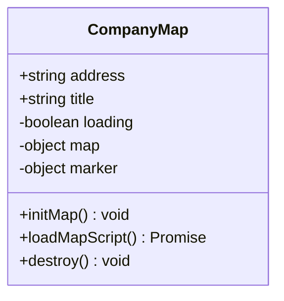
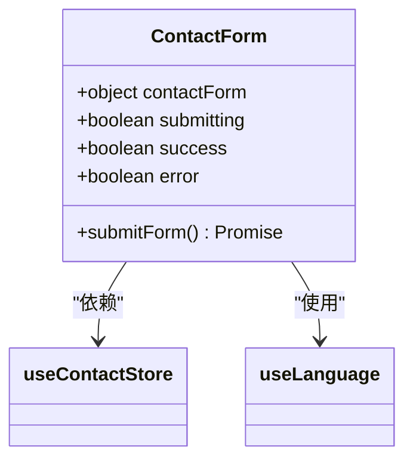
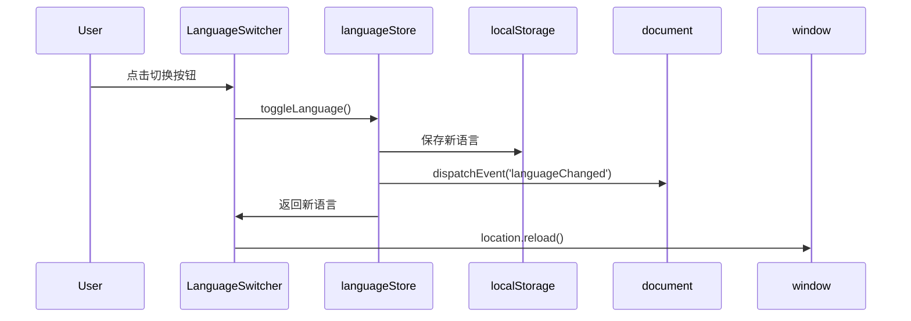
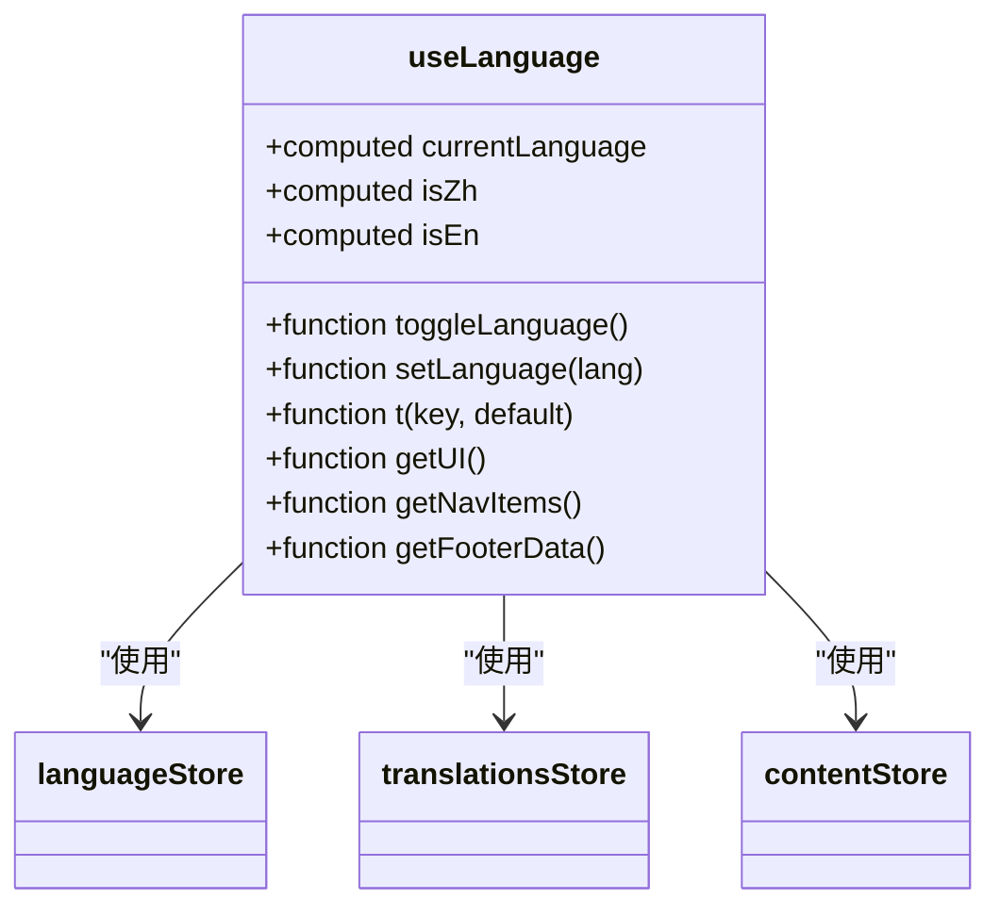
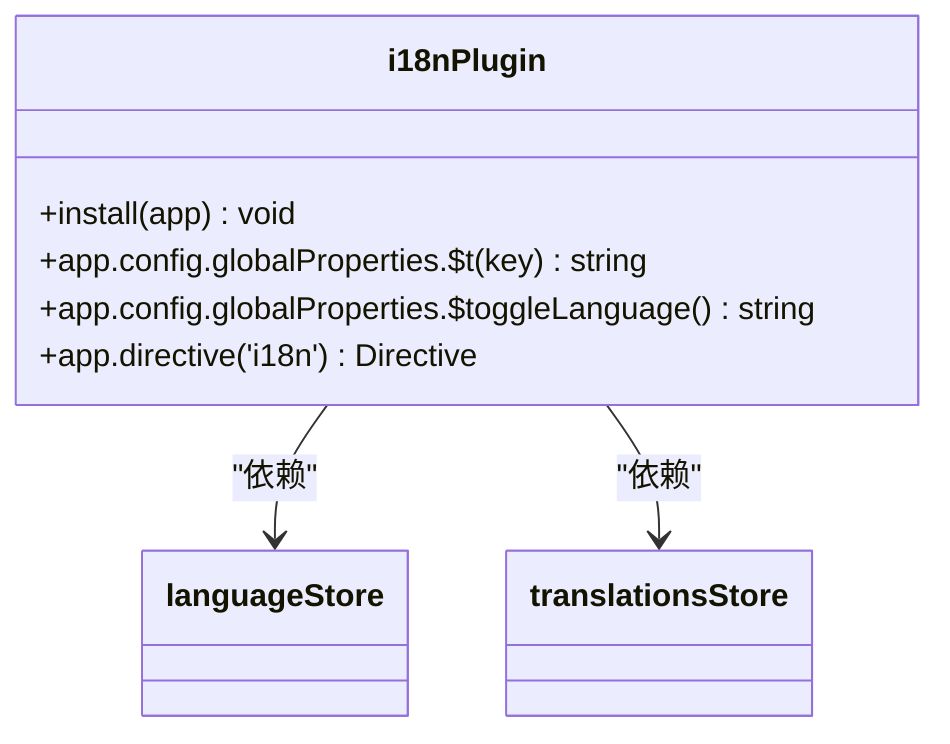
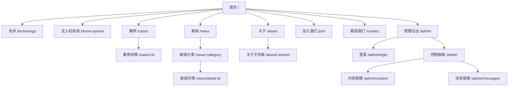
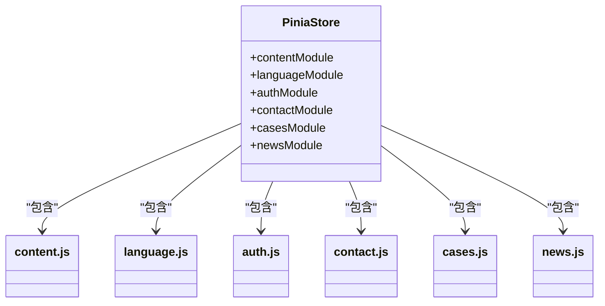
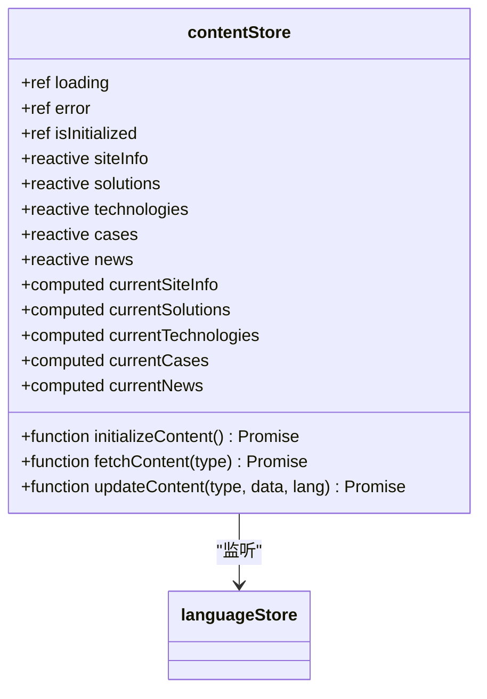
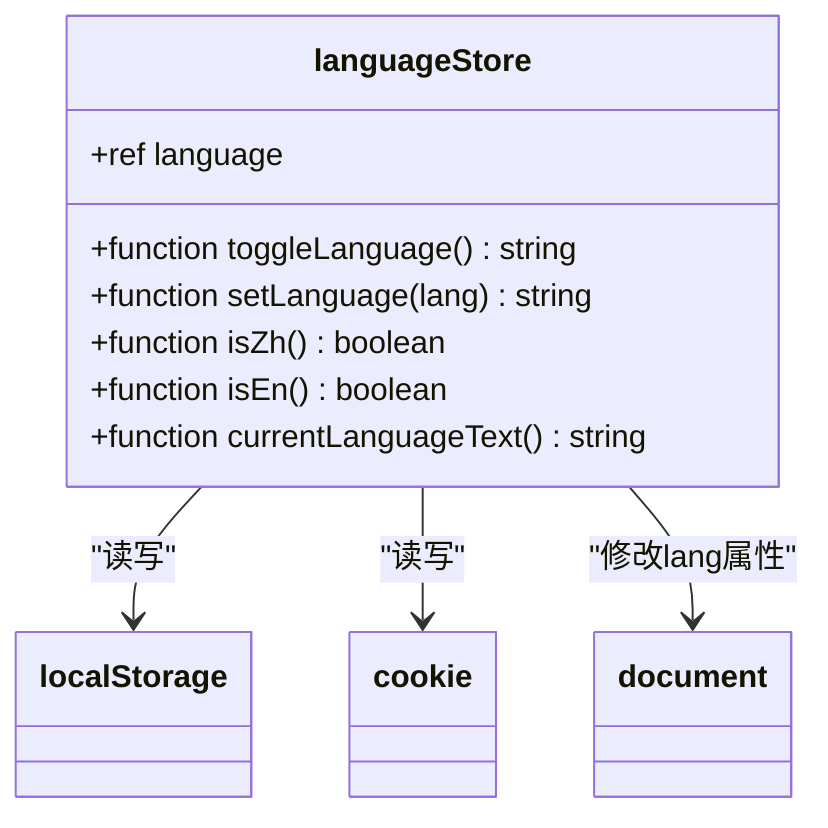

# 项目目录结构详解

<cite>
**本文档引用的文件**
- [data/content.json](file://data/content.json)
- [data/users.json](file://data/users.json)
- [src/api/index.js](file://src/api/index.js)
- [src/assets/base.css](file://src/assets/base.css)
- [src/assets/main.css](file://src/assets/main.css)
- [src/assets/responsive.css](file://src/assets/responsive.css)
- [src/components/CompanyMap.vue](file://src/components/CompanyMap.vue)
- [src/components/ContactForm.vue](file://src/components/ContactForm.vue)
- [src/components/DroneDefenseAnimation.vue](file://src/components/DroneDefenseAnimation.vue)
- [src/components/LanguageSwitcher.vue](file://src/components/LanguageSwitcher.vue)
- [src/mixins/language.js](file://src/mixins/language.js)
- [src/plugins/i18n.js](file://src/plugins/i18n.js)
- [src/router/index.js](file://src/router/index.js)
- [src/store/modules/auth.js](file://src/store/modules/auth.js)
- [src/store/modules/content.js](file://src/store/modules/content.js)
- [src/store/modules/language.js](file://src/store/modules/language.js)
- [src/store/index.js](file://src/store/index.js)
- [src/views/admin/AdminLoginView.vue](file://src/views/admin/AdminLoginView.vue)
- [src/views/admin/AdminView.vue](file://src/views/admin/AdminView.vue)
- [src/views/admin/ContentView.vue](file://src/views/admin/ContentView.vue)
- [src/views/admin/DashboardView.vue](file://src/views/admin/DashboardView.vue)
- [src/views/admin/MessagesView.vue](file://src/views/admin/MessagesView.vue)
- [src/App.vue](file://src/App.vue)
- [src/main.js](file://src/main.js)
</cite>

## 目录结构

1. [数据存储层（data/）](#数据存储层data)
2. [API封装层（src/api/）](#api封装层srcapi)
3. [静态资源层（src/assets/）](#静态资源层srcassets)
4. [组件复用层（src/components/）](#组件复用层srccomponents)
5. [逻辑混入层（src/mixins/）](#逻辑混入层srcmixins)
6. [插件配置层（src/plugins/）](#插件配置层srcplugins)
7. [路由定义层（src/router/）](#路由定义层srcrouter)
8. [状态管理层（src/store/）](#状态管理层srcstore)
9. [视图组织层（src/views/）](#视图组织层srcviews)

## 数据存储层（data）

`data/` 目录用于存放项目的静态数据文件，主要为后端服务提供数据支持。

### content.json 文件用途
`content.json` 文件存储了网站的核心内容数据，包括公司信息、解决方案、核心技术、典型案例、新闻资讯等多语言版本的内容。该文件作为后端API的数据源，通过Express服务器提供RESTful接口，供前端动态获取和更新内容。

### users.json 文件用途
`users.json` 文件存储了系统用户信息，主要用于管理后台的身份验证。其中包含管理员账号的用户名和密码哈希值，通过JWT进行身份认证，确保管理后台的安全访问。

**Section sources**
- [data/content.json](file://data/content.json)
- [data/users.json](file://data/users.json)

## API封装层（src/api）

`src/api/` 目录用于封装所有前端与后端交互的API请求，实现了网络请求的统一管理和维护。

### index.js 文件功能
`index.js` 文件集中定义了项目所需的所有API接口，使用Axios库进行HTTP请求封装。它提供了清晰的模块化接口调用方式，将不同功能模块的API分组管理，便于前端组件调用。例如，内容管理、用户认证、消息提交等功能都有对应的API方法。

**Section sources**
- [src/api/index.js](file://src/api/index.js)

## 静态资源层（src/assets）

`src/assets/` 目录存放项目所需的CSS样式资源和其他静态文件。

### CSS资源组织
该目录包含三个主要的CSS文件：
- `base.css`：基础样式定义，设置全局变量和基本样式规则
- `main.css`：主样式文件，包含页面布局、组件样式和响应式设计
- `responsive.css`：专门处理移动端适配的响应式样式

这些样式文件通过`@import`在`main.js`中引入，确保样式的一致性和可维护性。

**Section sources**
- [src/assets/base.css](file://src/assets/base.css)
- [src/assets/main.css](file://src/assets/main.css)
- [src/assets/responsive.css](file://src/assets/responsive.css)

## 组件复用层（src/components）

`src/components/` 目录包含可复用的UI组件，实现了界面元素的模块化和重用。

### 核心组件分析

#### CompanyMap 组件
`CompanyMap.vue` 是一个高德地图集成组件，用于展示公司地理位置。它动态加载高德地图API，通过地理编码将公司地址转换为经纬度，并在地图上显示标记和信息窗口，支持导航功能。

**Diagram sources**
- [src/components/CompanyMap.vue](file://src/components/CompanyMap.vue)

#### ContactForm 组件
`ContactForm.vue` 是联系表单组件，集成了国际化支持。它从Pinia store中获取表单文本，并处理用户咨询信息的提交逻辑，包含输入验证、提交状态管理和成功/错误提示。

**Diagram sources**
- [src/components/ContactForm.vue](file://src/components/ContactForm.vue)

#### DroneDefenseAnimation 组件
`DroneDefenseAnimation.vue` 是无人机防御系统的动画展示组件，可能使用Three.js或GSAP实现动态视觉效果，用于在技术页面展示反无人机系统的工作原理。

#### LanguageSwitcher 组件
`LanguageSwitcher.vue` 是语言切换组件，提供中文/英文切换功能。它与语言状态store深度集成，切换时会触发全局事件并刷新页面以确保语言变更生效。

**Diagram sources**
- [src/components/LanguageSwitcher.vue](file://src/components/LanguageSwitcher.vue)

**Section sources**
- [src/components/CompanyMap.vue](file://src/components/CompanyMap.vue)
- [src/components/ContactForm.vue](file://src/components/ContactForm.vue)
- [src/components/DroneDefenseAnimation.vue](file://src/components/DroneDefenseAnimation.vue)
- [src/components/LanguageSwitcher.vue](file://src/components/LanguageSwitcher.vue)

## 逻辑混入层（src/mixins）

`src/mixins/` 目录存放可复用的逻辑代码，通过Vue的组合式API实现功能复用。

### language.js 文件功能
`language.js` 文件定义了`useLanguage()`组合函数，封装了与语言相关的所有逻辑。它不仅提供当前语言状态，还集成了多个store的数据访问方法，使组件可以方便地获取多语言内容。该混入通过provide/inject机制优化性能，避免不必要的重新渲染。

**Diagram sources**
- [src/mixins/language.js](file://src/mixins/language.js)

**Section sources**
- [src/mixins/language.js](file://src/mixins/language.js)

## 插件配置层（src/plugins）

`src/plugins/` 目录存放Vue插件的配置代码。

### i18n.js 国际化插件
`i18n.js` 文件配置了项目的国际化插件，通过Vue的插件机制注册全局属性和指令。它将语言状态注入到应用实例中，提供`$t()`翻译函数和`v-i18n`指令，简化模板中的多语言处理。

**Diagram sources**
- [src/plugins/i18n.js](file://src/plugins/i18n.js)

**Section sources**
- [src/plugins/i18n.js](file://src/plugins/i18n.js)

## 路由定义层（src/router）

`src/router/` 目录定义了前端应用的路由配置。

### index.js 路由配置
`index.js` 文件使用Vue Router 4定义了完整的路由表，包括：
- 主要页面路由：首页、技术、案例、新闻、关于等
- 动态路由：新闻分类、案例详情等带参数的路由
- 管理后台路由：包含登录、控制面板、内容管理和消息管理

路由守卫确保管理后台的安全访问，只有经过身份验证的用户才能访问受保护的路由。

**Diagram sources**
- [src/router/index.js](file://src/router/index.js)

**Section sources**
- [src/router/index.js](file://src/router/index.js)

## 状态管理层（src/store）

`src/store/` 目录使用Pinia进行模块化的状态管理，实现了复杂应用状态的有效组织。

### 模块化架构
采用模块化设计，将不同功能领域的状态分离到独立的模块中：

**Diagram sources**
- [src/store/index.js](file://src/store/index.js)
- [src/store/modules/content.js](file://src/store/modules/content.js)
- [src/store/modules/language.js](file://src/store/modules/language.js)
- [src/store/modules/auth.js](file://src/store/modules/auth.js)

### content 模块功能
`content.js` 模块管理网站的所有内容数据，包括：
- 站点基本信息（siteInfo）
- 解决方案数据（solutions）
- 核心技术数据（technologies）
- 典型案例数据（cases）
- 新闻资讯数据（news）
- 关于我们数据（aboutData）
- 招聘信息数据（jobs）

该模块通过计算属性`currentSolutions`、`currentTechnologies`等根据当前语言返回相应的内容，实现了无缝的多语言切换。

**Diagram sources**
- [src/store/modules/content.js](file://src/store/modules/content.js)

### language 模块功能
`language.js` 模块管理应用的语言状态，实现了持久化的语言偏好存储。它通过localStorage和cookie双重存储机制确保语言设置在页面刷新后依然保持，并在语言切换时触发全局事件通知所有组件。

**Diagram sources**
- [src/store/modules/language.js](file://src/store/modules/language.js)

**Section sources**
- [src/store/index.js](file://src/store/index.js)
- [src/store/modules/content.js](file://src/store/modules/content.js)
- [src/store/modules/language.js](file://src/store/modules/language.js)
- [src/store/modules/auth.js](file://src/store/modules/auth.js)

## 视图组织层（src/views）

`src/views/` 目录组织页面级的视图组件，每个文件通常对应一个路由。

### 页面视图组件
主要页面组件包括：
- `HomeView.vue`：首页视图
- `TechnologyView.vue`：技术页面
- `CasesView.vue`：案例列表页面
- `NewsView.vue`：新闻中心
- `AboutView.vue`：关于我们
- `ContactView.vue`：联系页面

### 管理后台视图
`src